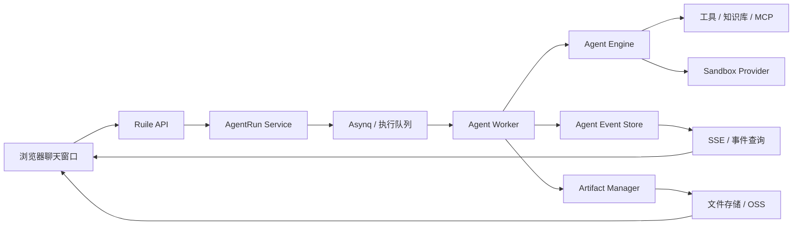

# Web 端 Agent 实时执行与产物交互 PRD

> 文档状态：V1 草案  
> 编写日期：2026-09-18  
> 适用项目：ruile  
> 参考实现：WorkBuddy Agent 对话交互、本地 `tdesign-chat-demo`  
> 实施基座：当前 `AgentRun` 队列、已发布专家、SSE 聊天流、Agent Engine、Skill、Sandbox、产物结果协议

## 1. 文档目的

本 PRD 用于定义 Web 端调用已发布专家时的第一版用户体验和执行架构。

本版本的目标不是立即复制 WorkBuddy 的全部能力，而是先形成一条完整、稳定、可恢复的 Agent 执行链路：

```text
选择已发布专家
    -> 在聊天窗口发起问题
    -> 创建异步 AgentRun
    -> 实时显示执行状态
    -> 必要时展示结构化选项面板
    -> 生成服务卡片和详细产物
    -> 在聊天右侧预览产物
    -> 支持继续追问、重新生成和恢复任务
```

本版本明确采用服务器端执行模型。用户使用浏览器，Agent 工作由服务端运行队列和隔离执行环境完成。页面不能依赖长时间保持的单个 HTTP 请求，也不能要求用户等待最终结果后才能看到任何反馈。

## 2. 当前阶段范围

### 2.1 本期范围

1. 只向普通用户展示已发布的专家。
2. 暂不做用户身份与专家的绑定关系。
3. 暂不做工作画像与专家的服务绑定。
4. 用户可以在聊天窗口选择专家并发起问题。
5. 专家通过当前 `AgentRun` 队列异步执行。
6. 页面可以显示排队、执行、等待补充、成功、失败和取消状态。
7. 信息不足时优先展示单选、多选或日期等结构化选项。
8. 服务卡片只显示三个字段：
   - 标题
   - 摘要
   - 下一步动作
9. 详细内容通过 HTML、Markdown、PDF、图片、文档、表格等产物交付。
10. 点击产物后，在聊天右侧打开预览面板。
11. 任务完成后，用户可以继续追问或重新生成。
12. 页面刷新、网络短暂断开后，可以根据 `run_id` 恢复任务状态。
13. 服务器端执行需要通过统一的执行提供者接口接入 Sandbox。

### 2.2 本期不做

1. 不做普通用户导入、安装或修改专家包。
2. 不做专家与用户身份的长期绑定。
3. 不做专家与服务模块的自动绑定。
4. 不做 CRM、工单、日历、IM 等外部系统写入。
5. 不做高并发弹性扩缩容和复杂计费。
6. 不做公开分享链接和匿名访问。
7. 不要求所有 Skill 在本期都变成可执行脚本。
8. 不把每一轮普通聊天都自动保存成长期产物。
9. 不替换当前聊天系统，只增加专家运行和产物交互能力。

## 3. 背景与问题

当前项目已经具备专家包导入、版本发布、已发布专家列表、AgentRun 队列、补充信息和结果产物基础能力，但用户感知仍然偏向“提交问题后轮询最终结果”：

- 用户不知道任务是否已经开始。
- Agent 执行中的检索、分析和产物生成过程不可见。
- 页面刷新或网络中断后，任务恢复能力不足。
- 信息不足时的交互与 WorkBuddy 的选项面板不一致。
- 卡片和详细报告的层次不够明确。
- 产物已经生成，但查看入口和对话布局不够稳定。
- Skill、工具和产物的执行过程没有统一事件协议。

本 PRD 的核心判断是：

> Web 端不需要复制桌面端的本地执行方式，但必须复制“任务立即接收、过程持续反馈、结果分层交付、断开后可恢复”的产品体验。

## 4. 产品目标

### 4.1 用户目标

- 用户发送问题后立即得到反馈，不出现空白等待。
- 用户不需要为普通场景填写大量文字。
- 专家只在确实缺少关键条件时提问。
- 复杂任务可以在后台继续执行。
- 用户可以看到专家正在做什么，但不被大量技术日志打扰。
- 结果先通过卡片快速阅读，详细内容通过产物查看。
- 用户可以从当前结果继续追问，而不需要重新选择专家。
- 任务失败时可以知道失败阶段，并能重新生成。

### 4.2 平台目标

- 复用当前 `AgentRun`、队列、Agent Engine、Skill、Sandbox 和结果协议。
- 将 Agent 执行从“最终结果接口”升级为“持久化任务 + 事件流”。
- 让前端可以统一渲染状态、工具、询问和产物。
- 让服务器沙箱的实现可以替换，不把业务逻辑绑定到 Docker 或本地进程。
- 让不同专家使用不同产物类型，但共享同一套产物生命周期和预览入口。

## 5. 用户角色

### 5.1 普通用户

- 浏览已发布专家。
- 选择专家并提交问题。
- 选择结构化补充信息。
- 查看服务卡片和产物。
- 继续追问、重新生成和取消自己的任务。

### 5.2 管理员

- 导入专家包。
- 诊断、发布或回退专家版本。
- 在后台测试专家。
- 查看运行步骤、质量结果和错误。
- 控制专家是否处于发布状态。

## 6. 核心用户流程

### 6.1 发起专家任务

```text
用户打开聊天窗口
    -> 点击专家选择器
    -> 只看到已发布专家
    -> 选择一个专家
    -> 输入问题或点击预设问题
    -> 页面立即插入用户消息和专家运行消息
    -> 后端返回 run_id
    -> 前端订阅或轮询运行事件
```

要求：

- 选择专家后，在输入框或消息区域明确显示当前专家名称。
- 已发布专家列表加载失败时，不影响普通聊天使用。
- 任务创建成功后，不能因为后续执行异常而丢失用户消息。
- 相同用户、相同专家、相同请求的重复提交应通过幂等键避免重复运行。

### 6.2 执行过程

前端按以下状态展示：

```text
排队中
  -> 准备上下文
  -> 分析需求
  -> 检索资料
  -> 生成草稿
  -> 检查质量
  -> 生成产物
  -> 已完成
```

界面不展示完整模型思维内容。默认展示简短、可理解的执行摘要，例如：

- 正在读取相关资料
- 正在整理活动目标和约束
- 正在生成执行方案
- 正在检查方案完整性
- 正在生成 HTML 报告

工具调用详情可以折叠查看，避免聊天窗口被技术日志占满。

### 6.3 信息不足时的交互

当 Agent 判断缺少关键条件时，运行进入 `waiting_input`，前端在当前专家消息位置渲染选项面板。

默认规则：

- 优先使用单选或多选。
- 单题单选可以点击即提交。
- 多题、多选或需要组合条件时，使用统一提交按钮。
- 允许使用“其他”作为兜底，但不是默认输入方式。
- 题目数量建议 1-4 题，最多不超过 5 题。
- 已提交的答案保留在原面板中，选项不可重复修改。
- 用户另起新问题时，未回答的旧面板标记为“已跳过”。

用户提交答案后：

```text
更新原询问卡为“已提交”
    -> 在对话中显示用户选择摘要
    -> 恢复原 run_id
    -> 后端继续从 planning 或 drafting 阶段执行
    -> 不创建新的专家会话
```

### 6.4 结果交付

任务成功后，专家消息按以下顺序展示：

1. 专家名称和运行状态。
2. 服务卡片。
3. 产物卡片列表。
4. 可选的质量提示或证据数量。
5. 继续追问入口。

服务卡片只能包含：

```text
标题
摘要
下一步动作
```

详细报告不得直接塞进服务卡片。详细内容应通过产物打开。

### 6.5 产物预览

点击产物卡片后：

- 桌面端：聊天右侧打开预览面板。
- 移动端：打开全屏抽屉或独立预览页。
- 关闭预览后，回到原聊天位置。
- 切换不同产物时，不重新执行 Agent。
- 面板支持“查看全部产物”。
- 产物不存在或加载失败时，显示明确错误和下载入口。

第一版支持以下预览方式：

| 产物类型 | 默认行为 |
| --- | --- |
| Markdown | 使用聊天同款 Markdown 渲染 |
| HTML | 受限 iframe 预览 |
| 图片 | 图片预览和新窗口打开 |
| PDF | PDF 查看器或浏览器预览 |
| CSV/XLSX | 表格预览或下载 |
| DOCX/PPTX | 使用服务端转换副本预览，原文件可下载 |
| 纯文本 | 文本阅读器 |
| 音频/视频 | 播放器或下载 |

## 7. 信息架构与页面结构

### 7.1 聊天消息结构

```text
用户消息
  └── 用户问题

专家运行消息
  ├── 专家名称
  ├── 当前状态
  ├── 执行摘要 / 工具折叠组
  ├── 询问面板（仅 waiting_input）
  ├── 服务卡片（成功后）
  ├── 产物卡片
  └── 继续追问 / 重新生成
```

### 7.2 右侧产物面板

```text
┌─────────────────────┬────────────────────────────┐
│                     │ 产物标题                    │
│     聊天消息区       │ 类型 / 大小 / 更新时间       │
│                     │                            │
│                     │ 产物预览                    │
│                     │                            │
│                     │ 下载 / 新窗口打开            │
└─────────────────────┴────────────────────────────┘
```

面板宽度应稳定，打开和关闭不能导致聊天消息横向跳动。

## 8. 执行架构

### 8.1 总体架构



### 8.2 执行位置

本版本采用服务器端执行：

- Web 前端只负责发起任务、接收事件和展示结果。
- Agent Worker 在服务端运行。
- Skill 脚本只能通过 `Sandbox Provider` 执行。
- 生产环境优先使用 Docker Sandbox。
- 本地开发环境可以使用 Local Sandbox。
- 如果专家只使用知识检索和模型能力，不需要脚本执行时，可以不启动 Sandbox。

当前项目已有 `internal/sandbox`，本期不重新设计沙箱实现，只增加运行时调用边界：

```go
type ExecutionProvider interface {
    Execute(ctx context.Context, request ExecuteRequest) (*ExecuteResult, error)
}
```

业务层只能依赖 `ExecutionProvider`，不能直接调用 `docker`、`os/exec` 或具体脚本路径。

### 8.3 Agent 执行阶段

```text
intake
  -> planning
  -> drafting
  -> reviewing
  -> revising（可选，最多两次）
  -> packaging
  -> completed
```

阶段与当前 `AgentRunPhase*` 保持一致，不新增另一套状态命名。

## 9. Agent 事件协议

### 9.1 事件类型

第一版统一使用以下事件：

| 事件 | 用途 |
| --- | --- |
| `run.started` | 任务开始执行 |
| `run.phase_changed` | 执行阶段变化 |
| `run.progress` | 面向用户的执行摘要 |
| `tool.started` | 工具或 Skill 开始执行 |
| `tool.completed` | 工具或 Skill 执行完成 |
| `ask_user` | 需要用户补充信息 |
| `artifact.created` | 新产物生成 |
| `artifact.updated` | 产物元数据或内容更新 |
| `quality.updated` | 质量检查结果更新 |
| `run.succeeded` | 任务成功 |
| `run.failed` | 任务失败 |
| `run.cancelled` | 任务取消 |

已有聊天 Agent 的 `thought`、`tool_call`、`tool_result` 事件继续兼容，但专家运行应增加 `run_id` 和 `step_id`。

### 9.2 事件字段

```json
{
  "id": "event-uuid",
  "run_id": "run-uuid",
  "sequence": 12,
  "type": "run.progress",
  "phase": "drafting",
  "status": "running",
  "message": "正在生成执行方案",
  "data": {},
  "created_at": "2026-09-18T10:00:00Z"
}
```

要求：

- 事件有递增序号。
- 事件可以持久化并按游标重放。
- 前端重复收到同一个事件时不能重复渲染。
- 事件不保存完整敏感工具结果，只保存前端需要的摘要。
- 完整工具结果进入运行步骤或审计记录，不直接暴露给普通用户。

### 9.3 事件接收方式

优先使用 SSE：

```text
GET /api/v1/service/agent-runs/{run_id}/events
```

参数：

```text
?after={sequence}
```

断线后，前端使用最后收到的 `sequence` 重新连接。SSE 不可用时，降级为 1-2 秒一次的状态查询。

## 10. API 需求

### 10.1 已有接口继续复用

```text
GET  /api/v1/expert-packages/published
POST /api/v1/expert-packages/published/{package_id}/definitions/{definition_id}/runs

GET  /api/v1/service/agent-runs/{run_id}
GET  /api/v1/service/agent-runs/{run_id}/steps
POST /api/v1/service/agent-runs/{run_id}/answers
POST /api/v1/service/agent-runs/{run_id}/regenerate
POST /api/v1/service/agent-runs/{run_id}/cancel
```

### 10.2 本期新增接口

```text
GET /api/v1/service/agent-runs/{run_id}/events
GET /api/v1/service/agent-runs/{run_id}/artifacts
GET /api/v1/service/artifacts/{artifact_id}
```

如果当前 `AgentRun.result.artifacts` 已包含可预览内容，产物接口可以先作为兼容层实现，不要求一次完成独立产物中心。

### 10.3 创建运行请求

```json
{
  "prompt": "帮我制定国庆亲子运动会活动方案",
  "model_id": "balanced-model",
  "conversation_id": "optional-session-id",
  "client_request_id": "client-generated-id"
}
```

响应：

```json
{
  "success": true,
  "data": {
    "id": "run-uuid",
    "status": "queued",
    "phase": "intake",
    "agent_ref": "kindergarten_activity_planner",
    "agent_version": "1.0.0"
  }
}
```

### 10.4 等待补充响应

```json
{
  "answers": {
    "event_date": "2026-10-01",
    "participant_scope": ["幼儿", "家长"],
    "venue": "园内操场"
  }
}
```

接口必须保证：

- 只允许任务所属用户提交。
- 只允许 `waiting_input` 状态提交。
- 答案必须符合当前交互面板的题目定义。
- 提交后恢复原 `run_id`，不创建新的专家运行。

## 11. Agent 包描述要求

专家包中的 Markdown 需要描述“如何工作”和“如何输出”，但平台权限、运行状态、资源存储和安全策略由平台控制。

推荐 Front Matter：

```yaml
---
agent_id: kindergarten_activity_planner
display_name: 幼儿园活动策划专家
description: 根据幼儿园活动目标和约束生成可执行活动方案
output_contract: agent_result_v1
interaction:
  mode: choice_first
  max_questions: 4
  allow_other: true
artifacts:
  primary: html
  supporting:
    - pdf
    - markdown
capabilities:
  - knowledge_search
  - artifact_html
  - artifact_pdf
---
```

正文至少描述：

1. 角色和适用范围。
2. 必须确认的输入条件。
3. 可以采用默认值的条件。
4. 何时必须询问用户。
5. 询问问题如何设计为选项。
6. 分析和生成的步骤。
7. 卡片标题、摘要和下一步动作的写法。
8. 详细报告必须包含的章节。
9. 允许生成的产物类型。
10. 事实、假设和待确认项的区分方式。
11. 安全、合规和能力边界。

Skill 的执行规则：

- `SKILL.md` 说明型内容进入 Agent 上下文。
- Skill 的引用资料按需加载。
- 脚本型 Skill 必须声明脚本路径和能力要求。
- 脚本只能通过 Sandbox 执行。
- AgentRun 必须记录实际加载的 Skill 版本和执行结果。

## 12. 结果和产物协议

### 12.1 服务卡片

服务卡片使用当前 `service_card_v1`：

```json
{
  "schema_version": "service_card_v1",
  "title": "国庆亲子运动会活动方案",
  "summary": "围绕亲子共育和园本特色设计分组比赛、亲子协作和安全保障流程。",
  "next_action": "确认活动日期、参与人数和场地后，生成最终执行版和物资清单。"
}
```

卡片不展示：

- 完整报告
- 全部证据
- 全部工具调用
- 大段模型分析
- 未经确认的外部写入动作

### 12.2 产物

产物统一使用 `AgentArtifactResultV1`：

```json
{
  "kind": "html",
  "role": "primary",
  "title": "国庆亲子运动会活动方案",
  "format": "html",
  "content": {
    "resource_id": "resource-uuid",
    "preview_url": "/api/v1/service/artifacts/artifact-uuid"
  }
}
```

产物元数据至少包含：

- `artifact_id`
- `run_id`
- `title`
- `kind`
- `format`
- `role`
- `size`
- `mime_type`
- `previewable`
- `downloadable`
- `created_at`
- `resource_id`

### 12.3 存储策略

第一版采用两层存储：

```text
数据库：保存 AgentRun、产物元数据、关联关系和状态
文件存储：保存 HTML、PDF、图片、文档和表格正文
```

开发环境可以使用本地 FileService，部署环境可以使用 OSS。

第一版不公开原始 OSS 地址。浏览器预览通过后端受控接口或短期签名地址获取。

## 13. 追问、纠偏和重新生成

### 13.1 继续追问

用户在产物或服务卡片上点击“继续追问”后，可以使用预设动作：

- 继续补充细节
- 生成执行清单
- 生成物资清单
- 生成家长通知
- 生成 PDF
- 根据新条件重新调整

默认优先使用按钮或选项，不强制用户输入文字。

追问应携带：

```text
parent_run_id
parent_artifact_id
conversation_id
question
```

### 13.2 重新生成

重新生成不覆盖旧结果，创建新的内容版本：

```text
旧 AgentRun
    -> 新 AgentRun
    -> parent_run_id 指向旧任务
    -> 保留旧卡片和旧产物
```

用户可以选择：

- 重新生成
- 使用更简洁的版本
- 补充证据
- 调整目标受众
- 调整产物格式

### 13.3 失败恢复

失败信息至少包括：

- 失败阶段
- 简短原因
- 是否可以重试
- 是否需要补充信息
- 重试按钮

以下错误允许重试：

- 模型暂时不可用
- 产物渲染暂时失败
- 临时网络错误
- 队列执行超时

以下错误不应自动无限重试：

- 专家包版本无效
- 输出协议始终不合法
- Skill 权限不允许
- Sandbox 安全校验失败

## 14. 前端交互要求

### 14.1 专家选择器

- 只展示 `published` 状态的专家。
- 显示专家名称、领域、摘要和版本。
- 不显示未发布、诊断失败或已撤回版本。
- 选择专家后保留当前问题内容。
- 页面刷新后不要求重新加载历史任务才能显示运行状态。

### 14.2 状态显示

| 状态 | 用户文案 | 允许操作 |
| --- | --- | --- |
| `queued` | 排队中 | 取消 |
| `running` | 正在生成 | 查看进度、取消 |
| `waiting_input` | 需要补充 | 选择并提交 |
| `succeeded` | 已完成 | 查看产物、继续追问、重新生成 |
| `failed` | 生成失败 | 查看原因、重试 |
| `cancelled` | 已取消 | 重新运行 |

### 14.3 工具和过程展示

- 默认显示阶段摘要。
- 工具调用可以折叠为一组。
- 执行中的工具组自动展开。
- 完成后的工具组自动折叠。
- `ask_user` 不能折叠，否则用户看不到待处理选项。
- 不向普通用户展示完整系统提示词、内部错误堆栈和敏感工具参数。

### 14.4 响应式要求

- 桌面端优先支持聊天区 + 右侧产物面板。
- 平板端允许产物面板覆盖部分聊天区域。
- 移动端改为全屏产物抽屉。
- 面板打开或关闭不能破坏消息顺序。
- 产物卡片标题过长时截断，但完整标题在预览头部显示。

## 15. 可靠性与安全要求

### 15.1 任务可靠性

- 创建任务后立即持久化 `AgentRun`。
- Agent Worker 不依赖浏览器连接存活。
- 前端断开不会自动取消运行。
- 页面重连后可以从最后事件序号继续接收。
- 运行状态和最终结果必须可通过 API 查询。
- 任务超时后进入 `failed`，不能一直显示“生成中”。

### 15.2 沙箱安全

- 脚本执行必须经过 Capability 检查。
- 默认禁止网络访问，只有声明并允许的 Skill 才能访问网络。
- 限制工作目录和可读写路径。
- 限制 CPU、内存、进程数和执行时间。
- 生产环境不允许使用无约束的本地进程作为默认执行方式。
- 产物 HTML 预览必须使用受限 iframe。
- 产物分享和下载必须经过权限检查。

### 15.3 数据隔离

- `run_id`、产物和资源必须校验租户与用户权限。
- 用户只能查看自己的专家运行和产物。
- 管理员可以查看后台测试运行，但不能默认访问其他用户的业务对话。
- 工具返回结果进入审计记录前需要脱敏。

## 16. 验收标准

### 16.1 基础调用

- [ ] 聊天窗口只显示已发布专家。
- [ ] 选择专家后可以发送问题。
- [ ] 发送后 2 秒内出现用户消息和专家运行消息。
- [ ] 后端返回有效 `run_id`。
- [ ] 重复提交不会产生相同幂等请求的重复任务。

### 16.2 执行过程

- [ ] 页面能显示排队中和执行中。
- [ ] 至少显示三个有业务意义的执行阶段。
- [ ] 工具或 Skill 执行失败时可以显示失败阶段。
- [ ] 页面关闭或刷新后，可以重新查询任务状态。
- [ ] SSE 断开后可以从游标继续接收事件。

### 16.3 补充信息

- [ ] 缺少关键输入时，任务进入 `waiting_input`。
- [ ] 面板默认优先显示选项。
- [ ] 单题单选可以点击即提交。
- [ ] 多题或多选支持统一提交。
- [ ] 提交后原面板显示已提交状态。
- [ ] 用户提交答案后，原 `run_id` 可以继续执行。
- [ ] 未回答的旧问题不会阻塞用户发起新问题。

### 16.4 结果和产物

- [ ] 成功结果只显示标题、摘要、下一步动作三个卡片字段。
- [ ] 详细内容不直接展开在卡片正文中。
- [ ] 至少支持一种文本类产物和一种 HTML/PDF 类产物。
- [ ] 点击产物后右侧打开预览面板。
- [ ] 切换产物不重新执行 Agent。
- [ ] 预览失败时显示下载或重试入口。
- [ ] 页面刷新后可以重新打开已完成任务的产物。

### 16.5 失败和恢复

- [ ] 模型错误、Skill 错误、产物错误分别显示阶段。
- [ ] 可重试错误提供“重新生成”。
- [ ] 重新生成不会覆盖旧结果。
- [ ] 取消任务后状态变为 `cancelled`。
- [ ] 超时任务不会长期停留在 `running`。

### 16.6 权限和范围

- [ ] 未发布专家不能出现在用户专家列表。
- [ ] 普通用户不能导入或修改专家包。
- [ ] 本期不要求身份绑定和服务绑定。
- [ ] 用户不能读取其他用户的运行、步骤或产物。

## 17. 测试方案

### 17.1 手工测试

1. 发布一个可正常生成 HTML 的专家。
2. 在聊天窗口选择该专家并发送问题。
3. 观察排队、执行、生成产物和完成状态。
4. 使用一个缺少关键条件的问题，验证选项面板。
5. 提交选项后确认原任务继续执行。
6. 点击产物卡片，确认右侧预览打开。
7. 刷新页面，确认运行状态和产物仍然存在。
8. 模拟任务失败，确认显示失败阶段和重试入口。
9. 使用未发布专家，确认用户侧不可见。
10. 使用两个不同格式产物，确认预览分派正确。

### 17.2 自动化测试

- AgentRun 状态机测试。
- 事件序号和幂等消费测试。
- SSE 断线重连和事件重放测试。
- `waiting_input` 答案校验测试。
- 产物类型和权限测试。
- 服务卡片三字段校验测试。
- 失败重试和取消测试。
- Sandbox 路径、超时和资源限制测试。
- 发布状态过滤测试。

### 17.3 对照验收

使用同一个专家、同一个问题，对比 WorkBuddy Demo 和 Ruile：

| 对照项 | 合格标准 |
| --- | --- |
| 发起任务反馈 | Ruile 不出现长时间空白 |
| 过程反馈 | 至少显示阶段和工具摘要 |
| 补充信息 | 选项面板可直接操作 |
| 结果结构 | 卡片只显示三个字段 |
| 产物入口 | 点击后可以在右侧查看 |
| 任务恢复 | 刷新后可继续查看 |
| 结果一致性 | 用户选择能影响最终报告 |

## 18. 实施拆分

### Phase 1：执行事件和恢复基础

- 定义 `AgentRunEvent`。
- 为事件增加 `run_id`、`sequence`、`phase`。
- 持久化关键事件。
- 增加事件查询和 SSE 接口。
- 前端从固定轮询逐步切换为事件优先、查询兜底。

### Phase 2：专家聊天运行体验

- 保持当前已发布专家选择器。
- 重构专家运行消息为状态机。
- 接入阶段摘要、工具折叠和失败信息。
- 保持现有 `waiting_input` 逻辑。
- 将补充信息面板统一为 choice-first。

### Phase 3：产物交互

- 统一产物卡片元数据。
- 增加右侧产物预览槽位。
- 支持 Markdown、HTML、图片、PDF 至少四类。
- 增加查看全部产物入口。
- 增加预览失败和下载兜底。

### Phase 4：Agent 运行质量

- 让 Expert Workflow 使用多阶段 Agent Engine。
- 按专家包声明加载 Skill。
- 增加规则校验、质量评分和有限自动修订。
- 记录实际使用的 Skill、工具和产物。

### Phase 5：服务器沙箱和外部能力

- 为脚本型 Skill 接入 `ExecutionProvider`。
- 生产默认使用 Docker Sandbox。
- 增加 Capability、网络、目录和资源限制。
- 后续再接入 OSS 分享、外部系统和多 Agent 协作。

## 19. 产品决策与取舍

### 19.1 为什么先做事件流，不先做复杂沙箱

用户首先感知的是：

- 页面是否立即响应。
- 是否知道任务正在执行。
- 是否能继续操作。
- 是否能查看产物。

因此第一阶段优先建立 `AgentRun + Event + Artifact` 三者之间的稳定协议。沙箱实现应通过接口接入，避免先把产品体验绑定到某一种运行环境。

### 19.2 为什么卡片只保留三个字段

服务卡片用于扫描和行动，不用于承载完整报告。将详细内容放入产物可以：

- 避免聊天窗口被长文占满。
- 允许不同 Agent 使用不同产物类型。
- 支持 HTML、PDF、图片和表格等组合交付。
- 让卡片更适合后续进入服务空间或提醒列表。

### 19.3 为什么默认不要求用户输入

大多数专家任务的输入可以通过：

- 单选
- 多选
- 日期选择
- 数字步进
- 预设动作

完成。只有无法枚举的条件才允许自由文本。这样可以降低用户操作成本，也能减少模型理解自然语言答案时的歧义。

## 20. 本期交付定义

本 PRD 对应的第一版完成标准是：

```text
用户可以在 Web 聊天窗口选择一个已发布专家，
发送问题后看到实时执行状态；
信息不足时通过选项面板补充；
任务完成后看到标题、摘要、下一步动作；
点击产物后在右侧查看详细报告；
刷新页面或短暂断网后仍可以恢复任务和产物。
```

身份绑定、服务绑定、外部系统接入、公开分享、高并发治理和完整脚本型 Skill 体系不属于本期验收范围。
