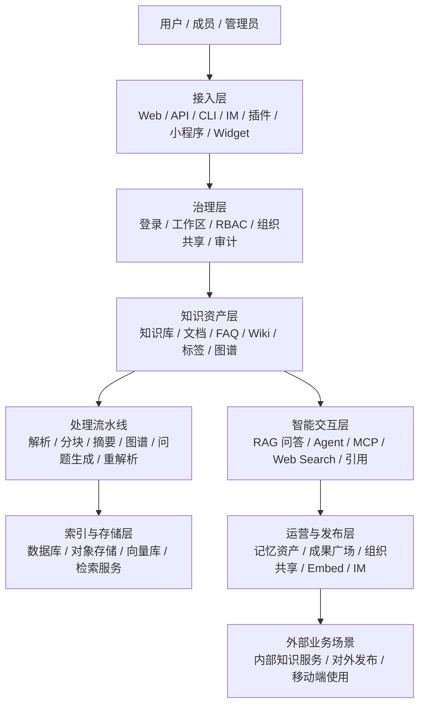

# 睿乐大脑业务架构说明

> 本文基于当前仓库的 README、RBAC / 共享空间 / Organization API 文档，以及前后端入口整理，侧重业务分层、核心对象和主流程，不展开底层实现细节。

## 1. 项目定位

睿乐大脑（WeKnora）是一套面向企业知识资产的 LLM 知识框架，核心不是单点聊天，而是围绕“知识导入、知识治理、智能问答、Agent 执行、对外发布”形成完整闭环。

它的业务目标可以概括为一句话：

**把分散在文档、网页、IM 和外部系统里的内容，变成可沉淀、可检索、可推理、可协作、可发布的知识资产。**

## 2. 业务边界

睿乐大脑的主线不是 CRM，也不是纯聊天应用，而是一套知识中台：

- 以工作区/空间为主隔离单元，管理成员、权限和资源归属
- 以知识库为核心资产单元，承载文档、FAQ、Wiki、标签和图谱
- 以会话和 Agent 为智能交互单元，承接 RAG 问答和多步推理
- 以组织/共享空间为横向协作单元，解决跨空间共享
- 以多入口发布能力把知识服务输出到 Web、API、CLI、IM、插件和小程序

本文中，“工作区/空间”指 tenant，“组织/共享空间”指 organization。

## 3. 业务分层

## 4. 核心业务域

| 业务域 | 关注点 | 核心能力 | 主要产物 |
|------|------|------|------|
| 接入层 | 用户从哪里进入 | Web UI、REST API、CLI、Chrome 插件、小程序、IM、Embed Widget | 会话、导入、发布请求 |
| 治理层 | 谁能做什么 | 登录、成员、邀请、工作区 RBAC、组织共享、审计日志 | 成员关系、权限、共享关系 |
| 知识资产层 | 资产怎么沉淀 | 知识库、FAQ、Wiki、标签、文档列表、图谱 | 可复用知识资产 |
| 处理流水线 | 内容如何变成知识 | 解析、分块、摘要、问题生成、图谱抽取、重解析 | Chunk、摘要、图谱、问答素材 |
| 智能交互层 | 知识如何被使用 | RAG、Agent 推理、工具调用、MCP、Web Search、建议问题 | 回答、引用、行动建议 |
| 运营与发布层 | 知识如何被运营和分发 | 记忆资产、成果广场、精选、组织共享、内容发布 | 运营内容、可见成果、发布入口 |
| 平台治理层 | 系统如何稳定运行 | 模型、存储、向量库、解析引擎、任务队列、观测 | 配置、运行态、审计、告警线索 |

## 5. 核心对象

### 5.1 工作区 / 空间

工作区是系统内最基础的业务边界，负责：

- 成员管理
- 资源归属
- 空间内权限控制
- API Key / Principal 管理
- 审计和治理

### 5.2 组织 / 共享空间

组织用于跨工作区协作，重点解决“一个知识库/智能体如何共享给别的空间使用”。

- 共享不会改变资源原始归属
- 共享关系与空间内 RBAC 是两条正交边界
- 组织更像协作容器，不是资源本体

### 5.3 知识库

知识库是最核心的业务资产，通常对应一个主题、项目、团队或数据源集合。

常见类型包括：

- 文档型知识库
- FAQ 型知识库
- Wiki 型知识库

知识库通常会绑定：

- 模型配置
- 分块策略
- 向量库
- 存储后端
- 数据源
- 标签和权限

### 5.4 知识内容

知识内容是知识库里的具体条目，常见形态包括：

- 文档
- FAQ
- Wiki 页面
- Chunk
- 标签
- 图谱节点和边

### 5.5 会话与消息

会话是知识服务的消费入口，承载：

- 普通问答
- 基于知识库的检索问答
- Agent 多步推理
- 附件/图片临时问答
- 推荐问题与追问

### 5.6 Agent、技能与工具

Agent 是更高一层的执行器，负责把知识检索、模型推理、Web Search、MCP 工具和技能串成行动链。

### 5.7 平台配置对象

平台配置对象包括：

- 模型
- 向量数据库
- 存储后端
- 网络搜索服务商
- 解析引擎
- 系统设置
- 运行时任务队列

## 6. 核心业务流程

### 6.1 用户进入与授权

1. 用户通过登录、OIDC、API Key、邀请链接或自助创建进入系统
2. 系统识别其所属工作区和角色
3. 前端根据权限展示相应入口
4. 后端再做一次强制校验，防止越权

### 6.2 知识库生命周期

1. 创建知识库
2. 选择知识库类型、模型、存储、向量库和解析方式
3. 导入文件、URL、外部数据源或在线内容
4. 触发解析、分块、摘要、问题生成和图谱抽取
5. 进入可检索状态
6. 支持重解析、共享、复制、删除和归档

### 6.3 问答与推理生命周期

1. 用户在会话中输入问题
2. 系统根据当前知识库、Agent 或嵌入场景选择检索范围
3. 触发 RAG、Agent 推理、Web Search 或 MCP 工具
4. 生成回答、引用和后续建议
5. 会话和消息沉淀为可回放的业务记录

### 6.4 内容运营生命周期

Organize 业务面承担“内容沉淀和成果运营”的角色，主要包括：

- 记忆资产的列表、编辑、删除和发芽
- 成果内容广场的精选、预览和状态管理
- 让内容从原始记录走向可复用、可发布的业务资产

### 6.5 共享协作生命周期

1. 空间内资源创建完成
2. 通过组织/共享空间把知识库或智能体共享给其他空间
3. 共享空间成员按角色使用资源
4. 共享关系可随时调整、取消或停用

## 7. 业务入口与渠道

睿乐大脑不是单入口产品，而是多渠道统一能力底座：

- Web 管理台：知识库、会话、组织、设置、系统治理
- REST API：给系统集成和脚本调用
- CLI：给终端用户和自动化任务使用
- Chrome 插件：网页剪藏入库
- 微信小程序：移动端轻量问答
- IM 集成：在企业微信、飞书、Slack 等场景中直接问答
- Embed Widget：嵌入外部站点对外提供知识服务
- ClawHub Skill：面向技能生态的程序化调用入口

## 8. 治理与运营原则

### 8.1 权限先于功能

业务上最重要的原则是：

- 工作区内的角色决定你能不能改
- 资源归属决定你能改哪一类资源
- 组织共享决定你能不能跨空间使用

### 8.2 配置与运行分离

平台层把“配置”与“运行态”分开：

- 模型、存储、向量库、解析引擎属于配置
- 任务队列、观测面板、审计日志属于运行态

### 8.3 可观测性优先

系统强调可追踪、可回溯：

- 对话链路可看引用和检索过程
- 解析链路可看阶段进度
- 任务队列可看积压、失败和重试
- 审计日志可看成员和权限变化

### 8.4 可扩展优先

业务能力通过插件式方式扩展：

- 新模型厂商
- 新向量库
- 新存储后端
- 新网络搜索源
- 新 MCP 服务
- 新 IM 渠道

## 9. 推荐配套文档

- [空间 RBAC 说明](./RBAC说明.md)
- [共享空间说明](./共享空间说明.md)
- [组织管理 API](./api/organization.md)
- [API 文档总览](./api/README.md)
- [Worker Pool Governance](./worker-pool-governance.md)

## 10. 结论

睿乐大脑的业务架构可以归纳为：

**以工作区做隔离，以知识库做资产，以会话和 Agent 做消费，以组织做共享，以多渠道做发布，以平台治理做保障。**

这使它既能服务内部知识问答，也能支撑更复杂的知识生产、协作和外部集成场景。
