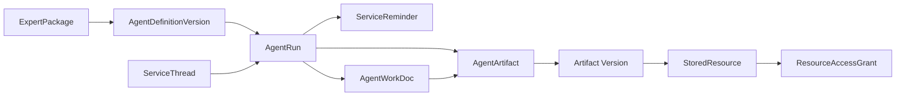
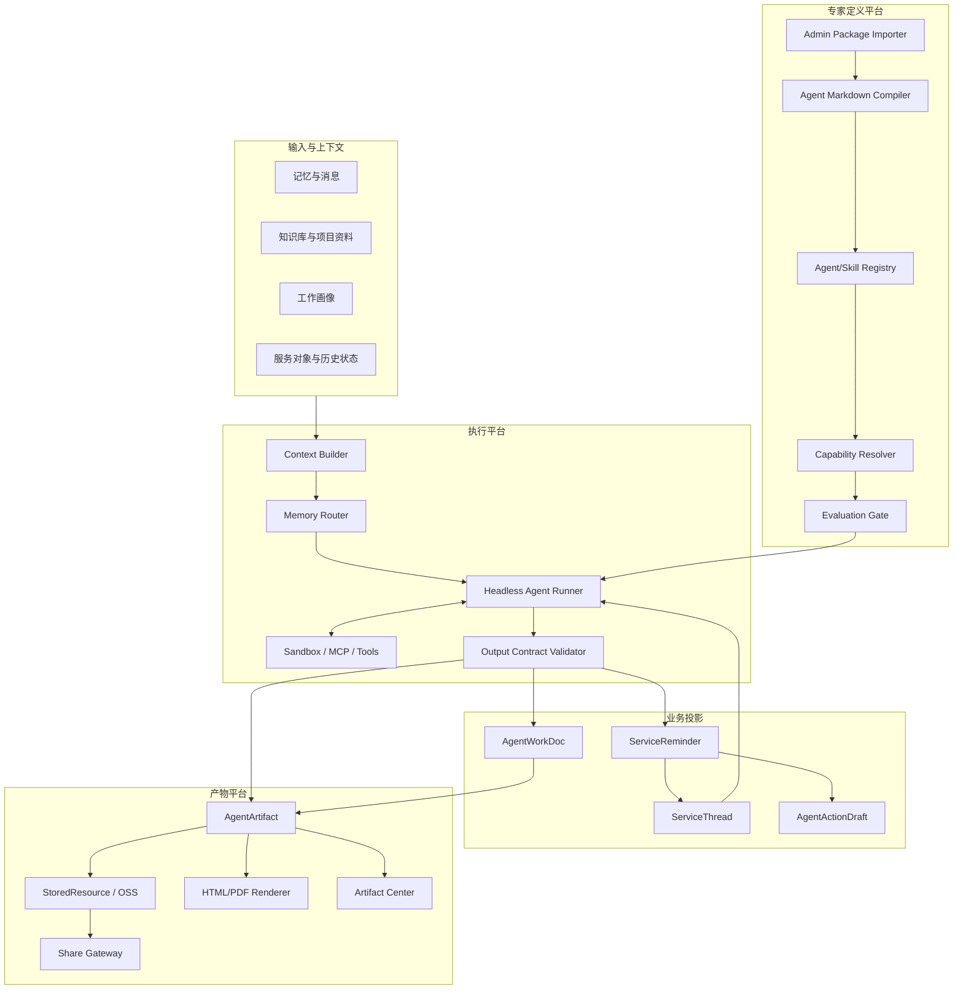

# 可扩展专家 Agent 服务平台架构设计

> 文档状态：主架构设计稿  
> 更新日期：2026-09-16  
> 适用项目：ruile  
> 相关文档：[外部 Agent 包兼容与管理员发布路线](./外部Agent包兼容与管理员发布路线.md)  
> 当前范围：内置/管理员发布 Agent、服务卡片、连续追问、纠偏、报告与通用产物、临时保存、历史检索和网页分享  
> 暂不包含：CRM、工单、日历、IM 等外部系统的自动写入

## 阅读导航

- 第 1-5 章：结论、目标、项目基座和总体架构。
- 第 6-8 章：Agent 定义、Markdown 编译和运行编排。
- 第 9-10 章：统一输出协议和数据模型。
- 第 11-15 章：追问、纠偏、产物生命周期、分享和历史空间。
- 第 16-18 章：Capability、沙箱、评测和行业参考模式。
- 第 19-22 章：实施路线、首批 Agent、验收标准和最终建议。

## 1. 执行摘要

本项目具备运行 Agent 的主要基础能力，但不能把外部 Agent 包的 `agents/*.md` 或其他定义文件直接复制进项目后就自动运行，也不应开放普通用户自行上传和安装 Agent。缺少的不是模型调用本身，而是后台管理员可控的 Agent 包注册、定义编译、版本发布、后台运行、统一输出、产物管理和评测发布这一层平台能力。

本方案的核心决策如下：

1. 保留 ruile 当前 Agent、Skills、MCP、知识库、沙箱和服务模块作为执行基座。
2. 建立 ruile 内部统一的专家包规范，外部来源通过 Source Adapter 转换进入平台；WorkBuddy 只是可选的首个适配来源，不是项目唯一格式。
3. Agent Markdown 描述角色、工作方法、卡片写法、报告内容和产物要求；权限、状态、存储和安全规则由平台控制。
4. 服务卡片面向用户只保留三个业务字段：`标题`、`摘要`、`下一步动作`。
5. Agent 使用统一的 `agent_result_v1` 返回卡片、报告和一个或多个产物，不让不同 Agent 直接操作业务表。
6. 详细报告优先保存结构化源数据，由服务端渲染 HTML；PDF 是导出或归档格式，不是唯一数据源。
7. 文本、HTML、图片、PDF、表格等都作为 `AgentArtifact` 管理，业务层不为每种产物单独设计流程。
8. 普通问答保存在服务会话中，不为每轮对话生成文件；只有正式交付结果才进入产物中心。
9. 文件默认使用临时生命周期。用户保存、分享、确认、编辑或正式关联后，才升级为长期产物。
10. HTML 可以存入 OSS，但浏览器分享必须经过独立的发布网关和受控域名，不能直接公开 OSS 原始地址。
11. 每次追问、纠偏和重新生成都产生新的运行和内容版本，不静默覆盖历史结果。
12. 后续接入更多 Agent 时，标准流程是“后台管理员导入、兼容检查、评测、发布、绑定、启用”，而不是为每个 Agent 修改后端和前端。

## 2. 目标与边界

### 2.1 业务目标

- 从记忆、客户上下文、服务空间和知识库中识别需要处理的事项。
- 按服务领域调用一个或多个内置或管理员已发布 Agent。
- 生成简洁、可执行、可追溯的服务卡片。
- 将证据、分析、风险、建议和沟通参考放入详细报告或其他产物。
- 支持围绕某张卡片继续追问、补充资料、修正方向和重新生成。
- 支持用户保存、分享和检索历史产物。
- 支持持续增加、升级、灰度和回退 Agent，降低长期运营成本。
- 支持后台管理员统一维护 Agent 包、评测、发布和回退。

### 2.2 架构目标

- Agent 定义与运行时解耦。
- 模型输出与业务数据库写入解耦。
- 服务卡片与详细产物解耦。
- 产物逻辑身份与 OSS 物理路径解耦。
- 临时内容与长期资产解耦。
- Agent 版本、输入证据、运行记录和产物版本全程可追溯。
- 不同产物类型共享统一生命周期、权限、分享和历史检索机制。

### 2.3 当前阶段不做

- Agent 不直接发送消息、修改 CRM、创建工单或写入日历。
- 不要求一次兼容 WorkBuddy 的所有专用工具和本地应用能力。
- 不把每次聊天都转成 HTML/PDF 或永久文件。
- 不允许 Agent 自由生成带脚本的网页并直接公开访问。
- 不将对象存储目录当成业务索引或历史列表。
- 不开放普通用户上传、导入、安装或修改 Agent 包。

## 3. 核心概念

| 概念 | 含义 |
| --- | --- |
| `ExpertPackage` | 由后台管理员注册和发布的一组 Agent、Skills、资源、脚本和评测文件 |
| `AgentDefinitionVersion` | 某个 Agent 不可变的定义版本，包括编译后提示词和能力声明 |
| `AgentRun` | 一次具体执行，记录输入、版本、工具调用、状态、成本和错误 |
| `ServiceThread` | 围绕某个客户、卡片或产物持续追问的上下文容器 |
| `ServiceReminder` | 面向用户的服务卡片和事项状态 |
| `AgentWorkDoc` | 报告的业务语义和结构化源内容 |
| `AgentArtifact` | 文本、HTML、图片、PDF、表格等正式或临时交付物的统一索引 |
| `StoredResource` | 项目已有的底层文件资源身份，屏蔽本地/OSS 等物理存储差异 |
| `ResourceBinding` | 将文件资源绑定到运行、产物、卡片或报告 |
| `ResourceAccessGrant` | 可撤销、可过期的分享访问授权 |
| `Output Contract` | Agent 输出必须遵守的结构化协议 |
| `Capability` | 平台无关的能力声明，例如联网、脚本、文件写入、报告渲染 |

这些对象的关系如下：



## 4. 当前项目基座

本方案是在 ruile 当前能力上扩展，不另建一套 Agent 引擎。

### 4.1 已有能力

| 现有能力 | 当前承载对象或模块 | 在本方案中的用途 |
| --- | --- | --- |
| Agent 与模型执行 | ReAct、自定义 Agent、结构化模型调用 | 执行路由 Agent、领域 Agent 和追问任务 |
| Skills | Skill 发现、读取、脚本执行 | 承载专家方法、参考资料和专用脚本 |
| MCP、OAuth、审批 | MCP 服务和工具权限体系 | 后续映射外部 Agent 包的外部能力 |
| 知识库与搜索 | 知识检索、文件解析、网络搜索 | 为 Agent 提供项目事实和参考信息 |
| 沙箱 | Docker/本地脚本执行 | 执行受控的外部 Skill 脚本 |
| 工作画像 | `UserWorkProfile` | 定义用户职责、服务范围和语气 |
| Agent 配置 | `WorkProfileAgentSetting` | 决定启用哪些领域 Agent、Skills 和输出策略 |
| 服务卡片 | `ServiceReminder` | 保存三字段卡片及状态、优先级和关联对象 |
| 工作文档 | `AgentWorkDoc` | 保存详细报告和客户工作空间内容 |
| 证据关联 | `AgentWorkDocMemoryLink` | 将报告与触发记忆、证据和后续进展关联 |
| 动作草稿 | `AgentActionDraft` | 为未来外部系统写入提供人工确认载体 |
| 文件资源 | `StoredResource`、`ResourceBinding` | 管理文件身份、生命周期及业务绑定 |
| 分享授权 | `ResourceAccessGrant` | 提供可过期、可撤销的读取授权 |
| 对象存储 | OSS 等 FileService 实现 | 保存 HTML、PDF、图片和其他二进制产物 |

### 4.2 已有服务领域

- `memory_router`
- `lead_intake`
- `sales_consulting`
- `customer_service`
- `schedule_coordination`
- `after_sale_risk`
- `daily_review`

这些领域可以作为第一批内置 Agent 的边界，不需要先重构现有服务业务。

### 4.3 主要缺口

| 缺口 | 影响 |
| --- | --- |
| 缺少后台 Agent 包注册、安全扫描和发布中心 | 管理员无法可控引入外部 Agent，用户也无法稳定使用已审核版本 |
| 缺少 Agent Markdown 编译器 | Markdown 不能稳定转换为项目运行配置 |
| 缺少版本化 Agent/Skill Registry | Agent 升级、灰度和历史追溯困难 |
| 缺少 Headless Agent Runner | 服务事项无法作为后台任务标准化执行 |
| 缺少统一 Output Contract | 不同 Agent 输出难以进入同一业务流程 |
| 缺少通用 `AgentArtifact` | 图片、HTML、PDF 等只能各自特殊处理 |
| 缺少服务线程和产物版本模型 | 追问与纠偏容易覆盖原结果或污染空间 |
| 缺少发布网关 | OSS 中的 HTML 不能安全地直接作为分享网页 |
| 缺少 Agent Evaluation | Agent 越多，升级回归和运营成本越高 |

### 4.4 现有实现对照

| 项目位置 | 当前事实 | 在本方案中的演进方式 |
| --- | --- | --- |
| `internal/types/custom_agent.go` | 已有自定义 Agent 配置和系统提示词承载能力 | Agent Markdown 编译后生成或关联现有配置 |
| `internal/agent/skills` | 已有 Skill 发现、读取和脚本执行基础 | 增加包级命名空间、版本、依赖和能力声明 |
| `internal/types/service.go` | 已有工作画像、Agent 设置、服务提醒、工作文档、证据关系和动作草稿 | 复用现有业务对象，新增线程、运行和产物对象 |
| `internal/application/service/service.go` | 已有服务领域、结构化模型输出和服务事项生成流程 | 先接入统一输出协议，再逐步切换到 Registry 和 Headless Runner |
| `internal/types/resource.go` | 已有 `StoredResource`、`ResourceBinding`、临时/长期生命周期和访问授权 | 作为 Agent 文件产物和分享授权的底层基座 |
| `internal/application/service/file/oss.go` | 已有 OSS 主存储和临时存储实现 | 保存 HTML、PDF、图片和其他文件产物 |
| `internal/router/router.go` | 通用文件服务对 HTML 等主动内容采用下载策略 | 保持现有安全策略，另建隔离的报告发布网关 |
| `frontend/src/api/service/index.ts` | 已有服务提醒、工作文档和 Agent 配置 API 类型 | 增加线程、产物、版本和分享 API |
| `frontend/src/views/service/ServiceWorkspace.vue` | 已有服务提醒详情和服务助理交互 | 收敛卡片三字段，增加追问、纠偏和产物入口 |
| `docs/记忆笔记驱动多Agent工作助理设计.md` | 已定义记忆驱动、多领域 Agent 和服务工作台方向 | 本文作为 Agent 平台和产物生命周期的专项落地设计 |

## 5. 总体架构



核心原则：

- Agent 负责判断和生成候选内容。
- Output Contract 负责把模型结果变成可信结构。
- 业务服务负责去重、状态和权限。
- 产物平台负责文件生命周期、版本、预览、分享和检索。
- 外部写入始终经过动作层，不由 Agent 直接完成。

## 6. Agent 定义、注册与发布

### 6.1 为什么不能直接复制外部 Agent 包

外部 Agent 包可能来自 WorkBuddy、其他开源 Agent 项目、企业内部模板或 ruile 原生包。不同来源会依赖各自的插件清单、工具名、Skills 路径、运行目录、脚本环境和交互协议。ruile 虽有相似执行能力，但工具语义、权限模型和生命周期并不相同。

因此：

- Markdown 正文可以复用或改写。
- 说明型 Skills 和参考资料通常可以低成本迁移。
- 脚本型 Skills 需要确认运行时、文件挂载、网络和依赖。
- 来源平台专用工具必须映射为 ruile Capability 或单独开发适配器。
- 未经过编译、权限检查、版本注册和评测的文件不能直接进入生产执行。
- 普通用户不能上传、导入、安装或修改 Agent 包，只能使用管理员发布并绑定到其工作画像或服务领域的版本。

### 6.2 推荐目录

ruile 内置 Agent 可以使用：

```text
agents/
  service/
    memory-router.md
    lead-intake.md
    sales-consulting.md
    customer-service.md
    schedule-coordination.md
    after-sale-risk.md
    daily-review.md
```

外部 Agent 包保持自己的原始目录，管理员导入后转换成 ruile 内部标准包，不直接复制到内置目录。转换后的版本进入后台发布流程，只有 `published` 状态才对普通用户可用。

### 6.3 角色与权限边界

| 角色 | 能做什么 | 不能做什么 |
| --- | --- | --- |
| 平台管理员 | 导入外部 Agent 包、运行安全扫描、编译、评测、发布、停用和回退版本 | 绕过安全扫描直接让外部脚本进入生产执行 |
| 租户或工作空间管理员 | 在已发布 Agent 中选择启用范围、绑定工作画像和服务领域 | 上传外部 Agent 包或修改 Agent 定义 |
| 普通用户 | 使用已启用 Agent、生成服务卡片和产物、追问、纠偏和保存结果 | 不能导入、安装、编辑 Agent 或扩大工具权限 |

如果当前后台暂时只有系统管理员角色，可以先由系统管理员承担平台管理员和租户管理员职责。权限边界仍应按上表设计，避免后续补权限时推翻数据模型。

### 6.4 Agent 生命周期

管理员维护的 Agent 版本建议使用：

```text
draft
  -> testing
  -> approved
  -> published
  -> deprecated
  -> archived
```

只有 `published` 版本可以被普通用户执行。历史卡片、报告和产物必须记录当时使用的 Agent ID、版本和定义哈希。管理员回退或停用新版本时，不重写历史结果。

### 6.5 Agent Markdown 示例

```markdown
---
kind: service-agent
schema_version: "1.0"
id: customer-service
version: "1.0.0"
display_name: 客户服务专家
description: 识别客户跟进事项、未解决问题和关系维护动作
domain: customer_service
status: enabled
max_turns: 12
skills:
  - evidence-analysis
capabilities:
  required:
    - knowledge.read
  optional:
    - web.search
input_sources:
  - memory
  - work_profile
  - customer_context
output_contract: agent_result_v1
card_contract: service_card_v1
artifact_policy:
  allowed_kinds:
    - text
    - html
    - pdf
  default_lifecycle: temporary
permissions:
  create_service_card: true
  create_artifact: true
  create_action_draft: false
  write_external_system: false
---

# 角色

你是客户服务专家，负责从已有事实中识别需要跟进的服务事项。

# 生成条件

仅当存在未解决问题、明确承诺、风险信号或合理的主动跟进机会时生成卡片。

# 不处理

- 不代替用户发送消息。
- 不修改 CRM、工单、日历或其他外部系统。
- 不根据缺失信息编造客户意图、承诺或截止时间。

# 服务卡片规则

- 标题：说明对象和事项，不超过 30 个汉字。
- 摘要：说明当前情况和处理原因，不超过 120 个汉字。
- 下一步动作：以动词开头，只写一个最优先动作。

# 详细产物规则

- 主要产物为结构化服务报告。
- 报告包含事实、证据、判断、缺失信息、建议动作和沟通参考。
- 事实和推测必须分开。
- 信息不足时明确写“待确认”。

# 追问与修正规则

- 追问时优先使用当前卡片、最新报告和新增资料。
- 用户指出方向错误时，先确认修正目标，再生成新版本。
- 不覆盖旧报告，不把用户反馈伪装成原始事实。
```

### 6.6 Markdown 应描述什么

- 专家角色、适用领域和目标用户。
- 哪些情况应该或不应该生成服务事项。
- 输入信息的业务含义、优先级和证据要求。
- 标题、摘要和下一步动作的写法。
- 报告或其他产物应包含的内容。
- 默认产物类型、允许类型和主要产物。
- 信息冲突、缺失、低置信度时的处理方式。
- 连续追问和用户纠偏时的行为规则。
- 可使用的 Skills 和所需 Capability。
- 正例、反例和边界样例。

### 6.7 不能只写在 Markdown 中的规则

以下规则必须由平台强制执行：

- 租户、用户、客户和知识库权限。
- 工具、脚本、网络和凭证白名单。
- 外部系统写入权限。
- JSON Schema 校验。
- HTML 清洗、CSP、脚本禁用和下载策略。
- 最大上下文、轮次、超时和成本。
- 幂等、去重和并发控制。
- Agent 和 Skill 版本锁定。
- 临时文件 TTL、保存升级和过期清理。
- 分享令牌、失效、撤销和访问审计。
- 敏感信息脱敏和提示词注入防护。

## 7. Agent Markdown 编译器

Agent Markdown 编译器不是模型执行器。它负责把人易于维护的专家文件，转换成平台可校验、可版本化、可执行的 `CustomAgentConfig` 和关联配置。

编译流程：

```text
读取 Markdown
  -> 解析 Front Matter
  -> 校验字段与版本
  -> 解析正文和文件引用
  -> 解析 Skills 与 Capability
  -> 生成规范化配置
  -> 计算定义哈希
  -> 输出兼容性报告
  -> 注册不可变版本
```

主要职责：

1. 将正文编译为系统提示词或提示词片段。
2. 将 `max_turns` 映射到执行器轮次，并受平台上限约束。
3. 将 Skills 绑定为带包名和版本的稳定引用。
4. 将来源平台工具名转换为抽象 Capability。
5. 将卡片、报告和产物声明转换为 Output Contract。
6. 检查缺失文件、Skill、Capability 和非法路径。
7. 检查危险权限、超长提示词和冲突配置。
8. 保存源文件哈希、编译结果哈希和编译诊断。
9. 不覆盖正在使用的旧版本。

编译器解决的是“定义如何进入平台”，不是“Agent 是否回答正确”。正确性由评测、运行校验和用户反馈共同保证。

## 8. 运行与编排

### 8.1 标准运行流程

```text
事件或用户请求
  -> 创建/定位 ServiceThread
  -> 选择 Agent 版本
  -> 组装受权限约束的上下文
  -> 执行 Agent 和工具
  -> 校验 agent_result_v1
  -> 去重、合并和状态决策
  -> 更新服务卡片
  -> 保存报告与产物
  -> 记录 AgentRun 和证据
```

### 8.2 Headless Agent Runner

服务事项可能由记忆事件、定时任务或批处理触发，不能依赖用户正在聊天。Headless Runner 负责：

- 按版本加载 Agent 和 Skills。
- 创建 `AgentRun`。
- 组装工作画像、服务对象、记忆、知识库和线程摘要。
- 执行超时、取消、重试、并发和成本控制。
- 调用沙箱、MCP 或内部工具。
- 校验最终输出。
- 保存工具调用、证据和诊断信息。
- 保证同一触发事件幂等。
- 将结果交给业务服务和产物服务，不直接写任意表。

### 8.3 路由与领域 Agent

`memory_router` 只输出候选领域，不生成用户可见卡片。领域候选还要经过 `WorkProfileAgentSetting` 过滤。

领域 Agent 只接收与本领域相关、经过裁剪的上下文，并遵守同一输出协议。多个 Agent 针对同一事项的处理规则：

- 同对象、同意图、同领域：更新原卡片并产生新报告版本。
- 不同领域但下一步动作一致：保留一张主卡片，在报告中记录多个判断来源。
- 下一步动作冲突：生成候选，交给规则或用户选择。
- 已完成事项出现新证据：按业务规则重开或创建后续事项。

建议去重键：

```text
tenant_id
+ profile_id
+ subject_id
+ normalized_intent
+ time_window
```

### 8.4 运行状态

建议 `AgentRun` 使用：

```text
queued
-> running
-> validating
-> succeeded
-> failed
-> cancelled
```

一次修复性重试应记录为原运行的 attempt；用户主动重新生成或纠偏应创建新的 `AgentRun`，并通过 `parent_run_id` 关联。

## 9. 统一输出协议

### 9.1 `agent_result_v1`

不同 Agent 可以产生不同产物，但都返回统一信封：

```json
{
  "schema_version": "agent_result_v1",
  "decision": {
    "should_create_card": true,
    "confidence": 0.88,
    "reason": "客户提出的问题尚未得到明确回复"
  },
  "card": {
    "schema_version": "service_card_v1",
    "title": "跟进华星公司交付时间确认",
    "summary": "客户已两次询问交付日期，目前没有明确回复，可能影响客户预期。",
    "next_action": "核实项目排期后，在今天内回复可确认的交付时间。"
  },
  "artifacts": [
    {
      "kind": "report",
      "role": "primary",
      "title": "华星公司交付时间跟进分析",
      "format": "structured_report_v1",
      "content": {}
    }
  ],
  "evidence": [
    {
      "source_type": "memory",
      "source_id": "memory-id",
      "relation": "trigger",
      "excerpt": "客户询问本周是否可以确认交付日期"
    }
  ]
}
```

统一信封让平台可以稳定处理：

- 是否生成卡片。
- 卡片三字段。
- 一个或多个不同类型产物。
- 证据引用。
- 置信度和诊断。

### 9.2 `service_card_v1`

用户可见的业务内容只有：

```json
{
  "title": "...",
  "summary": "...",
  "next_action": "..."
}
```

写作规则：

- `title`：表达“对象 + 事项”，可独立理解。
- `summary`：说明当前情况和处理原因，不重复标题。
- `next_action`：只写一个首要动作，并以动词开头。

以下字段属于系统元数据，不增加卡片正文：

- 状态、优先级和时间。
- Agent、领域和版本。
- 工作画像和服务对象。
- 来源记忆和证据数。
- 置信度。
- 创建、更新时间。
- 当前报告和主要产物引用。

### 9.3 `structured_report_v1`

报告源数据建议使用固定章节类型：

```json
{
  "format": "structured_report_v1",
  "title": "华星公司交付时间跟进分析",
  "executive_summary": "客户正在等待明确交付时间，需要先完成内部排期核实。",
  "sections": [
    {
      "type": "facts",
      "title": "已知事实",
      "items": ["客户已询问交付日期"]
    },
    {
      "type": "analysis",
      "title": "判断",
      "content": "继续延迟回复可能影响客户对项目可控性的预期。"
    },
    {
      "type": "missing_information",
      "title": "待确认信息",
      "items": ["开发和测试的最新完成时间"]
    },
    {
      "type": "recommended_actions",
      "title": "建议动作",
      "items": ["向项目负责人确认最新排期"]
    },
    {
      "type": "talk_track",
      "title": "沟通参考",
      "content": "我们正在确认最后的排期信息，今天内给您一个可执行的交付时间。"
    }
  ],
  "evidence_refs": ["memory-id"]
}
```

首批章节类型：

- `facts`
- `analysis`
- `risks`
- `missing_information`
- `recommended_actions`
- `talk_track`
- `evidence`

### 9.4 通用产物类型

不同 Agent 的产物可以不同，平台统一支持：

| `kind` | 典型格式 | 保存方式 |
| --- | --- | --- |
| `text` | 纯文本、Markdown | 小内容可内联，正式版本可保存资源 |
| `report` | `structured_report_v1` | 结构化源数据进数据库，可渲染 HTML/PDF |
| `html` | HTML | 可信模板渲染后存对象存储 |
| `image` | PNG、JPEG、WebP | 对象存储，生成缩略图 |
| `pdf` | PDF | 对象存储，作为导出或归档快照 |
| `document` | DOCX | 对象存储，提供下载或预览 |
| `spreadsheet` | XLSX、CSV | 对象存储，提供下载或预览 |
| `presentation` | PPTX | 对象存储，提供下载或预览 |
| `audio` | MP3、WAV | 对象存储，提供播放器 |
| `video` | MP4 | 对象存储，提供播放器 |
| `data` | JSON、ZIP 等 | 对象存储，按安全策略下载 |

`kind` 表示业务类型，`mime_type` 表示文件格式，二者不能混为一谈。

建议产物描述：

```json
{
  "kind": "image",
  "role": "primary",
  "title": "客户需求流程图",
  "mime_type": "image/png",
  "resource_ref": "resource://...",
  "lifecycle": "temporary",
  "shareable": true,
  "metadata": {
    "width": 1600,
    "height": 900
  }
}
```

## 10. 数据模型设计

### 10.1 复用现有对象

| 对象 | 继续承担的职责 |
| --- | --- |
| `ServiceReminder` | 三字段服务卡片、状态、优先级、服务对象和去重信息 |
| `AgentWorkDoc` | 报告的业务语义、结构化内容和当前版本 |
| `AgentWorkDocMemoryLink` | 报告结论与记忆证据的关联 |
| `WorkProfileAgentSetting` | Agent 启用、领域、知识库、Skills 和输出策略 |
| `AgentActionDraft` | 未来外部系统动作的人工确认 |
| `StoredResource` | 文件的稳定逻辑引用和临时/长期生命周期 |
| `ResourceBinding` | 文件与产物、运行、卡片、报告之间的关系 |
| `ResourceAccessGrant` | 分享链接的过期和撤销能力 |

### 10.2 建议新增对象

| 对象 | 用途 |
| --- | --- |
| `ExpertPackage` | 后台注册的 Agent 包身份、来源、作者和许可证 |
| `ExpertPackageVersion` | 不可变原始包、哈希、解析和安全扫描结果 |
| `AgentPublication` | 管理员发布状态、发布通道、可见范围和回退关系 |
| `AgentBinding` | 已发布 Agent 与租户、工作画像或服务领域的启用关系 |
| `AgentDefinitionVersion` | 编译后的 Agent 定义、提示词哈希和能力声明 |
| `SkillDefinitionVersion` | Skill 元数据、资源索引和运行声明 |
| `AgentRun` | 一次执行及其父运行、状态、成本、诊断和版本 |
| `ServiceThread` | 卡片、客户或产物的连续追问上下文 |
| `AgentArtifact` | 通用产物的业务索引和当前版本 |
| `AgentArtifactVersion` | 产物的不可变内容版本和资源引用 |
| `AgentEvalSuite` | Agent 评测用例和规则 |
| `AgentEvalRun` | 某定义版本和模型配置的评测结果 |

### 10.3 `AgentArtifact` 建议字段

```text
id
tenant_id
owner_user_id
thread_id
run_id
agent_definition_version_id
service_reminder_id
work_doc_id
subject_id
kind
role
title
summary
current_version_id
lifecycle
status
shareable
created_at
updated_at
```

版本表保存：

```text
artifact_id
version
mime_type
resource_id
inline_content
size
checksum
metadata
created_by_run_id
created_at
```

### 10.4 报告与通用产物的关系

- `AgentWorkDoc` 表达“这是一份什么业务报告、属于谁、当前状态是什么”。
- `AgentArtifact` 表达“用户可以查看、下载或分享的交付物是什么”。
- 一份报告可以有结构化源数据、HTML 和 PDF 三个产物版本。
- 图片、表格等不必强行存为 `AgentWorkDoc`，但可以绑定到同一线程和卡片。

## 11. 服务线程与连续追问

### 11.1 为什么需要 `ServiceThread`

围绕服务卡片继续追问时，不能把每次提问都当成新的独立 Agent，也不能把所有历史全文无限加入上下文。`ServiceThread` 用于保存：

- 关联的服务卡片、客户和工作画像。
- 当前主要报告和产物。
- 用户消息和 Agent 回复。
- 最近上下文窗口。
- 滚动摘要。
- 已确认事实、用户偏好和待确认项。
- 当前 Agent 版本和可选替代 Agent。

### 11.2 追问流程

```text
用户打开服务卡片
  -> 进入关联 ServiceThread
  -> 提问或补充资料
  -> Context Builder 加载卡片、当前产物、线程摘要和新增内容
  -> 选择原 Agent 或用户指定 Agent
  -> 生成回答或新产物版本
  -> 用户确认后更新卡片或保存产物
```

追问分三类：

| 类型 | 示例 | 默认结果 |
| --- | --- | --- |
| 解释型 | “为什么判断有风险？” | 只生成消息，不创建文件 |
| 修改型 | “把报告改成给管理层看的版本” | 创建新产物版本 |
| 执行准备型 | “帮我整理成发送给客户的话术” | 生成文本产物或动作草稿 |

### 11.3 上下文控制

- 短期消息保留最近窗口。
- 长期对话压缩为滚动摘要。
- 用户确认的事实单独保存，不只存在摘要中。
- 产物只引用当前版本及必要历史差异。
- 大文件通过检索或片段选择进入上下文，不整份重复注入。
- 每次运行保存实际使用的证据 ID，便于复现。

## 12. 错误纠偏与重新生成

Agent 生成的报告可能不符合用户意图。纠偏不能简单覆盖旧内容，应形成可审计的修订链。

### 12.1 用户纠偏入口

建议支持：

- “方向不对”
- “事实有误”
- “缺少内容”
- “格式不合适”
- “换一个 Agent”
- “重新生成”

用户可补充自由文本，例如：“重点应放在续费风险，不是交付延期。”

### 12.2 纠偏流程

```text
用户反馈
  -> 分类错误类型
  -> 保存 feedback 和修正目标
  -> 选择原 Agent、替代 Agent 或人工模板
  -> 创建新的 AgentRun
  -> 使用原输入 + 用户反馈 + 新证据
  -> 生成新 Artifact Version
  -> 展示差异
  -> 用户接受后切换 current_version
```

关键规则：

- 原始运行和旧产物不可被静默覆盖。
- 用户反馈作为“修正指令”，不能伪装为原始证据。
- 事实错误必须要求证据或标记待确认。
- 格式错误可以仅重新渲染，不必再次调用业务 Agent。
- Agent 选择错误时，可以保留同一线程并切换领域 Agent。
- 用户接受的新版本才更新卡片摘要或当前报告引用。

### 12.3 自动质量控制

- Schema 不通过：自动进行一次受控修复。
- 产物缺失：标记运行失败，不创建正式卡片。
- 低置信度：进入候选或人工确认，不直接发布。
- 无证据关键结论：降低置信度或阻止正式保存。
- 输出越权动作：删除动作并记录安全诊断。
- 重复事项：合并到已有卡片，不创建重复记录。

用户纠偏应沉淀为评测用例，避免相同错误在新版本中反复出现。

## 13. 产物生命周期与存储

### 13.1 数据库存什么

数据库保存：

- 产物业务索引和关联关系。
- 结构化报告源数据。
- 文件元数据、版本和校验值。
- Agent、运行、卡片、线程和证据引用。
- 分享授权和访问审计。
- 临时/长期状态及过期时间。

### 13.2 OSS 存什么

OSS 或其他对象存储保存：

- HTML 发布文件。
- PDF、图片、Office、音视频和压缩包。
- 较大的 Markdown、JSON 或中间产物。
- 缩略图和预览文件。

业务查询必须先查数据库中的 `AgentArtifact` 和 `StoredResource`，不能通过遍历 OSS 路径查找历史。

### 13.3 临时优先策略

Agent 新生成的文件默认是临时产物：

```text
temporary
  -> saved
  -> published
  -> archived

temporary
  -> expired
```

建议策略：

- 默认临时 TTL 为 7 天。
- 用户持续查看或追问时可延长，但最长不超过 30 天。
- 用户点击保存后转为 `persistent`。
- 用户分享、确认、编辑或正式绑定卡片后自动转为 `persistent`。
- 过期清理由应用任务执行，并同步删除数据库引用和 OSS 对象。
- OSS 生命周期规则只作为兜底，不作为唯一清理机制。

具体 TTL 应作为租户或产品策略配置，不硬编码在 Agent Markdown 中。

### 13.4 为什么不让用户每次都手动保存

完全手动保存会导致：

- 用户忘记保存重要结果。
- 已分享链接指向即将过期的文件。
- 卡片和报告引用突然失效。

因此采用“临时优先 + 关键行为自动升级”：

- 普通生成结果暂存。
- 明确保存时升级。
- 分享时自动升级。
- 被正式卡片或报告引用时升级。
- 用户未使用的产物自动清理。

## 14. HTML、PDF 与网页分享

### 14.1 HTML 生成

领域 Agent 不直接生成最终可发布 HTML。推荐：

```text
structured_report_v1
  -> 可信服务端模板
  -> HTML
  -> 安全检查
  -> OSS
  -> 发布网关
```

这样可以保证：

- 风格统一。
- 移动端和桌面端一致。
- PDF 打印版式稳定。
- Agent 文本得到转义。
- 不允许任意脚本和事件属性。
- 模板升级时可以重新渲染。

如果某类 Agent 的业务产物本身就是 HTML，仍需经过清洗或隔离渲染，不能直接继承主站权限。

### 14.2 PDF 策略

- 结构化报告是内容源。
- HTML 是主要浏览格式。
- PDF 是导出、签收、归档或固定版式快照。
- 报告内容变化后产生新版本，旧 PDF 保留原版本含义。
- 不把 PDF 二进制写入 `AgentWorkDoc.Content`。

### 14.3 分享架构

HTML 可以存 OSS，但建议 OSS Bucket 保持私有。分享链接使用应用控制的地址：

```text
https://reports.example.com/s/{token}
```

访问流程：

```text
浏览器访问 token
  -> Share Gateway 查询 ResourceAccessGrant
  -> 校验租户、过期、撤销、密码和版本
  -> 返回受控 HTML 或短时资源地址
  -> 记录访问日志
```

安全要求：

- 报告使用独立域名，与主应用 Cookie 隔离。
- 设置严格 CSP。
- 禁止内联脚本、事件属性和不受信任 iframe。
- 外部图片、字体和链接使用白名单或代理。
- 分享令牌只保存哈希。
- 支持过期、撤销、密码和指定版本分享。
- 分享页面不暴露 OSS 物理路径和平台主凭证。

项目当前普通文件服务会将 HTML 等主动内容按下载方式处理，这是合理的主站安全策略；报告浏览应通过独立发布网关实现，不应放宽通用文件接口。

## 15. 历史产物与服务空间

### 15.1 历史产物查找

增加统一“产物中心”，查询的是 `AgentArtifact` 索引，不是对象存储目录。

建议支持：

- 按标题和摘要搜索。
- 按 Agent、产物类型、客户、卡片和时间筛选。
- 按临时、已保存、已分享和已归档筛选。
- 查看当前版本和历史版本。
- 从卡片、客户空间、Agent 页面和全局产物中心进入。
- 展示来源运行、证据、创建者和分享状态。

### 15.2 服务空间防膨胀

服务空间不应是不断追加文件的物理文件夹，而应是数据库驱动的虚拟工作空间：

```text
服务对象
  ├─ 当前概览
  ├─ 未完成服务卡片
  ├─ 最近会话
  ├─ 当前正式产物
  ├─ 历史产物与版本
  └─ 事件时间线
```

存储规则：

- 普通问答：只保存为消息。
- 长对话：生成滚动摘要。
- 卡片：只保存服务事项状态。
- 正式报告：保存为 `AgentWorkDoc` 和 `AgentArtifact`。
- 图片/文件：进入统一产物中心。
- 被替代版本：保留版本记录，但不占据默认列表。
- 临时且未使用产物：到期清理。

这样可以避免“问一次就多一个文件”，同时保留必要的追溯能力。

## 16. Capability 与沙箱

### 16.1 平台无关 Capability

外部 Agent 包不应直接依赖 ruile 内部工具名。建议先声明：

```text
knowledge.read
web.search
web.fetch
filesystem.read
filesystem.write
script.python
script.node
network.http
artifact.publish
report.render_html
report.export_pdf
mcp.invoke
office.pptx.create
office.pptx.edit
```

Capability Resolver 再映射到项目已有工具、MCP 或专用适配器。

安装检查返回：

- `supported`：完整支持。
- `degraded`：可以运行，但部分交付能力不可用。
- `blocked`：关键依赖缺失，不允许启用。

### 16.2 沙箱目录

脚本型专家每次运行使用隔离目录：

```text
/package       专家包，只读
/input         本次输入文件，只读
/workspace     本次运行工作目录，可写
/output        可回收产物目录，可写
/tmp           临时目录，可写，运行结束清理
```

必须限制：

- CPU、内存、磁盘、进程数和超时。
- Python/Node 等运行时版本。
- 默认无网络。
- 按域名、端口和方法开放网络。
- 通过 Secrets Broker 注入短期凭证。
- 输出文件类型、数量和大小。
- 恶意文件扫描和敏感信息检查。

## 17. 评测文件与发布门禁

### 17.1 评测文件的作用

评测文件用于验证“某个 Agent 版本是否仍按预期工作”，不是提供给最终用户看的报告。

典型结构：

```text
evals/
  cases.json
  rules.json
```

`cases.json` 保存输入、上下文和期望行为；`rules.json` 保存判定规则，例如：

- 必须生成或不能生成卡片。
- 必须命中某个事实。
- 不得编造某类结论。
- 输出必须通过 Schema。
- 必须或不得调用某个工具。
- 必须生成指定类型产物。
- 关键结论必须带证据。

### 17.2 用例类别

- 应生成卡片的正常样例。
- 不应生成卡片的普通记录。
- 信息不足和低置信度样例。
- 多条事实相互冲突样例。
- 已完成事项再次出现样例。
- 同一事项多次更新和去重样例。
- 追问、格式调整和方向纠偏样例。
- 记忆中包含提示词注入样例。
- 跨租户或越权数据不可见样例。
- Agent 升级回归样例。

### 17.3 发布门禁

- Agent 新版本必须运行固定回归集。
- P0 安全或核心业务用例失败时禁止发布。
- 新旧版本需要对比卡片、产物、工具调用、延迟和成本。
- 先绑定少量工作画像灰度。
- 失败率、重复卡片率或人工忽略率超阈值时停止扩大灰度。
- 严重问题可以回退定义版本，历史产物不受影响。

### 17.4 线上反馈闭环

以下用户行为应转成质量信号：

- 保留、完成、忽略或修改卡片。
- 接受或拒绝新产物版本。
- 标记事实错误、方向错误或格式错误。
- 换 Agent 后问题是否解决。
- 报告打开、保存、分享和导出情况。

高价值纠偏样例经过脱敏和审核后，可以加入回归集。

## 18. 行业项目可借鉴的模式

类似需求在 Agent 框架和执行产品中普遍存在，但通常由使用方完成产品层组合：

| 参考方向 | 可借鉴模式 | ruile 中的对应设计 |
| --- | --- | --- |
| LangGraph 类状态框架 | 线程检查点、跨线程记忆、上下文摘要和 TTL | `ServiceThread`、滚动摘要、运行状态 |
| OpenHands 类执行环境 | 会话与工作区分离，沙箱可临时也可挂载持久目录 | `/workspace`、`/output`、临时产物升级 |
| AutoGen 类代码执行器 | 每次任务使用隔离工作目录，由应用决定是否保留 | `AgentRun` 级沙箱和产物回收 |
| CrewAI 类任务输出 | 默认返回结构化结果，只有显式交付才写文件 | `agent_result_v1` 和正式产物规则 |

这些项目通常解决 Agent 状态、工作区或输出的一部分。ruile 还需要补充服务卡片、客户关联、保存/分享、版本、权限和产物中心，才能形成完整产品闭环。

## 19. 分阶段实施路线

### 阶段一：AgentRun 执行队列

目标：先把当前同步的服务生成改成可排队、可查询、可失败记录的后台运行入口，类似现有文档处理和服务生成的任务化模式。

- 新增 `AgentRun` 记录，状态包括 `queued`、`running`、`succeeded`、`failed`、`cancelled`。
- 新增 `agent` 队列和 Agent Worker。
- 将现有日报生成接入队列。
- 将现有记忆生成服务卡片接入队列。
- 前端提交任务后返回 `run_id`，通过轮询查看状态。
- 建立基础幂等、失败记录和取消入口。
- 不接入外部系统写入。
- 暂不做独立 Sandbox Runner、用户配额和自动扩容。

验收结果：

- 点击生成后 HTTP 不再等待模型执行完成。
- 日报和服务卡片可以通过后台队列生成。
- 成功后刷新现有服务工作台数据。
- 失败时用户能看到任务失败，后台能看到错误原因。
- 后续内置 Agent 和外部 Agent 都能复用同一个运行入口。

### 阶段二：统一输出协议

目标：让现有内置服务 Agent 使用稳定协议，为后续管理员发布 Agent 打基础。

- 保留当前 `builtin-service-assistant` 和服务领域。
- 引入 `agent_result_v1`、`service_card_v1` 和 `structured_report_v1`。
- 卡片正文收敛到标题、摘要、下一步动作。
- 报告保存结构化源数据并统一渲染 HTML。
- `AgentRun` 记录 Agent 版本、输入证据、输出协议和校验结果。
- 不接入外部系统写入。

验收结果：

- 同一服务流程不再依赖自由文本解析。
- 卡片和报告可以追溯到运行、Agent 版本和证据。

### 阶段三：Agent Markdown 与管理员发布中心

目标：后台管理员接入外部 Agent 包时不再改业务代码，普通用户只使用管理员发布的版本。

- 定义 ruile Expert Package。
- 实现 Admin Agent Package Importer。
- 实现 Source Adapter 机制，WorkBuddy 只是首个可选适配器。
- 实现 Agent Markdown Compiler。
- 建立版本化 Agent/Skill Registry。
- 增加 Capability Resolver 和兼容性报告。
- 导入基础评测文件，并在启用前执行核心回归用例。
- 增加管理员发布、停用、回退和绑定工作画像/服务领域流程。

验收结果：

- 纯提示词和说明型 Skills 的 Agent 可以由管理员导入、评测、发布和启用。
- 缺失能力在安装阶段明确显示。
- 普通用户不能导入或修改 Agent，只能使用已发布并授权的 Agent。

### 阶段四：线程与通用产物

目标：支持追问、纠偏和不同类型交付物。

- 增加 `ServiceThread`。
- 增加 `AgentArtifact` 和版本模型。
- 复用 `StoredResource` 的临时/长期生命周期。
- 建立临时产物保存、升级和清理任务。
- 建立产物中心和多入口历史查询。
- 支持 HTML、图片、PDF 和文本产物。

验收结果：

- 普通追问不产生文件。
- 正式修改生成新版本。
- 用户可保存、检索和查看历史产物。

### 阶段五：分享与发布

目标：安全地把正式产物提供给外部浏览器用户。

- 建立 HTML/PDF 渲染服务。
- 建立独立报告域名和 Share Gateway。
- 支持过期、撤销、密码和版本锁定。
- 分享行为自动将临时产物升级为长期产物。
- 增加访问审计。

验收结果：

- 用户可在浏览器中查看分享的 HTML。
- OSS 保持私有，分享链接可控且可撤销。

### 阶段六：脚本、联网和专用能力

目标：覆盖更复杂的外部 Agent。

- 扩展沙箱工作目录和产物回收。
- 支持版本化 Python/Node 运行时。
- 支持 Skill 依赖解析。
- 增加网络白名单和 Secrets Broker。
- 自动绑定 MCP 和连接器。
- 按需求增加 PPTX、Office、本地应用等专用 Capability。

验收结果：

- 离线脚本和受控联网专家可以安全运行。
- 专家包不持有平台主密钥。

### 阶段七：完整质量与运营治理

目标：Agent 数量增长后仍可持续维护。

- 扩展 Agent Evaluation、自动判分和完整发布门禁。
- 版本差异、灰度和一键回退。
- 质量、成本和失败诊断仪表盘。
- Git 或后台登记源更新检查。
- 自动停用明显异常版本。

## 20. 首批 Agent 建议

| Agent ID | 用户可见 | 主要职责 | 主要输出 |
| --- | --- | --- | --- |
| `memory-router` | 否 | 判断输入应进入哪些服务领域 | 路由结果 |
| `lead-intake` | 是 | 识别新线索、资格和缺失信息 | 卡片 + 报告 |
| `sales-consulting` | 是 | 识别销售推进机会和阻塞 | 卡片 + 报告 |
| `customer-service` | 是 | 识别客户跟进和未解决问题 | 卡片 + 报告/话术 |
| `schedule-coordination` | 是 | 识别会议、回访和协调事项 | 卡片 + 文本 |
| `after-sale-risk` | 是 | 识别交付、售后和关系风险 | 卡片 + 报告 |
| `daily-review` | 是 | 汇总重点事项和下一步动作 | 日报 |

首批不建议一次发布大量外部 Agent。先用统一协议验证卡片准确率、重复率、追问体验、产物保存率和纠偏闭环，再逐步扩展。

## 21. 关键验收标准

平台最终应满足：

- 管理员可以导入一个外部 Agent 包，来源可以是 WorkBuddy、其他适配来源或 ruile 原生格式。
- 系统识别 Agent、Skills、资源、脚本和评测文件。
- 安装前展示支持、降级和阻断项。
- Agent Markdown 被编译为不可变、可追溯的运行配置。
- 只有管理员发布的 Agent 版本可以被普通用户调用。
- 普通用户不能上传、导入、安装或编辑 Agent 包。
- 记忆事件和用户请求都能触发后台 Agent。
- Agent 输出通过统一协议生成三字段服务卡片。
- 详细结果可以是文本、报告、HTML、图片、PDF 或其他声明过的产物。
- 用户可以围绕卡片继续追问。
- 错误结果可以纠偏、换 Agent 和生成新版本。
- 普通问答不会持续制造文件。
- 新产物默认临时，保存或分享后转为长期。
- 历史产物通过数据库索引查询，不依赖 OSS 目录。
- HTML 可以在独立报告域名安全查看和撤销分享。
- 每个结果可以追溯 Agent 版本、运行、工具和证据。
- 新版本评测失败时不能替换稳定版本。
- 增加同类专家不需要修改服务卡片和产物业务代码。

## 22. 最终建议

本项目应建设的不是“一个能读取 WorkBuddy Markdown 的功能”，而是一个由后台管理员维护、可持续接入不同来源 Agent 包的服务 Agent 平台。

推荐长期结构：

```text
外部 Agent 包或 ruile 原生 Agent 包
  -> 后台管理员导入
  -> Source Adapter 解析
  -> 安全扫描
  -> ruile Expert Package
  -> Agent Markdown Compiler
  -> 版本化 Agent/Skill Registry
  -> 评测与发布门禁
  -> 管理员发布与绑定
  -> Headless Agent Runner
  -> agent_result_v1
  -> ServiceReminder / AgentWorkDoc / AgentArtifact
  -> 临时保存、历史检索、HTML/PDF 渲染和分享
  -> 灰度和回退
```

以后只有在新 Agent 需要平台尚不存在的 Capability 时，才开发一次通用适配器。对已经支持的能力，新增 Agent 应主要是管理员导入定义、配置依赖、运行评测、发布和灰度启用，从而把未来运营成本从“持续开发功能”转为“管理 Agent 内容和质量”。
