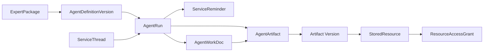
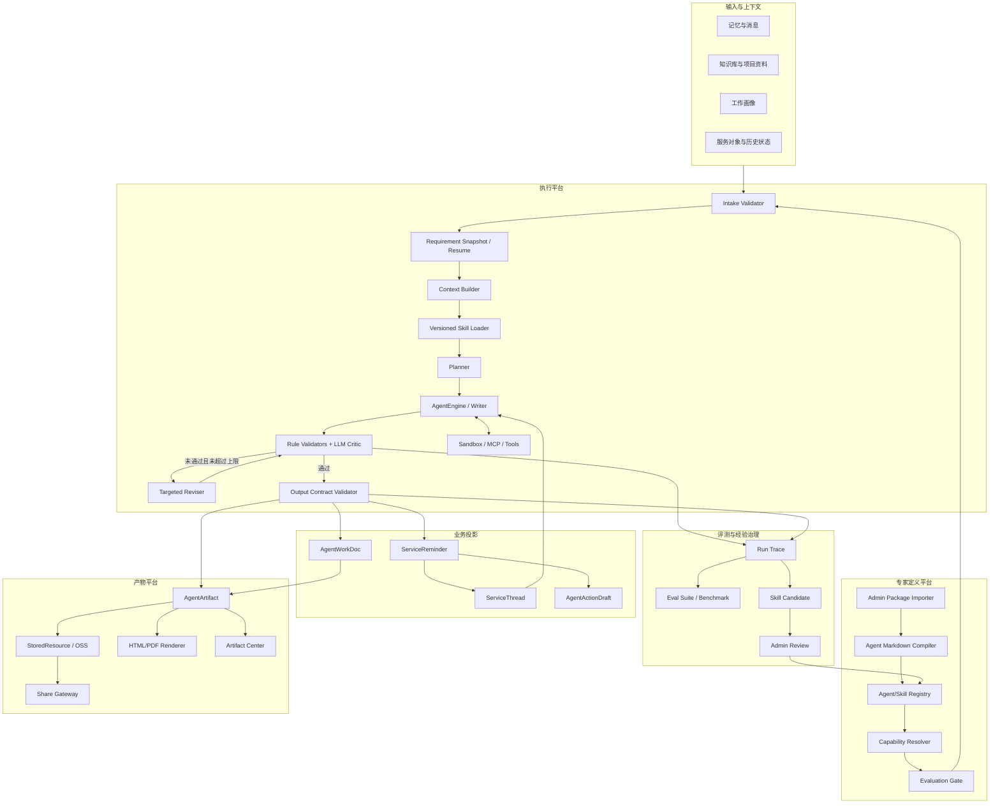

# 可扩展专家 Agent 服务平台 PRD

> 文档状态：V2，专家工作流质量闭环方案
> 更新日期：2026-09-17
> 适用项目：ruile
> 相关文档：[外部 Agent 包兼容与管理员发布路线](./外部Agent包兼容与管理员发布路线.md)
> 实施基线：当前分支已具备 AgentRun 队列、ZIP 专家包导入、版本发布、工作画像绑定、后台专家测试和 `agent_result_v1` 校验
> 当前优先范围：需求澄清、Skill 实际加载、专家工作流、质量审查与自动修订、聊天调用、服务卡片和报告交付
> 后续范围：连续追问、通用产物、临时保存、历史检索、网页分享和脚本型 Skill
> 暂不包含：CRM、工单、日历、IM 等外部系统的自动写入

## 阅读导航

- 第 1-5 章：结论、目标、已实现基线、主要差距和总体架构。
- 第 6-8 章：Agent 定义、Markdown 编译和运行编排。
- 第 9-10 章：统一输出协议和数据模型。
- 第 11-15 章：追问、纠偏、产物生命周期、分享和历史空间。
- 第 16-18 章：Capability、沙箱、评测和行业参考模式。
- 第 19-22 章：最新实施路线、首批验收专家、验收标准和最终建议。

## 1. 执行摘要

本项目已经完成专家平台第一版基础设施，但当前专家测试仍是“系统提示词 + 用户问题 + 一次模型调用”。这种方式能够验证包是否可以导入和返回合法 JSON，不能验证一个专家是否真正按方法论工作，也无法稳定达到 WorkBuddy 等成熟 Agent 产品的交付质量。

本次 PRD 修订后的首要目标，不再是继续扩充导入格式，而是把已导入专家升级为可重复执行的专家工作流。平台需要在正式生成前补齐关键需求，执行时加载 Skill 正文和项目上下文，生成后经过确定性规则与模型审查，再进行有限次数的定向修订，最后才生成服务卡片和正式产物。

本方案的核心决策如下：

1. 保留 ruile 当前 Agent、Skills、MCP、知识库、沙箱和服务模块作为执行基座。
2. 建立 ruile 内部统一的专家包规范，外部来源通过 Source Adapter 转换进入平台；WorkBuddy 只是可选的首个适配来源，不是项目唯一格式。
3. Agent Markdown 描述角色、工作方法、卡片写法、报告内容和产物要求；权限、状态、存储和安全规则由平台控制。
4. 服务卡片面向用户只保留三个业务字段：`标题`、`摘要`、`下一步动作`。
5. Agent 使用统一的 `agent_result_v1` 返回卡片、报告和一个或多个产物，不让不同 Agent 直接操作业务表。
6. 详细报告优先保存结构化源数据，由服务端渲染 HTML；PDF 是导出或归档格式，不是唯一数据源。
7. 文本、HTML、图片、PDF、表格等都作为 `AgentArtifact` 管理，业务层不为每种产物单独设计流程。
8. 普通问答保存在服务会话中，不为每轮对话生成文件；只有正式交付结果才进入产物中心。
9. 文件默认使用临时生命周期。用户保存、分享、确认、编辑或正式关联后，才升级为长期产物。
10. HTML 可以存入 OSS，但浏览器分享必须经过独立的发布网关和受控域名，不能直接公开 OSS 原始地址。
11. 每次追问、纠偏和重新生成都产生新的运行和内容版本，不静默覆盖历史结果。
12. 后续接入更多 Agent 时，标准流程是“后台管理员导入、兼容检查、评测、发布、绑定、启用”，而不是为每个 Agent 修改后端和前端。
13. 专家执行不能以单次 `Chat()` 作为最终运行方式，应复用项目已有 AgentEngine，形成 `intake -> plan -> draft -> review -> revise -> package` 工作流。
14. 缺少关键输入时，运行进入 `waiting_input`，向用户展示 3-5 个结构化问题；用户补充后恢复原运行，不先生成一份猜测性报告。
15. `skills` 不只是名称列表。说明型 Skill 的 `SKILL.md` 必须按版本加载到执行上下文，脚本型 Skill 则必须经过 Capability 和沙箱检查。
16. 最终报告必须同时通过确定性校验和 LLM Critic；低于质量门槛或命中红线时最多自动修订两次。
17. 用户修改、接受和拒绝结果形成质量信号，但不能直接自动改写已发布 Skill，只能生成待管理员审核的 Skill 候选版本。
18. 超越竞品的判断标准不是报告字数，而是需求覆盖、事实与假设区分、可执行性、安全合规、产物质量和用户最终修改量。

## 2. 目标与边界

### 2.1 业务目标

- 从记忆、客户上下文、服务空间和知识库中识别需要处理的事项。
- 按服务领域调用一个或多个内置或管理员已发布 Agent。
- 生成简洁、可执行、可追溯的服务卡片。
- 将证据、分析、风险、建议和沟通参考放入详细报告或其他产物。
- 支持围绕某张卡片继续追问、补充资料、修正方向和重新生成。
- 支持用户保存、分享和检索历史产物。
- 支持持续增加、升级、灰度和回退 Agent，降低长期运营成本。
- 支持后台管理员统一维护 Agent 包、评测、发布和回退。
- 在信息不足时先澄清，不用模型猜测关键业务条件。
- 让专家包中的说明型 Skill 真正参与执行，并记录实际使用版本。
- 对报告进行自动评分、红线检查和定向修订。
- 让管理员能够使用固定测试集比较专家版本、模型和 Skill 的质量差异。

### 2.2 架构目标

- Agent 定义与运行时解耦。
- 模型输出与业务数据库写入解耦。
- 服务卡片与详细产物解耦。
- 产物逻辑身份与 OSS 物理路径解耦。
- 临时内容与长期资产解耦。
- Agent 版本、输入证据、运行记录和产物版本全程可追溯。
- 需求快照、执行步骤、Skill 使用记录和质量评分全程可追溯。
- 不同产物类型共享统一生命周期、权限、分享和历史检索机制。

### 2.3 当前阶段不做

- Agent 不直接发送消息、修改 CRM、创建工单或写入日历。
- 不要求一次兼容 WorkBuddy 的所有专用工具和本地应用能力。
- 不把每次聊天都转成 HTML/PDF 或永久文件。
- 不允许 Agent 自由生成带脚本的网页并直接公开访问。
- 不将对象存储目录当成业务索引或历史列表。
- 不开放普通用户上传、导入、安装或修改 Agent 包。

## 3. 核心概念

| 概念 | 含义 |
| --- | --- |
| `ExpertPackage` | 由后台管理员注册和发布的一组 Agent、Skills、资源、脚本和评测文件 |
| `AgentDefinitionVersion` | 某个 Agent 不可变的定义版本，包括编译后提示词和能力声明 |
| `AgentRun` | 一次具体执行，记录输入、版本、工具调用、状态、成本和错误 |
| `ServiceThread` | 围绕某个客户、卡片或产物持续追问的上下文容器 |
| `ServiceReminder` | 面向用户的服务卡片和事项状态 |
| `AgentWorkDoc` | 报告的业务语义和结构化源内容 |
| `AgentArtifact` | 文本、HTML、图片、PDF、表格等正式或临时交付物的统一索引 |
| `StoredResource` | 项目已有的底层文件资源身份，屏蔽本地/OSS 等物理存储差异 |
| `ResourceBinding` | 将文件资源绑定到运行、产物、卡片或报告 |
| `ResourceAccessGrant` | 可撤销、可过期的分享访问授权 |
| `Output Contract` | Agent 输出必须遵守的结构化协议 |
| `Capability` | 平台无关的能力声明，例如联网、脚本、文件写入、报告渲染 |
| `RequirementSnapshot` | 用户已确认信息、默认值、假设和待补充项的版本化快照 |
| `AgentRunStep` | 一次运行中的需求检查、规划、生成、审查、修订和制品化步骤 |
| `QualityAssessment` | 确定性规则和 LLM Critic 产生的评分、红线与修改建议 |
| `SkillCandidate` | 从高质量运行和用户修改中提取、等待管理员审核的 Skill 更新候选 |

这些对象的关系如下：



## 4. 当前项目基座

本方案是在 ruile 当前能力上扩展，不另建一套 Agent 引擎。

### 4.1 已有能力

| 现有能力 | 当前承载对象或模块 | 在本方案中的用途 |
| --- | --- | --- |
| Agent 与模型执行 | ReAct、自定义 Agent、结构化模型调用 | 执行路由 Agent、领域 Agent 和追问任务 |
| Skills | Skill 发现、读取、脚本执行 | 承载专家方法、参考资料和专用脚本 |
| MCP、OAuth、审批 | MCP 服务和工具权限体系 | 后续映射外部 Agent 包的外部能力 |
| 知识库与搜索 | 知识检索、文件解析、网络搜索 | 为 Agent 提供项目事实和参考信息 |
| 沙箱 | Docker/本地脚本执行 | 执行受控的外部 Skill 脚本 |
| 工作画像 | `UserWorkProfile` | 定义用户职责、服务范围和语气 |
| Agent 配置 | `WorkProfileAgentSetting` | 决定启用哪些领域 Agent、Skills 和输出策略 |
| 服务卡片 | `ServiceReminder` | 保存三字段卡片及状态、优先级和关联对象 |
| 工作文档 | `AgentWorkDoc` | 保存详细报告和客户工作空间内容 |
| 证据关联 | `AgentWorkDocMemoryLink` | 将报告与触发记忆、证据和后续进展关联 |
| 动作草稿 | `AgentActionDraft` | 为未来外部系统写入提供人工确认载体 |
| 文件资源 | `StoredResource`、`ResourceBinding` | 管理文件身份、生命周期及业务绑定 |
| 分享授权 | `ResourceAccessGrant` | 提供可过期、可撤销的读取授权 |
| 对象存储 | OSS 等 FileService 实现 | 保存 HTML、PDF、图片和其他二进制产物 |

### 4.2 已有服务领域

- `memory_router`
- `lead_intake`
- `sales_consulting`
- `customer_service`
- `schedule_coordination`
- `after_sale_risk`
- `daily_review`

这些领域可以作为第一批内置 Agent 的边界，不需要先重构现有服务业务。

### 4.3 截至 2026-09-17 的已实现基线

| 已实现能力 | 当前结果 |
| --- | --- |
| `AgentRun` 队列 | 日报、记忆提取和专家测试可以异步排队、查询状态、失败重试和取消 |
| ZIP 专家包导入 | 管理员可以上传 ZIP，系统解析包清单、`agents/*.md`、Skills、资源和诊断 |
| 幂等重导入 | 相同版本、相同内容返回已有版本；相同版本、不同内容要求升级版本号 |
| Agent Markdown 基础编译 | Front Matter 和正文可以编译为 `AgentDefinitionVersion` 与 `CustomAgentConfig` |
| 版本发布与绑定 | 管理员可以发布专家版本，并绑定工作画像 |
| 管理后台专家测试 | 管理员可以选择模型、输入问题并轮询查看运行结果 |
| `agent_result_v1` | 当前测试结果可以校验三字段卡片和一个结构化报告 |
| 基础兼容诊断 | 缺失 Skill 或不支持的 Capability 可以显示阻断或警告 |

以上能力证明“专家包可以进入 ruile 并被调用”。它们不是专家质量闭环的完成标志。

### 4.4 当前主要差距

| 缺口 | 当前表现 | 业务影响 |
| --- | --- | --- |
| 专家测试只执行一次模型调用 | `SystemPrompt + UserPrompt -> Chat()` | 无法规划、复查和定向修改，复杂任务容易输出模板化内容 |
| Skill 只保存引用 | 导入时检查 `SKILL.md` 是否存在，运行时没有加载正文 | 专家包的方法论没有真正参与回答 |
| 缺少需求澄清 | 信息不足时仍直接生成报告 | 模型会猜日期、人数、预算、场地等关键条件 |
| 没有需求快照 | 用户选择、默认值、假设和待确认项没有结构化保存 | 结果难以复现，追问时容易前后不一致 |
| 没有质量审查与自动修订 | 只检查 JSON Schema 和产物数量 | 章节缺失、预算不一致和安全红线仍可能通过 |
| 测试产物固定为一个报告 | 当前测试 Schema 限制一个 `structured_report_v1` | 无法验证图片、HTML、PDF 和组合产物 |
| 没有执行步骤记录 | 只能看到最终运行状态和结果 | 无法判断使用了哪些 Skill、在哪一步退化 |
| 缺少固定评测集和对照评分 | 管理员主要依靠人工阅读单次回答 | 专家升级和模型切换缺少可靠依据 |
| 缺少服务线程和版本化产物 | 追问、纠偏尚未形成完整业务链路 | 用户无法围绕同一结果持续完善 |
| 缺少 Skill 学习治理 | 用户修改不能转成可审核经验 | 专家质量无法低成本持续积累 |

### 4.5 现有实现对照

| 项目位置 | 当前事实 | V2 演进方式 |
| --- | --- | --- |
| `internal/application/service/agent_run_expert.go` | 专家测试使用一次结构化模型调用 | 改为 ExpertWorkflowRunner，并复用 AgentEngine |
| `internal/agent/engine.go` | 已有多轮 ReAct 和工具执行能力 | 作为 draft/revise 阶段的执行内核 |
| `internal/agent/skills` | 已有 Skill 发现、读取和脚本执行基础 | 增加专家包级 Skill Loader、版本锁定和使用追踪 |
| `internal/types/custom_agent.go` | 已有系统提示词、轮次、Skills 和工具配置 | 承载编译后的运行参数，不单独承担需求与质量契约 |
| `internal/types/service.go` | 已有工作画像、服务提醒、工作文档、证据关系和动作草稿 | 复用现有业务对象，新增需求快照、步骤、线程和产物对象 |
| `internal/types/resource.go` | 已有 `StoredResource`、`ResourceBinding`、临时/长期生命周期和访问授权 | 作为 Agent 文件产物和分享授权的底层基座 |
| `internal/application/service/file/oss.go` | 已有 OSS 主存储和临时存储实现 | 保存 HTML、PDF、图片和其他文件产物 |
| `admin/src/views/AdminExpertPackages.vue` | 已有导入、诊断、发布、绑定和单问题测试 | 增加需求问答、步骤轨迹、质量评分和版本对比 |
| `frontend/src/views/service/ServiceWorkspace.vue` | 已有服务提醒详情和服务助理交互 | 增加专家选择、待补充信息、运行进度、追问和产物入口 |

## 5. 总体架构



核心原则：

- Agent 负责判断和生成候选内容。
- Intake Validator 负责判断信息是否足够，不足时暂停并向用户追问。
- Skill Loader 负责按专家版本加载实际 Skill 内容，而不是只传递 Skill 名称。
- Planner、Writer、Critic 和 Reviser 是同一次运行的不同步骤，必须留下可审计轨迹。
- Output Contract 负责把模型结果变成可信结构。
- Quality Gate 负责判断内容是否达到交付标准，不能由模型自己宣布通过。
- 业务服务负责去重、状态和权限。
- 产物平台负责文件生命周期、版本、预览、分享和检索。
- 学习机制只生成待审核候选，不自动修改已发布专家。
- 外部写入始终经过动作层，不由 Agent 直接完成。

## 6. Agent 定义、注册与发布

### 6.1 为什么不能直接复制外部 Agent 包

外部 Agent 包可能来自 WorkBuddy、其他开源 Agent 项目、企业内部模板或 ruile 原生包。不同来源会依赖各自的插件清单、工具名、Skills 路径、运行目录、脚本环境和交互协议。ruile 虽有相似执行能力，但工具语义、权限模型和生命周期并不相同。

因此：

- Markdown 正文可以复用或改写。
- 说明型 Skills 和参考资料通常可以低成本迁移。
- 脚本型 Skills 需要确认运行时、文件挂载、网络和依赖。
- 来源平台专用工具必须映射为 ruile Capability 或单独开发适配器。
- 未经过编译、权限检查、版本注册和评测的文件不能直接进入生产执行。
- 普通用户不能上传、导入、安装或修改 Agent 包，只能使用管理员发布并绑定到其工作画像或服务领域的版本。

### 6.2 推荐目录

ruile 内置 Agent 可以使用：

```text
agents/
  service/
    memory-router.md
    lead-intake.md
    sales-consulting.md
    customer-service.md
    schedule-coordination.md
    after-sale-risk.md
    daily-review.md
```

外部 Agent 包保持自己的原始目录，管理员导入后转换成 ruile 内部标准包，不直接复制到内置目录。转换后的版本进入后台发布流程，只有 `published` 状态才对普通用户可用。

### 6.3 角色与权限边界

| 角色 | 能做什么 | 不能做什么 |
| --- | --- | --- |
| 平台管理员 | 导入外部 Agent 包、运行安全扫描、编译、评测、发布、停用和回退版本 | 绕过安全扫描直接让外部脚本进入生产执行 |
| 租户或工作空间管理员 | 在已发布 Agent 中选择启用范围、绑定工作画像和服务领域 | 上传外部 Agent 包或修改 Agent 定义 |
| 普通用户 | 使用已启用 Agent、生成服务卡片和产物、追问、纠偏和保存结果 | 不能导入、安装、编辑 Agent 或扩大工具权限 |

如果当前后台暂时只有系统管理员角色，可以先由系统管理员承担平台管理员和租户管理员职责。权限边界仍应按上表设计，避免后续补权限时推翻数据模型。

### 6.4 Agent 生命周期

管理员维护的 Agent 版本建议使用：

```text
draft
  -> testing
  -> approved
  -> published
  -> deprecated
  -> archived
```

只有 `published` 版本可以被普通用户执行。历史卡片、报告和产物必须记录当时使用的 Agent ID、版本和定义哈希。管理员回退或停用新版本时，不重写历史结果。

### 6.5 Agent Markdown 示例

```markdown
---
kind: service-agent
schema_version: "2.0"
id: customer-service
version: "1.0.0"
display_name: 客户服务专家
description: 识别客户跟进事项、未解决问题和关系维护动作
domain: customer_service
status: enabled
max_turns: 12
execution_policy:
  strategy: expert_workflow_v2
  reasoning: true
  max_revision_rounds: 2
skills:
  - evidence-analysis
capabilities:
  required:
    - knowledge.read
  optional:
    - web.search
input_sources:
  - memory
  - work_profile
  - customer_context
required_inputs:
  - id: service_goal
    label: 本次服务目标
    type: string
    required: true
    ask_when_missing: true
  - id: expected_deadline
    label: 期望完成时间
    type: date
    required: false
    ask_when_missing: false
  - id: audience
    label: 结果使用对象
    type: enum
    required: true
    options:
      - 客户
      - 一线服务人员
      - 管理层
clarification_policy:
  max_questions_per_round: 5
  allow_assumptions: true
  require_assumption_labels: true
output_contract: agent_result_v1
card_contract: service_card_v1
deliverable_spec:
  primary_kind: report
  required_sections:
    - facts
    - analysis
    - missing_information
    - recommended_actions
  formats:
    - markdown
    - html
  optional_formats:
    - pdf
quality_rubric:
  minimum_score: 85
  red_lines:
    - fabricated_evidence
    - unlabeled_critical_assumption
    - unauthorized_external_action
  dimensions:
    requirement_coverage: 15
    structure_completeness: 15
    specificity_and_actionability: 20
    consistency_and_feasibility: 15
    evidence_and_assumptions: 10
    safety_and_compliance: 15
    artifact_quality: 10
artifact_policy:
  allowed_kinds:
    - text
    - html
    - pdf
  default_lifecycle: temporary
permissions:
  create_service_card: true
  create_artifact: true
  create_action_draft: false
  write_external_system: false
learning_policy:
  propose_skill_updates: true
  auto_publish: false
---

# 角色

你是客户服务专家，负责从已有事实中识别需要跟进的服务事项。

# 生成条件

仅当存在未解决问题、明确承诺、风险信号或合理的主动跟进机会时生成卡片。

# 不处理

- 不代替用户发送消息。
- 不修改 CRM、工单、日历或其他外部系统。
- 不根据缺失信息编造客户意图、承诺或截止时间。

# 服务卡片规则

- 标题：说明对象和事项，不超过 30 个汉字。
- 摘要：说明当前情况和处理原因，不超过 120 个汉字。
- 下一步动作：以动词开头，只写一个最优先动作。

# 详细产物规则

- 主要产物为结构化服务报告。
- 报告包含事实、证据、判断、缺失信息、建议动作和沟通参考。
- 事实和推测必须分开。
- 信息不足时明确写“待确认”。

# 质量检查规则

- 每项建议必须能追溯到事实、用户确认信息或明确标注的假设。
- 下一步动作必须包含动作对象和完成条件；存在明确时限时写出时限。
- 不得把用户没有确认的信息写成事实。
- 命中红线时不能生成正式服务卡片。

# 追问与修正规则

- 追问时优先使用当前卡片、最新报告和新增资料。
- 用户指出方向错误时，先确认修正目标，再生成新版本。
- 不覆盖旧报告，不把用户反馈伪装成原始事实。
```

### 6.6 Markdown 应描述什么

- 专家角色、适用领域和目标用户。
- 哪些情况应该或不应该生成服务事项。
- 输入信息的业务含义、优先级和证据要求。
- 标题、摘要和下一步动作的写法。
- 报告或其他产物应包含的内容。
- 默认产物类型、允许类型和主要产物。
- 信息冲突、缺失、低置信度时的处理方式。
- 连续追问和用户纠偏时的行为规则。
- 可使用的 Skills 和所需 Capability。
- 生成前必须确认的字段、提问方式和允许使用的默认值。
- 交付物必须包含的章节、表格、附件和格式。
- 质量评分维度、最低分、红线和允许修订次数。
- 是否允许根据结果提出 Skill 更新候选。
- 正例、反例和边界样例。

### 6.7 不能只写在 Markdown 中的规则

以下规则必须由平台强制执行：

- 租户、用户、客户和知识库权限。
- 工具、脚本、网络和凭证白名单。
- 外部系统写入权限。
- JSON Schema 校验。
- HTML 清洗、CSP、脚本禁用和下载策略。
- 最大上下文、轮次、超时和成本。
- 幂等、去重和并发控制。
- Agent 和 Skill 版本锁定。
- 临时文件 TTL、保存升级和过期清理。
- 分享令牌、失效、撤销和访问审计。
- 敏感信息脱敏和提示词注入防护。

## 7. Agent Markdown 编译器

Agent Markdown 编译器不是模型执行器。它负责把人易于维护的专家文件转换成平台可校验、可版本化、可执行的 `CompiledExpertDefinition`。`CustomAgentConfig` 只是其中的模型与工具运行配置，不再承载全部专家语义。

建议编译结果至少包含：

```text
CompiledExpertDefinition
  ├─ CustomAgentConfig
  ├─ IntakeContract
  ├─ DeliverableContract
  ├─ QualityPolicy
  ├─ SkillBindings
  ├─ CapabilityBindings
  └─ LearningPolicy
```

编译流程：

```text
读取 Markdown
  -> 解析 Front Matter
  -> 校验字段与版本
  -> 解析正文和文件引用
  -> 解析 Skills 与 Capability
  -> 编译 Required Inputs 与 Clarification Policy
  -> 编译 Deliverable Spec 与 Quality Rubric
  -> 生成规范化配置
  -> 计算定义哈希
  -> 输出兼容性报告
  -> 注册不可变版本
```

主要职责：

1. 将正文编译为系统提示词或提示词片段。
2. 将 `max_turns` 映射到执行器轮次，并受平台上限约束。
3. 将 Skills 绑定为带包名和版本的稳定引用。
4. 解析每个说明型 Skill 的入口文件、摘要、长度和依赖，并生成可加载索引。
5. 将来源平台工具名转换为抽象 Capability。
6. 将 `required_inputs` 编译为 Intake Contract 和前端可渲染问题。
7. 将卡片、报告、章节和产物声明转换为 Deliverable Contract。
8. 将评分维度、最低分和红线编译为 Quality Policy。
9. 检查缺失文件、Skill、Capability、非法路径和循环依赖。
10. 检查危险权限、超长提示词、重复字段和冲突配置。
11. 保存源文件哈希、编译结果哈希和编译诊断。
12. 不覆盖正在使用的旧版本。

兼容策略：

- `schema_version: "1.0"` 的包继续允许导入，但没有声明的 Intake、Deliverable 和 Quality 字段使用平台保守默认值。
- V1 包在后台显示“基础模式”，不能宣称已通过专家工作流质量门禁。
- 管理员可以在不修改原始包的前提下增加租户级覆盖配置，但覆盖配置必须独立版本化并参与定义哈希。
- 编译器只建立 Skill 索引；运行时仍需由 Skill Loader 读取已锁定版本的正文。

编译器解决的是“定义如何进入平台”，不是“Agent 是否回答正确”。正确性由评测、运行校验和用户反馈共同保证。

## 8. 运行与编排

### 8.1 标准运行流程

```text
事件或用户请求
  -> 创建 AgentRun 并锁定 Agent/Skill/模型版本
  -> Intake Validator 检查 required_inputs
  -> [信息不足] 保存问题并进入 waiting_input
  -> [用户补充] 生成 RequirementSnapshot 并恢复运行
  -> Context Builder 组装事实、记忆、文件和线程摘要
  -> Skill Loader 加载实际 SKILL.md 和必要参考文件
  -> Planner 形成执行计划和交付检查清单
  -> AgentEngine 生成初稿
  -> 确定性 Validator 检查结构、计算、红线和产物
  -> LLM Critic 按 Quality Rubric 评分并给出修改指令
  -> [未通过] Reviser 定向修订，最多两轮
  -> [通过] 校验 agent_result_v1
  -> 更新服务卡片并保存报告与产物
  -> 记录步骤、Skill、质量评分、证据和成本
```

正式运行必须把“业务生成”和“结果包装”分开。Writer 负责生成满足 Deliverable Contract 的内容，Result Packager 再生成三字段卡片和最终 `agent_result_v1`，避免为了满足 JSON Schema 压缩专家的思考和报告结构。

### 8.2 Expert Workflow Runner

服务事项可能由记忆事件、定时任务或批处理触发，不能依赖用户正在聊天。Headless Runner 负责：

- 按版本加载 Agent 和 Skills。
- 创建 `AgentRun`。
- 锁定 Agent 定义、Skill、模型、提示词模板和 Quality Policy 版本。
- 执行 Intake、Plan、Draft、Review、Revise 和 Package 步骤。
- 组装工作画像、服务对象、记忆、知识库和线程摘要。
- 执行超时、取消、重试、并发和成本控制。
- 调用沙箱、MCP 或内部工具。
- 校验最终输出。
- 保存工具调用、证据和诊断信息。
- 保证同一触发事件幂等。
- 将结果交给业务服务和产物服务，不直接写任意表。

第一阶段实现原则：

- 复用现有 `internal/agent/engine.go`，不另写第二套推理循环。
- 先支持说明型 Skill。执行 Skill 和联网 Capability 按后续沙箱阶段开放。
- 管理后台测试与用户正式调用走同一 Workflow Runner，只通过 `run_mode=test|production` 区分是否写入业务表。
- 测试模式仍保存完整步骤和评分，但不创建正式服务卡片和长期产物。

### 8.3 需求澄清与恢复

Intake Validator 先使用确定性规则检查 `required_inputs`，再由模型判断是否存在影响结果方向的未声明缺口。

问题设计规则：

- 每轮最多提出 5 个问题。
- 优先使用单选、多选、日期和数字输入，减少开放式长文本。
- 推荐项必须说明它是默认建议，不能伪装成用户已确认事实。
- 非关键字段允许使用默认值，但必须进入 `assumptions`。
- 日期、人数、预算、地点、目标受众等影响方案结构的字段原则上不应猜测。

运行暂停与恢复：

```text
running/intake
  -> waiting_input
  -> 用户提交 answers
  -> 生成新的 RequirementSnapshot
  -> 重新进入 queued
  -> running/planning
```

同一个业务请求保留同一个 `AgentRun` 根记录，补充信息形成不可变的输入修订。用户在已经生成最终结果后主动改变目标，则创建带 `parent_run_id` 的新运行。

### 8.4 Skill 加载规则

专家运行必须区分三类内容：

| 类型 | 处理方式 |
| --- | --- |
| Agent Markdown 正文 | 作为专家角色、目标和边界进入系统上下文 |
| 说明型 Skill | 由 Skill Loader 读取 `SKILL.md` 和明确引用的参考文件，按预算装入上下文 |
| 脚本型 Skill | 只有 Capability、依赖和沙箱检查通过后才允许执行 |

加载规则：

- 按 `package_id + package_version + skill_name + skill_hash` 锁定版本。
- 保存本次实际加载的文件、哈希和截断信息。
- Skill 内容过长时按摘要、目录和按需读取策略加载，不允许静默丢弃。
- Agent 声明但未加载成功的必需 Skill 直接阻断运行。
- 可选 Skill 加载失败时允许降级，但必须进入诊断。
- 外部包 Skill、租户 Playbook 和项目记忆分层注入，优先级不能互相覆盖。

### 8.5 规划、生成与修订

Planner 输出内部 `execution_plan_v1`，至少包含：

- 已确认需求和明确假设。
- 报告章节及每章目的。
- 需要读取的 Skill、证据和工具。
- 需要进行的计算或一致性检查。
- 交付物列表。
- 质量检查清单。

Writer 根据计划生成初稿。Critic 不能只给笼统评价，必须返回结构化的问题位置、严重级别、规则来源和修改动作。Reviser 只处理 Critic 指定的问题，避免每轮整体重写造成事实漂移。

默认最多自动修订两轮。仍未通过时：

- 测试模式：显示最终得分和失败项。
- 正式模式：不发布正式卡片，将结果保留为候选草稿，并提示用户或管理员处理。
- 命中安全、合规、越权或伪造证据红线时，不进入自动发布。

### 8.6 路由与领域 Agent

`memory_router` 只输出候选领域，不生成用户可见卡片。领域候选还要经过 `WorkProfileAgentSetting` 过滤。

领域 Agent 只接收与本领域相关、经过裁剪的上下文，并遵守同一输出协议。多个 Agent 针对同一事项的处理规则：

- 同对象、同意图、同领域：更新原卡片并产生新报告版本。
- 不同领域但下一步动作一致：保留一张主卡片，在报告中记录多个判断来源。
- 下一步动作冲突：生成候选，交给规则或用户选择。
- 已完成事项出现新证据：按业务规则重开或创建后续事项。

建议去重键：

```text
tenant_id
+ profile_id
+ subject_id
+ normalized_intent
+ time_window
```

### 8.7 运行状态与步骤状态

建议 `AgentRun` 使用：

```text
queued
-> running
-> waiting_input
-> validating
-> succeeded
-> failed
-> cancelled
```

`AgentRun.status` 表示用户可见的总状态，`AgentRun.phase` 表示当前阶段：

```text
intake
planning
drafting
reviewing
revising
packaging
completed
```

每个 `AgentRunStep` 单独记录：

- step type、状态和开始结束时间。
- 使用的模型、提示词模板和 token。
- 读取的 Skill、证据和工具。
- 输入摘要、输出引用和错误。
- 质量评分及修订目标。

一次基础设施失败重试记录为原运行的 `attempt`；自动修订记录为新的 `AgentRunStep`；用户主动重新生成或纠偏创建新的 `AgentRun`，并通过 `parent_run_id` 关联。

### 8.8 下一阶段 API

保留当前创建测试运行和查询运行接口，新增：

```text
POST /api/v1/agent-runs/{run_id}/answers
GET  /api/v1/agent-runs/{run_id}/steps
GET  /api/v1/agent-runs/{run_id}/quality
POST /api/v1/agent-runs/{run_id}/regenerate
```

`answers` 接口要求：

- 只允许当前用户或管理员回答其有权限的运行。
- 只接受 `waiting_input` 状态。
- 按 Intake Contract 校验类型、选项和必填项。
- 保存新的 Input Revision 和 Requirement Snapshot。
- 使用幂等键防止重复提交导致重复恢复。
- 更新为 `queued` 后重新进入现有 Agent 队列。

查询运行接口在 `waiting_input` 时返回：

```json
{
  "status": "waiting_input",
  "phase": "intake",
  "interaction": {
    "schema_version": "intake_request_v1",
    "questions": []
  }
}
```

管理员测试页面和后续聊天页面必须复用同一响应模型。

## 9. 统一输出协议

专家工作流包含中间协议和最终协议：

| 协议 | 用途 | 是否用户可见 |
| --- | --- | --- |
| `intake_request_v1` | 返回待补充字段、问题、选项和原因 | 是 |
| `requirement_snapshot_v1` | 保存确认值、默认值、假设和来源 | 部分可见 |
| `execution_plan_v1` | 保存章节、证据、Skill 和检查计划 | 管理员可见 |
| `quality_assessment_v1` | 保存评分、红线、问题和修订指令 | 管理员可见，用户可看摘要 |
| `agent_result_v1` | 最终卡片、报告、产物和证据信封 | 是 |

中间步骤不能伪装成最终 `agent_result_v1`。处于 `waiting_input` 时不生成正式服务卡片和报告产物。

### 9.1 `agent_result_v1`

不同 Agent 可以产生不同产物，但都返回统一信封：

```json
{
  "schema_version": "agent_result_v1",
  "decision": {
    "should_create_card": true,
    "confidence": 0.88,
    "reason": "客户提出的问题尚未得到明确回复"
  },
  "card": {
    "schema_version": "service_card_v1",
    "title": "跟进华星公司交付时间确认",
    "summary": "客户已两次询问交付日期，目前没有明确回复，可能影响客户预期。",
    "next_action": "核实项目排期后，在今天内回复可确认的交付时间。"
  },
  "artifacts": [
    {
      "kind": "report",
      "role": "primary",
      "title": "华星公司交付时间跟进分析",
      "format": "structured_report_v1",
      "content": {}
    }
  ],
  "evidence": [
    {
      "source_type": "memory",
      "source_id": "memory-id",
      "relation": "trigger",
      "excerpt": "客户询问本周是否可以确认交付日期"
    }
  ]
}
```

统一信封让平台可以稳定处理：

- 是否生成卡片。
- 卡片三字段。
- 一个或多个不同类型产物。
- 证据引用。
- 置信度和诊断。

当前后台专家测试限制为一个 `structured_report_v1` 产物，这是第一版实现限制，不是最终协议限制。V2 Workflow Runner 应允许一个主要产物和多个辅助产物，并由 Deliverable Contract 控制种类、数量和是否必需。

### 9.2 `service_card_v1`

用户可见的业务内容只有：

```json
{
  "title": "...",
  "summary": "...",
  "next_action": "..."
}
```

写作规则：

- `title`：表达“对象 + 事项”，可独立理解。
- `summary`：说明当前情况和处理原因，不重复标题。
- `next_action`：只写一个首要动作，并以动词开头。

以下字段属于系统元数据，不增加卡片正文：

- 状态、优先级和时间。
- Agent、领域和版本。
- 工作画像和服务对象。
- 来源记忆和证据数。
- 置信度。
- 创建、更新时间。
- 当前报告和主要产物引用。

### 9.3 `structured_report_v1`

报告源数据建议使用固定章节类型：

```json
{
  "format": "structured_report_v1",
  "title": "华星公司交付时间跟进分析",
  "executive_summary": "客户正在等待明确交付时间，需要先完成内部排期核实。",
  "sections": [
    {
      "type": "facts",
      "title": "已知事实",
      "items": ["客户已询问交付日期"]
    },
    {
      "type": "analysis",
      "title": "判断",
      "content": "继续延迟回复可能影响客户对项目可控性的预期。"
    },
    {
      "type": "missing_information",
      "title": "待确认信息",
      "items": ["开发和测试的最新完成时间"]
    },
    {
      "type": "recommended_actions",
      "title": "建议动作",
      "items": ["向项目负责人确认最新排期"]
    },
    {
      "type": "talk_track",
      "title": "沟通参考",
      "content": "我们正在确认最后的排期信息，今天内给您一个可执行的交付时间。"
    }
  ],
  "evidence_refs": ["memory-id"]
}
```

首批章节类型：

- `facts`
- `analysis`
- `risks`
- `missing_information`
- `recommended_actions`
- `talk_track`
- `evidence`

### 9.4 通用产物类型

不同 Agent 的产物可以不同，平台统一支持：

| `kind` | 典型格式 | 保存方式 |
| --- | --- | --- |
| `text` | 纯文本、Markdown | 小内容可内联，正式版本可保存资源 |
| `report` | `structured_report_v1` | 结构化源数据进数据库，可渲染 HTML/PDF |
| `html` | HTML | 可信模板渲染后存对象存储 |
| `image` | PNG、JPEG、WebP | 对象存储，生成缩略图 |
| `pdf` | PDF | 对象存储，作为导出或归档快照 |
| `document` | DOCX | 对象存储，提供下载或预览 |
| `spreadsheet` | XLSX、CSV | 对象存储，提供下载或预览 |
| `presentation` | PPTX | 对象存储，提供下载或预览 |
| `audio` | MP3、WAV | 对象存储，提供播放器 |
| `video` | MP4 | 对象存储，提供播放器 |
| `data` | JSON、ZIP 等 | 对象存储，按安全策略下载 |

`kind` 表示业务类型，`mime_type` 表示文件格式，二者不能混为一谈。

建议产物描述：

```json
{
  "kind": "image",
  "role": "primary",
  "title": "客户需求流程图",
  "mime_type": "image/png",
  "resource_ref": "resource://...",
  "lifecycle": "temporary",
  "shareable": true,
  "metadata": {
    "width": 1600,
    "height": 900
  }
}
```

## 10. 数据模型设计

### 10.1 复用现有对象

| 对象 | 继续承担的职责 |
| --- | --- |
| `ServiceReminder` | 三字段服务卡片、状态、优先级、服务对象和去重信息 |
| `AgentWorkDoc` | 报告的业务语义、结构化内容和当前版本 |
| `AgentWorkDocMemoryLink` | 报告结论与记忆证据的关联 |
| `WorkProfileAgentSetting` | Agent 启用、领域、知识库、Skills 和输出策略 |
| `AgentActionDraft` | 未来外部系统动作的人工确认 |
| `StoredResource` | 文件的稳定逻辑引用和临时/长期生命周期 |
| `ResourceBinding` | 文件与产物、运行、卡片、报告之间的关系 |
| `ResourceAccessGrant` | 分享链接的过期和撤销能力 |

### 10.2 建议新增对象

| 对象 | 用途 |
| --- | --- |
| `ExpertPackage` | 后台注册的 Agent 包身份、来源、作者和许可证 |
| `ExpertPackageVersion` | 不可变原始包、哈希、解析和安全扫描结果 |
| `AgentPublication` | 管理员发布状态、发布通道、可见范围和回退关系 |
| `AgentBinding` | 已发布 Agent 与租户、工作画像或服务领域的启用关系 |
| `AgentDefinitionVersion` | 编译后的 Agent 定义、提示词哈希和能力声明 |
| `SkillDefinitionVersion` | Skill 元数据、资源索引和运行声明 |
| `AgentRun` | 一次执行及其父运行、状态、成本、诊断和版本 |
| `AgentRunInputRevision` | 首次请求、澄清答案和恢复运行时的不可变输入修订 |
| `AgentRunStep` | Intake、Plan、Draft、Review、Revise、Package 的步骤记录 |
| `AgentRequirementSnapshot` | 已确认字段、默认值、假设、缺失项和来源 |
| `AgentQualityAssessment` | 质量维度得分、红线、问题列表和修改建议 |
| `ServiceThread` | 卡片、客户或产物的连续追问上下文 |
| `AgentArtifact` | 通用产物的业务索引和当前版本 |
| `AgentArtifactVersion` | 产物的不可变内容版本和资源引用 |
| `AgentEvalSuite` | Agent 评测用例和规则 |
| `AgentEvalRun` | 某定义版本和模型配置的评测结果 |
| `SkillCandidate` | 从优秀产物或用户修订中提取的 Skill 新增/修改候选 |

`AgentRun` V2 建议补充：

```text
parent_run_id
run_mode
phase
agent_definition_version_id
model_id
requirement_snapshot_id
quality_status
quality_score
current_step_id
waiting_reason
resumed_at
```

运行表只保存索引和当前状态，大段初稿、审查文本和产物内容保存到步骤输出或资源中，避免运行记录无限膨胀。

### 10.3 `AgentArtifact` 建议字段

```text
id
tenant_id
owner_user_id
thread_id
run_id
agent_definition_version_id
service_reminder_id
work_doc_id
subject_id
kind
role
title
summary
current_version_id
lifecycle
status
shareable
created_at
updated_at
```

版本表保存：

```text
artifact_id
version
mime_type
resource_id
inline_content
size
checksum
metadata
created_by_run_id
created_at
```

### 10.4 报告与通用产物的关系

- `AgentWorkDoc` 表达“这是一份什么业务报告、属于谁、当前状态是什么”。
- `AgentArtifact` 表达“用户可以查看、下载或分享的交付物是什么”。
- 一份报告可以有结构化源数据、HTML 和 PDF 三个产物版本。
- 图片、表格等不必强行存为 `AgentWorkDoc`，但可以绑定到同一线程和卡片。

## 11. 服务线程与连续追问

### 11.1 为什么需要 `ServiceThread`

围绕服务卡片继续追问时，不能把每次提问都当成新的独立 Agent，也不能把所有历史全文无限加入上下文。`ServiceThread` 用于保存：

- 关联的服务卡片、客户和工作画像。
- 当前主要报告和产物。
- 用户消息和 Agent 回复。
- 最近上下文窗口。
- 滚动摘要。
- 已确认事实、用户偏好和待确认项。
- 当前 Agent 版本和可选替代 Agent。

### 11.2 追问流程

```text
用户打开服务卡片
  -> 进入关联 ServiceThread
  -> 提问或补充资料
  -> Context Builder 加载卡片、当前产物、线程摘要和新增内容
  -> 选择原 Agent 或用户指定 Agent
  -> 生成回答或新产物版本
  -> 用户确认后更新卡片或保存产物
```

追问分三类：

| 类型 | 示例 | 默认结果 |
| --- | --- | --- |
| 解释型 | “为什么判断有风险？” | 只生成消息，不创建文件 |
| 修改型 | “把报告改成给管理层看的版本” | 创建新产物版本 |
| 执行准备型 | “帮我整理成发送给客户的话术” | 生成文本产物或动作草稿 |

### 11.3 上下文控制

- 短期消息保留最近窗口。
- 长期对话压缩为滚动摘要。
- 用户确认的事实单独保存，不只存在摘要中。
- 产物只引用当前版本及必要历史差异。
- 大文件通过检索或片段选择进入上下文，不整份重复注入。
- 每次运行保存实际使用的证据 ID，便于复现。

## 12. 错误纠偏与重新生成

Agent 生成的报告可能不符合用户意图。纠偏不能简单覆盖旧内容，应形成可审计的修订链。

### 12.1 用户纠偏入口

建议支持：

- “方向不对”
- “事实有误”
- “缺少内容”
- “格式不合适”
- “换一个 Agent”
- “重新生成”

用户可补充自由文本，例如：“重点应放在续费风险，不是交付延期。”

### 12.2 纠偏流程

```text
用户反馈
  -> 分类错误类型
  -> 保存 feedback 和修正目标
  -> 选择原 Agent、替代 Agent 或人工模板
  -> 创建新的 AgentRun
  -> 使用原输入 + 用户反馈 + 新证据
  -> 生成新 Artifact Version
  -> 展示差异
  -> 用户接受后切换 current_version
```

关键规则：

- 原始运行和旧产物不可被静默覆盖。
- 用户反馈作为“修正指令”，不能伪装为原始证据。
- 事实错误必须要求证据或标记待确认。
- 格式错误可以仅重新渲染，不必再次调用业务 Agent。
- Agent 选择错误时，可以保留同一线程并切换领域 Agent。
- 用户接受的新版本才更新卡片摘要或当前报告引用。

### 12.3 自动质量控制

质量门禁由两部分组成：

1. 确定性 Validator：检查可以用程序明确判断的问题。
2. LLM Critic：按专家 `quality_rubric` 判断业务质量并给出定向修改建议。

平台默认质量维度：

| 维度 | 默认分值 | 核心检查 |
| --- | ---: | --- |
| 需求覆盖 | 15 | 已确认要求是否全部进入方案 |
| 结构完整 | 15 | 必需章节、表格、附件是否齐全 |
| 具体与可执行 | 20 | 动作是否包含对象、负责人、时间或完成条件 |
| 一致与可行 | 15 | 时间、人数、预算、流程是否前后一致 |
| 证据与假设 | 10 | 事实、证据、推测和默认值是否区分 |
| 安全与合规 | 15 | 是否命中行业和专家红线 |
| 产物质量 | 10 | HTML/PDF/图片是否完整、可读和符合格式 |

默认通过条件：

- 总分不低于 85。
- 所有必需章节和产物存在。
- 没有安全、合规、越权和伪造证据红线。
- 确定性计算和引用校验通过。

自动处理规则：

- Schema 不通过：执行一次结构修复，不改变业务结论。
- 必需章节或产物缺失：进入定向修订。
- 预算、总数或日期计算不一致：由程序指出具体字段后修订。
- 无证据关键结论：改写为明确假设、待确认项或删除结论。
- 输出越权动作：阻断发布并记录安全诊断，不能只静默删除。
- 重复事项：合并到已有卡片，不创建重复记录。
- 自动修订最多两轮，超过后转为候选草稿或人工处理。

Critic 应与 Writer 使用隔离提示词。条件允许时可以使用不同模型，避免生成者直接自评造成稳定偏差。

用户纠偏应沉淀为评测用例，避免相同错误在新版本中反复出现。

## 13. 产物生命周期与存储

### 13.1 数据库存什么

数据库保存：

- 产物业务索引和关联关系。
- 结构化报告源数据。
- 文件元数据、版本和校验值。
- Agent、运行、卡片、线程和证据引用。
- 分享授权和访问审计。
- 临时/长期状态及过期时间。

### 13.2 OSS 存什么

OSS 或其他对象存储保存：

- HTML 发布文件。
- PDF、图片、Office、音视频和压缩包。
- 较大的 Markdown、JSON 或中间产物。
- 缩略图和预览文件。

业务查询必须先查数据库中的 `AgentArtifact` 和 `StoredResource`，不能通过遍历 OSS 路径查找历史。

### 13.3 临时优先策略

Agent 新生成的文件默认是临时产物：

```text
temporary
  -> saved
  -> published
  -> archived

temporary
  -> expired
```

建议策略：

- 默认临时 TTL 为 7 天。
- 用户持续查看或追问时可延长，但最长不超过 30 天。
- 用户点击保存后转为 `persistent`。
- 用户分享、确认、编辑或正式绑定卡片后自动转为 `persistent`。
- 过期清理由应用任务执行，并同步删除数据库引用和 OSS 对象。
- OSS 生命周期规则只作为兜底，不作为唯一清理机制。

具体 TTL 应作为租户或产品策略配置，不硬编码在 Agent Markdown 中。

### 13.4 为什么不让用户每次都手动保存

完全手动保存会导致：

- 用户忘记保存重要结果。
- 已分享链接指向即将过期的文件。
- 卡片和报告引用突然失效。

因此采用“临时优先 + 关键行为自动升级”：

- 普通生成结果暂存。
- 明确保存时升级。
- 分享时自动升级。
- 被正式卡片或报告引用时升级。
- 用户未使用的产物自动清理。

## 14. HTML、PDF 与网页分享

### 14.1 HTML 生成

领域 Agent 不直接生成最终可发布 HTML。推荐：

```text
structured_report_v1
  -> 可信服务端模板
  -> HTML
  -> 安全检查
  -> OSS
  -> 发布网关
```

这样可以保证：

- 风格统一。
- 移动端和桌面端一致。
- PDF 打印版式稳定。
- Agent 文本得到转义。
- 不允许任意脚本和事件属性。
- 模板升级时可以重新渲染。

如果某类 Agent 的业务产物本身就是 HTML，仍需经过清洗或隔离渲染，不能直接继承主站权限。

### 14.2 PDF 策略

- 结构化报告是内容源。
- HTML 是主要浏览格式。
- PDF 是导出、签收、归档或固定版式快照。
- 报告内容变化后产生新版本，旧 PDF 保留原版本含义。
- 不把 PDF 二进制写入 `AgentWorkDoc.Content`。

### 14.3 分享架构

HTML 可以存 OSS，但建议 OSS Bucket 保持私有。分享链接使用应用控制的地址：

```text
https://reports.example.com/s/{token}
```

访问流程：

```text
浏览器访问 token
  -> Share Gateway 查询 ResourceAccessGrant
  -> 校验租户、过期、撤销、密码和版本
  -> 返回受控 HTML 或短时资源地址
  -> 记录访问日志
```

安全要求：

- 报告使用独立域名，与主应用 Cookie 隔离。
- 设置严格 CSP。
- 禁止内联脚本、事件属性和不受信任 iframe。
- 外部图片、字体和链接使用白名单或代理。
- 分享令牌只保存哈希。
- 支持过期、撤销、密码和指定版本分享。
- 分享页面不暴露 OSS 物理路径和平台主凭证。

项目当前普通文件服务会将 HTML 等主动内容按下载方式处理，这是合理的主站安全策略；报告浏览应通过独立发布网关实现，不应放宽通用文件接口。

## 15. 历史产物与服务空间

### 15.1 历史产物查找

增加统一“产物中心”，查询的是 `AgentArtifact` 索引，不是对象存储目录。

建议支持：

- 按标题和摘要搜索。
- 按 Agent、产物类型、客户、卡片和时间筛选。
- 按临时、已保存、已分享和已归档筛选。
- 查看当前版本和历史版本。
- 从卡片、客户空间、Agent 页面和全局产物中心进入。
- 展示来源运行、证据、创建者和分享状态。

### 15.2 服务空间防膨胀

服务空间不应是不断追加文件的物理文件夹，而应是数据库驱动的虚拟工作空间：

```text
服务对象
  ├─ 当前概览
  ├─ 未完成服务卡片
  ├─ 最近会话
  ├─ 当前正式产物
  ├─ 历史产物与版本
  └─ 事件时间线
```

存储规则：

- 普通问答：只保存为消息。
- 长对话：生成滚动摘要。
- 卡片：只保存服务事项状态。
- 正式报告：保存为 `AgentWorkDoc` 和 `AgentArtifact`。
- 图片/文件：进入统一产物中心。
- 被替代版本：保留版本记录，但不占据默认列表。
- 临时且未使用产物：到期清理。

这样可以避免“问一次就多一个文件”，同时保留必要的追溯能力。

## 16. Capability 与沙箱

### 16.1 平台无关 Capability

外部 Agent 包不应直接依赖 ruile 内部工具名。建议先声明：

```text
knowledge.read
web.search
web.fetch
filesystem.read
filesystem.write
script.python
script.node
network.http
artifact.publish
report.render_html
report.export_pdf
mcp.invoke
office.pptx.create
office.pptx.edit
```

Capability Resolver 再映射到项目已有工具、MCP 或专用适配器。

安装检查返回：

- `supported`：完整支持。
- `degraded`：可以运行，但部分交付能力不可用。
- `blocked`：关键依赖缺失，不允许启用。

### 16.2 沙箱目录

脚本型专家每次运行使用隔离目录：

```text
/package       专家包，只读
/input         本次输入文件，只读
/workspace     本次运行工作目录，可写
/output        可回收产物目录，可写
/tmp           临时目录，可写，运行结束清理
```

必须限制：

- CPU、内存、磁盘、进程数和超时。
- Python/Node 等运行时版本。
- 默认无网络。
- 按域名、端口和方法开放网络。
- 通过 Secrets Broker 注入短期凭证。
- 输出文件类型、数量和大小。
- 恶意文件扫描和敏感信息检查。

## 17. 评测文件与发布门禁

### 17.1 评测文件的作用

评测文件用于验证“某个 Agent 版本是否仍按预期工作”，不是提供给最终用户看的报告。

典型结构：

```text
evals/
  cases.json
  rules.json
```

`cases.json` 保存输入、上下文和期望行为；`rules.json` 保存判定规则，例如：

- 必须生成或不能生成卡片。
- 必须命中某个事实。
- 不得编造某类结论。
- 输出必须通过 Schema。
- 必须或不得调用某个工具。
- 必须生成指定类型产物。
- 关键结论必须带证据。

### 17.2 用例类别

- 应生成卡片的正常样例。
- 不应生成卡片的普通记录。
- 信息不足和低置信度样例。
- 多条事实相互冲突样例。
- 已完成事项再次出现样例。
- 同一事项多次更新和去重样例。
- 追问、格式调整和方向纠偏样例。
- 记忆中包含提示词注入样例。
- 跨租户或越权数据不可见样例。
- Agent 升级回归样例。

### 17.3 发布门禁

- Agent 新版本必须运行固定回归集。
- P0 安全或核心业务用例失败时禁止发布。
- 新旧版本需要对比卡片、产物、工具调用、延迟和成本。
- 先绑定少量工作画像灰度。
- 失败率、重复卡片率或人工忽略率超阈值时停止扩大灰度。
- 严重问题可以回退定义版本，历史产物不受影响。

### 17.4 线上反馈闭环

以下用户行为应转成质量信号：

- 保留、完成、忽略或修改卡片。
- 接受或拒绝新产物版本。
- 标记事实错误、方向错误或格式错误。
- 换 Agent 后问题是否解决。
- 报告打开、保存、分享和导出情况。

高价值纠偏样例经过脱敏和审核后，可以加入回归集。

### 17.5 专家质量基准

每个准备正式发布的专家至少维护 20 个固定用例，成熟专家建议 50 个以上。用例必须包含：

- 信息完整且应直接生成的任务。
- 缺少关键字段、必须先追问的任务。
- 包含冲突信息和错误事实的任务。
- 容易命中行业安全或合规红线的任务。
- 需要不同产物格式的任务。
- 用户纠偏后重新生成的任务。

版本对比必须锁定：

- 相同用户输入和 Requirement Snapshot。
- 相同模型或明确标注模型差异。
- 相同知识库和项目上下文。
- 相同评分规则。

对照指标：

| 指标 | 目标 |
| --- | --- |
| 必需章节覆盖率 | 100% |
| 关键假设标注率 | 100% |
| 红线违规数 | 0 |
| 责任人/时间/完成条件覆盖率 | 不低于 90% |
| 预算和数量计算正确率 | 100% |
| 质量门禁通过率 | 核心用例不低于 90% |
| 用户接受率 | 持续高于上一个稳定版本 |
| 用户修改距离 | 持续下降 |
| PDF/HTML 渲染通过率 | 100% |

与 WorkBuddy 等外部产物做盲评时，不能只比较字数。评审者应隐藏来源，按需求覆盖、具体程度、风险控制、可执行性、产物可读性和需要人工修改的程度评分。

### 17.6 Skill 经验晋升

系统可以从以下来源提出 `SkillCandidate`：

- 高评分且被用户接受的报告。
- 用户对报告的实质性修改。
- 多个评测用例重复出现的缺陷修复。
- 管理员新增的行业规则和红线。

晋升流程：

```text
运行或修改记录
  -> 提取候选规则
  -> 与现有 Skill 做差异对比
  -> 运行固定回归集
  -> 管理员审核
  -> 生成新的 SkillDefinitionVersion
  -> 灰度发布
```

禁止模型直接覆盖已发布 Skill。候选必须显示来源、适用范围、可能影响的用例和回归结果，支持拒绝、修改、发布和回退。

## 18. 行业项目可借鉴的模式

类似需求在 Agent 框架和执行产品中普遍存在，但通常由使用方完成产品层组合：

| 参考方向 | 可借鉴模式 | ruile 中的对应设计 |
| --- | --- | --- |
| LangGraph 类状态框架 | 线程检查点、跨线程记忆、上下文摘要和 TTL | `ServiceThread`、滚动摘要、运行状态 |
| OpenHands 类执行环境 | 会话与工作区分离，沙箱可临时也可挂载持久目录 | `/workspace`、`/output`、临时产物升级 |
| AutoGen 类代码执行器 | 每次任务使用隔离工作目录，由应用决定是否保留 | `AgentRun` 级沙箱和产物回收 |
| CrewAI 类任务输出 | 默认返回结构化结果，只有显式交付才写文件 | `agent_result_v1` 和正式产物规则 |

这些项目通常解决 Agent 状态、工作区或输出的一部分。ruile 还需要补充服务卡片、客户关联、保存/分享、版本、权限和产物中心，才能形成完整产品闭环。

## 19. 分阶段实施路线

### 阶段零：第一版平台基线，已完成

当前分支已经完成：

- `AgentRun` 队列、Worker、状态查询、失败记录和取消。
- 日报、记忆服务生成和专家测试运行类型。
- ZIP 专家包上传、解析、诊断、幂等重导入和版本存储。
- Agent Markdown 基础编译、版本发布和工作画像绑定。
- 管理后台专家列表、详情、发布、绑定和模型测试。
- `agent_result_v1`、`service_card_v1` 和单一结构化报告校验。

阶段零的验收结论是“平台链路可运行”，不代表专家回答质量已经达标。

### 阶段一：Expert Workflow V2 核心，P0，已完成

目标：将专家测试从一次模型调用升级为可暂停、可恢复、可审计的工作流。

- 已新增 `waiting_input` 状态和 `phase` 字段。
- 已新增 `AgentRunInputRevision`、`AgentRequirementSnapshot` 和 `AgentRunStep`。
- 已编译并执行 `required_inputs` 与 `clarification_policy`，平台确定性校验优先于模型判断。
- 后台测试弹窗已支持结构化追问、提交答案和恢复运行。
- 已实现专家包级 Skill Loader，真正读取说明型 `SKILL.md` 并校验哈希。
- 已记录 Agent、Skill、模型和执行步骤。
- 已复用现有 AgentEngine 执行 Plan、Draft 和 Package。
- 测试模式已统一使用 Expert Workflow Runner。
- 当前仍不开放脚本型 Skill、外部系统写入和普通用户导入。

建议实现落点：

| 层 | 主要改动 |
| --- | --- |
| 类型与迁移 | 扩展 `AgentRun`，新增 Input Revision、Requirement Snapshot 和 Run Step |
| 专家编译 | 扩展 `expert_package.go`，编译 Intake、Deliverable、Quality 和 Skill 索引 |
| 运行服务 | 新增 Expert Workflow Runner，让现有 `agent_run_expert.go` 委托工作流执行 |
| Skill | 新增包级 Skill Loader，从已锁定 Package Version 中读取正文 |
| API | 已增加 answers、steps、quality 和 regenerate 接口 |
| Admin | 已增加追问表单、步骤轨迹、质量评分和纠偏重新生成入口 |
| 测试 | 已覆盖暂停恢复、输入版本、Skill 缺失、版本锁定和确定性规则 |

验收结果：

- 输入“幼儿园制定国庆亲子运动会方案”时，系统先询问日期、规模、场地和活动形式等关键问题。
- 未回答关键问题前不生成正式服务卡片和报告。
- 补充答案后可以恢复同一个运行，不要求用户重新输入原问题。
- 运行详情显示使用的 Agent、Skill、模型和每个步骤。
- 删除或损坏必需 `SKILL.md` 时运行被阻断，而不是静默退化。

### 阶段二：质量门禁与自动修订，P0，已完成基础闭环

目标：让专家结果在交付前经过可量化检查，先达到 WorkBuddy 同类质量，再建立可持续超越能力。

- 将 Agent Markdown 升级为 V2 编译结果。
- 支持 `deliverable_spec`、`quality_rubric`、红线和修订次数。
- 已实现报告长度、必需章节、关键假设标注和阻断问题的确定性 Validator。
- 已实现结构化质量评估和隔离的 LLM Critic。
- 已实现最多两轮定向 Reviser。
- 管理后台已展示总分、分项分数、红线、问题列表和通过状态。
- 已支持从已完成/失败运行创建带 `parent_run_id` 的纠偏子运行。
- 已增加日期合法性、预算表分项与合计一致性、按交付声明检查依据章节的确定性规则。
- 更复杂的跨表数量计算、日期区间推导、引用真实性核验和 WorkBuddy 自动盲评仍需在评测集阶段补齐。

建议实现落点：

| 层 | 主要改动 |
| --- | --- |
| 质量规则 | 建立 Validator Registry，区分通用规则和专家包规则 |
| Critic | 定义 `quality_assessment_v1`，使用隔离提示词和可替换模型 |
| 修订 | 根据 assessment 生成定向修订步骤，限制最大轮次 |
| 数据 | 保存分项得分、红线、问题定位和修订前后引用 |
| Admin | 展示评分雷达、问题列表、修订差异和最终结论 |
| 测试 | 建立固定用例、预算计算、安全红线和回归测试 |

验收结果：

- 必需章节覆盖率 100%，关键假设标注率 100%。
- 安全、合规、越权和伪造证据红线为 0。
- 预算和数量计算校验通过。
- 未达到 85 分时不发布正式结果，并能显示明确失败原因。
- 同一需求、相同确认信息和相同模型下，Ruile 结果盲评不低于 WorkBuddy。

### 阶段三：聊天调用、服务卡片与连续追问，P1

目标：让普通用户在聊天窗口和服务模块使用管理员已发布的专家。

- 聊天窗口支持选择已绑定专家。
- 展示待补充信息卡片、结构化选项和运行进度。
- 最终结果生成三字段服务卡片和详细报告。
- 增加 `ServiceThread`，关联卡片、运行、需求快照和当前报告。
- 支持解释型追问、内容修改、补充资料、重新生成和切换专家。
- 纠偏创建子运行和新版本，不覆盖原结果。
- 普通用户仍不能上传、编辑或发布专家包。

当前实施进度，2026-09-20：

- 已完成普通用户聊天窗口调用已发布专家、结构化补充信息、运行进度、三字段卡片和右侧 HTML 产物预览。
- 已完成第一版修改型追问：结果下方使用快捷动作创建 `parent_run_id` 子运行，子运行读取上一版报告作为修订基线。
- 已完成失败运行的快捷重试入口；旧运行、旧卡片和旧产物不被覆盖。
- 已完成纠偏子运行跳过重复模型澄清；显式 `required_inputs` 仍由平台确定性校验。
- 已完成第一版解释型追问：使用预置按钮创建独立 `expert_follow_up` 运行，只返回聊天回答，不生成卡片或产物，并沿用已发布专家和上一版报告。
- 已使用 `thread_id` 串联父子运行，解释型追问和修改型运行会读取同线程近期任务、交付摘要和追问回答。
- 已完成基础版本差异查看。
- 独立 `ServiceThread` 实体、长期线程摘要、补充附件后继续执行和切换专家仍属于本阶段后续功能。

验收结果：

- 用户可以在一次连续交互中完成提问、补充信息、查看卡片和打开报告。
- 解释型追问只生成消息，不制造文件。
- 修改型追问生成新版本，并可查看修改前后差异。
- 专家测试与聊天正式调用使用同一执行链路。

### 阶段四：通用产物与报告交付，P1

目标：支持不同专家交付文本、Markdown、HTML、PDF、图片和 Office 文件。

当前 P0 基础能力：

- 结构化报告会同时持久化为 HTML 主产物和 Markdown 辅助产物。
- 产物记录包含文件名、MIME 类型、大小和资源引用。
- 右侧面板支持 HTML、Markdown、普通文本、图片、PDF、音频和视频预览。
- 预览失败时显示明确错误和重新加载入口，仍保留下载操作。
- `AgentArtifact` 独立实体、产物版本、临时转长期和产物中心仍按本阶段实施。

- 增加 `AgentArtifact` 和 `AgentArtifactVersion`。
- 复用 `StoredResource` 的临时/长期生命周期。
- 结构化报告先渲染可信 HTML，再按需导出 PDF。
- 建立 HTML/PDF 渲染检查，包括分页、表格溢出、字体和空白页。
- 建立临时产物保存、升级和清理任务。
- 建立产物中心和多入口历史查询。
- 将当前“只能返回一个报告”的测试限制扩展为主要产物加辅助产物。

验收结果：

- 专家可以按声明生成不同产物组合。
- HTML 和 PDF 内容一致，渲染检查通过率 100%。
- 用户保存、分享、确认或正式关联后，临时产物自动升级为长期产物。
- 历史产物通过数据库索引查询，不依赖 OSS 目录。

### 阶段五：评测集与 Skill 经验治理，P1

目标：让管理员能够持续升级专家，而不依赖逐份人工试答。

- 增加 `AgentEvalSuite`、`AgentEvalRun` 和固定测试集。
- 支持专家版本、模型、Skill 的 A/B 对比。
- 发布前自动执行核心回归用例和质量门禁。
- 收集用户接受、拒绝、修改和重新生成行为。
- 从高质量运行和用户修改中生成 `SkillCandidate`。
- 管理员审核候选后生成新的 Skill 版本，支持灰度和回退。

验收结果：

- 每个正式专家至少有 20 个固定用例。
- P0 用例失败时禁止发布。
- 管理员可以查看新旧版本质量、成本、延迟和失败项差异。
- Skill 不会被模型自动覆盖，所有晋升都有来源、审核和版本记录。

### 阶段六：脚本、联网和专用能力，P2

目标：覆盖包含脚本、联网、MCP 和专用文件生成能力的复杂专家包。

- 扩展 AgentRun 级沙箱工作目录和产物回收。
- 支持版本化 Python/Node 运行时和 Skill 依赖解析。
- 增加网络白名单、Secrets Broker 和短期凭证。
- 自动绑定 MCP 和连接器。
- 按需求增加 PPTX、Office、本地应用等专用 Capability。

验收结果：

- 离线脚本和受控联网专家只能在隔离环境运行。
- 专家包不持有平台主密钥。
- 工具调用、网络访问和文件输出均可审计。

### 阶段七：分享与规模治理，P2

目标：安全分享正式产物，并为后续大量用户使用建立治理能力。

- 建立独立报告域名和 Share Gateway。
- 支持过期、撤销、密码、版本锁定和访问审计。
- 增加版本灰度、一键回退、质量与成本仪表盘。
- 增加租户配额、并发隔离、Worker 扩容和异常版本自动停用。

验收结果：

- OSS 保持私有，浏览器分享链接可控且可撤销。
- 单个租户或专家异常不会阻塞全部运行队列。
- 管理员能够定位失败发生在哪个步骤、模型、Skill 或工具。

当前版本按用户决策暂不以前置服务器扩容为重点。阶段一和阶段二复用现有队列，先验证质量闭环；容量治理在真实使用量形成后实施。

## 20. 首批 Agent 建议

阶段一和阶段二只选择少量专家验证完整质量链路，不以专家数量作为进度指标。

首个端到端验收专家：

| Agent ID | 用途 | 选择原因 | 重点验收 |
| --- | --- | --- | --- |
| `kindergarten-activity-planner` | 幼儿园活动方案策划 | 已有 WorkBuddy 包和同题基准报告，便于直接对照 | 结构化追问、Skill 加载、12 章交付、安全红线、预算校验、HTML/PDF |

服务模块首批业务 Agent：

| Agent ID | 用户可见 | 主要职责 | 主要输出 |
| --- | --- | --- | --- |
| `memory-router` | 否 | 判断输入应进入哪些服务领域 | 路由结果 |
| `lead-intake` | 是 | 识别新线索、资格和缺失信息 | 卡片 + 报告 |
| `sales-consulting` | 是 | 识别销售推进机会和阻塞 | 卡片 + 报告 |
| `customer-service` | 是 | 识别客户跟进和未解决问题 | 卡片 + 报告/话术 |
| `schedule-coordination` | 是 | 识别会议、回访和协调事项 | 卡片 + 文本 |
| `after-sale-risk` | 是 | 识别交付、售后和关系风险 | 卡片 + 报告 |
| `daily-review` | 是 | 汇总重点事项和下一步动作 | 日报 |

`kindergarten-activity-planner` 用于证明平台可以执行一个复杂外部专家；服务模块 Agent 用于验证卡片、记忆和工作画像业务闭环。两类专家共用同一 Workflow Runner、质量门禁和产物机制。

首批不建议一次发布大量外部 Agent。先用固定评测集验证需求澄清率、Skill 实际加载率、卡片准确率、追问体验、质量门禁通过率、产物保存率和纠偏闭环，再逐步扩展。

## 21. 关键验收标准

### 21.1 下一版本验收，阶段一与阶段二

功能验收：

- 管理员导入并发布 `kindergarten-activity-planner` 后，可以在后台发起专家工作流测试。
- 系统能够从专家定义生成结构化澄清问题。
- 运行可以进入 `waiting_input`，补充答案后恢复执行。
- 专家声明的说明型 Skill 正文被实际加载，并在运行轨迹中显示文件和哈希。
- Expert Workflow Runner 使用 Plan、Draft、Review、Revise、Package 步骤，不再只执行一次 `Chat()`。
- 最终结果仍符合三字段服务卡片和统一产物协议。
- 质量未通过时不生成正式结果，管理员能看到评分、红线和修订历史。

质量验收：

| 指标 | 通过标准 |
| --- | --- |
| 必需输入识别率 | 固定用例 100% |
| 必需 Skill 加载率 | 100% |
| 必需章节覆盖率 | 100% |
| 关键假设标注率 | 100% |
| 红线违规数 | 0 |
| 预算/数量/日期校验正确率 | 100% |
| 质量门禁通过率 | 核心正向用例不低于 90% |
| 失败诊断可定位率 | 100% 能定位到步骤 |
| 同题盲评 | 不低于 WorkBuddy 基准 |

固定验收题使用：

```text
幼儿园制定国庆亲子运动会方案
```

至少验证两种路径：

1. 不提供补充信息：必须先追问，不能直接生成正式方案。
2. 提供日期、规模、场地、形式和预算：生成完整报告并通过质量门禁。

### 21.2 聊天与服务模块验收，阶段三

- 只有管理员发布并绑定的专家可以被普通用户调用。
- 普通用户不能上传、导入、安装或编辑 Agent 包。
- 聊天窗口可以展示结构化问题、运行状态、三字段卡片和详细报告。
- 追问沿用同一 ServiceThread，不无限拼接历史全文。
- 用户纠偏后产生新运行和新版本，旧结果可查看且不被覆盖。
- 解释型追问不生成文件，正式修改才生成产物版本。

### 21.3 产物与治理验收，阶段四以后

- 详细结果可以是文本、报告、HTML、图片、PDF 或专家声明的其他产物。
- 新产物默认临时，保存、分享或正式关联后转为长期。
- 历史产物通过数据库索引查询，不依赖 OSS 目录。
- HTML 可以在独立报告域名安全查看并撤销分享。
- 每个结果可以追溯 Requirement Snapshot、Agent、Skill、模型、步骤、工具、证据和质量评分。
- 新版本评测失败时不能替换稳定版本。
- 增加同类专家不需要修改服务卡片和产物业务代码。
- Skill 更新必须经过候选、评测、管理员审核和版本发布。

### 21.4 非验收方式

以下现象不能单独证明专家质量达标：

- 报告字数更多。
- 模型返回了合法 JSON。
- 包中存在 `skills/` 目录。
- 页面显示运行成功。
- 单个演示问题看起来合理。

验收必须基于固定输入、确认需求、运行轨迹、质量评分、红线、产物检查和盲评结果。

## 22. 最终建议

本项目应建设的不是“一个能读取 WorkBuddy Markdown 的功能”，也不是“把专家提示词调用一次并包装成 JSON”，而是一个由后台管理员维护、可以执行专家方法论、验证交付质量并持续积累经验的服务 Agent 平台。

推荐长期结构：

```text
外部 Agent 包或 ruile 原生 Agent 包
  -> 后台管理员导入
  -> Source Adapter 解析
  -> 安全扫描
  -> ruile Expert Package
  -> Agent Markdown Compiler
  -> 版本化 Agent/Skill Registry
  -> 评测与发布门禁
  -> 管理员发布与绑定
  -> Intake 与 Requirement Snapshot
  -> Versioned Skill Loader
  -> Plan / Draft / Review / Revise
  -> Quality Gate
  -> agent_result_v1
  -> ServiceReminder / AgentWorkDoc / AgentArtifact
  -> 临时保存、历史检索、HTML/PDF 渲染和分享
  -> 用户反馈与 Skill Candidate
  -> 管理员审核和新版本发布
  -> 灰度和回退
```

最新研发顺序应从阶段一开始：先让说明型 Skill 真正参与运行，并完成需求澄清、审查和修订；再接入聊天、产物和经验治理。以后只有在新 Agent 需要平台尚不存在的 Capability 时，才开发一次通用适配器。对已经支持的能力，新增 Agent 应主要是管理员导入定义、配置依赖、运行评测、发布和灰度启用，从而把未来运营成本从“持续开发功能”转为“管理专家内容、评测集和质量规则”。
