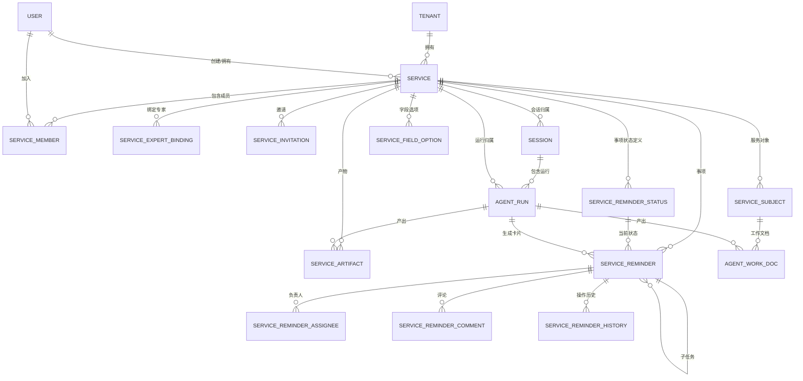
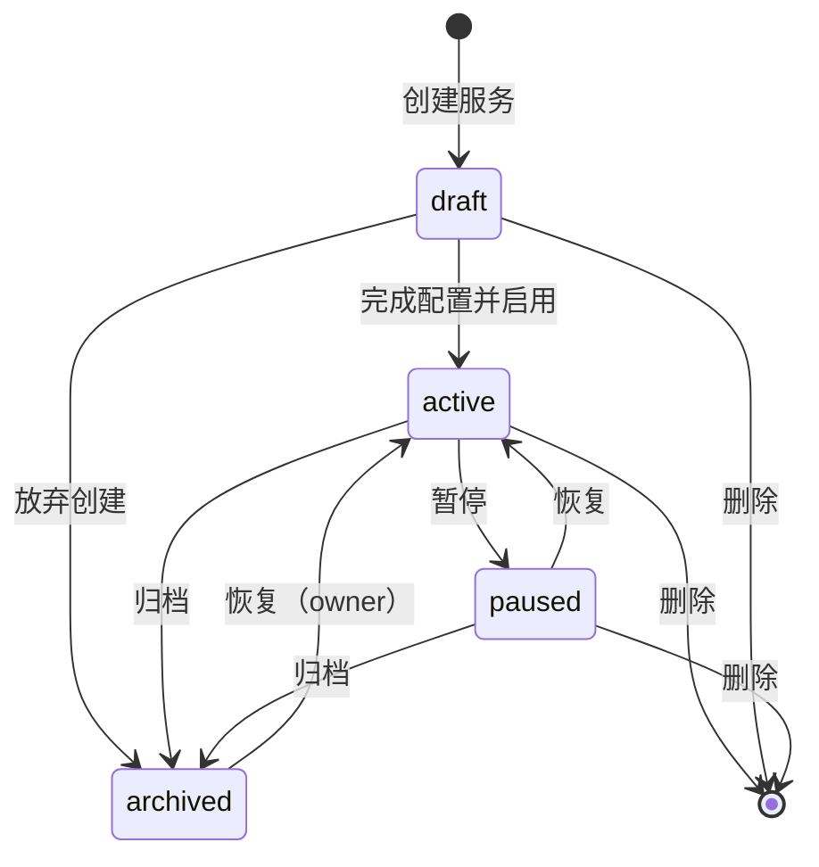

# 服务模块重构 PRD

> 目标：让用户能够**创建服务**，并在**服务空间**内使用 Agent 开展工作。
> 本文档为设计评审稿，评审通过后再排期动代码。

---

## 阅读导航

| 章节 | 内容 | 主要读者 |
| --- | --- | --- |
| [1. 执行摘要](#1-执行摘要) | 一句话结论与改造量级 | 全部 |
| [2. 背景与现状诊断](#2-背景与现状诊断) | 代码事实盘点与五个结构性缺口 | 产品、研发 |
| [3. 目标与边界](#3-目标与边界) | 本期做什么、不做什么、关键决策、**构件映射（D10）**、**面向对象：教培服务行业（D12）** | 全部 |
| [4. 领域模型](#4-领域模型) | 概念定义与实体关系 | 产品、研发 |
| [5. 数据模型设计](#5-数据模型设计) | 表结构与 DDL（含事项状态机、字段选项） | 研发、DBA |
| [6. 服务生命周期](#6-服务生命周期与状态机) | 服务生命周期状态机；**6.5 事项状态机（可配置）** | 产品、研发 |
| [7. 功能需求](#7-功能需求ears) | EARS 规范需求条目；**7.5 服务级配置管理** | 产品、测试 |
| [8. 权限模型](#8-权限模型) | 角色定义与权限矩阵 | 产品、研发、测试 |
| [9. API 契约](#9-api-契约) | 接口定义与兼容策略；**9.7 服务级配置接口** | 研发、测试 |
| [10. 前端交互](#10-前端交互说明) | 页面清单与关键流程 | 设计、前端 |
| [11. 数据迁移方案](#11-数据迁移方案) | ID 复用策略与三阶段执行（含事项状态迁移） | 研发、DBA |
| [12. 影响范围与改造拆分](#12-影响范围与改造拆分) | 涉及模块与迭代拆分 | 研发负责人 |
| [13. 验收标准](#13-验收标准) | 可执行的验收条件；**13.4 配置能力验收** | 测试 |
| [14. 数据指标](#14-数据指标与埋点) | 指标口径与埋点 | 产品、数据 |
| [15. 待确认问题清单](#15-待确认问题清单) | 需评审确认的开放问题 | 全部 |

---

## 1. 执行摘要

**结论：当前系统里不存在"服务"实体，也不存在"服务空间"实体。**

"服务"目前是三个对象拼出来的一个**用户级单例**：`UserWorkProfile`（用户工作画像，一人一个，由唯一索引强制）+ `WorkProfileAgentSetting`（画像下的 Agent 开关）+ 一组业务对象（`ServiceSubject` / `AgentWorkDoc` / `ServiceReminder`）。而"客户空间"`ServiceCustomerSpace` 不是表，是查询时临时聚合出来的投影。

因此，"用户可以创建服务"这件事**在当前模型下无法表达**——用户只能拥有一份画像，不能拥有多个服务；也没有任何地方能承载"在服务空间内用 Agent 工作"这件事的上下文。

**本次重构的核心动作**：在 `UserWorkProfile` 与既有业务对象之间，插入一层显式的 `Service` 实体，并把它同时作为服务空间的载体。

**定位澄清（本文档的地基，先读这一段）**：本模块的"服务"**不是对外提供的服务产品**，而是 **WorkBuddy「项目」在教培垂直领域的实例**——把"项目"这个通用协作容器，按行业惯用叫法命名为"服务"，并预置教培领域的专家与业务对象。因此本模块**不做**服务目录、服务市场、服务订阅、对外交付与计费；所有能力面向**用户及其团队自身的工作**。

**对齐原则（D10）**：**每一个服务都应当像一个 WorkBuddy 项目那样完整可用——项目有的构件，服务都有；项目能做的事，服务都能做。** 本模块因此**不做"吸收 / 不吸收"的取舍**，只接受两类差异：垂直领域增量（服务对象 / 模板 / 行业专家）与一处刻意差异（角色四档）。完整构件映射见 §3.4.1。

**面向对象（D12）**：结构与能力对齐项目模块，但**面向对象是教培服务行业**——两者不是一回事，必须分开读。WorkBuddy 面向"做项目"的通用人群，本应用面向**教培从业者**（园长 / 教务主管 / 招生顾问 / 带班老师 / 后勤）；他们的工作对象是**学生 / 班级 / 家长 / 园所**，工作性质是**持续运营的服务**，而非有明确起止的一次性交付。因此界面语汇、预设模板、专家组合、示例数据一律按行业落地；**通用项目管理词（项目 / 里程碑 / 看板 / 冲刺 / 甘特）与对外业务词（客户 / 商机 / 工单 / 合同）不得出现在产品界面**。详见 §3.5。

**服务专家（D13）**：本模块的「专家」是**按教培岗位封装的 AI 协作角色**（招生顾问 / 教务主管 / 带班老师…），**一个服务里可以配多个**。建一个服务相当于**组建一个小团队**——**指令**是这个团队要干什么，**专家**是团队里的岗位成员，各承担一摊职责。专家用**岗位名**命名，不用"线索跟进专家"这类实现视角的能力名，更不用 `lead_intake` 这类技术名。详见 §3.5.5。

**空间内的工作载体（D14）**：在服务空间里调用 Agent 干活，**每次开工都落在一个「会话」上**——会话是一段连续的工作对话，有标题、可置顶、可回看，一个会话里可以来回多轮、也可以包含多次运行。**会话 ≠ 运行记录**：运行记录是"这一次执行的完整步骤"，会话是"这段工作本身"。会话复用平台已有的 `sessions` / `messages` 表（不新建），只补两个字段：归属哪个服务（`service_id`）与用哪个专家（`expert_ref`）。这样"空间里干过什么"就成了一条可翻阅的时间线，而不是散落的执行日志。详见 §10.4。

**空间里的入口（D18）**：服务空间**没有导航栏**——进来就是工作现场（对话区 + 右侧面板；D18 原为"左列会话 + 右侧对话"，会话那一列已在 **D21** 撤掉，见下条），**产物与事项**作为会话的沉淀物常驻在**服务头右侧**（带计数、点击在**右侧面板**查看）；服务本身的设置（**改名称 / 改描述 / 分享**）收在服务头右上角的 `⋯`。三版导航形态（横向 tab 条 → 文字导航 → 图标栏）最终全部撤掉，因为**导航栏本身就在问用户"你要去哪个页面"，而用户进服务只有一个意图：接着干活**。详见 §10.3、§10.4。

**应用级入口（D19）**：服务类入口收敛为**一项**——应用级侧栏里只有「服务」。原先摆在侧栏的「服务提醒」「客户空间」「日报」**都不再作为目录**：前两项是**服务内的**东西（服务里的待办、服务里的对象），做成脱离服务的全局目录后，用户点进去还得再选一次"哪个服务"；日报是跑出来的**结果**，不设一级页面。判据是——**一项能力若"离开某个服务就说不清是什么"，它就不该有应用级目录**。这是 D18 的道理在**上一层**的延续。详见 §3.3 D19、Q38。**「服务」下面直接挂服务列表（D20）**：一级项仍进列表页，二级项就是服务本身——点一下**从任何地方直接进到那个服务的工作台**，草稿与归档不进二级。这样"切到某个服务"全程只有一次点击。详见 §3.3 D20、Q39。**会话再往下一层（D21）**：二级项下面挂**这个服务的会话**，点一下**连会话一起打开**——"接着上次那段工作"从产品任何位置都是**一次点击**。代价是**服务空间内的会话栏取消了**（D18 的三块 → 两块），它底部的「产物 / 事项」两个带计数入口与「新建会话 `⊕`」一并提到**服务头右侧**；对话区因此从 766px 增至 **956px**。详见 §3.3 D21、Q39。

**存储计量（D22）**：服务空间里的**产物也要算进租户的存储配额**，与知识库**共用同一个账本**。这一条不能漏——界面上那个存储用量条读的是租户的**累加字段**（`subscription.go` 里 `UsedBytes: tenant.StorageUsed`，**不是实时聚合**），产物不主动记账就**永远不会进这个数字**，配额也就形同虚设。四条口径：① **临时产物同样计入**（生成即占、被过期回收或删除即释放），否则"不保存"就成了绕开配额的免费口子；② **Agent 开工前先预留、配额不足就直接拒绝**——运行本身有成本，跑到一半才发现配额不够是最贵的失败方式；③ **所有产物（含纯文本）一律落成文件、以文件字节为唯一计量真源**（`resources.size`）；④ **账本结构不动**，要按模块看时聚合流水（`knowledge:*` / `artifact:*`）。详见 §3.3 D22、§5.2.5、FR-318~320、AC-F23。

**创建表单（D23）**：新建服务只做四件事——**填名称、写指令、选专家、选知识库与技能**。删掉三处：新建页的**「选择模板」入口**（模板的唯一入口是列表页的「从模板创建」）、**「服务范围（校区 / 课程）」**与**「服务描述」**两个折叠区（这两样对应的列都**保留**，只是改到服务空间里去配）。同时把**知识库与技能从专家级上移到服务级**——D11 当初说"不要让用户逐项配知识库与技能"，针对的是**每个专家各配一遍**（加 3 个专家就要选 3 遍）；上移到服务级之后**配一次、全员共享**，而"这个服务能检索哪些库"本来也就是**服务级的授权边界**，不是某个岗位的属性。技能取自**平台内置技能库**，**留空即为不启用**——技能里包含联网检索这类会把内容送出园的能力，默认开启等于默认放行数据外发。详见 §3.3 D23、§10.2、FR-321~323。

**改造量级**：新增 12 张表（服务主表、成员、邀请、**服务专家绑定**、产物索引、**服务模板**，事项状态机 2 张、字段选项 1 张，以及**协作三表**：事项负责人 / 事项评论 / 事项历史），1 张存量配置表升级为服务专家绑定表，6 张存量业务表加归属列（其中 `service_reminders` 另加子任务树两列），1 张存量表的状态列迁入可配置状态机，新增 1 套空间级权限校验层，前端新增 1 个创建表单 + 1 个工作台改版。存量画像数据通过 **ID 复用**策略平滑迁移，不需要停机、不需要回填大批数据。

---

## 2. 背景与现状诊断

### 2.1 代码事实盘点

> 以下均为代码事实，非推测。用于确认改造基线。

| 代码位置 | 事实 |
| --- | --- |
| `internal/types/service.go:147` | `UserWorkProfile` 表 `user_work_profiles`，字段含 `user_id`、`role_type`、`campus_scope`、`course_scope`、`memory_scope`、`tone_preference`、`default_profile`、`state` |
| `migrations/versioned/000078_service_module.up.sql:33` | `CREATE UNIQUE INDEX idx_user_work_profiles_default ON user_work_profiles(tenant_id, user_id) WHERE default_profile = true` —— **强制"一个用户一个默认画像"** |
| `internal/types/service.go:188` | `WorkProfileAgentSetting` 表 `work_profile_agent_settings`，以 `profile_id` 关联画像，字段含 `agent_domain`、`knowledge_base_ids`、`selected_skills`、`work_doc_directory`、`output_policy` |
| `migrations/versioned/000078_service_module.up.sql` | `chk_work_profile_agent_settings_domain` 把 `agent_domain` 限制为 7 个硬编码值 |
| `internal/types/service.go:593` | `ServiceCustomerSpace` 结构体**全部字段为运行时聚合**，无 `TableName()` 方法，即**无实体表** |
| `internal/types/service.go:230-263` | `ServiceSubject` 有 `visibility_scope`（默认 `private`）字段，但无配套的共享关系表与之联动 |
| `internal/types/agent_run.go` | `AgentRun` 绑 `ProfileID` + `AgentRef` + `AgentVersion`，**不绑知识库、不绑空间** |
| `internal/types/session.go:75` | `Session`（会话）表 `sessions`，**不绑画像、不绑空间**，是全局会话 |
| `internal/router/router.go:1379` | `RegisterServiceRoutes` 前缀 `/api/v1/service`，路由守卫仅 `g.Viewer()` / `g.Admin()` 两级粗粒度 |
| `internal/router/rbac.go` | RBAC 角色为 `Viewer` / `Contributor` / `Admin` / `Owner`，**作用于租户维度，无资源级 ACL** |

### 2.2 五个结构性缺口

**缺口一：服务不可数。** `UserWorkProfile` 被人为限制为单例（唯一索引 + `default_profile` 字段）。"创建第二个服务"在数据层就被拒绝。这是最根本的阻塞点。

**缺口二：服务空间不可寻址。** 没有 `service_id` 这样的稳定标识。`ServiceCustomerSpace` 每次调用现算，意味着它无法挂载任何**有状态**的东西——成员、权限、置顶、排序、最近访问、归档状态，一概存不下。

**缺口三：Agent 运行与业务上下文脱钩。** `AgentRun` 只记 `profile_id`，`Session` 什么都不绑。结果是"这次运行属于哪个服务、围绕哪个对象、哪次对话"在数据上无法回答，只能靠 `subject_id` 这种间接线索猜。产物无法自动归档回空间。

**缺口四：权限只能做到租户级。** 服务模块所有写操作都要求租户 `Admin`，读操作只要 `Viewer`。这意味着**要么全公司都能看，要么谁都配置不了**，中间没有"这摊工作只给这三个人"的表达能力。`ServiceSubject.visibility_scope` 字段存在但没有生效链路，属于预留未实现。

**缺口五：Agent 领域不可扩展。** 7 个 `agent_domain` 是数据库 CHECK 约束里的硬编码值。新增一类领域要同时改迁移文件、Go 常量、前端枚举三处。

### 2.3 为什么不能靠"加字段"解决

一个自然的想法是：给 `UserWorkProfile` 加个 `is_multi` 开关，去掉唯一索引，就变成多实例了。

这条路走不通，原因有三：

1. **语义错位。** `UserWorkProfile` 的语义是"我是谁、我负责什么范围、我习惯什么语气"——这是**用户属性**。而"服务"是"我在做的一摊工作"——这是**工作实体**。用户属性天然一人一份，工作实体天然多份。把一个改成多个，等于让"我有三个我"。
2. **归属链断裂。** `AgentWorkDoc`、`ServiceReminder`、`ServiceSubject` 都靠 `profile_id` 归属。如果 profile 变成多实例，这些对象的归属语义会变成"这份报告属于我的第二人格"——权限、配额、计费口径全部失去参照。
3. **空间无处安放。** 服务空间需要成员、权限、会话、产物索引。这些都需要一个稳定的实体主键作为外键目标。画像表承担不了这个角色。

所以正确做法是**插入一层**，而不是**改造一层**。这也是本文档的起点。

---

## 3. 目标与边界

### 3.1 业务目标

| 编号 | 目标 | 可衡量的结果 |
| --- | --- | --- |
| G1 | 用户能自主创建多个服务 | 单个用户可创建 ≥ 3 个互不干扰的服务 |
| G2 | 创建后有明确的"落脚点" | 每个服务都有独立的工作视图，内容互不串台 |
| G3 | 服务空间内可直接用 Agent 干活 | 空间内可发起运行、看到进度、拿到产物，全程不离开该服务上下文 |
| G4 | 服务可协作但可控 | 服务所有者可精确授权到"某人对某个服务"的粒度 |
| G5 | 存量数据零丢失 | 迁移后所有历史画像、专家配置、报告、事项均可正常访问 |

### 3.2 本期范围

**本期做：**

- `Service` 实体与生命周期（创建 / 启用 / 暂停 / 归档 / 删除）
- `ServiceMember` 成员体系与四档角色，含**离职状态与加入/离开时间**
- `ServiceExpertBinding` 服务级专家绑定（取代原 `WorkProfileAgentSetting` 的 `agent_domain` 单维绑定）
- **服务模板**：产品方预置的行业预设（事项状态机 + 字段选项 + 专家组合），创建服务时选用（D8）。模板同时承载服务的"类型"语义，不另设类型字段（D9）
- **服务事项的完整协作能力**（D10 对齐项目模块）：多负责人、子任务树（≤5 层）、评论、操作历史
- **服务消息**：构件的项目消息流对齐，实现复用现有 IM 通道
- 服务空间工作视图（概览 / 服务对象 / 会话 / 产物 / 事项）
- `AgentRun` 与 `Session` 增加服务归属
- 空间级权限守护层
- 存量 `user_work_profiles` 数据迁移（`memory_scope` / `tone_preference` 并入 `instruction`）

**本期不做（明确排除，避免范围蔓延）：**

- 完整产物中心（`AgentArtifact` 全量版本管理，见 `docs/服务Agent与卡片报告架构设计.md` 第 13 章；本期只落地轻量索引）
- `ServiceThread` 追问线程实体（本期用 `sessions` + `service_id` 承载，线程留待下一阶段）
- 移动端与小程序适配（后端接口就绪后单独立项）

**不属于本模块的演进方向（是定位使然，不是"暂缓"）：**

本模块的"服务"= WorkBuddy「项目」在教培垂直领域的实例（§3.4.1），面向**用户及其团队自身的工作**，不是对外交付的服务产品。因此下列能力不在本模块的演进方向上，评审时也无需为其预留扩展位：

- **服务目录 / 服务市场 / 服务订阅** —— 对外发布与获取服务的形态
- **跨租户共享服务** —— 跨组织交付服务。现有 `organizations` 共享空间机制解决的是租户间协作，属另一条线，不在本模块范围内
- **服务级计费**（`billing_service_prices` 口径）
- **Agent 模板的市场化** —— 用户自定义 / 上架 Agent 领域供他人使用

### 3.3 关键设计决策

> 以下为已确认决策，作为本文档的设计前提。

| 编号 | 决策项 | 结论 | 影响 |
| --- | --- | --- | --- |
| D1 | 服务粒度 | **一个服务 = 一摊具体工作**，等价于 WorkBuddy 的一个「项目」（如"2026 秋季招生""大班毕业季"）。**每一个服务都应当像一个项目那样完整可用**——服务是配置、归属、协作与权限的边界，内含事项（含负责人 / 子任务 / 评论 / 历史）、成员、专家绑定、服务消息与工作对象 | 层级为 服务 → 服务对象 → 事项/产物。**关键：不是"对外交付的一条服务业务线"**；"服务对象"的定位见 D7 |
| D2 | 与画像关系 | **Service 取代 `UserWorkProfile`** | 需写数据迁移；`default_profile` 逻辑全面重写为"默认服务" |
| D3 | 空间权限 | **可邀请协作者 + 空间内四档角色** | 需新增成员表与空间级 ACL 校验层 |
| D4 | 交付节奏 | **先出设计文档评审**，评审通过后再动代码 | 本文档即该交付物 |
| D5 | 服务与空间是否分表 | **不分表**（详见下方说明） | 服务空间作为产品概念保留，数据层不独立建表 |
| D6 | 实现基准 | **本模块即 WorkBuddy「项目」在教培垂直领域的实例**，不是"另建一套再对标" | 构件**完整对齐**（§3.4.1 完整映射表），**不做"吸收 / 不吸收"的取舍**；事项状态机与字段枚举改为服务级可配置（§6.5、§5.2.6–5.2.8）；服务生命周期状态保持固定四态 |
| D7 | 「服务对象」的定位与命名 | **保留名称「服务对象」** | 定义为"该服务围绕的工作对象（学生 / 班级 / 家长 / 园所）"，**不是"我对外服务的客户"**。名称在教培行业是内部惯用语（"服务好每个孩子"），无需改名；一级导航沿用现名 |
| D8 | 服务模板 | **本期纳入**。产品方预置行业模板（事项状态机 + 字段选项 + 专家组合），创建服务时选用 | 新增 `service_templates` 全局表（§5.2.9）与创建表单的模板入口（§10.2）；模板是"垂直领域"最直观的落地载体。**v0.22 修订（D23）**：创建表单里的模板入口已删除，**列表页的「从模板创建」是唯一入口**——"创建时选用模板"这条本身不变，变的只是入口位置（表单 → 列表页分组） |
| D9 | 服务类型字段 | **不设 `service_type` 字段**。服务的"类型"以**模板形式**承载，模板名即类型名 | 删除 `services.service_type` 与 `service_templates.service_type` 两列；`service_field_options` 不再含 `service_type` 组（剩 `reminder_priority` / `reminder_tag` / `expert_domain`）；创建表单不含"服务类型"字段；未选模板的服务视为"自定义"。原画像 `role_type` 迁入 `services.metadata` 保留，不作一等字段。**v0.22 修订（D23）**：新建页已不能选模板，**从空白创建 = 按平台默认模板 `default` 展开初始配置**（FR-109 已覆盖）；"类型由模板承载"不变，只是"自定义"这一支的入口不再出现在表单上 |
| D10 | 对齐程度 | **服务 ≡ 项目，构件完整对齐，不做取舍**。凡 WorkBuddy 项目模块具备的构件，服务全部实现；差异只在"垂直增量"（服务对象 / 模板 / 行业专家）与一处刻意差异（角色四档） | 撤回本文档此前所有"本期不对齐 / 不吸收"的判断：事项**多负责人**（`service_reminder_assignees`）、**子任务树**（`parent_id` + `depth`）、**评论**、**操作历史**、成员**离职记录**（`status` / `left_at`）、**项目消息流**全部纳入本期。完整映射见 §3.4.1 |
| D11 | 创建形态 | **单页表单，以「指令 + 专家」组织**（**v0.22 修订**：扩为「指令 + 专家 / 知识库 / 技能」，后两项由专家级上移到服务级，见 D23），取代原三步向导 | `services` 新增 `instruction`（≤4000，复用 `prompt_instructions` 机制）；原 `memory_scope` / `tone_preference` 并入指令，不再作为独立表单字段；`service_agent_bindings` 升级为 `service_expert_bindings`（§5.2.4）。详见 §10.2 |
| D12 | 面向对象 | **结构对齐项目，面向对象为教培服务行业——二者分离。** D10 管"构件齐不齐"，D12 管"为谁、做什么、说什么话" | 新增 §3.5「面向对象：教培服务行业」（三层对象 / 结构 vs 对象对照 / 术语对照与反面清单 / 三条下游硬约束）。连带：① 服务生命周期显式确认为**无"完成"态**（服务是持续运营，非一次性交付，§6.1）；② 模板、专家、字段选项的预设一律使用行业语汇；③ 界面文案增设行业语汇约束（界面设计说明 §7） |
| D13 | 服务专家的定义 | **一个服务里有多个专家；专家是按教培岗位封装的 AI 协作角色**（招生顾问、教务主管…），岗位名即专家名。服务 = 一个虚拟小团队：指令是团队准则，专家是团队里的岗位成员 | 新增 §3.5.5；`service_expert_bindings` 的 1:N 关系写明确；专家命名规范定为**岗位名**（禁止能力名与技术名）；模板 `config.experts` 预置岗位组合；原型与示例数据改用岗位名。连带：`expert_domain` 的语义澄清为"岗位所属职能"，是否改名见 Q30 |
| D14 | 空间内的工作载体 | **在服务空间内调用 Agent 执行任务时创建「会话」**，会话是空间内的工作单元（一段连续的工作对话），**不是**一次性的运行记录 | **不新建会话表**，复用现有 `sessions`（迁移 000000）+ `messages`；`sessions` 加 `service_id`（归属服务）与 `expert_ref`（本次工作用哪个专家）；**`agent_runs.thread_id` 即承载会话 ID，不新增 `agent_runs.session_id` 列**（该列已存在且有索引，`BeforeCreate` 已默认填 ID，再加一列会造成语义重叠）。新增 FR-210~215、§10.4 会话工作台界面规范、AC-16~18。会话可见性见 Q31 |
| D15 | 服务空间的主形态 | **服务空间 = 会话工作台**：进入服务先看到的是**会话栏 + 当前会话的完整对话 + 产物**，产物挂在对话里，而不是一个"概览仪表盘"或"一张会话列表" | 修正此前的"会话是一张列表"形态：**概览下沉为二级页**（`/overview`），会话页升为空间默认落地页；**一个服务下可有很多会话**——会话是用户理解工作的自然单位，服务只是容器（这是 D14 在信息架构层的落地）。连带：§10.3 工作台布局、§10.4 由"会话列表"改为"会话工作台"；界面设计说明 §8 重写；产物交互协议复用《Web端Agent实时执行与产物交互PRD》§6–§7、§12。**入口组织见 D18**（D18 之后"概览"不再是一个独立页面，其内容并入右侧面板；`/overview` 路由保留供深链）；**会话那一列见 D21**（D21 之后会话栏移出服务空间、挂到应用级侧栏的服务名下方，本条"会话栏"字样按历史保留） |
| ~~D16~~ | ~~服务空间的导航形态与清单~~ | **v0.13 已被 D18 取代。** 原方案是「左侧图标栏（48px，只有图标 + hover 文字提示）+ 5 项主入口（会话 / 概览 / 事项 / 服务对象 / 产物）+ 配置类收进底部设置」。经评审否决——**服务空间根本不该有导航栏** | 保留此条仅供追溯。三版形态的淘汰理由：① **横向 tab 条**——9 项以上在 1366 宽必然溢出，且会在头部再压掉一层纵向空间；② **左侧文字栏**——要吃掉约 150px，而对话区本来就最紧张；③ **左侧图标栏**——省下了空间，但**仍在回答"你要去哪个页面"这个用户没在问的问题**，且图标天然比文字难认。**图标栏的收益由 D18 继承**（对话区最终 766px）。`runs` / `experts` / `members` / `statuses` / `field-options` **路径仍不变**（便于深链），只是不再有任何导航位 |
| D17 | 「服务提醒」的归并 | **代码现有的「服务提醒」视图并入「事项」**：以 `service_reminders` 为唯一待办模型，「服务提醒」退化为事项页的一个默认视图（如默认筛「今日提醒」），**不再单独占导航位** | 现状是**同一批工作有两个入口、两套状态**——`ServiceWorkspace.vue` 的"服务提醒列表 + 详情"（代码里 `SERVICE_MENU_ROUTES` 的 `messages`，label 就是"服务提醒"）与 PRD 的 `service_reminders`（含状态机 / 多负责人 / 子任务 / 评论）互不相干，用户不知道该在哪一栏推进。**落地**：存量"提醒列表 + 详情"三栏可直接复用为事项页，改造成本低；`SERVICE_MENU_ROUTES` 的 `messages` 项从导航移除，路由保留 301 重定向一个版本。**注意**：这与 PRD §7.7 的「服务消息」（复用 IM 通道、路由段同为 `messages`）**不是同一项能力**，勿一并删除——该用词撞车已在 §10.1 标注待澄清。**收口 Q36** |
| D18 | 服务空间内的入口组织（**取代 D16**） | **服务空间不设导航栏**，页面只剩三块：**会话栏 / 对话区 / 右侧面板**。入口按"离工作有多近"分三层：① **会话栏底部**常驻「产物 / 事项」两个**带计数**入口，点击在右侧面板查看、不跳页；② 服务头 **⋯ 菜单**管**服务本身**——一级只留「修改服务名称 / 修改服务描述 / 分享设置」，其余进「更多 ›」二级（服务概览 / 服务对象 / 运行记录 / 服务设置 / 归档 / 删除；归档与删除**仅 owner / admin 可见**，非拥有者显示「退出服务」）；③ **右侧面板**是统一内容查看区，一个位置装五种内容（产物预览 / 产物列表 / 事项列表 / 服务概览 / 服务设置） | **为什么把导航栏彻底去掉**：导航栏本身就在问用户"你要去哪个页面"，可进了服务之后用户只有一个意图——**接着干活**。真正高频的只有"会话"；次高频的是"这次跑出来的产物与事项"——它们是**会话的沉淀物，与会话同源**，所以放同一条竖线上（会话在上、沉淀物在下）；剩下的配一次就忘，收进 ⋯。**量化收益**：去掉 48px 图标栏后，对话区 704 → **766px**。**连带**：服务**描述**在列表卡片上露出（两行截断），否则"改完看不到"；右侧面板是**浮层**，开关不得改变对话区宽度（否则消息横向跳动，《Web端Agent实时执行与产物交互PRD》§6.5）。**落地**：§10.1 路由表（"导航位置"列改为"呈现位置"）、§10.3 布局图、§10.4、界面设计说明 §2.3 / §8.2 / §8.7 / §8.8；新增 FR-310~314。**收口 Q35**。**v0.19 修订（D21 生效）**：本条描述的"三块"布局与"产物 / 事项常驻会话栏底部"**已被 D21 改写为两块**——会话栏撤掉（会话列表上移到应用级侧栏）、两个带计数入口与 `⊕` 提到服务头右侧；本条其余判断（**服务空间不设导航栏**、⋯ 菜单的两级分工、右侧面板是浮层、服务描述在卡片上露出）**继续有效**——D21 是同一条道理在会话列表上的第二次应用 |
| D19 | 应用级侧栏的服务类入口（**D18 的上一层延续**） | **应用级侧栏里，服务类入口只有「服务」一项**，指向 `/platform/service`。（**文案口径**：一级项叫「**服务**」，不叫「我的服务」——「我的服务」在本产品里指的是**列表页内的分组标题**，见界面设计说明 §3.1。**视觉规格**：这一组不自己定样式，**整体复用知识库菜单组件** `KnowledgeBaseMenu.vue`——侧栏 260px、一级项 28px 高 / 13px / 字重 500 / 无激活底色、二级项 28px 高 / 12px / **34px 缩进、不带左侧图标**（v0.20 修订，原为 26px 缩进 + 20px 模板图形）、当前项靠**右侧品牌绿点**标识，见界面设计说明 §2.3.1。）原先把「服务提醒」「客户空间」「日报」三项摆在侧栏作为**目录**，全部去掉：服务提醒按 D17 并入**服务内**的「事项」；客户空间是**服务内的构件**（D7 / D12），入口在服务头 ⋯ 的「更多 ›」；日报是工作跑出来的**结果**，不设一级页面（落点见 Q38） | **为什么**：D18 已经证明"导航栏在回答一个用户没在问的问题"——用户进服务只想接着干活。同一条道理往上一层看也成立：**这三项都天然带服务上下文，做成脱离服务的全局目录，用户点进去还得再选一次"哪个服务"**（服务提醒、日报尤其明显）。**判据**：一项能力若"离开某个服务就说不清是什么"，它就不该有应用级目录。**连带**：并发问题 Q28 一并消解——原来的选项是"给「客户空间」改名还是不改名"，去掉入口后这个问题不存在了；`「服务对象」`作为**服务内**构件按 D7 / D12 **保留不变**。**落地**：§10.1 路由表（`subjects` 行的呈现位置）、界面设计说明 §2.1 / §2.2 / §2.3 / **§2.3.1（侧栏视觉规格，v1.13 新增）** / §10.2 改动点 2、原型侧栏。**未改任何表结构与 DDL**。**v0.19 补充**：这一组的视觉规格除一级 / 二级项外，还包含**二级项右侧的折叠箭头**与**三级项（服务下的会话）**——三级随 D21 增补，规格同见界面设计说明 §2.3.1 |
| D20 | 侧栏「服务」的二级菜单（**D19 的下一层**） | **「服务」下面直接列出服务（二级菜单）**，点一下**直接进那个服务的工作台**；一级项本身**仍指向服务列表页** `/platform/service`。二级列的是**可进入工作的服务**（活跃 / 暂停），**草稿与归档不进二级**；顺序按**最近更新**（与列表页默认排序一致）；**当前所在服务在二级里高亮** | **为什么**：D19 把侧栏收敛成一项之后，"从列表进服务"变成**先进列表、再点一次卡片**——而**侧栏本来就是导航，能一次到位就不该让用户中转**。**为什么也带折叠控件**（v0.18 修订）：v0.17 曾写"不设折叠控件，折叠没有信息量"——**该判断作废**。知识库菜单（`KnowledgeBaseMenu.vue`）的一级标题右侧本来就带一个 **hover 才现的折叠箭头**，同一条侧栏里不能出现两种折叠范式；默认仍是**展开**，"我手上是哪几个服务"依然是有效信息。**为什么不把列表页搬进侧栏**：列表页仍在（搜索 / 排序 / 创建 / 空态都在那儿），二级只是**同一批数据的快捷方式**。**两处口径**：① 计数 = 二级条数 = **不含草稿与归档**——草稿不是一个"能进去干活的工作现场"（点它只会回到创建表单），留在列表页更合适；② 在创建表单里点侧栏 = **离开表单**，走与「取消」同一套二次确认（界面设计说明 §5.5）。**服务空间本身零改动**（负责人明确要求"当前服务页面不变"）：D18 的三块布局与 ⋯ 菜单一律不动。**落地**：§10.1 路由表（`/platform/service` 与 `/platform/service/:serviceId` 两行的呈现位置）、界面设计说明 §2.3 / §10.2 改动点 2、原型侧栏。**未改任何表结构与 DDL**；数量上限等边界见 Q39。**v0.19 补充**：D20 只解决"进到某个服务"，其下再挂**会话（三级）**由 **D21** 接手——两级合起来才是"从任何地方一次点击回到某段工作" |
| D21 | 会话的界面落点（**D20 的下一层**） | **会话挂到应用级侧栏的服务名下方（第三级）**——"服务 → 会话"两级一步到位。**侧栏取代了服务空间内的会话栏**：服务空间由 D18 的**三块变两块**（对话区 / 右侧面板）。原先坐在会话栏底部的**产物 / 事项**两个带计数入口、以及**新建会话 `⊕`**，一并提到**服务头右侧**。三条派生口径：① **手风琴**——同时只展开一个服务，点开一个收掉上一个；② **进入某个服务空间时自动展开该服务**（否则会出现"进了服务却看不到会话列表"——侧栏是会话列表唯一的落点）；③ 会话行的写操作（**重命名 / 置顶 / 删除**）**只在当前所在服务的那些行上**出现，其余服务只是"入口"（避免在列表页顺手删掉某个陌生服务里的会话）。 | **为什么**：WorkBuddy 的项目就是"项目名下面直接是会话"——**用户理解工作的单位是会话，不是服务**（D14 在信息架构上的又一层落地）。会话原先被锁在服务空间内部，意味着"想接着上次那段工作"必须**先进服务、再在一列里找**；挂到侧栏之后，从产品任何位置**一次点击就回到那一段工作**。**为什么不两处都留**：会话列表与侧栏回答的是**同一个问题**（"这个服务里有哪些工作"）——两处都留会让同一条会话出现两份，用户还得判断"置顶该在哪边做、哪边才是全的"，**同一件事不该有两个答案**。**量化收益**：撤掉 236px 会话栏后，对话区由 766 → **956px**（原型实测）。**未改任何表结构与 DDL**——会话仍然只靠 `sessions.service_id` 归属（D14 已定），本次改动全在界面层。侧栏列多少条、"还有 N 个"之后往哪去，见 Q39 与界面设计说明 UI-Q11。**落地**：§1 执行摘要、§10.1 路由表（两行的呈现位置）、§10.3 布局图与入口分层、§10.4、FR-313 / FR-314 / **FR-315~317（新增）**、AC-F17 / **AC-F21 / AC-F22（新增）**、界面设计说明 §2.3 / §2.3.1 / §8.1–§8.4 / §10.2、原型侧栏与工作台 |
| D22 | 服务空间产物的存储计量（**D14 / D15 的下一层，跨界到计费域**） | **服务空间里的产物同样计入租户存储配额**，与知识库**共用同一个账本**（`tenants.storage_quota` / `storage_used` + `tenant_storage_reservations` / `tenant_storage_transactions`）。四条口径：① **临时产物也计入**——产物一生成即占用，被过期回收或删除时自动释放；**不按 `lifecycle` 分档**（`temporary` / `saved` / `shared` / `archived` 一视同仁）。② **开工前预留、超限即拒**——沿用知识库那套 `reserve → commit / release`，配额不足时**在 Agent 开工前**就拒绝，不让一次运行白跑；运行失败或产物作废时释放预留，**产物删除按实际字节记负 delta**（同 `knowledge_delete` 的做法，`recordStorageDeltaWithRepository` 可直接复用）。③ **一律落成文件、按字节计**——所有产物（**含纯文本报告**）都落 `resources` 并在 `service_artifacts.resource_id` 上引用，**`resources.size` 是唯一计量真源**；`service_artifacts` **不新增 size 类列**（避免两份真源对不上）。④ **账本不改结构、靠流水分项**——`tenants.storage_used` 仍是一个总数，要按模块看时聚合流水表的 `operation` / `ref_no`（`knowledge:*` vs `artifact:*`）。 | **为什么必须显式记账**：界面上那个存储用量条读的是租户的**累加字段**（`internal/application/service/subscription.go` 的 `UsedBytes: tenant.StorageUsed`），**不是实时聚合 `resources` 表**——所以产物不主动写入，这个数字就**永远不会包含产物**，用量长期偏低、配额形同虚设。**为什么临时也算**：对象存储上它**物理确实占了地方**；只算"已保存"会留下一个可被利用的口子（不保存就能长期白占）。**为什么开工前拒而不是跑完再拒**：Agent 运行时间长、消耗算力，**跑到一半才发现配额不够是最贵的失败方式**；知识库上传本来就是"先预留再落盘"，两者是同一套。**为什么落在 `resources` 而不是给产物表加列**：`resources`（迁移 `000069`）**已有** `size` / `lifecycle` / `expires_at` / `content_hash`，把文本产物也落成文件可以让**所有产物共用一条计量与回收路径**，也顺带兑现了架构文档"产物逻辑身份与 OSS 物理路径解耦"（`docs/服务Agent与卡片报告架构设计.md`）。**一处易混（实现时必须分清）**：`service_artifacts.lifecycle`（**四态、业务态**）与 `resources.lifecycle`（`temporary` / `persistent`、**物理态**）**不是一回事**；产物的业务态变化（保存 / 分享 / 归档）只影响业务可见性，**不影响存储计量**，物理回收由 `resources.expires_at` 负责。**落地**：§1 执行摘要、§4.1、§5.2.5（存储口径注）、§7.2 新增 **FR-318~320**、§10.3（配额不足的关键交互）、§12.1 / §12.2、§13 新增 **AC-F23**、§14 埋点、§15 新增 **Q40**、界面设计说明 §6 / §7。**未改任何表结构**——沿用既有账本与 `resources` 表，新增的只是**记账调用点** |
| D23 | 创建表单的字段集（**D11 / D13 的下一层**） | **新建服务只做四件事：填名称、写指令、选专家、选知识库与技能。** 即「名称（必填）+ 指令（选填）+ **三个并列选择区：专家 / 知识库 / 技能**」。**删掉三处**：① 新建页的**「选择模板」入口**；② 折叠区**「服务范围（校区 / 课程）」**；③ 折叠区**「服务描述」**。**知识库与技能由专家级上移到服务级**：`services` 记一份 `knowledge_base_ids` / `selected_skills`，服务内**所有专家共享**；`service_expert_bindings` **去掉**这两列，保留 `work_doc_directory` / `output_policy` / `memory_filter` 等**岗位级**配置。技能取自**平台内置技能库**（`ListPreloadedSkills`），语义是"这个服务允许专家调用哪些能力"；**留空 = 不启用任何内置技能**。专家卡片在创建表单里**不再带收窄区**（岗位名 + 职能 + 来源 + 排序 + 移除）。 | **三处删除各自的去处**：① 模板入口 → **列表页「从模板创建」是唯一入口**（`openCreate(templateId)` 语义不变，只是不再在表单里选；D8/D9 的"类型由模板承载"不受影响）；② 服务范围（`campus_scope` / `course_scope`）→ **列保留，改在「服务设置」里配**，创建时留空；③ 服务描述（`services.description`）→ **列保留，改在服务头 ⋯「服务本身」里写**（D18 已经把它放在那里）；④ 专家的岗位级收窄（工作文档目录等）→ **进服务后在「服务设置 › 专家」里配**。**为什么知识库 / 技能要上移**：D11 的原判据是"不要让用户逐项配知识库与技能"——那是针对**每个专家各配一遍**（加 3 个专家就要选 3 遍）；上移到服务级后**配一次、全员共享**，"逐项配"的代价就消失了，而"这个服务能检索哪些库"本来就是**服务级的授权边界**，不是某个岗位的属性。**D11 未被推翻的部分**：单页表单、`instruction` 承载记忆范围 / 语气偏好、专家 1:N——都不变。**D13 未被推翻的部分**：专家仍是按岗位封装的团队成员，只是不再各自带知识库与技能。**为什么技能留空 = 不启用**：内置技能里有联网检索这类**会把内容送出园**的能力，默认开启等于默认放行数据外发；显式勾选才启用（同 D22"临时产物也计入"的取向：默认从严，不留给用户一个看不见的口子）。**存量处理**：模块未上线，`services` 直接加列、`service_expert_bindings` 直接不建这两列，**无存量回填**。**落地**：§1、§3.3 D8 / D9 / D11 修订注、§3.5.5 团队隐喻表、§4.1、§5.1、§5.2.1、§5.2.4、§5.2.9、§7.3 新增 **FR-321~324**、§10.2 整节重写、§13 新增 **AC-F24 / AC-F25**、§15 新增 **Q41 / Q42**、界面设计说明 §3 / §5 / §6 |

**另需评审确认的一项设计决策（D5）：Service 与 ServiceSpace 是否分表。**

本文档的主张是 **不分表**：

- 两者是 1:1 强绑定，拆成两张表没有信息增益，反而引入"服务权限"与"空间权限"两套判断，容易出现两者不一致的脏状态；
- 现有 `ServiceCustomerSpace` 已经是一层概念投影，再插一层实体是重复抽象；
- "服务空间"作为**产品概念**与**前端视图**保留（前端路由、文案、用户心智都用"服务空间"），但在**数据层**它就是 `services` 记录的作用域。

如果未来需要"一个服务开多个空间"（如按校区/学期分组），再拆表，届时 `services` 的字段可无损迁移。**建议本期按不分表推进**，请评审时确认。

### 3.4 源自 WorkBuddy 项目模块

**定位**：本模块不是"参照 WorkBuddy「项目」模块另做了一套相似的东西"，而是**把 WorkBuddy 的「项目」直接落到教培垂直领域的实例**——"服务"就是"项目"在这一行业的叫法。

**注意区分两个层面（这是本模块定位的关键）**：

| 层面 | 问题 | 由谁规定 |
| --- | --- | --- |
| **结构层面** | 构件齐不齐？项目能做的事服务能不能做？ | **本章 §3.4 / §3.4.1（D10）**——答案是"完整对齐，不做取舍" |
| **面向对象层面** | 为谁做？做什么？说什么话？ | **§3.5（D12）**——答案是"教培服务行业，与通用项目管理不同" |

两者**分离**：结构上照抄项目模块的长处（不加不减），对象上完全按教培行业落地（谁在用、工作对象是什么、界面说什么词）。不会因为"结构对齐"就把通用项目管理语汇搬进界面，也不会因为"面向行业"就少做项目模块已有的构件。

由此得出本节的**唯一原则**：

> **每一个服务，都应当像一个 WorkBuddy 项目那样完整可用。项目有的构件，服务都有；项目能做的事，服务都能做。**

本模块因此**不做"吸收 / 不吸收"的取舍**。凡 WorkBuddy 项目模块具备的构件，一律对齐（见 §3.4.1 的完整映射）。差异只可能来自两处，且都是"多出来"而非"少做了"：

1. **垂直领域增量**——服务对象（ServiceSubject）、服务模板（ServiceTemplate）、行业专家。教培的工作对象与行业预设是项目模块没有的概念。
2. **一处刻意差异**——角色四档而非三档（见本节末）。

WorkBuddy 项目模块的领域模型为：项目成员三档角色（`project.owner` / `project.admin` / `project.member`）、成员带 `active` / `left` 状态与加入离开时间、事项支持多负责人与最多 5 层子任务、事项带评论与操作历史、项目级可配置的状态机与流转规则、项目级可配置的字段选项（优先级单选、标签多选，用户可自行加值）、项目消息流。

#### 3.4.1 构件映射

| WorkBuddy「项目」 | 本模块「服务」 | 对应关系 |
| --- | --- | --- |
| Project（项目） | Service（服务） | **等价转化**，术语行业本地化 |
| `project_members`（owner/admin/member，含 `active`/`left`） | `service_members`（owner/admin/editor/viewer，含 `status`/`left_at`，§5.2.2） | 转化；保留离职状态与加入/离开时间；刻意多一档 `editor`（理由见本节末） |
| Todo（事项） | `service_reminders`（服务事项） | 等价转化 |
| 事项**多负责人** | `service_reminder_assignees`（§5.2.10） | 等价转化 |
| 事项**子任务树**（≤5 层） | `service_reminders.parent_id` + `depth`（§5.3） | 等价转化 |
| 事项**评论** | `service_reminder_comments`（§5.2.11） | 等价转化 |
| 事项**操作历史** | `service_reminder_history`（§5.2.12） | 等价转化 |
| `todo_statuses` + 流转规则 | `service_reminder_statuses` + `_transitions`（§5.2.6–5.2.7） | 等价转化，另加固定 `category` 语义层（§6.5） |
| `todo_field_options`（priority / tags） | `service_field_options`（§5.2.8） | 等价转化，另承载 `expert_domain` 一组枚举 |
| 项目资料库 / 共享文件 | 服务知识库范围（`services.knowledge_base_ids`，D23 起为**服务级**） | 转化：复用平台知识库体系，不另建文件库 |
| 项目消息流（`project_message_*`） | 服务消息 | 构件对齐（可发帖 / 回复 / 编辑），**实现复用现有 IM 通道**（`internal/im/`），以 `service_id` 归属（IM 群 / 频道，**不是** D14 的"会话"，两者勿混） |
| **项目专家**（可添加到项目，1:N） | `service_expert_bindings`（§5.2.4） | 结构等价转化（服务内"添加专家"，取代原先按 `agent_domain` 单一维度绑定的做法），但**专家本身垂直化**——按教培岗位封装，岗位名即专家名（D13，§3.5.5） |
| **项目会话**（项目内新建会话，带标题 / 置顶 / 相对时间 / 来源标签） | `sessions` + `messages`（加 `service_id` / `expert_ref`，§5.3） | **等价转化**：在服务空间内调用 Agent 即创建会话；**复用平台现有会话表，不新建**；`agent_runs.thread_id` 即会话 ID（D14，§10.4） |
| — | **ServiceSubject（服务对象）** | **垂直增量**：教培工作天然围绕学生 / 班级 / 家长 / 园所展开（定位见 D7） |
| — | **ServiceTemplate（服务模板）** | **垂直增量**：行业预设（状态机 + 字段选项 + 专家组合），是"垂直领域"最直观的载体（D8） |

> **读法**：上表是**完整映射**，不是"选做清单"。凡未标注「垂直增量」的行都应当实现——若某行未实现，即为设计缺陷而非范围裁剪，这是 D10 决策的直接要求。标注「垂直增量」的行是**项目模块没有、本模块多出来的**能力（不实现则"垂直化"不成立），其中「项目专家」一行特殊：**结构同构、内容垂直**。

**刻意差异（仅此一处）：**

WorkBuddy 项目模块只有三档角色（owner / admin / member）。服务模块保留四档，多一个 `editor`——"能干活但不能改配置"是服务空间的真实需求（例如助理可以发起 Agent 运行，但不应修改知识库范围），把它合并进 `member` 会让配置权过宽。见 §8.1。

该差异已挂 §15 的 Q24，供评审时确认是否收敛为三档。

### 3.5 面向对象：教培服务行业

**定位**：WorkBuddy 面向的是**做项目**的人——通用协作场景，使用者可以是任何行业、任何岗位，工作对象是抽象的"任务与交付物"。本应用**主要面向教培服务行业**——使用者是教培从业者，工作对象是**学生 / 班级 / 家长 / 园所**，工作性质是**持续运营的服务关系**。

这不是"换个词"的差别，而是一层需要显式约束的设计输入：**结构与能力照抄项目模块（D10），面向对象必须换成教培（D12）**。混掉这一层，产品会变成"套了教培皮肤的项目管理工具"。

#### 3.5.1 三层对象

| 层面 | WorkBuddy（做项目） | 本应用（教培服务） | 是否影响结构 |
| --- | --- | --- | --- |
| **使用者** | 通用项目协作者，跨行业 | 教培从业者：园长 / 保教（教务）主任 / 后勤主任 / 招生顾问 / 主班老师 / 保育员；机构侧的校长 / 教务 / 课程顾问 / 任课老师 | 否（角色模型照 D3 四档不变） |
| **工作对象** | 抽象的任务、里程碑、交付物 | **学生 / 班级 / 家长 / 园所**（即 `ServiceSubject`，D7） | **是**——`ServiceSubject` 是垂直增量，见 §3.4.1 |
| **工作性质** | 有明确起止的**一次性交付** | **持续运营**的服务关系：一个班要带三年，一个孩子要跟到毕业 | **是**——服务无"完成"态，见 §6.1 |

> 使用者岗位清单为本轮拟定，供业务侧确认；如与实际组织结构不符请直接改（Q27）。
>
> **注意区分**：这里说的是**真人**（服务成员）。同一批岗位名还会以另一种身份出现——**按岗位封装的 AI 专家**（"招生顾问""教务主管"），一个服务可配多个。两者同名但不同物，详见 §3.5.5。

#### 3.5.2 术语对照

界面与文档中，**左侧的词一律不出现在产品界面**：

| 通用项目管理词（不用） | 本模块用词 |
| --- | --- |
| 项目 | **服务** |
| 任务 / 待办 | **服务事项**（简称"事项"） |
| 项目成员 | **服务成员**（简称"成员"） |
| 里程碑 | ——（无对应物，不用此概念） |
| 项目资料库 | **服务知识库范围** |
| 项目消息 | **服务消息** |
| 看板 / 冲刺 / 甘特 / 迭代 / 燃尽图 | ——（一律不用） |

#### 3.5.3 反面清单（不得出现在产品界面）

分三类，评审时可直接对照检查：

1. **通用项目管理语汇**：项目、里程碑、看板、冲刺、甘特图、WBS、迭代、需求池、燃尽图、Sprint。
2. **对外交付语汇**（已被定位排除，§3.3「不属于本模块的演进方向」）：客户、商机、工单、合同、订单、SLA、售前 / 售后。**注意例外**：「线索」在招生场景是行业惯用语（"招生线索""线索跟进"），**保留**，不属禁用词。
3. **平台内部概念泄漏**：`profile`、`domain`、`binding`、`artifact`、`run`、`subject`、`template_key` 等标识符与英文技术词，一律不出现在面向用户的文案里——该叫"产物"就叫"产物"，不写 "artifact"。

#### 3.5.4 三条下游硬约束

| # | 约束 | 落点 |
| --- | --- | --- |
| C1 | **界面语汇**：按钮、空态、提示、模板名、专家名、示例数据一律用行业语汇，受 §3.5.3 反面清单约束 | 界面设计说明 §7 文案清单；前端评审 checklist |
| C2 | **预设内容**：模板（`service_templates`）、专家组合、字段选项默认值（优先级 / 标签）必须按行业预置，不得沿用通用项目管理默认值 | §5.2.9 模板 `config`；字段选项 seed |
| C3 | **结构与对象不得互相牵连**：不得以"面向行业"为由少做构件（违 D10），也不得以"对齐项目模块"为由把通用词搬进界面（违 D12）。**评审时两者分开判** | 本文档 §3.4 与本节 |

**候选垂直增量（待裁）**：教培服务的工作大量**按周期重复**（家园联系、安全巡查、月度教研、学期节点），项目模块没有"周期性事项"这个概念。是否将其作为第三项垂直增量纳入本期，取决于行业实际使用强度，已挂 §15 的 Q26。

#### 3.5.5 服务专家：按教培岗位封装的 AI 角色（D13）

**定义**：本模块的「专家」不是抽象的能力包，而是**按教培岗位封装的 AI 协作角色**——招生顾问、教务主管、带班老师……**一个服务里可以配多个专家**，各自承担一摊职责（D13）。

**服务 = 一个虚拟小团队**。这是理解"指令 + 专家"最顺的方式：

| 团队隐喻 | 产品构件 | 说明 |
| --- | --- | --- |
| 这个团队要干什么 | **服务指令**（`services.instruction`） | 一段自然语言工作准则，全员共享（D11） |
| 团队里有哪几个岗位 | **服务专家**（`service_expert_bindings`） | 一个服务 **1:N**，每行一个岗位专家 |
| 每个岗位自身的职责 | 专家自带（`expert_ref` 指向的专家包） | 系统提示 + 技能 + 领域，打包好的能力 |
| 整个团队能查哪些资料、能用哪些能力 | **服务知识库范围**（`services.knowledge_base_ids`）+ **服务技能**（`services.selected_skills`） | **服务级、全员共享**（D23）。原先挂在每个专家身上，现在**配一次就够** |
| 某个岗位在本服务里的收窄 | `instruction_override` / `work_doc_directory` / `output_policy` / `memory_filter` | **岗位级**配置，只能收窄、不能扩张（FR-306）。创建表单里不出现，进服务后在「服务设置 › 专家」里配 |

**与 WorkBuddy「项目专家」的关系**：结构上同构（1:N、可添加可移除），但**专家本身被垂直化**——项目模块的专家面向通用协作，本模块的**专家按教培岗位定义**，岗位名即专家名。用户看到的是"我团队里的招生顾问"，而不是"一个叫 `lead_intake` 的 Agent"。

**命名规范（硬约束）：**

- **用岗位名**：招生顾问、教务主管、带班老师、保育员、后勤主任、园长
- **不用能力名**：如"线索跟进专家""跟进提醒专家"——那是实现视角，用户不知道"这件事该找谁"
- **不用技术名**：`lead_intake`、`builtin:*` 等标识符不得出现在界面（§3.5.3）

**与「服务成员」的区别（两者不要混）：**

| | 服务专家 | 服务成员 |
| --- | --- | --- |
| 是什么 | **AI 协作角色**，按岗位封装 | **真人**，有账号 |
| 从哪来 | 从专家目录添加（`/experts/available`） | 邀请同事加入（`service_invitations`） |
| 数量 | 一个服务可配多个 | 一个服务可邀请多人 |
| 权限 | 无角色，只受 `service_expert_bindings` 配置约束 | 四档角色（owner / admin / editor / viewer，D3） |
| 岗位名的角色 | **就是专家的名字** | 是成员的人事属性，非必填 |

> **同一岗位名出现两次并不冲突**：一个服务里既可以有"招生顾问"这个 AI 专家，也可以有一位岗位是招生顾问的真人同事。前者在专家列表、后者在成员列表，不在同一个界面区块，也不共用一条记录。

**岗位专家清单（草案，待业务侧确认，Q29）：**

| 岗位 | 主要职责 | 建议内置 |
| --- | --- | --- |
| 招生顾问 | 线索跟进、家长沟通、到访邀约与转化 | ✓ |
| 教务主管 | 排课协调、续费窗口、教务合规 | ✓ |
| 带班老师 | 一日流程、家园联系、日常记录 | ✓ |
| 保育员 | 生活照料记录、卫生保健 | 待定 |
| 后勤主任 | 安全巡查、物资与场地 | 待定 |
| 园长 | 全局概览、报表与复盘 | 待定 |

**配几个合适**：不设硬上限（与项目模块一致）。但创建表单与专家页必须给出**按模板预置的默认组合**（模板 `config.experts`，§5.2.9），否则用户面对空目录不知从何选起。

---

## 4. 领域模型

### 4.1 概念定义

| 概念 | 定义 | 承载对象 |
| --- | --- | --- |
| **Service（服务）** | 用户（或其团队）创建的**一摊具体工作**，是配置、归属、协作与权限的边界。**等价于 WorkBuddy 的一个「项目」**，不是对外提供的服务产品 | `services` 表 |
| **ServiceSpace（服务空间）** | 服务的**工作作用域**。产品概念，非独立实体；进入某服务即进入其服务空间 | `services.id` 的作用域 |
| **ServiceMember（空间成员）** | 被授权访问该服务的人，持有四档角色之一；带 `status`（`active` / `left`）与加入/离开时间，**离开不删记录** | `service_members` 表 |
| **ServiceExpertBinding（专家绑定）** | 本服务启用了哪些**岗位专家**（招生顾问 / 教务主管 / 带班老师…），**一个服务可配多个**，以及各自的**岗位级**配置（追加指令、工作文档目录、输出策略、记忆过滤）。专家是按教培岗位封装的 AI 协作角色——与"项目里添加专家"同构，但专家本身被垂直化（D13，见 §3.5.5）。**知识库范围与技能不在这里**——已按 D23 上移到服务级 | `service_expert_bindings` 表 |
| **ServiceKnowledgeScope（服务知识库范围）** | 这个服务**可检索哪些知识库**。是**服务级**授权边界（不是某个岗位的属性），服务内所有专家共享；创建服务时选定，之后在「服务设置」里改（D23） | `services.knowledge_base_ids`（JSONB） |
| **ServiceSkillScope（服务技能）** | 这个服务**允许专家调用哪些平台内置技能**（联网检索 / 代码执行 / 文件生成…，取自 `ListPreloadedSkills`）。服务级一份，创建时选定；**留空 = 不启用任何内置技能**——必须显式勾选，避免数据外发能力被默认打开（D23） | `services.selected_skills`（JSONB） |
| **ServiceSession（服务会话）** | 服务空间内**一段连续的工作对话**——在空间里调用 Agent 干活即产生一个会话。有标题、可置顶、可按相对时间列出，一个会话可含多轮对话与**多次运行**。**会话 ≠ 运行记录**：会话是"这段工作本身"，运行记录是"其中一次执行的步骤"（D14） | `sessions` 表（加 `service_id` / `expert_ref`） |
| **ReminderAssignee（事项负责人）** | 事项的负责人，可多个——对齐项目模块的事项多负责人 | `service_reminder_assignees` 表 |
| **ReminderComment（事项评论）** | 成员对事项的评论，可回复、可编辑 | `service_reminder_comments` 表 |
| **ReminderHistory（事项历史）** | 事项字段变更与流转的系统留痕（谁在何时把什么从 A 改成 B） | `service_reminder_history` 表 |
| **ServiceSubject（服务对象）** | 该服务所围绕的**工作对象**（学生 / 班级 / 家长 / 园所），归属某个服务。名称沿用"服务对象"——它是行业内部惯用语，**不指对外客户**。定位见 D7 | `service_subjects` 表（加 `service_id`） |
| **SubjectWorkspace（对象工作台）** | 单个服务对象的工作视图，即原 `ServiceCustomerSpace` | 运行时聚合视图 |
| **ServiceArtifact（服务产物）** | 服务内由 Agent 产出并可复用的交付物索引；**字节数计入租户存储配额**，配额不足时在运行开工前即被拒绝（D22） | `service_artifacts` 表（新增，轻量） |
| **ServiceInvitation（邀请）** | 加入服务的邀请码 | `service_invitations` 表 |
| **ReminderStatus（事项状态）** | 服务内事项的状态定义，服务级可配置；`category` 为固定语义层，`status_key` / `label` 为可配置层 | `service_reminder_statuses` 表 |
| **FieldOption（字段选项）** | 服务级可自定义的枚举取值，承载事项优先级、标签、专家领域 | `service_field_options` 表 |
| **ServiceInstruction（服务指令）** | 服务的一段自然语言工作指引（≤4000 字），描述"这个服务在做什么、按什么方式做"。取代原先分散的 `memory_scope` / `tone_preference` 结构化字段；运行时经 `prompt_instructions` 机制以 `<service_business_instructions>` 包裹注入 | `services.instruction` 列 |
| **ServiceTemplate（服务模板）** | 产品方预置的行业预设，含一组事项状态机、字段选项与专家组合。创建服务时选用，**一次性展开**为该服务的初始配置，此后不再回溯 | `service_templates` 表（全局，无租户） |
| **ServiceMessage（服务消息）** | 服务内的讨论流，对齐项目的消息流构件（可发帖 / 回复 / 编辑）。**不另建表**——复用现有 IM 通道，以 `service_id` 归属 | `internal/im/` 现有模型 + `service_id` |

### 4.2 实体关系



### 4.3 与现有对象的关系映射

| 现有对象 | 处置方式 | 说明 |
| --- | --- | --- |
| `user_work_profiles` | **升级为 `services`** | 保留 `id`，改名换列；`default_profile` → `is_default` |
| `work_profile_agent_settings` | **升级为 `service_expert_bindings`** | `profile_id` → `service_id`；`agent_domain` 映射为内置专家（详见 §11.4） |
| `service_subjects` | **加 `service_id`** | 原按 `owner_user_id` 归属，改为按服务归属 |
| `agent_work_docs` | **`profile_id` 改名 `service_id`** | 数据无损 |
| `service_reminders` | **`profile_id` 改名 `service_id`** | 数据无损 |
| `agent_runs` | **加 `service_id`** | 可空；非服务场景下的运行保持 NULL |
| `sessions` | **加 `service_id`** | 可空；空间内会话绑定，全局聊天保持 NULL |
| `ServiceCustomerSpace` | **保留为运行时投影** | 语义降为"服务对象工作台"，聚合范围改为按 `service_id` 过滤 |

---

## 5. 数据模型设计

### 5.1 表清单

| 表名 | 类型 | 说明 |
| --- | --- | --- |
| `services` | 新增（承接 `user_work_profiles`） | 服务主表（含 `instruction` 服务指令、**`knowledge_base_ids` 知识库范围与 `selected_skills` 技能，D23**） |
| `service_members` | 新增 | 服务成员与角色（含 `status` / `left_at` 离职记录） |
| `service_invitations` | 新增 | 邀请码 |
| `service_expert_bindings` | 新增（承接 `work_profile_agent_settings`） | 服务级专家绑定与**岗位级**配置（不含知识库与技能，见 D23） |
| `service_artifacts` | 新增 | 产物索引（轻量） |
| `service_reminder_statuses` | 新增 | 事项状态定义（服务级可配置） |
| `service_reminder_status_transitions` | 新增 | 事项状态流转规则（服务级可配置） |
| `service_field_options` | 新增 | 服务级字段选项（优先级 / 标签 / 专家领域） |
| `service_templates` | 新增（**全局表，无 `tenant_id`**） | 行业服务模板（状态机 + 字段选项 + 专家组合的预设） |
| `service_reminder_assignees` | 新增 | 事项负责人（支持多负责人，D10） |
| `service_reminder_comments` | 新增 | 事项评论（D10） |
| `service_reminder_history` | 新增 | 事项操作历史（D10） |
| `service_subjects` | 变更 | 加 `service_id` |
| `agent_work_docs` | 变更 | `profile_id` → `service_id` |
| `service_reminders` | 变更 | `profile_id` → `service_id`；加 `parent_id`、`depth`（子任务树，D10） |
| `agent_work_doc_memory_links` | 变更 | 加 `service_id`（可由 `doc_id` 推导，冗余存储以加速过滤） |
| `agent_action_drafts` | 变更 | 加 `service_id` |
| `agent_runs` | 变更 | 加 `service_id`。**不加 `session_id`**——会话关系经 `thread_id`（D14，见 §5.3 与 AC-M11） |
| `sessions` | 变更 | 加 `service_id` |

迁移文件编号：`migrations/versioned/000101_service_module_refactor.{up,down}.sql`（当前最新为 `000100`），并同步 `migrations/sqlite/` 方言版本。

### 5.2 新增表 DDL

#### 5.2.1 `services`

```sql
CREATE TABLE IF NOT EXISTS services (
    id VARCHAR(36) PRIMARY KEY DEFAULT uuid_generate_v4(),
    tenant_id BIGINT NOT NULL,
    owner_user_id VARCHAR(36) NOT NULL,
    name VARCHAR(255) NOT NULL,
    -- 服务描述：字段保留，但创建表单里已不再出现（D23）——改在服务头 ⋯「服务本身」里写
    description TEXT NOT NULL DEFAULT '',

    -- 服务指令（D11）：一段自然语言工作指引，取代原 memory_scope / tone_preference
    instruction TEXT NOT NULL DEFAULT '',

    -- 服务级资源边界（D23）：这个服务能检索哪些知识库、允许专家调用哪些内置技能。
    -- 全员共享、配一次就够；原先挂在每个专家绑定上（加 N 个专家要配 N 遍），已上移到服务级。
    -- selected_skills 留空 = 不启用任何内置技能（默认从严：内置技能含联网检索等会把内容送出园的能力）。
    knowledge_base_ids JSONB NOT NULL DEFAULT '[]'::jsonb,
    selected_skills    JSONB NOT NULL DEFAULT '[]'::jsonb,

    -- 服务范围（校区 / 课程）：字段保留，但创建表单里已不再出现（D23）——
    -- 创建时留空，进服务后在「服务设置」里配。最终去处见 Q42。
    campus_scope JSONB NOT NULL DEFAULT '[]'::jsonb,
    course_scope JSONB NOT NULL DEFAULT '[]'::jsonb,

    template_key VARCHAR(64) NOT NULL DEFAULT '',
    state VARCHAR(32) NOT NULL DEFAULT 'draft',
    is_default BOOLEAN NOT NULL DEFAULT false,
    visibility VARCHAR(32) NOT NULL DEFAULT 'private',
    member_limit INTEGER NOT NULL DEFAULT 20,

    settings JSONB NOT NULL DEFAULT '{}'::jsonb,
    metadata JSONB NOT NULL DEFAULT '{}'::jsonb,

    migrated_from_profile_id VARCHAR(36),
    created_by VARCHAR(36) NOT NULL DEFAULT '',
    updated_by VARCHAR(36) NOT NULL DEFAULT '',
    created_at TIMESTAMP WITH TIME ZONE DEFAULT CURRENT_TIMESTAMP,
    updated_at TIMESTAMP WITH TIME ZONE DEFAULT CURRENT_TIMESTAMP,
    deleted_at TIMESTAMP WITH TIME ZONE,

    CONSTRAINT chk_services_state
        CHECK (state IN ('draft', 'active', 'paused', 'archived')),
    CONSTRAINT chk_services_visibility
        CHECK (visibility IN ('private', 'tenant'))
);

CREATE INDEX IF NOT EXISTS idx_services_owner
    ON services(tenant_id, owner_user_id, state)
    WHERE deleted_at IS NULL;
CREATE INDEX IF NOT EXISTS idx_services_tenant_state
    ON services(tenant_id, state, updated_at DESC)
    WHERE deleted_at IS NULL;
CREATE UNIQUE INDEX IF NOT EXISTS idx_services_default
    ON services(tenant_id, owner_user_id)
    WHERE is_default = true AND deleted_at IS NULL;
CREATE INDEX IF NOT EXISTS idx_services_migrated
    ON services(migrated_from_profile_id)
    WHERE migrated_from_profile_id IS NOT NULL;
CREATE INDEX IF NOT EXISTS idx_services_template
    ON services(template_key)
    WHERE template_key <> '' AND deleted_at IS NULL;
```

**字段说明：**

| 字段 | 说明 |
| --- | --- |
| `owner_user_id` | 服务所有者（创建者）。唯一不可变，见 §8 权限模型 |
| `instruction` | **服务指令（D11）**。一段自然语言工作指引，≤4000 字（沿用 `types.MaxCustomPromptInstructionsLength`）。运行时经 `prompt_instructions` 机制注入，包裹为 `<service_business_instructions>`。**取代原先的 `memory_scope` / `tone_preference` 两个结构化字段**——"记忆范围"与"语气偏好"本就是指令要表达的语义，拆成枚举反而要求用户先理解系统内部概念；迁移方案见 §11.3 |
| ~~`service_type`~~ | **不设此字段（D9）。** 服务的"类型"由 `template_key` 承载——用户选定模板即等于选定类型，模板名就是类型名。不设独立的类型字段，是为了避免"模板说 A、字段说 B"的双源冲突，也避免用户在向导里重复回答同一个问题。未选模板的服务视为"自定义"，见 §5.2.9 |
| `state` | **服务生命周期状态，保持固定四态**（`draft` / `active` / `paused` / `archived`）。已评估过改为可配置，结论是**不做**，理由见 §6.5 |
| `is_default` | 用户的默认服务。进入服务模块时的默认落地页 |
| `visibility` | `private`：仅成员可见；`tenant`：租户内可见（只读）。为后续开放预留 |
| `member_limit` | 成员上限，默认 20，`0` 表示不限 |
| `migrated_from_profile_id` | 迁移溯源字段。记录本服务由哪个旧画像迁入，用于回滚与审计 |
| `template_key` | 创建该服务所用的模板。空串表示未经模板（迁移进来的存量服务）。仅作溯源与统计，**不是外键**——模板变更不回溯服务（FR-516） |
| `settings` / `metadata` | 扩展位，避免后续每加一个配置就改表 |
| ~~`memory_scope`~~ / ~~`tone_preference`~~ | **不设这两个字段（D11）。** 二者语义已并入 `instruction`；存量值在迁移时拼接为指令初始内容，原文另存 `metadata.migrated_memory_scope` / `metadata.migrated_tone_preference` 留痕 |

#### 5.2.2 `service_members`

```sql
CREATE TABLE IF NOT EXISTS service_members (
    id VARCHAR(36) PRIMARY KEY DEFAULT uuid_generate_v4(),
    tenant_id BIGINT NOT NULL,
    service_id VARCHAR(36) NOT NULL,
    user_id VARCHAR(36) NOT NULL,
    role VARCHAR(32) NOT NULL DEFAULT 'viewer',
    status VARCHAR(16) NOT NULL DEFAULT 'active',
    invited_by VARCHAR(36) NOT NULL DEFAULT '',
    joined_at TIMESTAMP WITH TIME ZONE,
    left_at TIMESTAMP WITH TIME ZONE,
    created_at TIMESTAMP WITH TIME ZONE DEFAULT CURRENT_TIMESTAMP,
    updated_at TIMESTAMP WITH TIME ZONE DEFAULT CURRENT_TIMESTAMP,
    deleted_at TIMESTAMP WITH TIME ZONE,

    CONSTRAINT chk_service_members_role
        CHECK (role IN ('owner', 'admin', 'editor', 'viewer')),
    CONSTRAINT chk_service_members_status
        CHECK (status IN ('active', 'left'))
);

CREATE UNIQUE INDEX IF NOT EXISTS idx_service_members_unique
    ON service_members(service_id, user_id)
    WHERE deleted_at IS NULL;
CREATE INDEX IF NOT EXISTS idx_service_members_user
    ON service_members(tenant_id, user_id)
    WHERE deleted_at IS NULL;
```

**关于成员离开（D10 对齐项目模块）：**

- 成员退出/被移出服务时，**不删行**，改写 `status = 'left'` 并记 `left_at`。成员列表默认只展示 `active`，可切换查看"已离开"并显示其加入/离开时间。
- **重新加入**：把同一行 `status` 改回 `active`、更新 `joined_at` 并清空 `left_at`——因唯一索引建在 `(service_id, user_id) WHERE deleted_at IS NULL` 上，保留行即天然阻止重复加入记录。
- **与软删的分工**：`deleted_at` 仅用于"误加纠正/合规删除"这类需要抹除轨迹的场景；日常退出走 `status`。二者不可互相替代——只有 `status` 能在列表上呈现"此人曾参与过这个服务"。

> 迁移时，存量 `service_members` 若已有软删行（`deleted_at IS NOT NULL`），一律保留为软删，**不**回填为 `left`——历史状态不可臆测。

#### 5.2.3 `service_invitations`

```sql
CREATE TABLE IF NOT EXISTS service_invitations (
    id VARCHAR(36) PRIMARY KEY DEFAULT uuid_generate_v4(),
    tenant_id BIGINT NOT NULL,
    service_id VARCHAR(36) NOT NULL,
    code VARCHAR(64) NOT NULL,
    role VARCHAR(32) NOT NULL DEFAULT 'viewer',
    expires_at TIMESTAMP WITH TIME ZONE,
    max_uses INTEGER NOT NULL DEFAULT 0,
    used_count INTEGER NOT NULL DEFAULT 0,
    revoked_at TIMESTAMP WITH TIME ZONE,
    created_by VARCHAR(36) NOT NULL DEFAULT '',
    created_at TIMESTAMP WITH TIME ZONE DEFAULT CURRENT_TIMESTAMP,
    updated_at TIMESTAMP WITH TIME ZONE DEFAULT CURRENT_TIMESTAMP,

    CONSTRAINT chk_service_invitations_role
        CHECK (role IN ('admin', 'editor', 'viewer'))
);

CREATE UNIQUE INDEX IF NOT EXISTS idx_service_invitations_code
    ON service_invitations(code);
CREATE INDEX IF NOT EXISTS idx_service_invitations_service
    ON service_invitations(service_id, revoked_at, expires_at);
```

> 邀请码**不可用于授予 `owner` 角色**，因此 CHECK 约束中不含 `owner`。

#### 5.2.4 `service_expert_bindings`

```sql
CREATE TABLE IF NOT EXISTS service_expert_bindings (
    id VARCHAR(36) PRIMARY KEY DEFAULT uuid_generate_v4(),
    tenant_id BIGINT NOT NULL,
    service_id VARCHAR(36) NOT NULL,
    expert_ref VARCHAR(128) NOT NULL,
    expert_name VARCHAR(255) NOT NULL DEFAULT '',
    expert_domain VARCHAR(64) NOT NULL DEFAULT '',
    source VARCHAR(32) NOT NULL DEFAULT 'builtin',
    enabled BOOLEAN NOT NULL DEFAULT true,
    display_order INTEGER NOT NULL DEFAULT 0,
    instruction_override TEXT NOT NULL DEFAULT '',
    work_doc_directory VARCHAR(255) NOT NULL DEFAULT '',
    output_policy JSONB NOT NULL DEFAULT '{}'::jsonb,
    memory_filter JSONB NOT NULL DEFAULT '{}'::jsonb,
    created_by VARCHAR(36) NOT NULL DEFAULT '',
    updated_by VARCHAR(36) NOT NULL DEFAULT '',
    created_at TIMESTAMP WITH TIME ZONE DEFAULT CURRENT_TIMESTAMP,
    updated_at TIMESTAMP WITH TIME ZONE DEFAULT CURRENT_TIMESTAMP,
    deleted_at TIMESTAMP WITH TIME ZONE,

    CONSTRAINT chk_service_expert_bindings_source
        CHECK (source IN ('builtin', 'published', 'custom'))
);

CREATE UNIQUE INDEX IF NOT EXISTS idx_service_expert_bindings_unique
    ON service_expert_bindings(service_id, expert_ref)
    WHERE deleted_at IS NULL;
CREATE INDEX IF NOT EXISTS idx_service_expert_bindings_domain
    ON service_expert_bindings(service_id, expert_domain)
    WHERE deleted_at IS NULL;
```

**字段说明：**

> **一个服务 → 多个专家（D13）**：本表是 1:N 关系——`service_id` 相同、`expert_ref` 不同的多行即"这个服务配了哪几个岗位专家"。唯一索引 `(service_id, expert_ref)` 只保证"同一个专家不会被重复添加"，**不限制数量**。用户在这里看到的每一行，就是团队里的一个岗位（招生顾问、教务主管…），见 §3.5.5。

> **⚠️ `knowledge_base_ids` 与 `selected_skills` 两列已按 D23 移到 `services`。** 旧表 `work_profile_agent_settings` 上这两列是**专家级**的（要逐领域 / 逐专家各配一遍）；D23 判定"这个服务能检索哪些库、能调用哪些技能"是**服务级的授权边界**，不是岗位属性，因此上移到 `services`（§5.2.1），本表**不再建这两列**，也**不做存量回填**。留在本表的 `work_doc_directory` / `output_policy` / `memory_filter` / `instruction_override` 是**真正的岗位级**配置（这个岗位把过程写哪个目录、输出成什么形态、带哪些记忆），它们**不在创建表单里出现**，进服务后在「服务设置 › 专家」里配。

| 字段 | 说明 |
| --- | --- |
| `expert_ref` | 专家标识。`builtin` 时为内置专家 key；`published` 时为面向用户的专家投影 `PublishedExpert.id`；`custom` 时为服务自定义标识。**不建物理外键**——专家包可下架而绑定保留（下架后在列表标注"专家已不可用"，不静默删除绑定） |
| `expert_name` | **岗位名**（D13）——"招生顾问""教务主管"。冗余快照，供列表展示与排序，避免每次连表。专家改名**不回溯**已有绑定（与模板同为"一次性展开"语义），真值仍以 `expert_ref` 指向的实体为准 |
| `expert_domain` | **专家所属职能**，用于在专家目录里分组浏览与筛选（如"招生"下设招生顾问）。同样是冗余快照。语义已随 D13 从"专家领域"偏移为"岗位所属职能"，是否改名见 Q30 |
| `source` | 绑定来源：内置专家 / 用户可用的已发布专家 / 服务自定义 |
| `instruction_override` | 服务内对该专家系统提示的**追加**内容（≤4000）。是"追加"不是"替换"——避免服务配置把专家能力整体改坏 |
| `work_doc_directory` / `output_policy` / `memory_filter` | **岗位级**对专家默认配置的收窄（不是扩张）：只能限定"这个岗位把过程写哪个目录、输出成什么形态、带哪些记忆"。**不在创建表单里出现**——进服务后在「服务设置 › 专家」里配（D23）。**知识库与技能不在这张表上**：它们已上移到 `services.knowledge_base_ids` / `services.selected_skills`（D23） |

**与旧表 `work_profile_agent_settings` 的差异：**

- **绑定对象由"领域"改为"专家"**（D10 / D11）。旧表以 `agent_domain`（7 个硬编码领域）为绑定单位，用户需逐项配"该领域用哪个知识库、开哪些技能"；新表以 `expert_ref` 为绑定单位——专家本身就是一份打包好的能力（系统提示 + 技能 + 领域），用户只做"添加专家 + 必要时收窄范围"。这也是创建表单里"＋ 添加专家"直接对应 `service_expert_bindings` 一行的原因（§10.2）。
- **知识库与技能不再逐专家配**（v0.22 / D23）。旧表把 `knowledge_base_ids` / `selected_skills` 放在**每个领域设置行**上——一个服务配 3 个专家就要选 3 遍同一批知识库。"这个服务能检索哪些库"是**服务级**的，故上移到 `services`，本表**不建这两列**。**注意这条与上面那条不矛盾**：留下的是**岗位级**配置（过程写到哪个目录、输出成什么形态、带哪些记忆），上移的是**服务级**边界（能查哪些库、能用哪些能力）——两者性质不同，不是一个东西换了个地方放。
- **去掉 `chk_..._domain` CHECK 约束。** `expert_domain` 的合法取值改由应用层维护，或引用 `service_field_options`（`field_key = 'expert_domain'`），新增领域无需改迁移。这是 §2.2 缺口五的解法。
- **新增 `(service_id, expert_ref)` 唯一索引。** 旧表没有 `(profile_id, agent_domain)` 唯一约束，迁移前必须先去重（见 §11.4）。

#### 5.2.5 `service_artifacts`

```sql
CREATE TABLE IF NOT EXISTS service_artifacts (
    id VARCHAR(36) PRIMARY KEY DEFAULT uuid_generate_v4(),
    tenant_id BIGINT NOT NULL,
    service_id VARCHAR(36) NOT NULL,
    subject_id VARCHAR(36),
    run_id VARCHAR(36),
    work_doc_id VARCHAR(36),
    kind VARCHAR(64) NOT NULL DEFAULT 'document',
    title VARCHAR(512) NOT NULL DEFAULT '',
    summary TEXT NOT NULL DEFAULT '',
    resource_id VARCHAR(36),
    lifecycle VARCHAR(32) NOT NULL DEFAULT 'saved',
    version INTEGER NOT NULL DEFAULT 1,
    created_by VARCHAR(36) NOT NULL DEFAULT '',
    created_at TIMESTAMP WITH TIME ZONE DEFAULT CURRENT_TIMESTAMP,
    updated_at TIMESTAMP WITH TIME ZONE DEFAULT CURRENT_TIMESTAMP,
    deleted_at TIMESTAMP WITH TIME ZONE,

    CONSTRAINT chk_service_artifacts_lifecycle
        CHECK (lifecycle IN ('temporary', 'saved', 'shared', 'archived'))
);

CREATE INDEX IF NOT EXISTS idx_service_artifacts_service
    ON service_artifacts(service_id, lifecycle, updated_at DESC)
    WHERE deleted_at IS NULL;
```

> **范围声明**：本表是**轻量索引**，只记录"这份产物属于哪个服务、什么类型、指向哪个文件资源"。完整的版本链条、分享授权、内容哈希留给产物中心（`docs/服务Agent与卡片报告架构设计.md` 第 10.3 节）。字段是其建议字段的子集，未来由产物中心扩展而非替换。

> **存储口径（D22）**：**本表刻意不设 size 类列**——产物的字节数**只有一个真源**，就是它指向的文件资源 `resources.size`（迁移 `000069` 已有该列）。因此：
>
> | 要点 | 口径 |
> | --- | --- |
> | 计量单位 | **字节**，取 `resources.size`；`resource_id` 为空的行（尚未落盘的中间态）**不参与计量** |
> | 是否落文件 | **所有产物都落 `resources`，包括纯文本报告**——同一个服务里"存成文本"与"导出成 PDF"必须走同一条计量路径，否则会出现"明明是一份报告，换个格式才算存储"的口径裂缝 |
> | 生命周期 | **`temporary` 与 `saved` / `shared` / `archived` 一视同仁，都占配额**；释放只发生在**物理回收**时（`resources.expires_at` 到期回收，或产物被删除时记负 delta） |
> | 记账时机 | **开工前预留 → 落盘后按实际字节提交 → 失败 / 作废释放 → 删除回冲**，与知识库上传同一套（`tenant_storage_reservations` / `tenant_storage_transactions`），流水 `ref_no` 前缀为 `artifact:` |
> | 账本结构 | **不改**。`tenants.storage_used` 仍是一个总数；要按模块看时聚合流水的 `operation` / `ref_no`（`knowledge:*` vs `artifact:*`） |
>
> **一处易混**：本表的 `lifecycle`（**四态、业务态**：这份产物用户是否已保存 / 分享 / 归档）与 `resources.lifecycle`（`temporary` / `persistent`、**物理态**：这个文件是否会被自动回收）**不是一回事**。产物的业务态只影响**业务可见性**，**不影响存储计量**——把"没保存就不算存储"当成本表的语义是一条实现岔路，须避免。详见 D22、FR-318~320。

#### 5.2.6 `service_reminder_statuses`

事项状态定义。**服务级可配置**，取代原 `service_reminders.status` 的九个硬编码值。

```sql
CREATE TABLE IF NOT EXISTS service_reminder_statuses (
    id VARCHAR(36) PRIMARY KEY DEFAULT uuid_generate_v4(),
    tenant_id BIGINT NOT NULL,
    service_id VARCHAR(36) NOT NULL,
    status_key VARCHAR(64) NOT NULL,
    label VARCHAR(128) NOT NULL,
    category VARCHAR(32) NOT NULL,
    is_initial BOOLEAN NOT NULL DEFAULT false,
    is_terminal BOOLEAN NOT NULL DEFAULT false,
    display_order INTEGER NOT NULL DEFAULT 0,
    color VARCHAR(32) NOT NULL DEFAULT '',
    description TEXT NOT NULL DEFAULT '',
    is_system BOOLEAN NOT NULL DEFAULT false,
    enabled BOOLEAN NOT NULL DEFAULT true,
    created_by VARCHAR(36) NOT NULL DEFAULT '',
    created_at TIMESTAMP WITH TIME ZONE DEFAULT CURRENT_TIMESTAMP,
    updated_at TIMESTAMP WITH TIME ZONE DEFAULT CURRENT_TIMESTAMP,
    deleted_at TIMESTAMP WITH TIME ZONE,

    CONSTRAINT chk_service_reminder_statuses_category
        CHECK (category IN ('open', 'in_progress', 'done', 'dismissed'))
);

CREATE UNIQUE INDEX IF NOT EXISTS idx_service_reminder_statuses_key
    ON service_reminder_statuses(service_id, status_key)
    WHERE deleted_at IS NULL;
CREATE INDEX IF NOT EXISTS idx_service_reminder_statuses_service
    ON service_reminder_statuses(tenant_id, service_id, display_order)
    WHERE deleted_at IS NULL;
```

**`category` 是固定的语义层，`status_key` 与 `label` 是可配置层。** 这是本设计的关键：业务代码只判断 `category`，永不判断具体 `status_key`。因此用户可以任意增删状态、改名、调序，而不会破坏"待办数""完成率"等既有统计逻辑。

| category | 语义 | 迁移自的原状态 |
| --- | --- | --- |
| `open` | 待处理 | `candidate`、`pending`、`stale`、`recompute_required` |
| `in_progress` | 处理中 | `generated`、`confirmed`、`snoozed` |
| `done` | 已完成 | `completed` |
| `dismissed` | 已放弃 | `ignored` |

#### 5.2.7 `service_reminder_status_transitions`

流转规则。决定"从状态 A 能否到状态 B、谁能操作"。

```sql
CREATE TABLE IF NOT EXISTS service_reminder_status_transitions (
    id VARCHAR(36) PRIMARY KEY DEFAULT uuid_generate_v4(),
    tenant_id BIGINT NOT NULL,
    service_id VARCHAR(36) NOT NULL,
    from_status_id VARCHAR(36) NOT NULL,
    to_status_id VARCHAR(36) NOT NULL,
    allowed_roles JSONB NOT NULL DEFAULT '[]'::jsonb,
    enabled BOOLEAN NOT NULL DEFAULT true,
    created_at TIMESTAMP WITH TIME ZONE DEFAULT CURRENT_TIMESTAMP,
    updated_at TIMESTAMP WITH TIME ZONE DEFAULT CURRENT_TIMESTAMP
);

CREATE UNIQUE INDEX IF NOT EXISTS idx_service_reminder_transitions_unique
    ON service_reminder_status_transitions(service_id, from_status_id, to_status_id);
```

说明：

- **白名单语义**：未在表中定义的流转对，一律视为不允许。
- `allowed_roles` 为空数组时沿用 §8.2 权限矩阵；非空时取**交集**（与权限矩阵同时满足才放行）。
- 自流转（`from = to`）默认允许，不建记录。

#### 5.2.8 `service_field_options`

服务级字段选项。承载"事项优先级 / 标签 / 专家领域"三组枚举，**用户可自定义取值**。这是 §2.2 缺口五（枚举硬编码在 CHECK 约束里）的解法。

> **为什么不含"服务类型"（D9）**：服务类型不是一个需要枚举管理的字段，而是由模板承载。若把它也做成字段选项，"类型"就有了模板与字段选项两个来源，二者可能不一致，且需要额外定义优先级规则。删掉字段后，"这个服务是做什么的"由模板名一眼可答，未选模板的则为"自定义"。

```sql
CREATE TABLE IF NOT EXISTS service_field_options (
    id VARCHAR(36) PRIMARY KEY DEFAULT uuid_generate_v4(),
    tenant_id BIGINT NOT NULL,
    service_id VARCHAR(36) NOT NULL,
    field_key VARCHAR(64) NOT NULL,
    value_key VARCHAR(64) NOT NULL,
    label VARCHAR(128) NOT NULL,
    description TEXT NOT NULL DEFAULT '',
    color VARCHAR(32) NOT NULL DEFAULT '',
    display_order INTEGER NOT NULL DEFAULT 0,
    enabled BOOLEAN NOT NULL DEFAULT true,
    is_system BOOLEAN NOT NULL DEFAULT false,
    metadata JSONB NOT NULL DEFAULT '{}'::jsonb,
    created_by VARCHAR(36) NOT NULL DEFAULT '',
    created_at TIMESTAMP WITH TIME ZONE DEFAULT CURRENT_TIMESTAMP,
    updated_at TIMESTAMP WITH TIME ZONE DEFAULT CURRENT_TIMESTAMP,
    deleted_at TIMESTAMP WITH TIME ZONE
);

CREATE UNIQUE INDEX IF NOT EXISTS idx_service_field_options_unique
    ON service_field_options(service_id, field_key, value_key)
    WHERE deleted_at IS NULL;
CREATE INDEX IF NOT EXISTS idx_service_field_options_field
    ON service_field_options(tenant_id, service_id, field_key, display_order)
    WHERE deleted_at IS NULL;
```

`field_key` 本期合法取值：`reminder_priority`、`reminder_tag`、`expert_domain`。

**约束（全部强制）：**

| 编号 | 约束 |
| --- | --- |
| C1 | 创建服务时按内置清单 seed 全部系统选项，`is_system = true` |
| C2 | `is_system = true` 的选项**不可删除**，仅可停用（`enabled = false`） |
| C3 | **已被引用的选项不可删除。** 删除前须检查 `service_reminders.priority` / `service_reminders.tags` / `service_expert_bindings.expert_domain` 是否仍有引用；有引用则返回 `OPTION_IN_USE` |
| C4 | 停用某选项后，新数据不可再选，存量数据保持可读 |
| C5 | `value_key` 一经创建**不可修改**（可改的是 `label`、`color`、`display_order`、`description`） |
| C6 | 同一 `(service_id, field_key)` 下 `label` 重复时返回警告而非拒绝，但 UI 须提示可能造成混淆 |

> C3 与 C5 是这套配置能力能否长期成立的关键。少了 C3，"删掉一个仍在使用的优先级"会让存量事项指向不存在的值；少了 C5，允许改 `value_key` 就等于允许把 `urgent` 静默变成 `high`——历史数据的语义被悄悄改写，且事后无法追溯。

#### 5.2.9 `service_templates`

```sql
CREATE TABLE IF NOT EXISTS service_templates (
    id VARCHAR(36) PRIMARY KEY DEFAULT uuid_generate_v4(),
    template_key VARCHAR(64) NOT NULL,
    name VARCHAR(128) NOT NULL,
    description TEXT NOT NULL DEFAULT '',
    icon VARCHAR(64) NOT NULL DEFAULT '',
    config JSONB NOT NULL DEFAULT '{}'::jsonb,
    display_order INTEGER NOT NULL DEFAULT 0,
    is_active BOOLEAN NOT NULL DEFAULT true,
    created_at TIMESTAMP WITH TIME ZONE DEFAULT CURRENT_TIMESTAMP,
    updated_at TIMESTAMP WITH TIME ZONE DEFAULT CURRENT_TIMESTAMP,
    deleted_at TIMESTAMP WITH TIME ZONE,
    CONSTRAINT uq_service_templates_key UNIQUE (template_key)
);

CREATE INDEX IF NOT EXISTS idx_service_templates_active
    ON service_templates(display_order)
    WHERE is_active = true AND deleted_at IS NULL;
```

> **这是一张全局表，没有 `tenant_id`** —— 与库内其他表都不同，需要特别说明。模板由产品方随版本预置（模板即"教培垂直领域知识"的载体），租户与用户不可创建、修改或删除（FR-514）。这是 D8 决策的直接体现，也是"服务 = 垂直领域的项目"这一定位在数据层的落点。
>
> **模板同时承载"服务类型"这一层语义（D9）。** 表内**不设** `service_type` 列——`name` 即类型名（"招生咨询""续费跟进"），`icon` 即类型的视觉标识。这是刻意的合并：模板与类型本就是同一个东西的两个说法，分开存会立刻产生一致性维护成本。列表页卡片上的类型标签、以及图标选取，都直接取模板定义（见界面设计说明 §3.1、§3.4——**创建表单里已不能选模板，模板的唯一入口是列表页的「从模板创建」分组**，D23）。

`config` 的 JSONB 结构：

```json
{
  "reminder_statuses": [
    {"status_key": "pending_visit", "label": "待回访", "color": "#FA8C16",
     "category": "open", "display_order": 1, "is_initial": true}
  ],
  "reminder_transitions": [
    {"from_status_key": "pending_visit", "to_status_key": "contacted",
     "allowed_roles": ["editor", "admin", "owner"]}
  ],
  "field_options": [
    {"field_key": "reminder_priority", "value_key": "urgent", "label": "紧急",
     "color": "#E34D59", "display_order": 1}
  ],
  "experts": [
    {"expert_ref": "builtin:role_admission_consultant", "expert_name": "招生顾问",
     "expert_domain": "招生", "enabled": true, "display_order": 1},
    {"expert_ref": "builtin:role_academic_supervisor", "expert_name": "教务主管",
     "expert_domain": "教务", "enabled": true, "display_order": 2}
  ],
  "defaults": {"instruction": "本服务用于…（模板预置的初始指令文本）"}
}
```

> **本示例按 D13 用岗位名**，并刻意给**两个**专家以体现"一个服务可配多个"（§3.5.5）。连带变化：`expert_ref` 的内置 key 由"领域制"（`builtin:lead_intake`）改为"岗位制"（`builtin:role_*`），`expert_domain` 承载"岗位所属职能"（招生 / 教务）。**存量绑定从旧 7 个 `agent_domain` 迁入时如何对应到岗位专家，见 §11.4 与 Q29。**

**展开规则（创建服务时执行，见 FR-108）：**

| 步骤 | 动作 |
| --- | --- |
| 1 | `services.template_key` 写入所选模板的 `template_key` |
| 2 | `reminder_statuses` → 逐条插入 `service_reminder_statuses`（`is_initial` 原样带过） |
| 3 | `reminder_transitions` → 逐条插入 `service_reminder_status_transitions`（按 `status_key` 解析为 `status_id`） |
| 4 | `field_options` → 逐条插入 `service_field_options`，**一律 `is_system = true`** |
| 5 | `experts` → 插入 `service_expert_bindings`。**模板不预置知识库与技能**——模板是**全局表、跨租户共用**（本节开头），它预置的知识库 ID 在别的租户下并不存在；这两项改由用户在**创建表单的「知识库」「技能」两个选择区**里自己选（D23），模板不参与 |
| 6 | `defaults.instruction` → 填入 `services.instruction`。**仅当用户未自行填写指令时**；用户已填写则保留用户内容，模板指令不覆盖 |

> **模板与实例是"一次性展开"，不是"持续继承"（FR-516）。** 展开后服务即独立：模板后续改名、加状态、调字段选项，都**不回溯**已创建的服务。这是有意为之——持续继承意味着用户在服务内做的配置随时可能被模板覆盖，用户无法预期自己的改动何时失效。代价是模板升级惠及不到存量服务，这个代价可接受（服务设置页可另加"从模板重新同步"的显式操作，留待后续版本）。
>
> 同理，`services.template_key` 只作溯源标签，**不建外键、不参与权限与业务判断**——一旦参与，模板就成了服务的隐式上游，与"一次性展开"矛盾。

#### 5.2.10 `service_reminder_assignees`

```sql
CREATE TABLE IF NOT EXISTS service_reminder_assignees (
    id VARCHAR(36) PRIMARY KEY DEFAULT uuid_generate_v4(),
    tenant_id BIGINT NOT NULL,
    service_id VARCHAR(36) NOT NULL,
    reminder_id VARCHAR(36) NOT NULL,
    user_id VARCHAR(36) NOT NULL,
    assigned_by VARCHAR(36) NOT NULL DEFAULT '',
    created_at TIMESTAMP WITH TIME ZONE DEFAULT CURRENT_TIMESTAMP,
    deleted_at TIMESTAMP WITH TIME ZONE
);

CREATE UNIQUE INDEX IF NOT EXISTS idx_service_reminder_assignees_unique
    ON service_reminder_assignees(reminder_id, user_id)
    WHERE deleted_at IS NULL;
CREATE INDEX IF NOT EXISTS idx_service_reminder_assignees_user
    ON service_reminder_assignees(service_id, user_id)
    WHERE deleted_at IS NULL;
```

**说明（D10 对齐项目模块）：**

- **多负责人用子表而非 `service_reminders` 上的单列。** 存量 `ServiceReminder` 结构里没有任何负责人字段（`internal/types/service.go` 的 `ServiceReminder` 有 `UserID` / `SubjectID` / `AgentDomain`，无 assignee），因此本次是**纯新增**，不涉及存量回填。
- `UserID` 与负责人**不是一回事**：`service_reminders.user_id` 是"这张卡片属于谁的工作台"，负责人是"谁负责推进它"。两者可以不同（如主管把事项派给同事）。筛选器需同时支持两种口径，不要合并。
- **不设"必须指定负责人"约束**：事项可在无负责人状态下存在（`candidate` / 待认领），指定负责人是流程推进的一步而非创建前提。

#### 5.2.11 `service_reminder_comments`

```sql
CREATE TABLE IF NOT EXISTS service_reminder_comments (
    id VARCHAR(36) PRIMARY KEY DEFAULT uuid_generate_v4(),
    tenant_id BIGINT NOT NULL,
    service_id VARCHAR(36) NOT NULL,
    reminder_id VARCHAR(36) NOT NULL,
    parent_comment_id VARCHAR(36),
    author_user_id VARCHAR(36) NOT NULL,
    content TEXT NOT NULL DEFAULT '',
    edited_at TIMESTAMP WITH TIME ZONE,
    created_at TIMESTAMP WITH TIME ZONE DEFAULT CURRENT_TIMESTAMP,
    updated_at TIMESTAMP WITH TIME ZONE DEFAULT CURRENT_TIMESTAMP,
    deleted_at TIMESTAMP WITH TIME ZONE
);

CREATE INDEX IF NOT EXISTS idx_service_reminder_comments_reminder
    ON service_reminder_comments(reminder_id, created_at)
    WHERE deleted_at IS NULL;
```

**说明：** 支持一级回复（`parent_comment_id`），不做无限嵌套——与项目模块一致。编辑留 `edited_at` 以便前端标注"已编辑"。

#### 5.2.12 `service_reminder_history`

```sql
CREATE TABLE IF NOT EXISTS service_reminder_history (
    id VARCHAR(36) PRIMARY KEY DEFAULT uuid_generate_v4(),
    tenant_id BIGINT NOT NULL,
    service_id VARCHAR(36) NOT NULL,
    reminder_id VARCHAR(36) NOT NULL,
    actor_user_id VARCHAR(36) NOT NULL DEFAULT '',
    action VARCHAR(64) NOT NULL,
    field_key VARCHAR(64) NOT NULL DEFAULT '',
    old_value TEXT NOT NULL DEFAULT '',
    new_value TEXT NOT NULL DEFAULT '',
    created_at TIMESTAMP WITH TIME ZONE DEFAULT CURRENT_TIMESTAMP
);

CREATE INDEX IF NOT EXISTS idx_service_reminder_history_reminder
    ON service_reminder_history(reminder_id, created_at DESC);
```

**说明与约束：**

- `action` 取值示例：`created` / `updated` / `status_changed` / `assigned` / `unassigned` / `commented` / `deleted`。`field_key` 仅在 `updated` 类事件中填充。
- **本表不设 `deleted_at`、不做软删。** 操作历史是审计留痕，一旦写入即不可修改、不可删除——这是它与评论表的本质区别（评论可删，历史不可）。
- 写入由应用层在事项变更的统一入口完成，**不依赖数据库触发器**——触发器在 PG / SQLite 双方言下行为不一致（本项目需同步维护 `migrations/sqlite/`）。
- 保留期：与租户的数据保留策略一致，本期不做自动清理。

### 5.3 存量表变更

```sql
-- ① 服务归属（D10：空间隔离）
ALTER TABLE service_subjects      ADD COLUMN IF NOT EXISTS service_id VARCHAR(36);
ALTER TABLE agent_work_doc_memory_links ADD COLUMN IF NOT EXISTS service_id VARCHAR(36);
ALTER TABLE agent_action_drafts   ADD COLUMN IF NOT EXISTS service_id VARCHAR(36);
ALTER TABLE agent_runs            ADD COLUMN IF NOT EXISTS service_id VARCHAR(36);

-- ② 事项树与状态（D10）
ALTER TABLE service_reminders     ADD COLUMN IF NOT EXISTS status_id VARCHAR(36);
ALTER TABLE service_reminders     ADD COLUMN IF NOT EXISTS parent_id VARCHAR(36);
ALTER TABLE service_reminders     ADD COLUMN IF NOT EXISTS depth SMALLINT NOT NULL DEFAULT 0;

-- ③ 会话归属与专家（D14）
ALTER TABLE sessions              ADD COLUMN IF NOT EXISTS service_id  VARCHAR(36);
ALTER TABLE sessions              ADD COLUMN IF NOT EXISTS expert_ref  VARCHAR(128) NOT NULL DEFAULT '';
ALTER TABLE sessions              ADD COLUMN IF NOT EXISTS expert_name VARCHAR(128) NOT NULL DEFAULT '';
```

> **⚠️ 本版撤回一处原计划改动：不新增 `agent_runs.session_id`。**
>
> 上一版本的本节曾写 `ALTER TABLE agent_runs ADD COLUMN session_id VARCHAR(36)`，**现已删除，请勿实施**。理由：
>
> 1. `agent_runs` **已有 `thread_id`**——迁移 `000100_agent_run_threads` 加的，其注释原文为 *"Generic AgentRun thread identity for multi-turn expert execution"*，即**专为多轮专家执行而设的会话身份**，正是 D14 要的东西；
> 2. 该列**已带索引** `idx_agent_runs_thread (tenant_id, user_id, thread_id, created_at)`；
> 3. `AgentRun.BeforeCreate` 中已默认 `thread_id = id`，语义自洽。
>
> **D14 下 `agent_runs.thread_id` 就承载 `sessions.id`。**再加一列 `session_id` 会造成两列语义重叠——改一个忘一个，是数据不一致的经典来源。
>
> **存量数据不做回填**：存量 `thread_id = id`，自成一个会话，语义仍成立；只是这些历史会话在 `sessions` 里没有对应行，因此**不会出现在任何服务的会话列表中**。这是刻意的——为历史运行凭空造会话，会让"这个服务里真正干过什么"掺入系统生成的噪声。

> **`sessions.expert_ref` / `expert_name` 与 `agent_runs.agent_ref` 的分工（D14）：**
>
> | 列 | 层级 | 含义 |
> | --- | --- | --- |
> | `sessions.expert_ref` | **会话级** | 这段工作**选用**的专家。用户在会话内切换专家时更新此列，列表据此显示"谁在跟你干活" |
> | `agent_runs.agent_ref` | **运行级** | 某一次运行**实际调用**的专家，是**真值**，不回改 |
>
> 两者可以不同——会话中途换了专家，历史运行的 `agent_ref` 仍是当时的专家。**展示以运行级为准，列表摘要以会话级为准**；不要用会话级去覆盖运行级。

> `service_reminders.status_id` 指向 `service_reminder_statuses.id`，是事项状态迁移后的权威列。原 `status` 字符串列本版本**保留并双写**，下一版本移除（见 §11.2）。
>
> `parent_id` / `depth` 支撑**子任务树**（D10）。`depth` 是冗余的层级缓存（0 为顶层），用于避免递归查询——列表渲染与"最多 5 层"校验都靠它。写入时由应用层维护，并在同一事务内校验 `depth <= 4`；`parent_id` 指向同一服务内的事项，**禁止跨服务父子**（应用层校验，不建物理外键）。

列改名：

```sql
-- profile_id → service_id（归属改造）
ALTER TABLE agent_work_docs  RENAME COLUMN profile_id TO service_id;
ALTER TABLE service_reminders RENAME COLUMN profile_id TO service_id;

-- agent_domain → expert_domain（D11：绑定单位由"领域"改为"专家"，全库术语统一）
ALTER TABLE service_reminders RENAME COLUMN agent_domain TO expert_domain;
```

> **实施注意**：`RENAME COLUMN` 在 SQLite 需 3.25+，且迁移脚本需同时提供两个方言。若目标环境 SQLite 版本不足，改用"新增列 + 回填 + 保留旧列"的兼容路径，旧列在下一版本清理。
>
> **`agent_domain` → `expert_domain` 是 D11 的连带改动**：既然服务的 Agent 能力改由专家绑定承载（§5.2.4），事项上的来源标记也应统一用专家术语，避免同一份数据里"专家"与"领域"两套叫法混用。该改名**不含数据变换**（值域不变），但需登记为迁移核对项（§11.4）。

索引（新列建立后补齐）：

```sql
CREATE INDEX IF NOT EXISTS idx_service_subjects_service
    ON service_subjects(tenant_id, service_id) WHERE deleted_at IS NULL;
CREATE INDEX IF NOT EXISTS idx_agent_work_docs_service
    ON agent_work_docs(tenant_id, service_id, status) WHERE deleted_at IS NULL;
CREATE INDEX IF NOT EXISTS idx_service_reminders_service
    ON service_reminders(tenant_id, service_id, status) WHERE deleted_at IS NULL;
CREATE INDEX IF NOT EXISTS idx_service_reminders_parent
    ON service_reminders(tenant_id, service_id, parent_id)
    WHERE parent_id IS NOT NULL AND deleted_at IS NULL;
CREATE INDEX IF NOT EXISTS idx_agent_runs_service
    ON agent_runs(tenant_id, service_id, created_at DESC);

-- 会话列表（D14）：排序口径与现有 000039 完全一致，只在最左加 service_id
CREATE INDEX IF NOT EXISTS idx_sessions_service
    ON sessions (tenant_id, service_id, user_id,
                 is_pinned DESC, pinned_at DESC NULLS LAST, updated_at DESC)
    WHERE service_id IS NOT NULL AND deleted_at IS NULL;

-- 会话内的运行列表（D14）：按 thread 取运行，不强制限定发起人
CREATE INDEX IF NOT EXISTS idx_agent_runs_service_thread
    ON agent_runs(tenant_id, service_id, thread_id, created_at)
    WHERE deleted_at IS NULL;
```

> **为什么会话索引要复刻 `000039` 的列序与 `NULLS LAST`**：现有会话列表查询（`000039` 注释原文）为
> `WHERE tenant_id = ? AND (user_id = ? OR user_id IS NULL) AND deleted_at IS NULL ORDER BY is_pinned DESC, pinned_at DESC NULLS LAST, updated_at DESC`。
> 服务内会话列表只多一个 `service_id = ?` 条件，因此把 `service_id` 插在 `user_id` 之前、其余列序与 `NULLS LAST` 原样保留，索引即可**同时服务两种查询**。若顺序写错，PostgreSQL 会退化成全表扫描 + 排序。
>
> **为什么不复用 `idx_agent_runs_thread`**：该索引列序为 `(tenant_id, user_id, thread_id, created_at)`，`user_id` 夹在中间。服务内的会话详情页需要"列出这个会话里的全部运行"（不再限定发起人——同一会话可能有多个成员参与），该查询无法有效利用它，故另建。**这不是重复索引，两者服务不同查询。**

### 5.4 约束与索引设计要点

| 要点 | 说明 |
| --- | --- |
| 逻辑外键 | 遵循项目现状，不建物理外键，由 `tenant_id` + 复合索引 + 应用层校验保证 |
| 部分唯一索引 | 所有唯一索引都带 `WHERE deleted_at IS NULL`，与现有 `000078` 风格一致，避免软删记录占用唯一位 |
| 软删除 | 全部新表使用 `deleted_at`，不物理删除 |
| 多租户隔离 | 每张表的查询都必须带 `tenant_id`；服务级 ACL 校验在 `tenant_id` 之后叠加 |

---

## 6. 服务生命周期与状态机

### 6.1 状态定义

| 状态 | 含义 | 可发起 AgentRun | 可改配置 | 可邀请成员 | 出现在默认列表 |
| --- | --- | --- | --- | --- | --- |
| `draft` | 已创建但未启用，配置可能不完整 | 否 | 是 | 是 | 是（带"未启用"标记） |
| `active` | 正常使用中 | 是 | 是 | 是 | 是 |
| `paused` | 暂停，只读 | 否 | 是 | 否 | 是（带"已暂停"标记） |
| `archived` | 归档，只读 | 否 | 否 | 否 | 否（需筛选查看） |

> **为什么四态里没有"已完成"（D12）**：项目模块的"项目"是有明确起止的一次性交付，天然存在"结项"。而本模块的"服务"是**教培场景下持续运营的工作容器**——一个班要带三年、一个孩子的成长档案要跟到毕业、一所园的安全巡查永远在循环。给服务加"完成"态会诱导用户把长期运营的东西"关掉再重开"，历史、成员、对象关系全部断裂。
>
> 因此服务**只有"用起来 / 暂时停 / 收起来"三种在生命周期上的姿态**（`active` / `paused` / `archived`），加上创建中继态 `draft`。真的要结束一项工作，用户应**归档**——归档保留全部数据且可恢复（§6.3）。这是 D12"工作性质差异"在数据结构上的直接体现。

### 6.2 状态流转



### 6.3 流转规则

| 编号 | 规则 |
| --- | --- |
| S1 | 创建后初始状态恒为 `draft` |
| S2 | `draft → active` 要求至少绑定 1 个已启用的 Agent；若启用 Agent 依赖知识库，则要求至少选 1 个知识库（校验失败时返回具体缺项） |
| S3 | 删除不设状态前置条件，但仅 `owner` 可执行，且默认软删除 |
| S4 | `archived → active` 仅 `owner` 可执行，且需重新通过 S2 校验 |
| S5 | 状态变更不回溯修改既有 `AgentRun` / `AgentWorkDoc` / `ServiceArtifact` 的状态 |

### 6.4 迁移状态映射

旧 `user_work_profiles.state` 五态 → 新 `services.state` 四态：

| 旧状态 | 新状态 | 说明 |
| --- | --- | --- |
| `draft` | `draft` | 直接对应 |
| `testing` | `draft` | "测试中"视为尚未正式启用 |
| `enabled` | `active` | 直接对应 |
| `disabled` | `paused` | 直接对应 |
| `archived` | `archived` | 直接对应 |

原状态值完整保留在 `services.metadata.migrated_state` 中，便于回滚与人工复核。

---

### 6.5 事项状态机（服务级可配置）

> **先厘清两个容易混淆的概念。** §6.1–6.4 描述的是**服务自身的生命周期状态**（`services.state`），固定四态、不可配置。本节描述的是**事项（`ServiceReminder`）的状态机**，服务级可配置。两者不是一回事。

#### 为什么服务生命周期不做成可配置

1. `services.state` 直接驱动权限与可写性判断（见 §6.1 表格）。一旦可配置，每次校验都要多查一次状态定义表并解析语义，且用户可配出"语义不明的状态导致服务既不可读也不可写"的死局。
2. 对齐基准 WorkBuddy 项目模块自身也不给项目配状态机，只有事项（Todo）有。
3. 服务生命周期是**平台语义**（草稿 / 可用 / 暂停 / 归档），不是业务语义。业务差异应由事项状态机承载。

#### 为什么事项状态要做成可配置

现有 `ServiceReminder` 的九个状态（`candidate` / `pending` / `generated` / `confirmed` / `completed` / `ignored` / `snoozed` / `stale` / `recompute_required`）硬编码在 `internal/types/service.go:25-33` 的常量里。而不同服务场景的实际流程差异极大——招生咨询的"待回访 / 已联系 / 已到访 / 已报名"与课后服务的"待排课 / 已排课 / 已上课 / 待回访"根本不是一套。硬编码意味着每开一类新服务都要找研发改代码。

#### 设计：两层分离

```text
可配置层（用户可改）    status_key（唯一键）、label（显示名）、color、display_order
                                  ↕
固定语义层（代码依赖）  category ∈ { open, in_progress, done, dismissed }
```

- 业务代码**只判断 `category`**，永不判断 `status_key`。所以用户怎么改名、加状态、调顺序，都不影响待办数、开放项计数、完成率等既有逻辑。
- 流转规则由 `service_reminder_status_transitions` 以**白名单**方式定义，未定义的流转对一律拒绝。
- 创建服务时按内置模板 seed 一套默认状态（即现有九态按 §5.2.6 映射表归入四个 `category`），用户在此基础上增删改。

#### 与 WorkBuddy 的差异（有意保留）

WorkBuddy 的项目级状态机不强制 `category` 语义层，完全自由。本设计多加了这一层：代价是用户不能自定义"语义类别"，收益是平台侧的统计与自动化逻辑不会因用户改名而失效。**建议保留这一层**，请在评审时确认（见 §15 Q16）。

---

## 7. 功能需求（EARS）

> 记法说明：**普遍** = 系统始终满足；**事件** = 由事件触发；**状态** = 特定状态下；**异常** = 异常/故障处理；**可选** = 可选特性存在时。

### 7.1 创建服务

| 编号 | 类型 | 需求描述 |
| --- | --- | --- |
| FR-101 | 事件 | 当已登录用户提交创建请求时，系统应创建一个状态为 `draft` 的服务，并将该用户设为 `owner` 及首个成员 |
| FR-102 | 普遍 | 系统应为每个新服务自动生成一组默认专家绑定记录（覆盖全部内置专家，默认 `enabled = false`） |
| FR-103 | 事件 | 当租户内已存在同名服务时，系统应允许创建，但在响应中返回重名提示 |
| FR-104 | 异常 | 如果创建请求携带的知识库 ID 不属于当前租户或当前用户无权访问，则系统应拒绝创建并返回 `KB_NOT_ACCESSIBLE` |
| FR-105 | 异常 | 如果用户已创建的服务数达到上限，则系统应拒绝创建并返回 `SERVICE_LIMIT_REACHED` |
| FR-106 | 事件 | 当用户将某服务设为默认时，系统应清除该用户原有默认服务的 `is_default` 标记，保证任一时刻至多一个默认服务 |
| FR-107 | 事件 | 当创建请求完成时，系统应写入一条审计日志，记录操作人、服务 ID 与初始配置 |
| FR-108 | 可选 | 当创建请求携带 `template_key` 时，系统应按该模板展开初始配置：写入事项状态定义与流转规则、字段选项（`is_system = true`）、专家绑定，并把 `template_key` 记入服务。展开规则见 §5.2.9 |
| FR-109 | 事件 | 当创建请求未携带 `template_key` 时，系统应按平台默认模板（`template_key = 'default'`）展开初始配置 |
| FR-110 | 异常 | 如果 `template_key` 不存在或模板已停用，则系统应拒绝创建并返回 `TEMPLATE_NOT_FOUND` |
| FR-111 | 普遍 | 系统应**不**把"服务类型"作为服务的独立属性（D9）。类型语义由 `template_key` 承载；创建与更新请求体不含 `service_type` 字段，若客户端传入该字段应被忽略而非报错（向后兼容） |
| FR-321 | 事件 | 当用户在创建表单选定知识库与技能后提交，系统应把 `knowledge_base_ids` / `selected_skills` 写入**服务本身**（`services`），服务内**所有专家共享同一份**，不再逐专家配置（D23） |
| FR-322 | 异常 | 如果创建请求携带的知识库 ID 不属于当前租户或当前用户无权访问，则系统应拒绝创建并返回 `KB_NOT_ACCESSIBLE`（与 FR-104 同口径）；如果携带的技能标识不在平台内置技能库（`ListPreloadedSkills`）中，则系统应拒绝创建并返回 `SKILL_NOT_FOUND` |
| FR-323 | 状态 | 当 `services.selected_skills` 为空数组时，系统应**不为该服务的任何专家启用平台内置技能**——**留空是"不启用"，不是"不限制"**。联网检索这类会把内容送出园的能力，必须由用户显式勾选才启用（D23） |
| FR-324 | 普遍 | 系统应保证创建表单**只有**三类可选资源（专家 / 知识库 / 技能）。模板、服务范围（`campus_scope` / `course_scope`）与服务描述（`description`）**不出现在创建表单**，三者按默认值落库（两个范围为空数组、描述为空串；未携带模板时按平台默认模板展开，见 FR-109），后续分别在列表页「从模板创建」入口、服务设置与服务头 ⋯ 三处补配（D23） |

### 7.2 服务空间工作

| 编号 | 类型 | 需求描述 |
| --- | --- | --- |
| FR-201 | 普遍 | 系统应保证服务空间内所有列表接口（服务对象、会话、产物、事项）均强制按 `service_id` 过滤，不具备跨服务返回数据的能力 |
| FR-202 | 事件 | 当有服务访问权的用户打开服务空间时，系统应返回空间概览，包含待办事项数、服务对象数、最近会话与最近产物 |
| FR-203 | 事件 | 当用户在服务空间内发起 Agent 运行时，系统应把 `service_id` 与（可选的）`subject_id`、`session_id` 写入 `AgentRun` |
| FR-204 | 事件 | 当 Agent 运行产出报告或文件时，系统应在 `service_artifacts` 写入索引记录，并将 `service_id` 写入 `AgentWorkDoc` |
| FR-205 | 状态 | 当服务处于 `draft` 或 `paused` 状态时，系统应拒绝发起新的 Agent 运行，并返回 `SERVICE_NOT_ACTIVE` |
| FR-206 | 状态 | 当服务处于 `archived` 状态时，系统应对空间内所有写操作返回 `SERVICE_ARCHIVED`，读操作正常放行 |
| FR-207 | 事件 | 当用户在服务空间内创建会话时，系统应将 `sessions.service_id` 置为该服务 |
| FR-208 | 异常 | 如果请求中的 `service_id` 不属于当前租户，则系统应返回 `SERVICE_NOT_FOUND` 而非 403，避免泄露服务存在性 |
| FR-209 | 状态 | 当 `services.knowledge_base_ids` **非空**时，系统应把检索范围**限定**在该范围内（只增不减——专家自身被授予的范围之外的部分依然不生效，FR-306）。**为空时的语义见 Q41**（建议"不检索任何知识库"，未定前按建议实现） |

**会话（D14）：**

| 编号 | 类型 | 需求描述 |
| --- | --- | --- |
| FR-210 | 事件 | 当用户在服务空间内调用 Agent 执行任务且**未指定既有会话**时，系统应**先创建一个会话**再发起运行，并将 `agent_runs.thread_id` 置为该会话 ID（**不加 `session_id` 列**） |
| FR-211 | 事件 | 当会话产生首条用户消息后，系统应自动生成会话标题，列表以标题展示；用户可手动重命名覆盖 |
| FR-212 | 普遍 | 系统应保证服务内的会话列表**只返回 `service_id` 等于当前服务的会话**，不具备返回跨服务会话的能力 |
| FR-213 | 事件 | 当用户在会话内选择或切换专家时，系统应更新 `sessions.expert_ref`，且**不回溯修改**历史运行的 `agent_ref`（运行级专家是真值） |
| FR-214 | 事件 | 当用户置顶会话时，系统应更新 `is_pinned` / `pinned_at`，列表按"置顶优先 → 最近更新"排序 |
| FR-215 | 状态 | 当服务处于 `archived` 状态时，系统应允许查看既有会话与其消息，但拒绝新建会话与发起新运行 |

> **会话与运行记录的区别（D14，勿混）：** 一个会话可包含**多次运行**。会话回答"这个服务里我们陆陆续续聊/干了些什么"，运行记录回答"其中某一次执行调了哪些工具、每一步是什么"。因此——
> - 会话列表按**会话更新时间**排序，运行记录列表按**运行创建时间**排序，两者不是同一张列表；
> - 会话可以没有运行（用户只问了句话，没触发工具），运行**必定**属于某个会话（`thread_id`）；
> - 删除会话**不删运行记录**——运行记录是执行留痕，会话是工作视图（处置策略见 Q32）。

### 7.3 专家绑定

| 编号 | 类型 | 需求描述 |
| --- | --- | --- |
| FR-301 | 事件 | 当具备配置权限的用户保存专家绑定时，系统应以 `(service_id, expert_ref)` 为幂等键整体覆盖，而非追加 |
| FR-302 | 异常 | 如果保存的绑定使服务已启用专家数为 0，则系统应允许保存，但将服务状态回退为 `draft` 并提示原因 |
| FR-303 | 异常 | 如果同一次提交中出现重复的 `expert_ref`，则系统应拒绝并返回 `DUPLICATE_EXPERT_REF` |
| FR-304 | 事件 | 当绑定的知识库被删除或权限被回收时，系统应在下次读取绑定时标记为失效，并在空间内提示重新选择 |
| FR-305 | 普遍 | 系统应按 `display_order` 稳定排序返回绑定列表，未显式排序的按专家领域预置顺序排列 |
| FR-306 | 可选 | 当用户添加一个已发布专家时，系统应默认采用该专家的默认配置；**服务级**选定的知识库与技能对该专家**只起收窄作用**——超出该专家被授予能力的部分**不生效**（D23）；**岗位级**还可收窄工作文档目录与输出策略，但**不得扩张** |
| FR-307 | 异常 | 如果绑定的专家已被下架或删除，则系统应保留该绑定并在列表中标注"专家已不可用"，**不得静默删除绑定记录** |
| FR-308 | 普遍 | 系统应支持**一个服务绑定多个专家**（1:N），不设数量上限；`(service_id, expert_ref)` 唯一约束只用于防止同一专家被重复添加 |
| FR-309 | 普遍 | 系统在一切面向用户的界面中应以**岗位名**（`expert_name`，如"招生顾问""教务主管"）呈现专家，**不得展示 `expert_ref`、`agent_domain`、`builtin:*` 等技术标识**；专家目录按岗位组织（D13、§3.5.5） |
| FR-310 | 事件 | 当具备管理权限的用户在服务头 ⋯ 菜单中**修改服务名称**时，系统应校验名称非空（≤40 字）并写入 `services.name`，界面立即更新；**名称为空时拒绝保存并提示**，不得静默失败（D18） |
| FR-311 | 事件 | 当具备管理权限的用户**修改服务描述**时，系统应写入 `services.description`（允许为空），并在**服务列表卡片**上以最多两行截断展示——否则用户"改完看不到"，描述就失去了意义（D18） |
| FR-312 | 事件 | 当用户打开**分享设置**并选择可见范围（仅我可见 / 服务成员可见 / 持有链接可见）时，系统应保存该**服务级**的分享配置并即时反馈选中态。**注意边界**：本 FR 只管"服务"这一层的可见范围；**服务内单个会话能否共享给其他成员，是 Q31 的另一件事，本 FR 不涵盖、界面也不默认实现** |
| FR-313 | 普遍 | 系统应保证**服务空间内不出现服务级导航栏**，也**不再有服务空间内的会话列表**：页面由**对话区与右侧面板两块**组成（D21；D18 原为"会话栏 / 对话区 / 右侧面板"三块）；会话列表挂在**应用级侧栏的服务名下方**（D21），从那里点一条即进入本服务并打开该会话；产物 / 事项以**带计数入口**常驻**服务头右侧**；其余入口由服务头 ⋯ 菜单承载（一级仅名称 / 描述 / 分享，其余进「更多 ›」二级）。**归档 / 删除**仅 owner / admin 可见，非拥有者显示「退出服务」（D18 / D21） |
| FR-314 | 普遍 | 系统应保证右侧面板（产物预览 / 产物列表 / 事项列表 / 服务概览 / 服务设置）以**浮层**形式呈现，**开启与关闭不得改变对话区宽度**，以避免消息横向跳动（《Web端Agent实时执行与产物交互PRD》§6.5）；浮层的定位基准为**消息区**，**下边界不得覆盖输入框中的专家选择器与发送按钮**（面板开启后仍可正常发消息）；只读角色与已归档服务**不降级面板**（查看行为与写权限无关） |
| FR-315 | 事件 | 当用户展开应用级侧栏中某个服务的会话列表时，系统应**只展开这一个服务**（手风琴：展开新的即收起旧的），并在该服务是**当前所在服务**时把列表展开（进入服务空间即自动展开），同时只对该服务下的会话行提供**重命名 / 置顶 / 删除**（D21 / 界面设计说明 §2.3） |
| FR-316 | 事件 | 当用户点击侧栏中的一条会话时，系统应**进入该会话所属的服务空间并直接打开这条会话**；若用户已在该服务空间内，则**只切换会话**、不重建界面（D21 / D20 同一条道理） |
| FR-317 | 状态驱动 | 当某个服务下的会话超过侧栏可列条数（当前为 8 条）时，系统应在本服务列表末尾给出「还有 N 个 ›」入口，点击后列出该服务的全部会话；**该服务下没有会话时，给出「还没有会话，去开一段 ›」入口**（进入该服务并把光标落在输入框），而不是一句"暂无数据"（D21，条数上限见 Q39） |
| FR-318 | 事件 | 当一次 Agent 运行**将要产出产物**时，系统应在**开工前**按预估字节向租户存储账本**预留**（`tenant_storage_reservations`，`ref_no` 以 `artifact:` 开头，与知识库的 `knowledge:*` 并存于同一账本）；**配额不足时拒绝本次运行**并给出可操作的提示（指向扩容 / 清理），**不得让运行跑完后才因配额失败**（D22、Q40） |
| FR-319 | 事件 | 当产物落盘完成后，系统应按**实际字节**提交预留（`commit`）；运行失败或产物作废时**释放**预留；**产物被删除时按实际字节记负 delta**——账本数值须始终等于 `resources` 中有效产物的字节之和，两者可对账（D22） |
| FR-320 | 普遍 | 系统应以**对象存储里的实体文件字节**作为产物的**唯一**计量口径：所有产物（**含纯文本报告**）都落 `resources` 并由 `service_artifacts.resource_id` 引用，**`service_artifacts` 不设 size 类列**；`lifecycle = temporary` 的产物**同样计入配额**，只在**物理回收**（`resources.expires_at` 到期或删除）时释放（D22、§5.2.5） |

### 7.4 成员与协作

| 编号 | 类型 | 需求描述 |
| --- | --- | --- |
| FR-401 | 事件 | 当 `owner` 或 `admin` 添加成员时，系统应写入 `service_members` 记录并记录邀请人 |
| FR-402 | 异常 | 如果目标用户已是该服务成员，则系统应返回 `MEMBER_ALREADY_EXISTS`，不重复插入 |
| FR-403 | 异常 | 如果服务成员数已达 `member_limit`，则系统应拒绝新增并返回 `MEMBER_LIMIT_REACHED` |
| FR-404 | 普遍 | 系统应保证 `owner` 成员记录不可被移除、不可被降级 |
| FR-405 | 异常 | 如果移除操作会导致服务没有任何 `admin` 及以上角色，则系统应拒绝并返回 `LAST_ADMIN_CANNOT_BE_REMOVED` |
| FR-406 | 事件 | 当成员主动退出时，系统应将其成员记录置为 `status = 'left'` 并记录 `left_at`，**不删除记录**；若退出者为 `owner`，系统应返回 `OWNER_CANNOT_LEAVE` |
| FR-407 | 事件 | 当用户通过邀请码加入时，系统应校验邀请码未撤销、未过期、未超次数，校验通过后按邀请码指定角色写入成员记录并递增 `used_count` |
| FR-408 | 异常 | 如果邀请码已失效，则系统应返回 `INVITATION_INVALID`，且不泄露失效原因细节 |
| FR-409 | 事件 | 当服务所有者将所有权转移给另一成员时，系统应在同一事务内更新 `services.owner_user_id` 与双方成员角色 |
| FR-410 | 普遍 | 系统应在每次服务相关读写请求中校验调用者的服务角色，校验失败返回 403 |
| FR-411 | 状态 | 当成员记录为 `status = 'left'` 时，系统应在成员列表中默认隐藏该成员，并在"已离开"视图中展示其加入与离开时间 |
| FR-412 | 事件 | 当已离开的成员重新加入时，系统应复用原记录（`status` 改回 `active`、更新 `joined_at`、清空 `left_at`），不新建记录 |

---

### 7.5 服务级配置管理

#### 事项状态机

| 编号 | 类型 | 需求描述 |
| --- | --- | --- |
| FR-501 | 事件 | 当服务创建完成时，系统应按内置模板 seed 事项状态定义与流转规则，并 seed 全部系统字段选项（`is_system = true`） |
| FR-502 | 事件 | 当具备配置权限的用户新增事项状态时，系统应要求指定 `status_key`、`label` 与 `category`，并保证同一服务内有且仅有一个 `is_initial` 状态 |
| FR-503 | 异常 | 如果删除事项状态时该状态仍被任一事项引用，则系统应拒绝并返回 `STATUS_IN_USE` |
| FR-504 | 异常 | 如果删除操作会移除服务唯一的状态，或移除当前 `is_initial` 状态而未指定替代者，则系统应拒绝并返回 `LAST_STATUS_CANNOT_BE_REMOVED` |
| FR-505 | 事件 | 当用户变更事项状态时，系统应按 `service_reminder_status_transitions` 白名单校验该流转是否允许；未定义则返回 `TRANSITION_NOT_ALLOWED` |
| FR-506 | 状态 | 当流转规则中的 `allowed_roles` 非空时，系统应要求调用者角色同时满足该列表与 §8.2 权限矩阵，取交集判定 |
| FR-507 | 普遍 | 系统应在所有事项统计（开放项数、完成率、关闭项数等）中基于 `category` 计算，不依赖 `status_key` |

#### 字段选项

| 编号 | 类型 | 需求描述 |
| --- | --- | --- |
| FR-508 | 事件 | 当具备配置权限的用户新增字段选项时，系统应校验 `(service_id, field_key, value_key)` 唯一，重复时返回 `DUPLICATE_OPTION_KEY` |
| FR-509 | 异常 | 如果删除字段选项时该选项仍被引用，则系统应拒绝并返回 `OPTION_IN_USE`（检查范围见 §5.2.8 约束 C3） |
| FR-510 | 异常 | 如果请求修改 `is_system = true` 选项的 `value_key`，则系统应拒绝并返回 `SYSTEM_OPTION_IMMUTABLE`；修改 `label`、`color`、`display_order`、`description` 应正常生效 |
| FR-511 | 异常 | 如果请求删除 `is_system = true` 的选项，则系统应拒绝并返回 `SYSTEM_OPTION_IMMUTABLE`，同时提示可改为停用 |
| FR-512 | 事件 | 当用户停用某字段选项时，系统应使其在新的选择场景中不可选，但不得影响已引用该选项的存量数据读取 |
| FR-513 | 可选 | 在服务配置了自定义事项状态时，系统应在事项列表接口中返回状态的可读 `label` 与 `color`，而非原始 `status_key` |

#### 服务模板

| 编号 | 类型 | 需求描述 |
| --- | --- | --- |
| FR-514 | 普遍 | 服务模板是**产品方预置的全局资源**，由版本随附。系统应拒绝任何租户或用户对模板的创建、修改与删除请求 |
| FR-515 | 事件 | 当用户打开创建表单或请求模板列表时，系统应返回全部 `is_active = true` 的模板，含名称、描述、图标与"预置 N 个专家 · M 个事项状态"摘要 |
| FR-516 | 普遍 | **模板展开只影响创建那一刻的初始配置**。服务创建后其状态机与字段选项即独立，模板后续的任何变更不得回溯已有服务 |
| FR-517 | 事件 | 当服务由模板创建时，系统应在服务设置页展示来源模板（只读）；若用户已改动状态或字段选项，应同时标注"已偏离模板" |

> FR-516 是本节最关键的一条。模板与实例若做成"持续继承"，用户在服务内的任何配置改动都可能被下一次模板同步覆盖，用户无法预期自己的修改何时失效——这比"模板升级惠及不到存量服务"的代价大得多。因此定为**一次性展开**（§5.2.9 展开规则）。

---

### 7.6 事项协作（D10 对齐项目模块）

| 编号 | 类型 | 需求描述 |
| --- | --- | --- |
| FR-601 | 事件 | 当成员为事项指定负责人时，系统应写入 `service_reminder_assignees` 记录；同一事项可指定多个负责人 |
| FR-602 | 异常 | 如果对同一事项重复指定同一负责人，则系统应幂等处理——不报错、不重复插入 |
| FR-603 | 事件 | 当创建子任务时，系统应写入 `parent_id` 并令 `depth = 父事项.depth + 1` |
| FR-604 | 异常 | 如果子任务层级将超过 5 层（`depth > 4`），则系统应拒绝创建并返回 `SUBTASK_DEPTH_EXCEEDED` |
| FR-605 | 异常 | 如果 `parent_id` 指向的事项不属于同一服务，则系统应拒绝并返回 `CROSS_SERVICE_PARENT` |
| FR-606 | 异常 | 如果 `parent_id` 指向事项自身或其子孙节点，则系统应拒绝并返回 `SUBTASK_CYCLE` |
| FR-607 | 事件 | 当成员对事项发表评论时，系统应写入 `service_reminder_comments`；评论支持一级回复 |
| FR-608 | 事件 | 当成员编辑自己的评论时，系统应更新内容并记录 `edited_at`；系统应拒绝编辑他人评论并返回 403 |
| FR-609 | 普遍 | 当事项的任何受跟踪字段（标题、状态、负责人、优先级、截止时间、所属层级）发生变化时，系统应在同一事务内写入 `service_reminder_history` |
| FR-610 | 普遍 | 系统应保证 `service_reminder_history` 记录不可修改、不可删除 |
| FR-611 | 状态 | 当父事项被删除时，系统应对其子任务按既定策略处理（本期取"一并软删"，策略待确认见 Q25） |
| FR-612 | 可选 | 在事项列表接口中，系统应支持按负责人、按子任务层级、按父事项过滤 |

### 7.7 服务消息

| 编号 | 类型 | 需求描述 |
| --- | --- | --- |
| FR-701 | 事件 | 当成员在服务内发布消息时，系统应写入现有 IM 模型并以 `service_id` 归属该服务 |
| FR-702 | 事件 | 当成员回复某条服务消息时，系统应保持回复语义（可追溯到被回复的消息） |
| FR-703 | 状态 | 当用户不是该服务成员时，系统应不向其展示与推送该服务的消息 |

> **实现说明**：服务消息**不新建表**——复用现有 IM 通道（`internal/im/`），以 `service_id` 归属。这是"D10 构件对齐、实现可复用"的典型：用户看到的是"项目消息"这一构件，底层不必与项目模块共用同一张表。

## 8. 权限模型

### 8.1 角色定义

| 角色 | 标识 | 说明 | 数量约束 |
| --- | --- | --- | --- |
| 所有者 | `owner` | 创建者。拥有全部权限，含删除服务与转移所有权 | **有且仅有一个** |
| 管理员 | `admin` | 管理成员、服务配置与专家绑定 | 可多个 |
| 编辑者 | `editor` | 在空间内开展工作：发起运行、编辑产物、维护服务对象 | 可多个 |
| 只读 | `viewer` | 仅可查看空间内容 | 可多个 |

### 8.2 权限矩阵

| 能力 | owner | admin | editor | viewer |
| --- | :---: | :---: | :---: | :---: |
| 查看服务与空间内容 | ✓ | ✓ | ✓ | ✓ |
| 发起 Agent 运行 | ✓ | ✓ | ✓ | ✗ |
| 编辑产物 / 变更事项状态 | ✓ | ✓ | ✓ | ✗ |
| 新增 / 编辑服务对象 | ✓ | ✓ | ✓ | ✗ |
| 创建会话 | ✓ | ✓ | ✓ | ✗ |
| 修改服务资源范围（知识库 / 技能，D23）与专家绑定 | ✓ | ✓ | ✗ | ✗ |
| 修改服务基本信息与状态 | ✓ | ✓ | ✗ | ✗ |
| 生成 / 撤销邀请码 | ✓ | ✓ | ✗ | ✗ |
| 添加 / 移除成员、修改角色 | ✓ | ✓ | ✗ | ✗ |
| 转移所有权 | ✓ | ✗ | ✗ | ✗ |
| 删除服务 | ✓ | ✗ | ✗ | ✗ |

### 8.3 与现有租户 RBAC 的关系

沿用项目既有的**双层闸口**设计（与 `docs/共享空间说明.md` 第 1 节的思路一致）：

```
一次服务请求
  ├─ 闸口一：租户 RBAC（internal/router/rbac.go）
  │    确认调用者在该 tenant 内至少是 Viewer
  └─ 闸口二：服务 ACL（本次新增）
       确认调用者在 service_members 中的角色满足该动作要求
```

**两者不能相互替代**：租户 `Admin` 不自动获得某个服务的配置权（除非同时是成员），服务 `admin` 也不能绕过租户级校验。

### 8.4 校验层实现位置

| 层 | 职责 |
| --- | --- |
| `internal/router/rbac.go` | 保留现有租户级守卫，服务路由的租户闸口不变 |
| `internal/middleware` 新增 `ServiceACL` | 从路径解析 `service_id`，查询 `service_members` 得到角色，注入请求上下文 |
| `internal/router` 新增 `ServiceGuards` | 提供 `g.ServiceEditor()` / `g.ServiceAdmin()` / `g.ServiceOwner()` 三个守卫，挂在具体路由上 |
| `internal/application/service` | 业务层按 `service_id` 强制过滤，作为纵深防御（即便守卫被绕过，也查不到跨服务数据） |

**关键约束**：ACL 查询结果按请求缓存（同一请求内不重复查库），且必须先校验 `tenant_id` 匹配再校验角色，防止跨租户越权。

---

## 9. API 契约

统一前缀 `/api/v1/service`（沿用现有）。

### 9.1 服务管理

| 方法 | 路径 | 权限 | 说明 |
| --- | --- | --- | --- |
| `POST` | `/services` | 登录用户 | 创建服务（含服务指令与首批专家绑定，可一并提交） |
| `GET` | `/services` | 登录用户 | 服务列表（默认只返回自己可访问的） |
| `GET` | `/services/:service_id` | viewer+ | 服务详情（含配置与成员摘要） |
| `PATCH` | `/services/:service_id` | admin+ | 更新基本信息、范围、语气 |
| `POST` | `/services/:service_id/activate` | admin+ | 启用（校验 S2） |
| `POST` | `/services/:service_id/pause` | admin+ | 暂停 |
| `POST` | `/services/:service_id/archive` | admin+ | 归档 |
| `POST` | `/services/:service_id/default` | viewer+ | 设为默认服务 |
| `POST` | `/services/:service_id/transfer` | owner | 转移所有权 |
| `DELETE` | `/services/:service_id` | owner | 删除（软删） |

### 9.2 空间工作

| 方法 | 路径 | 权限 | 说明 |
| --- | --- | --- | --- |
| `GET` | `/services/:service_id/overview` | viewer+ | 空间概览（替代旧 `/bootstrap`） |
| `GET` | `/services/:service_id/subjects` | viewer+ | 服务对象列表 |
| `POST` | `/services/:service_id/subjects` | editor+ | 新增服务对象 |
| `GET` | `/services/:service_id/subjects/:subject_id` | viewer+ | 对象工作台（原 `customer-space`） |
| `GET` | `/services/:service_id/reminders` | viewer+ | 事项列表 |
| `PATCH` | `/services/:service_id/reminders/:id` | editor+ | 变更事项状态 |
| `GET` | `/services/:service_id/artifacts` | viewer+ | 产物列表 |
| `POST` | `/services/:service_id/runs` | editor+ | 发起 Agent 运行（不指定会话时，服务端自动建会话，FR-210） |
| `GET` | `/services/:service_id/runs/:run_id` | viewer+ | 运行状态（含步骤与产物） |

**会话（D14）：**

| 方法 | 路径 | 权限 | 说明 |
| --- | --- | --- | --- |
| `GET` | `/services/:service_id/sessions` | viewer+ | **会话列表**。默认按"置顶 → 最近更新"排序；支持 `?keyword=`、`?pinned=` |
| `POST` | `/services/:service_id/sessions` | editor+ | 在空间内创建会话；可带 `expert_ref`，不传则用服务的默认专家 |
| `GET` | `/services/:service_id/sessions/:session_id` | viewer+ | 会话详情（含消息；消息体沿用平台既有读取接口） |
| `PATCH` | `/services/:service_id/sessions/:session_id` | editor+ | 重命名会话 / 切换专家（更新 `expert_ref`，不回溯 `agent_ref`） |
| `POST` | `/services/:service_id/sessions/:session_id/pin` | editor+ | 置顶会话 |
| `DELETE` | `/services/:service_id/sessions/:session_id/pin` | editor+ | 取消置顶 |
| `DELETE` | `/services/:service_id/sessions/:session_id` | editor+ | 删除会话（软删；运行记录保留，处置见 Q32） |
| `POST` | `/services/:service_id/sessions/:session_id/runs` | editor+ | **在指定会话内发起运行**（`thread_id` = `session_id`）。FR-210 的推荐调用形态 |

> **不重复实现平台已有的会话能力。** 以下接口**已在平台层存在**（`internal/router/router.go` 的 `/sessions` 组），服务模块只做**归属过滤**，不另写一套：会话标题自动生成（`POST /sessions/:id/generate_title`）、停止生成（`/:id/stop`）、临时附件（`/:id/attachments*`）、流式续传（`/continue-stream/:id`）、清空消息（`/:id/messages`）。若要加服务维度，做法是给这些接口**加可选的 `service_id` 校验**（传了就校验归属，不传则维持原语义），而不是复制路由。

### 9.3 专家绑定

| 方法 | 路径 | 权限 | 说明 |
| --- | --- | --- | --- |
| `GET` | `/services/:service_id/experts` | viewer+ | 绑定列表（含内置专家合并后的视图） |
| `PUT` | `/services/:service_id/experts` | admin+ | 整体覆盖保存绑定，幂等键 `(service_id, expert_ref)` |
| `GET` | `/experts/available` | viewer+ | 可添加的专家目录（内置专家 + 当前用户可用的已发布专家） |

> **路径命名**：`/experts` 而非 `/agents`。原 `/agent-templates` 保留一个版本作为兼容（返回"可添加专家"的等价视图），下一版本下线。

### 9.4 成员管理

| 方法 | 路径 | 权限 | 说明 |
| --- | --- | --- | --- |
| `GET` | `/services/:service_id/members` | viewer+ | 成员列表，`?status=` 取 `active` 或 `left`（默认 `active`） |
| `POST` | `/services/:service_id/members` | admin+ | 直接添加成员 |
| `PATCH` | `/services/:service_id/members/:user_id` | admin+ | 修改角色 |
| `DELETE` | `/services/:service_id/members/:user_id` | admin+ | 移出成员——**置 `status = 'left'` 并记 `left_at`，不删记录**（FR-406） |
| `POST` | `/services/:service_id/leave` | viewer+ | 主动退出 |
| `GET` | `/services/:service_id/invitations` | admin+ | 邀请码列表 |
| `POST` | `/services/:service_id/invitations` | admin+ | 生成邀请码 |
| `DELETE` | `/services/:service_id/invitations/:id` | admin+ | 撤销邀请码 |
| `POST` | `/invitations/:code/accept` | 登录用户 | 通过邀请码加入 |

### 9.5 错误码

| 错误码 | HTTP | 触发场景 |
| --- | --- | --- |
| `SERVICE_NOT_FOUND` | 404 | 服务不存在，或不属当前租户 |
| `SERVICE_NOT_ACTIVE` | 409 | 在 `draft` / `paused` 状态下发起运行 |
| `SERVICE_ARCHIVED` | 409 | 对归档服务执行写操作 |
| `SERVICE_LIMIT_REACHED` | 409 | 服务数超限 |
| `MEMBER_ALREADY_EXISTS` | 409 | 重复添加成员 |
| `MEMBER_LIMIT_REACHED` | 409 | 成员数达上限 |
| `LAST_ADMIN_CANNOT_BE_REMOVED` | 409 | 移除后无管理员 |
| `OWNER_CANNOT_LEAVE` | 409 | owner 尝试退出 |
| `DUPLICATE_EXPERT_REF` | 400 | 绑定提交中专家重复 |
| `EXPERT_NOT_FOUND` | 404 | 添加的专家不存在或当前用户不可用 |
| `SUBTASK_DEPTH_EXCEEDED` | 400 | 子任务层级超过 5 层 |
| `CROSS_SERVICE_PARENT` | 400 | 子任务的父事项不属于同一服务 |
| `SUBTASK_CYCLE` | 400 | 父子关系成环 |
| `INVITATION_INVALID` | 400 | 邀请码失效 |
| `KB_NOT_ACCESSIBLE` | 403 | 引用了无权访问的知识库（FR-104；创建表单或服务设置里选了越权 / 跨租户的库，FR-322） |
| `SKILL_NOT_FOUND` | 400 | 技能标识不在平台内置技能库（`ListPreloadedSkills`）中（FR-322，D23） |

> **这两个码与现有代码的关系（**逐条回代码验过**，不是凭空取的标识符）：**
> ① **知识库无权访问已有现成实现**——`types.ErrKnowledgeBaseAccessForbidden`（`internal/types/knowledgebase_access.go`），HTTP 层按 `ErrForbidden`（`internal/errors/errors.go`，码 1002 → `http.StatusForbidden`）映射为 403。`KB_NOT_ACCESSIBLE` 是给前端的**业务码**，落在同一条路径上，**不另建一套权限判断**。
> ② **技能侧没有现成错误码**——`internal/agent/skills/loader.go` 里只有自由文本 `skill not found: <name>`；`ListPreloadedSkills` 只返回清单、不含"校验传入标识是否合法"这一步。所以 `SKILL_NOT_FOUND` 是**本模块新增**，需在 `internal/handler/service.go` 的创建 / 更新路径里落。
> ③ 归 400 而不是 404：传入的是一组标识中的非法值，属**入参校验失败**，不是"资源不存在"。

### 9.6 旧接口兼容与下线

现有 `/api/v1/service` 下的 `bootstrap`、`refresh`、`customer-spaces`、`daily-reports`、`work-profiles` 等接口需要迁移。策略：

| 阶段 | 做法 |
| --- | --- |
| **兼容期** | 旧路由保留，内部解析出用户的默认服务（`is_default = true`）后转发到新逻辑。响应结构保持不变，避免前端与移动端同时改动 |
| **双轨期** | 新前端改用新路由；旧路由标记 `Deprecated`，在 Swagger 中加注并记录调用量 |
| **下线期** | 确认旧路由调用量归零后移除，同时清理 `/work-profiles`（其语义已被 `/services` 取代） |

> `/work-profiles` 从 `Admin` 守卫降级为服务级守卫。这是行为变更，需在发布说明中显式提示。

---

### 9.7 服务级配置接口

#### 事项状态机

| 方法 | 路径 | 权限 | 说明 |
| --- | --- | --- | --- |
| `GET` | `/services/:service_id/statuses` | viewer+ | 事项状态定义列表 |
| `POST` | `/services/:service_id/statuses` | admin+ | 新增事项状态 |
| `PATCH` | `/services/:service_id/statuses/:status_id` | admin+ | 更新状态（`category` 不可改） |
| `DELETE` | `/services/:service_id/statuses/:status_id` | admin+ | 删除状态（受 C3 与 FR-504 约束） |
| `GET` | `/services/:service_id/statuses/transitions` | viewer+ | 流转规则列表 |
| `PUT` | `/services/:service_id/statuses/transitions` | admin+ | 整体覆盖流转规则 |

#### 字段选项

| 方法 | 路径 | 权限 | 说明 |
| --- | --- | --- | --- |
| `GET` | `/services/:service_id/field-options` | viewer+ | 字段选项列表（可按 `field_key` 过滤） |
| `POST` | `/services/:service_id/field-options` | admin+ | 新增字段选项 |
| `PATCH` | `/services/:service_id/field-options/:option_id` | admin+ | 更新选项（`value_key` 不可改） |
| `DELETE` | `/services/:service_id/field-options/:option_id` | admin+ | 删除选项（受 C2、C3 约束） |

新增错误码：

| 错误码 | HTTP | 触发场景 |
| --- | --- | --- |
| `STATUS_IN_USE` | 409 | 删除仍被引用的事项状态 |
| `LAST_STATUS_CANNOT_BE_REMOVED` | 409 | 删除会导致状态集为空或缺失初始状态 |
| `TRANSITION_NOT_ALLOWED` | 409 | 事项状态流转不在白名单内 |
| `DUPLICATE_STATUS_KEY` | 400 | 同服务下 `status_key` 重复 |
| `OPTION_IN_USE` | 409 | 删除仍被引用的字段选项 |
| `DUPLICATE_OPTION_KEY` | 400 | 同服务同字段下 `value_key` 重复 |
| `SYSTEM_OPTION_IMMUTABLE` | 409 | 修改或删除系统选项的 `value_key` |

#### 服务模板

| 方法 | 路径 | 权限 | 说明 |
| --- | --- | --- | --- |
| `GET` | `/service-templates` | viewer+ | 可用模板列表（`is_active = true`），含摘要 |
| `GET` | `/service-templates/:template_key` | viewer+ | 单模板详情（展开预览：状态、字段选项、Agent 组合） |

> 路径用 `/service-templates` 而非 `/services/templates`——后者会与 `/services/:service_id` 产生路由歧义（`templates` 会被当作 service_id 匹配）。这是必须在实现时避开的坑。

新增错误码：

| 错误码 | HTTP | 触发场景 |
| --- | --- | --- |
| `TEMPLATE_NOT_FOUND` | 404 | 创建服务时指定的 `template_key` 不存在或已停用 |

---

## 10. 前端交互说明

> **配套文档**：服务列表页与创建流程的完整界面规范（布局、卡片规格、空态、状态清单、文案、埋点、设计令牌）见 **`docs/服务模块界面设计说明.md`**。本章只给页面清单与流程概要，界面细节以该文档为准。该文档另记录了 5 处相对参考形态的刻意差异（D-1~D-5）与 7 条界面待确认问题（UI-Q1~Q7）。

### 10.1 页面清单与路由

前端基路径沿用 `/platform/service`（`frontend/src/views/service/serviceRoutes.ts`）。

> **路由现状提醒**：`frontend/src/router/index.ts` 中 `service` 路径当前是 **redirect**（`resolveServiceRoutePath(to.query.tab)`，默认落到 `/platform/messages`），且服务工作台只支持两个 tab。下表 `/platform/service` 作为列表页需要**先移除该 redirect**。另注意 `SERVICE_MESSAGES_ROUTE_PATH` 现为 `/platform/messages`（平台一级路径），迁入服务上下文需评估存量链接兼容性（见界面设计说明 UI-Q1）。

| 路由 | 页面 | 呈现位置（D18） | 说明 |
| --- | --- | --- | --- |
| `/platform/service` | 服务列表 | 应用级侧栏「服务」（一级项）；其下**二级项逐个列出服务**（D20），**二级项之下再挂该服务的会话（三级）**（D21，点一条连会话一起打开） | 卡片式：服务名、**服务描述**、模板标签、我的角色、成员数、最近活动；含"创建服务"按钮（卡片规格见界面设计说明 §3.1） |
| `/platform/service/new` | 创建表单 | 列表页入口 | 单页表单（见 10.2） |
| `/platform/service/:serviceId` | 服务空间 | 进来即落在**当前会话的对话区**（无导航栏、无会话栏）；也可从**侧栏二级项**一步进入、或从**侧栏三级项直接打开某条会话**（D20 / D21） | **进来就是工作现场，不是概览**（D15） |
| `/platform/service/:serviceId/sessions/:sessionId` | 会话详情 | 对话区（会话选中态） | 消息流 + 输入框 + 实时步骤；`agent_runs.thread_id` = 此 `sessionId` |
| `/platform/service/:serviceId/artifacts` | 产物 | **服务头右侧「产物 N」→ 右侧面板**（D21，原在会话栏底部） | 面板默认显示本服务的产物列表；点任一条切到该产物的预览 |
| `/platform/service/:serviceId/reminders` | 事项列表 | **服务头右侧「事项 N」→ 右侧面板**（D21，原在会话栏底部） | 支持按负责人 / 层级 / 父事项过滤（FR-612）。**代码现状的「服务提醒」视图并入此页**，作为默认视图（如"今日提醒"筛选，D17） |
| `/platform/service/:serviceId/reminders/:reminderId` | 事项详情 | 右侧面板内展开 | 负责人、子任务、评论、操作历史 |
| `/platform/service/:serviceId/overview` | 服务概览 | ⋯ → 更多 › → 服务概览 → 右侧面板 | 四个计数卡：会话 / 产物 / 事项 / 待推进 |
| `/platform/service/:serviceId/subjects` | 服务对象列表 | ⋯ → 更多 › → 服务对象 | 路由段用 `subjects`；**应用级侧栏不再有「客户空间」入口**（D19）；存量 `customers` 的 301 保留见 Q38 |
| `/platform/service/:serviceId/subjects/:subjectId` | 对象工作台 | 同上 | 承接现有 `CustomerSpace.vue` |
| `/platform/service/:serviceId/settings` | 服务设置 | ⋯ → 更多 › → 服务设置 → 右侧面板 | 成员 / 专家 / **知识库范围 / 技能**（D23）/ 事项配置 / 运行记录 |
| `/platform/service/:serviceId/settings/runs` | 运行记录 | 设置分区 | 按运行创建时间排序，与会话列表**不是一回事**（§10.4） |
| `/platform/service/:serviceId/settings/experts` | 专家配置 | 设置分区 | 仅 admin+ 可编辑；添加 / 移除专家与收窄范围 |
| `/platform/service/:serviceId/settings/members` | 成员管理 | 设置分区 | 仅 admin+ 可编辑；含"已离开"视图 |
| `/platform/service/:serviceId/settings/statuses` | 事项状态配置 | 设置分区 · 事项配置 | 仅 admin+；状态定义与流转规则的可视化配置 |
| `/platform/service/:serviceId/settings/field-options` | 字段选项配置 | 设置分区 · 事项配置 | 仅 admin+；与上一行**同页分区**；优先级 / 标签 / 职能的选项管理 |
| `/platform/service/:serviceId/messages` | 服务消息（IM 通道） | 未定（非本模块入口） | 复用 IM 通道，以服务为上下文（§7.7）。**注意用词撞车**：代码 `SERVICE_MENU_ROUTES` 里的 `messages` key 实际渲染的是「服务提醒」列表视图（label 就是"服务提醒"），与本行的 IM 服务消息**不是同一项能力**；「服务提醒」按 D17 并入「事项」，本行保留待评审澄清 |

> **路由 ≠ 界面入口（D18）**：上表的"呈现位置"回答的是"用户在界面上从哪儿碰到它"，**不是**说这些路径要各占一个导航位。`runs` / `experts` / `members` / `statuses` / `field-options` **路径不变**（便于深链与分享），但在界面上统一收进「服务设置」面板的分区；`artifacts` / `reminders` 由**服务头右侧两个带计数入口**唤起（D21，原在会话栏底部）、`overview` / `subjects` 由 **⋯ 菜单**唤起——它们的内容在**右侧面板**里看，不产生整页跳转。
>
> **`/sessions` 已无界面入口（D21）**：`/platform/service/:serviceId/sessions` 与 `/sessions/:sessionId` **路径保留**（深链可达、旧书签与埋点不断），但会话列表在界面上的落点只剩**应用级侧栏**——服务空间内的会话栏已撤。这条"保留路由但无入口"的状态挂在界面设计说明 **UI-Q11** 待评审：若决定把「还有 N 个 ›」变成真落点，此处即为目的地。

无服务时，`/platform/service` 展示空态引导，点击进入创建表单。存在 `is_default` 服务时，从工作台入口进入服务模块应直接跳到该服务的空间。

### 10.2 创建表单

**单页表单，一屏完成**（D11），**只做四件事：填名称、写指令、选专家、选知识库与技能**（D23）。允许保存为 `draft`。

| 区域 | 字段 | 必填 | 说明 |
| --- | --- | --- | --- |
| 顶部 | 服务名称 | **是** | ≤255 |
| 主体 | 服务指令 | 否 | 多行文本，≤4000 字（`MaxCustomPromptInstructionsLength`）。占位示例："例如：跟进 2026 秋季招生线索，语气亲切，重点记录家长顾虑与到访意向" |
| 主体 | 专家 | 否 | 「＋ 添加专家」——从可用专家列表（内置 + 已发布）中选；已选专家以卡片列出（**岗位名 + 所属职能 + 来源**），可移除、可拖动排序。**卡片不带收窄区**——岗位级配置（工作文档目录 / 输出策略 / 记忆过滤）进服务后在「服务设置 › 专家」里配（D23） |
| 主体 | 知识库 | 否 | 「＋ 选择知识库」——**服务级**多选（D23），服务内**所有专家共享同一份**。列出当前用户可访问的知识库；已选以标签展示、可逐个移除。留空语义见 Q41 |
| 主体 | 技能 | 否 | 「＋ 选择技能」——**服务级**多选（D23），取自平台内置技能库（`ListPreloadedSkills`）。**留空 = 不启用任何内置技能**（FR-323） |
| — | 选择模板 | — | **本表单没有这个入口**（D23）。模板的唯一入口是**列表页的「从模板创建」分组**；从那里进入本页时，模板的指令与专家组合已预置好 |
| — | 服务范围（校区 / 课程） | — | **本表单没有这个区块**（D23）。`campus_scope` / `course_scope` 两列保留，创建时落空数组，进服务后在「服务设置」里配（最终去处见 Q42） |
| — | 服务描述 | — | **本表单没有这个区块**（D23）。`services.description` 列保留，改在服务头 ⋯「服务本身」里写（D18 已把它放在那里） |

**动作**：底部主按钮「创建服务」，次按钮「保存为草稿」。

**校验分三类：**

| 类型 | 条件 | 表现 |
| --- | --- | --- |
| **阻断** | 服务名称为空 / 超过 255 字 | 禁用主按钮并在字段下给红字 |
| **阻断** | 服务指令超过 4000 字 | 指令框下方红字 + 字数标红 |
| **阻断** | 选中的知识库无权访问 / 技能不在内置技能库中 | 提交时拒绝（FR-322），提示"该项已不可用，请重新选择" |
| **提示（不阻断）** | 未添加任何专家 | 黄底提示条，主按钮**保持可用** |
| **提示（不阻断）** | 未选知识库 / 未启用技能 | 轻提示（"未选知识库，专家将只依据指令与对话回答" / "未启用内置技能"）。**都不是错误**——技能默认就不启用 |
| **提示（不阻断）** | 未填指令 | 不提示。指令是选填项 |

> **四类阻断里只有"名称"与"指令长度"是格式问题，后两类是"选了但不能用"的授权问题。** 后者必须阻断：放过去等于创建了一个用户以为能用、实际静默不生效的服务——这类"看着配好了、跑起来才发现没带上"的失败，比创建时报错贵得多。

> **"不阻断"是有意为之。** 一个只做事项跟进、不检索资料、不发起 Agent 运行的服务是**合法用法**——把"未配专家"当成错误会把正常需求挡在门外。若用户在专家列表为空的情况下创建，服务状态置为 `draft`，概览页提示"添加专家后才能发起 Agent 工作"，而不是在创建环节拦住他。

**与上一版（三步向导）的差异：**

| 原设计 | 现设计 | 理由 |
| --- | --- | --- |
| 三步向导（模板 → 基本信息 → 服务范围 → 配 Agent） | 单页表单 | 三步中有两步（服务范围、配 Agent）在"先建起来再说"的路径上完全可以后置；强制走完会显著抬高放弃率 |
| 逐领域勾选 `agent_domain` 并逐项配知识库 / 技能 / 目录 | 「＋ 添加专家」+ **服务级**「知识库」「技能」 | 绑定单位由"领域"改为"专家"（D11）；知识库与技能不再**逐专家各配一遍**，改为**服务级配一次、全员共享**（D23）——上移之后，"逐项配"的代价（3 个专家就要选 3 遍）不复存在 |
| 独立的"记忆范围""语气偏好"字段 | 并入**服务指令** | 这两个字段要求用户先理解系统内部概念；自然语言指令表达力更强、门槛更低（D11） |
| 模板是独立的第一步（步骤零） | 模板入口**移到列表页**（**v0.22 修订 / D23**；上一版曾放在指令框右上角） | 模板的价值是"帮你填好"，不是"必须先做的决定"。放进表单会与"手选专家"形成两套来源、还要额外规定谁覆盖谁；挪到列表页之后，**要走模板的人从列表页进、要自己配的人从表单进**——一条路径只承载一种意图 |

创建成功时系统展开初始配置（FR-108，规则见 §5.2.9）：**从列表页「从模板创建」进入的按该模板展开**；**从「新建服务」进入的按平台默认模板 `default` 展开**（FR-109）。创建成功后跳转到 `/platform/service/:serviceId`，并在概览页给出"去配置事项状态""去添加专家"的引导入口。

### 10.3 服务空间工作台：布局与入口分层

> **本节范围**：讲**空间级**的东西——整体布局、入口分层、"不要去动导航栏"的理由、关键交互。**对话区与右侧面板的构件细节见 §10.4**（**会话列表的行结构不在这两节**，它已随 D21 搬到应用级侧栏，规范见《服务模块界面设计说明》§2.3 / §8.3）。D15 已确认「服务空间 = 会话工作台」，所以 **§10.3 与 §10.4 描述的是同一个界面**（两个视角），**不是两屏**。

工作台布局（`ServiceWorkspace.vue` 改版）——**两块，没有导航栏**（D18 三块 → D21 两块）：

```
┌─ 服务头：名称 / 模板标签 / ▤ 产物 3  ☑ 事项 3 / 状态徽标 / ⊕ / 服务级操作 ⋯ ───┐
├─ 对话区(自适应，原型实测 956px) ─────────────────────────────────────────────┤
│ 会话标题 · 专家 · 时间                                                       │
│ ─────────────────────────────────────────────────────────────────────────────│
│   我：把东苑分园那 4 条也并进来…                                             │
│                                                                              │
│   招生顾问  已完成                                                           │
│   › 执行过程 · 4 步（默认折叠）                                              │
│   服务卡片：已更新：秋季招生线索跟进表                                       │
│   [XLSX] 秋季招生线索跟进表.xlsx                                             │
│   继续追问   重新生成                                                        │
│                                                                              │
│   说点什么…                                           [招生顾问 ▾] 发送       │
└──────────────────────────────────────────────────────────────────────────────┘
                        右侧面板(320px) 是**浮层**：产物预览 / 产物列表 /
                        事项列表 / 服务概览 / 服务设置 共用这一个位置
```

> **会话列表不在这张图里——它在应用级侧栏的服务名下方**（D21，界面规范见《服务模块界面设计说明》§2.3 / §8.3）。

**入口分层（D18 + D21）**——按"离工作有多近"分：

| 层 | 内容 | 位置 | 理由 |
| --- | --- | --- | --- |
| 天天要点 | 会话 | **应用级侧栏，服务名下方**（D21） | 会话是工作的单位；挂在服务名下面，从产品任何位置**一次点击**回到那一段工作 |
| 天天要点 | 产物 / 事项（**带计数**） | **服务头右侧**（D21，原在会话栏底部） | 它们是会话跑出来的沉淀物，与会话同源；会话栏撤销后，服务头是唯一还属于"服务级"的位置。计数让"这个服务攒下东西了没有"一眼可见 |
| 偶尔要用 | 服务概览 / 服务对象 / 运行记录 / 服务设置 | ⋯ → **更多 ›**（二级） | 配一次就忘，不该跟工作入口抢位置 |
| 服务本身 | 修改服务名称 / 修改服务描述 / 分享设置 | ⋯ 菜单**一级** | 改的是"这个服务是什么"，不是"服务里有什么" |

**新建会话的入口是服务头右侧的 `⊕`**（圆形加号，与 `⋯` 并排，对齐 WorkBuddy 项目头——D21 由会话栏头部搬来，因为会话列表已经在侧栏里了）。

**三个入口的分工不重叠**（**不要为了"少一个入口"而合并**）：`⋯` 管**服务本身**（名称 / 描述 / 分享）；「服务设置」管**服务里的东西**（成员 / 专家 / **知识库范围 / 技能**（D23）/ 事项配置 / 运行记录）；**服务头右侧的产物 / 事项**管**工作产生的沉淀**（产物 / 事项）。合并后用户会分不清"我改的是这个服务，还是这个服务里的某个东西"。

> **为什么不要导航栏（D18，三次迭代的结论）**：横向 tab 条（9 项在 1366 宽溢出）、文字导航（吃掉约 150px）、图标栏（省了空间，但**仍在回答"你要去哪个页面"这个用户没在问的问题**）——三版都没绕开同一个前提。**量化收益**：去掉 48px 图标栏后，对话区 704 → **766px**；**D21 再撤掉 236px 会话栏后进一步增至 956px**（原型实测，含 14px 间距）。收口结论见 Q35。
>
> **D21 是同一条道理的第二次应用**：会话列表原先长在服务空间内部，它的问题与导航栏一模一样——**它和侧栏回答的是同一个问题**（"这个服务里有哪些工作"）。挂到侧栏之后，同一条会话不会在两个地方各有一份，用户也不必判断"置顶该在哪边做、哪边才是全的"。**代价**是服务空间少了一条腿，但那条腿的职责本来就与侧栏重叠。

**关键交互：**

1. **发起工作（D14 改为会话式）**：进入服务空间**直接落在当前会话的对话上**——会话列表在应用级侧栏的服务名下方（D21），点某一条即进入该服务并打开它，侧栏会随之展开当前服务；输入框在对话区底部。用户在输入框发第一句时，系统**创建一个新会话**并用服务默认专家响应；也可先"选择专家"（列出该服务已启用的岗位专家绑定，如招生顾问 / 教务主管）再发，或中途切换专家。运行过程在会话内实时展示步骤。**不再有"选专家 → 跳转到一次性运行界面"的独立流程**——会话就是工作现场，运行发生在会话内部。
2. **产物回落（D18 / D21）**：运行产出的报告/文件**先挂在对话里**（产物卡），同时自动汇入**服务头「产物」入口**的计数与右侧面板的产物列表，标注来源运行、会话与服务对象，无需用户手动保存。**"从会话里产出，也从会话里回看"**——产物不是一个需要单独去逛的页面。
3. **权限降级**：无写权限的角色隐藏所有写操作入口（而非点击后报错），移动端同样处理。
4. **防膨胀**：概览只展示"当前待办 + 最近 5 次活动 + 3 份最新产物"；完整历史进二级页。会话列表默认只加载最近 20 条，滚动续取。
5. **状态可配置的操作入口**：事项列表的状态筛选项、状态标签与颜色全部取自该服务自己的状态定义（FR-513），不写死在前端枚举里。管理员在"事项状态"页拖拽调整顺序，流转规则以连线方式可视化编辑。
6. **配置的失效提示**：若某字段选项已被停用但仍有存量数据引用，相关位置以灰度样式展示并提示"该选项已停用"，而非直接隐藏导致数据看起来缺失。
7. **存储配额不足时的拦截（D22）**：产物同样占租户存储，因此校验发生在**开工前**——配额不足时**不发起运行**，直接在输入框附近给出提示与两个可操作出口（扩容 / 去清理），而不是让 Agent 跑完才报错。**边界要说清**：会话与消息本身**不占**这份配额（普通问答不为每轮对话生成文件，只有正式交付结果才落产物），所以配额用完**不影响继续提问与追问**，只影响"产出新文件"。提示文案见界面设计说明 §7。

### 10.4 对话区 · 右侧面板（D14 / D15 / D18 / D21）

> **本节范围**：讲**构件级**的细节——对话区的构成、服务头两个带计数入口、右侧面板的五种内容、四条硬约束、会话与「运行记录」页的分工。**会话列表的行结构不在本节**——它已随 D21 搬到**应用级侧栏**，行规范见《服务模块界面设计说明》§8.3。**空间级**的布局图、入口分层与关键交互见 §10.3。两节是**同一个界面**的两个视角（D15：服务空间 = 会话工作台），不是两个页面——旧标题「会话工作台」与 §10.3 撞名，v0.14 按构件改名；v0.19 又因 D21 把"会话栏"二字从标题里去掉了（会话栏已不在空间内）。

服务空间的主视图**进来就是它**：**一条会话的完整对话 + 底部的输入框**。会话列表在应用级侧栏的服务名下方（D21）——**一个服务下可以有很多会话**，但同一时刻只有一条在对话区里。

**对话区头部一行**：`会话标题 · 专家 · 时间`。相对时间口径与列表页服务卡片**完全一致**（"12 天前" / "昨天" / "2 小时前"）；专家取 `sessions.expert_ref` 对应的**岗位名**（招生顾问 / 教务主管…），**不显示 `expert_ref` 原值**（§3.5.3 反面清单）。这两样东西**只在对话区头部出现，不在侧栏**——侧栏一行只有 248px 宽，放三样东西的结果是每样都被截断。

**服务头右侧：产物 / 事项（D18 / D21）**

| 位置 | 内容 | 行为 |
| --- | --- | --- |
| 服务头右侧（常驻） | `▤ 产物 3`、`☑ 事项 3` | **带计数**；点击在**右侧面板**查看、不跳页；面板正显示的内容所对应的入口保持选中态，再点一次收起 |

> **为什么从会话栏底部搬到这里（D21）**：D18 把它们放在会话栏底部，理由是"会话在上（过程）、沉淀物在下（结果），同一条竖线上"。**会话栏一撤，那条竖线就不存在了**——服务头是唯一还属于"服务级"的位置。与 `⋯` 的分工仍然清晰：**`⋯` 改服务本身，这两个看服务里攒下的东西**。

**右侧面板：一个位置装五种内容（D18）**

| 唤起方式 | 面板内容 |
| --- | --- |
| 点对话里的产物卡 | 该产物**预览**（标题 + 元信息 + 正文/表格），底部「下载」「新窗口打开」 |
| 点服务头「产物」 | 本服务**产物列表**，点任一条切到预览 |
| 点服务头「事项」 | 本服务**事项列表**（标题 + 状态 + 负责人 + 时间 + 来自哪个会话） |
| ⋯ → 更多 › → 服务概览 | 四个计数卡：会话 / 产物 / 事项 / 待推进 |
| ⋯ → 更多 › → 服务设置 | 成员 / 专家 / **知识库范围 / 技能**（D23）/ 事项配置 / 运行记录 |

**面板是浮层**：固定宽度（约 320px）+ 绝对定位，**开关不得改变对话区宽度**——否则消息会横向跳动，用户刚看到的那句话会被挪位（《Web端Agent实时执行与产物交互PRD》§6.5）。**定位基准是消息区（对话列里可滚动的那一段），不是整个对话列**——贴着整列做，`bottom:0` 会让面板一路压到输入框上，把**专家选择器与发送按钮**盖住，**面板一开就没法发消息**。面板也不产生页面跳转：关闭后用户还站在原地。**只读角色不降级面板**——查看产物与事项与 `viewer` / 归档无关，他们只是不能改。

**四条硬约束：**

1. **当前会话的标识在侧栏，不在对话区。** 正在查看的那一条在**侧栏三级行**上表达（底色 + 主色文字 + 字重，见界面设计说明 §8.3）；置顶会话**排序上永远优先**并带行尾小点。两者是不同维度：一个表示"我在看哪条"，一个表示"这条重要"——不要用置顶实现高亮，也不要在对话区里再画一遍"当前是第几条"。
2. **不显示技术标识。** 行内不得出现 `expert_ref`、`session_id`、`thread_id`、模型名。参照 §3.5.3 反面清单。
3. **空态不是空白。** 服务内尚无会话时，输入框保持可用并给出示例引导（如"试试问：本月哪些孩子该做视力复查？"），不显示"暂无数据"；**侧栏三级同时给「还没有会话，去开一段 ›」**（同一件事的两面：一处给引导，一处给入口）。
4. **面板不越界到输入框。** 面板的定位基准是**消息区**，不是整个对话列——它的下边界不得压住输入框里的**专家选择器与发送按钮**。验收方式：面板开启后，在专家选择器中心点做命中测试（`elementFromPoint`）应取到按钮本身而非面板（对应 AC-F20）。

**与"运行记录"页的分工（务必分开做，勿合成一个列表）：**

| | 会话列表 | 运行记录 |
| --- | --- | --- |
| 排序键 | 会话**更新时间** | 运行**创建时间** |
| 一条代表 | 一段工作对话 | 一次执行 |
| 数量关系 | 1 个会话 ⊇ 0..N 次运行 | 每次运行必属某会话 |
| 主要用途 | 回到"我们在做什么" | 追溯"那次到底调了什么" |

---

## 11. 数据迁移方案

### 11.1 核心策略：ID 复用

**`services.id` 直接复用 `user_work_profiles.id`，不生成新 ID。**

这一条极大简化了迁移：

- 所有存量 `profile_id` 外键（`agent_work_docs`、`service_reminders`、`work_profile_agent_settings`）**天然就是合法的 `service_id`**，不需要逐行回填；
- 只需要 `ALTER TABLE ... RENAME COLUMN profile_id TO service_id`，改名即完成迁移；
- 需要"新加列 + 回填"的只有那些原本没有 `profile_id` 的表（`service_subjects`、`agent_runs`、`sessions`、`agent_action_drafts`、`agent_work_doc_memory_links`）；
- 新创建的服务使用新 UUID，与存量 ID 空间不冲突。

**`migrated_from_profile_id` 记录溯源**，为回滚提供依据。

### 11.2 三阶段执行

#### 阶段一 · 建表与迁移（可在线执行）

```sql
-- 1. 建新表（services / service_members / service_invitations /
--            service_expert_bindings / service_artifacts /
--            service_reminder_assignees / service_reminder_comments / service_reminder_history）

-- 2. 存量画像迁入 services（保持 id 不变）
--    memory_scope / tone_preference 拼装为 instruction（D11）；原文另存 metadata 留痕
INSERT INTO services (
    id, tenant_id, owner_user_id, name, description,
    instruction,
    campus_scope, course_scope,
    state, is_default, visibility, member_limit,
    metadata, migrated_from_profile_id, created_by, updated_by,
    created_at, updated_at, deleted_at
)
SELECT
    p.id, p.tenant_id, p.user_id, p.name, '',
    CONCAT_WS(E'\n',
        NULLIF('【角色定位】' || COALESCE(p.role_type, ''), '【角色定位】'),
        NULLIF('【记忆范围】' || COALESCE(p.memory_scope, ''), '【记忆范围】'),
        NULLIF('【沟通语气】' || COALESCE(p.tone_preference, ''), '【沟通语气】')
    ),
    p.campus_scope, p.course_scope,
    CASE p.state
        WHEN 'enabled'  THEN 'active'
        WHEN 'disabled' THEN 'paused'
        WHEN 'testing'  THEN 'draft'
        ELSE p.state
    END,
    p.default_profile, 'private', 20,
    jsonb_build_object('migrated_state', p.state,
                       'migrated_role_type', p.role_type,
                       'migrated_memory_scope', p.memory_scope,
                       'migrated_tone_preference', p.tone_preference,
                       'migrated_at', now()),
    p.id, p.created_by, p.updated_by,
    p.created_at, p.updated_at, p.deleted_at
FROM user_work_profiles p
ON CONFLICT (id) DO NOTHING;

-- 3. 每个服务写入 owner 成员记录
INSERT INTO service_members (tenant_id, service_id, user_id, role, status, joined_at, created_at, updated_at)
SELECT s.tenant_id, s.id, s.owner_user_id, 'owner', 'active', s.created_at, s.created_at, s.updated_at
FROM services s
WHERE s.migrated_from_profile_id IS NOT NULL
ON CONFLICT DO NOTHING;

-- 4. 旧 Agent 配置迁入专家绑定表（agent_domain → 同名内置专家；去重见 11.4）
INSERT INTO service_expert_bindings (
    id, tenant_id, service_id, expert_ref, expert_name, expert_domain, source,
    enabled, display_order, knowledge_base_ids,
    work_doc_directory, selected_skills, output_policy, memory_filter,
    created_by, updated_by, created_at, updated_at, deleted_at
)
SELECT
    a.id, a.tenant_id, a.profile_id,
    'builtin:' || a.agent_domain,
    a.display_name,
    a.agent_domain, 'builtin',
    a.enabled, a.display_order, a.knowledge_base_ids,
    a.work_doc_directory, a.selected_skills, a.output_policy, a.memory_filter,
    a.created_by, a.updated_by, a.created_at, a.updated_at, a.deleted_at
FROM (
    SELECT *, ROW_NUMBER() OVER (
        PARTITION BY profile_id, agent_domain
        ORDER BY updated_at DESC, id
    ) AS rn
    FROM work_profile_agent_settings
) a
WHERE a.rn = 1
ON CONFLICT DO NOTHING;
```

> **旧 `display_name` 的落点**：旧表按"领域"配置时的自定义名，作为新表 `expert_name` 的初始值（用户当初起的名字仍有意义）。`expert_ref` 统一取 `builtin:<agent_domain>`——旧 7 个内置领域各自对应一个内置专家。若某领域当期尚无对应内置专家，`expert_ref` 仍写入（保持引用稳定），由应用层在列表标注"专家已不可用"（FR-307），**不回填空值、不丢绑定**。

> **D13 连带提醒**：D13 把专家定义为"按教培岗位封装"，因此旧 7 个 `agent_domain`（职能制）与新岗位专家之间需要一张**对应表**（如 `lead_intake` → 招生顾问、`schedule_coordination` → 教务主管）。迁移时按该表写 `expert_ref`，未能对应的按上一段降级处理。**该对应表属内容侧产出，见 Q29。** 本节的 `builtin:<agent_domain>` 写法在对应表确定后改为 `builtin:role_*`。

#### 阶段二 · 切流

1. 业务表加列 / 改名 / 建索引（§5.3）。
2. 需要回填的表执行 `UPDATE`（按 `owner_user_id` → 默认服务映射）：

```sql
UPDATE service_subjects t
SET service_id = (
    SELECT s.id FROM services s
    WHERE s.owner_user_id = t.owner_user_id
      AND s.tenant_id = t.tenant_id
      AND s.deleted_at IS NULL
    ORDER BY s.is_default DESC, s.created_at ASC
    LIMIT 1
)
WHERE t.service_id IS NULL;

UPDATE agent_work_docs t
SET service_id = COALESCE(t.service_id, (
    SELECT s.id FROM services s
    WHERE s.owner_user_id = t.owner_user_id
      AND s.tenant_id = t.tenant_id AND s.deleted_at IS NULL
    ORDER BY s.is_default DESC, s.created_at ASC LIMIT 1
))
WHERE t.deleted_at IS NULL;
```

**存量会话与运行：一律不回填（D14）。**

```sql
-- 刻意不执行：不给存量 sessions 回填 service_id
-- 刻意不执行：不给存量 agent_runs 回填 service_id / 改 thread_id
-- 刻意不执行：不为存量 agent_runs 造 sessions 行
```

> 理由有三，请勿"顺手补上"：
>
> 1. **存量 `sessions` 是全局聊天**，`service_id` 为 NULL 即有明确语义（"不属于任何服务的个人聊天"）。回填等于把用户的私人聊天塞进工作空间，是**越权而非迁移**。
> 2. **存量 `agent_runs.thread_id = id`**（迁移 `000100` 的既有事实），已自成一个会话，语义自洽，无需改动。
> 3. **为历史运行凭空造会话行**，会让每个服务的会话列表一上线就充满"系统生成的历史记录"，把真正的工作流淹没——体验上的负收益。
>
> 结论：**会话是"迁移之后新产生的工作"的载体。** 迁移只保证新写入路径正确（`service_id` 必填、`thread_id = session_id`），历史数据维持原状，不做人工归并。若某租户确需认领历史会话，走**产品化的"移动到服务"操作**（本期不做，见 Q33），不做批量脚本。

3. 代码切换为读写新表，旧表转只读。
4. 旧表与新表在切换期**双写**一个版本，确保可回退。

#### 阶段三 · 清理（下一个大版本）

确认无回滚需求后，`DROP TABLE user_work_profiles, work_profile_agent_settings`，并移除 `migrated_from_profile_id` 索引（保留字段）。

#### 阶段二补充：事项状态迁入可配置状态机

存量 `service_reminders.status` 是九个硬编码值，需要迁入 `service_reminder_statuses`。

```sql
-- 1. 为每个服务 seed 九个默认状态（按 §5.2.6 的 category 映射表）
INSERT INTO service_reminder_statuses (
    tenant_id, service_id, status_key, label, category,
    is_initial, is_terminal, display_order, is_system, enabled
)
SELECT s.tenant_id, s.id, v.status_key, v.label, v.category,
       v.is_initial, v.is_terminal, v.display_order, true, true
FROM services s
CROSS JOIN (VALUES
    ('candidate',          '待确认', 'open',        true,  false, 10),
    ('pending',            '待处理', 'open',        false, false, 20),
    ('stale',              '已过期', 'open',        false, false, 30),
    ('recompute_required', '需重算', 'open',        false, false, 40),
    ('generated',          '已生成', 'in_progress', false, false, 50),
    ('confirmed',          '已确认', 'in_progress', false, false, 60),
    ('snoozed',            '已延后', 'in_progress', false, false, 70),
    ('completed',          '已完成', 'done',        false, true,  80),
    ('ignored',            '已忽略', 'dismissed',   false, true,  90)
) AS v(status_key, label, category, is_initial, is_terminal, display_order)
ON CONFLICT DO NOTHING;

-- 2. 生成默认流转规则：open / in_progress 可流转到 in_progress / done / dismissed
INSERT INTO service_reminder_status_transitions (
    tenant_id, service_id, from_status_id, to_status_id, allowed_roles, enabled
)
SELECT f.tenant_id, f.service_id, f.id, t.id, '[]'::jsonb, true
FROM service_reminder_statuses f
JOIN service_reminder_statuses t
  ON t.service_id = f.service_id
 AND t.deleted_at IS NULL
 AND t.category IN ('in_progress', 'done', 'dismissed')
WHERE f.deleted_at IS NULL
  AND f.category IN ('open', 'in_progress')
  AND f.id <> t.id
ON CONFLICT DO NOTHING;

-- 3. 回填事项的 status_id
UPDATE service_reminders r
SET status_id = st.id
FROM service_reminder_statuses st
WHERE st.service_id = r.service_id
  AND st.status_key = r.status
  AND st.deleted_at IS NULL
  AND r.status_id IS NULL;
```

**校验：** 迁移后 `service_reminders` 中 `status_id IS NULL` 的行数必须为 0（软删行除外）。若有残留，说明存在 `status_key` 不在映射表内的历史值，需单独排查后补录。

`service_reminders.status` 字符串列在本版本**保留并双写**，下一版本移除（见 §15 Q19）。

### 11.3 回滚方案

| 回滚点 | 做法 |
| --- | --- |
| 阶段一内 | 直接 `DROP` 新建的 5 张表，旧表未动，无影响 |
| 阶段二内 | 代码回滚到旧版本；因 ID 复用，旧表数据完整可用；新表数据保留但不再读取 |
| 阶段二后 | 需先从 `services` 反向导出回 `user_work_profiles`（`metadata.migrated_state` 保存了原状态，可无损还原状态字段） |

**关键前提**：阶段三的 `DROP TABLE` 必须在确认新版本稳定运行至少一个完整发布周期后执行，且执行前做一次全量备份。

### 11.4 迁移风险点与校验

| 风险 | 说明 | 应对 |
| --- | --- | --- |
| **专家绑定重复** | 旧表无 `(profile_id, agent_domain)` 唯一约束，可能已有重复记录，直接插入新表会触发 `(service_id, expert_ref)` 唯一索引冲突 | 迁移 SQL 中用 `ROW_NUMBER()` 去重（取 `updated_at` 最新的一条），迁移前先跑一遍重复量统计 |
| **指令拼接（D11）** | `role_type` / `memory_scope` / `tone_preference` 三个旧字段合并为 `instruction` | 迁移后抽查：原三字段任一非空的服务，其 `instruction` 均含对应小节（【角色定位】【记忆范围】【沟通语气】）；原文在 `services.metadata` 可回溯核对（§11.2 第 2 步） |
| **一用户多画像** | 虽然 `default_profile` 唯一，但非默认画像可以有多个；一个用户可能对应多个服务 | 全部迁入，不做合并；`is_default` 只保留原 `default_profile = true` 的那条 |
| **无画像用户** | 存在用户从未创建画像的情况 | 不为其生成服务；该用户在服务列表页看到空态，走创建向导 |
| **画像已软删** | `deleted_at` 非空 | 原样迁入（保留 `deleted_at`），不参与列表展示 |
| **`role_type` 的落点** | 旧字段是画像上的自由文本，D9 已删除 `service_type` 字段 | 迁入 `services.metadata.migrated_role_type`，**仅作历史留痕**，不作一等字段、不参与匹配与校验。这批服务 `template_key` 为空，显示为"自定义" |
| **SQLite 方言** | `RENAME COLUMN` 需 3.25+；`ROW_NUMBER()` 需 3.25+ | 实施时确认目标 SQLite 版本；不满足则改用"新增列 + 回填 + 保留旧列"路径 |
| **`sessions` 表结构** | 需确认 `sessions` 主键类型与索引现状 | 实施前以 `internal/types/session.go` 与对应迁移文件为准，先出结构比对 |
| **索引膨胀** | 5 张业务表加索引，大表锁风险 | 迁移中使用 `CREATE INDEX CONCURRENTLY`（PostgreSQL），并安排低峰执行 |

**迁移前必跑的校验查询：**

```sql
-- 重复绑定统计
SELECT profile_id, agent_domain, COUNT(*)
FROM work_profile_agent_settings
WHERE deleted_at IS NULL
GROUP BY profile_id, agent_domain
HAVING COUNT(*) > 1;

-- 画像总量与状态分布
SELECT state, COUNT(*) FROM user_work_profiles
WHERE deleted_at IS NULL GROUP BY state;

-- 待回填对象量
SELECT COUNT(*) FROM service_subjects WHERE deleted_at IS NULL;
SELECT COUNT(*) FROM agent_work_docs WHERE deleted_at IS NULL;

-- 会话侧核对（D14）
-- ① 迁移后应保持为 0：存量 sessions 不得被回填 service_id
SELECT COUNT(*) FROM sessions WHERE service_id IS NOT NULL;
-- ② 应保持为 0：存量 agent_runs 不得被回填 service_id
SELECT COUNT(*) FROM agent_runs WHERE service_id IS NOT NULL;
-- ③ 应保持为 0：不得出现 thread_id 为空的运行
SELECT COUNT(*) FROM agent_runs WHERE thread_id = '' AND deleted_at IS NULL;
-- ④ 新写入的运行必须能对应到会话（上线后抽样）
SELECT COUNT(*) FROM agent_runs r
LEFT JOIN sessions s ON s.id = r.thread_id
WHERE r.deleted_at IS NULL AND r.created_at > now() - interval '1 day'
  AND r.service_id IS NOT NULL AND s.id IS NULL;
```

---

## 12. 影响范围与改造拆分

### 12.1 后端

| 模块 | 文件 | 改动性质 |
| --- | --- | --- |
| 领域模型 | `internal/types/service.go` | 重写：新增 `Service` / `ServiceMember` / `ServiceInvitation` / `ServiceExpertBinding` / `ServiceArtifact` / `ServiceReminderStatus` / `ServiceReminderStatusTransition` / `ServiceFieldOption` / `ServiceReminderAssignee` / `ServiceReminderComment` / `ServiceReminderHistory`；`ServiceCustomerSpace` 聚合逻辑加 `service_id` 过滤；`UserWorkProfile` 的 `memory_scope` / `tone_preference` 并入 `Service.Instruction` |
| 状态常量 | `internal/types/service.go:10-66` | 事项状态常量退役（改为读 `service_reminder_statuses`），保留 `category` 常量；`expert_domain` 校验改为读字段选项表 |
| 领域模型（D23） | `internal/types/service.go` | 改造：`Service` 新增 `KnowledgeBaseIds` / `SelectedSkills`（**服务级**资源边界）；`ServiceExpertBinding` **去掉**同名的两个字段，只留 `WorkDocDirectory` / `OutputPolicy` / `MemoryFilter` / `InstructionOverride`（**岗位级**） |
| 技能清单（D23） | `internal/agent/skills/manager.go`（现有）→ 接口暴露 | 复用：`ListPreloadedSkills` 已经存在（`internal/types/interfaces/skill.go`），创建表单的技能选择直接取它，**不新建技能表** |
| 状态机服务 | 新增 `internal/application/service/status_machine.go` | 新增：状态与流转规则读写、流转白名单校验、按 `category` 统计 |
| 字段选项服务 | 新增 `internal/application/service/field_options.go` | 新增：字段选项读写与引用检查（约束 C1–C6） |
| 业务逻辑 | `internal/application/service/*.go` | 改造：`service.go`、`agent_run_expert*.go` 等服务归属逻辑 |
| 仓储层 | `internal/application/repository/*` | 新增 12 张表的仓储实现（含全局表 `service_templates`） |
| 接口层 | `internal/handler/service.go` | 改造：新增服务 CRUD、成员、邀请、专家绑定、事项协作（负责人 / 子任务 / 评论 / 历史）、事项状态机与字段选项接口；**创建 / 更新路径按 §9.5 落 `SKILL_NOT_FOUND`**（知识库越权沿用既有 `ErrKnowledgeBaseAccessForbidden` → 403，不新建判断） |
| 接口层 | `internal/handler/agent_run.go` | 改造：运行创建时写入 `service_id`；**`thread_id` 取自会话 ID（D14），不新增 `session_id` 列** |
| 存储记账（D22） | `internal/application/service/knowledge_storage_accounting.go`（现有）→ 抽出通用层；新增产物侧调用点 | 改造 / 新增：现有 `reserveKnowledgeStorage` / `commitKnowledgeStorage` / `releaseKnowledgeStorage` / `recordKnowledgeStorageDelta` 是**挂在 `knowledgeService` 上的私有方法**，产物要复用就得把它们**抽成与业务域无关的账本层**（`recordStorageDeltaWithRepository` 已是这个形态，可作为抽取起点）；产物侧按同一套记账，流水 `ref_no` 用 `artifact:` 前缀。**账本表结构不变**——`tenant_storage_reservations` / `tenant_storage_transactions` 一行不改 |
| 接口层 | `internal/handler/session.go`（现有） | 改造：新增服务级会话列表 / 创建 / 重命名 / 置顶入口，均按 `service_id` 过滤（D14）；**不改动**既有 `/sessions/*` 的全局语义 |
| 领域模型 | `internal/types/session.go`（现有） | 改造：`Session` 加 `ServiceID` / `ExpertRef` / `ExpertName` 三个字段（D14）。**不新增 `AgentRun.SessionID`**——用既有 `ThreadID` |
| 路由 | `internal/router/router.go:1379` | 改造：`RegisterServiceRoutes` 重排，加服务级守卫 |
| 权限 | `internal/router/rbac.go` + `internal/middleware` | 新增：`ServiceACL` 中间件与 `ServiceGuards` |
| 迁移 | `migrations/versioned/000101_*.up/down.sql` | 新增 |
| 迁移 | `migrations/sqlite/` | 同步方言版本 |
| 文档 | `docs/swagger.yaml`、`docs/swagger.json`、`docs/api/` | 同步更新 |

### 12.2 前端

| 模块 | 文件 | 改动性质 |
| --- | --- | --- |
| API 层 | `frontend/src/api/service/index.ts` | 改造：新增服务、成员、邀请、专家绑定、事项协作接口；旧接口标 `Deprecated` |
| 列表页 | 新增 `views/service/ServiceList.vue` | 新增 |
| 创建表单 | 新增 `views/service/ServiceCreate.vue` | 新增（**单页表单：名称 + 指令 + 专家 / 知识库 / 技能 三个选择区**，D23；**不含模板入口、服务范围、服务描述**） |
| 工作台 | `frontend/src/views/service/ServiceWorkspace.vue` | 改版：**撤掉服务内导航栏**（D18），并**撤掉服务内的会话栏**（D21），收敛为**对话区 + 右侧面板两块**；服务头一行承载 `← 返回列表 │ 服务名 │ 模板徽标 │ 产物 N │ 事项 N │ 状态 │ ⊕ │ ⋯`；加空间归属与权限降级；**进来即落在会话工作台**（D15） |
| 对话区与服务头入口 | 改造 `ServiceWorkspace.vue` 内的对话区与头部；消息区**复用既有聊天组件** | 服务头：`⊕` 新建会话 + **「产物 N」/「事项 N」两个带计数入口**（D21，原分别在会话栏头部与底部）；对话区：消息流 + 实时步骤 + 专家切换 + 输入框（在对话区底部）。**不重写消息渲染**；**会话列表移出本文件**（改由应用级侧栏承担，见改动点 2） |
| 侧栏三级会话（新增） | 改造 `frontend/src/components/KnowledgeBaseMenu.vue` 所在的侧栏菜单 | 在二级服务项右侧加**折叠箭头**，展开后在其下渲染该服务的会话行（三级）：手风琴互斥、进入服务时自动展开当前服务、**写操作（重命名 / 置顶 / 删除）只在当前所在服务上给 ⋯**、最多 8 条 + 「还有 N 个 ›」、无会话时给入口而非空文案。规格见界面设计说明 §2.3 / §2.3.1 / §8.3 |
| 存储配额提示（D22） | 改造 `ServiceWorkspace.vue` 的对话区 | 在输入区附近常驻一条**配额不足提示**（仅在剩余配额 ≤ 0 时出现），带「扩容 / 清理」两个出口；**出现时输入框不置灰**——配额不影响提问与追问，只影响"产出新文件"（§10.3 关键交互第 7 条、界面设计说明 §7） |
| 右侧面板 | 新增组件（建议 `views/service/ServiceSidePanel.vue`） | 一个容器装五种内容：产物预览 / 产物列表 / 事项列表 / 服务概览 / 服务设置。**必须为浮层**（固定宽度 + 绝对定位），开关不得改变对话区宽度 |
| 服务头 ⋯ 菜单与模态 | 改造 `ServiceWorkspace.vue` 头部 | 一级：修改服务名称 / 修改服务描述 / 分享设置；「更多 ›」二级：概览 / 服务对象 / 运行记录 / 服务设置 / 归档 / 删除（后两项仅 owner / admin）。两个轻量模态共用外壳 |
| 对象工作台 | `frontend/src/views/service/CustomerSpace.vue` | 改造：路由参数加 `serviceId`，语义降为"服务对象工作台" |
| 成员管理 | 新增 `views/service/ServiceMembers.vue` | 新增（含"已离开"视图） |
| 专家配置 | 新增 `views/service/ServiceExperts.vue` | 新增。只放**岗位级**配置：追加指令、工作文档目录、输出策略、记忆过滤（D23——知识库与技能已上移到服务级，不在这里配） |
| 知识库与技能配置（D23） | 放进服务设置区（复用现有 `frontend/src/components/KnowledgeBaseSelector.vue`） | 新增：**服务级**知识库范围与技能（技能取自 `ListPreloadedSkills`）。创建表单里选过的那两份，之后要能在这里改；**同一份配置只有一个编辑入口** |
| 事项详情 | 新增 `views/service/ServiceReminderDetail.vue` | 新增：负责人、子任务树、评论、操作历史 |
| 服务消息 | 复用现有 IM 视图组件 | 改造：加服务上下文（`service_id`） |
| 状态机配置 | 新增 `views/service/ServiceStatuses.vue` | 新增：事项状态与流转规则的可视化配置 |
| 字段选项配置 | 新增 `views/service/ServiceFieldOptions.vue` | 新增：优先级 / 标签 / 专家领域的选项管理 |
| 路由 | `frontend/src/views/service/serviceRoutes.ts` | 改造：新增子路由 |

### 12.3 迭代拆分建议

> 具体排期与资源需与研发负责人确认，此处只给拆分逻辑与依赖顺序。

| 迭代 | 内容 | 依赖 | 可独立验证的产出 |
| --- | --- | --- | --- |
| **I1 · 地基** | 迁移文件、**12 张新表**、领域模型、仓储层、**内置服务模板的 seed 数据**、存量数据迁移脚本（含事项状态迁移与指令拼接 `instruction`）与校验 | 无 | 迁移脚本在预发环境跑通，数据量核对一致；模板 seed 可查且能正确展开 |
| **I2 · 服务 CRUD** | 服务创建/查询/改/状态流转、成员体系（含离职状态）、邀请码、服务级 ACL 中间件 | I1 | 接口可创建服务并完成角色授权校验 |
| **I2.5 · 服务级配置** | 事项状态机、流转规则、字段选项的读写接口与引用检查（约束 C1–C6） | I2 | 可自定义事项状态与优先级，并跑通流转白名单校验 |
| **I3 · 专家绑定与运行** | 专家绑定接口、`AgentRun` / `Session` 归属改造（`service_id` / `expert_ref`，`thread_id` = 会话 ID）、**会话列表与详情接口**、空间内发起运行链路 | I2、I2.5 | 能在服务空间内跑通一次完整运行并落产物；会话可列出、可重命名、可置顶（D14） |
| **I3.5 · 事项协作** | 多负责人、子任务树、评论、操作历史、服务消息（复用 IM） | I2 | 事项可多人协作、留痕完整（D10） |
| **I4 · 前端** | 服务列表、创建表单、工作台改版（默认会话页）、**会话列表与会话详情**、成员 / 专家配置页、事项详情、服务消息入口 | I2、I3、I3.5 | 端到端可用 |
| **I5 · 兼容清理** | 旧接口下线、旧表清理、文档同步 | I4 | 旧路由调用量为 0 后移除 |

**关键路径**：I1 → I2 → I3 → I4。I1 的迁移脚本是最大风险点，建议先单独在预发环境验证，不要与业务代码改动混在同一发布批次。

---

## 13. 验收标准

### 13.1 功能验收

| 编号 | 验收项 | 通过标准 |
| --- | --- | --- |
| AC-1 | 创建服务 | 同一用户可创建 3 个服务，各自独立；服务名可重复但有提示 |
| AC-2 | 服务隔离 | 服务 A 的服务对象、会话、产物、事项均不出现在服务 B 中 |
| AC-3 | 空间内运行 | 在 `active` 服务内发起运行，运行记录带 `service_id`，产物回落到该空间 |
| AC-4 | 状态约束 | `draft`/`paused` 服务发起运行返回 `SERVICE_NOT_ACTIVE`；`archived` 服务写操作返回 `SERVICE_ARCHIVED` |
| AC-5 | 权限精确 | `viewer` 看不到任何写操作入口；`editor` 改不了专家绑定 |
| AC-6 | 所有者保护 | `owner` 无法被移除或降级；移除最后一个 admin 被拒绝 |
| AC-7 | 邀请码 | 有效期、次数、撤销均生效；邀请码不能授予 `owner` |
| AC-8 | 默认服务 | 用户设新默认服务后，原默认自动取消，任一时刻至多一个 |
| AC-9 | 重名与限流 | 达到服务数上限或成员上限时返回对应错误码 |
| AC-10 | 事项多负责人（D10） | 同一事项可指定 2 个以上负责人；重复指定同一人幂等不报错；按负责人过滤能查到该事项 |
| AC-11 | 子任务树（D10） | 可建至第 5 层子任务；第 6 层被拒绝并返回 `SUBTASK_DEPTH_EXCEEDED`；父事项属其他服务时返回 `CROSS_SERVICE_PARENT`；设置自身子孙为父返回 `SUBTASK_CYCLE` |
| AC-12 | 评论与操作历史（D10） | 评论可回复、可编辑（仅本人，他人返回 403）；事项改状态后 `service_reminder_history` 新增一条；历史记录无法被修改或删除 |
| AC-13 | 成员离职记录（D10） | 成员退出后 `status = 'left'` 且 `left_at` 有值、记录仍在库；默认成员列表不显示，切"已离开"可见并显示加入/离开时间；重新加入复用同一行（不产生第二条） |
| AC-14 | 服务消息（D10） | 服务内发布的消息带 `service_id`；非成员看不到、收不到推送 |
| AC-15 | 服务指令（D11） | 创建表单上的指令写入 `services.instruction`；超 4000 字被拒绝；发起运行时指令经 `<service_business_instructions>` 包裹注入，且系统规则优先 |
| AC-16 | 会话自动创建（D14） | 在服务空间内直接发一句话（不显式建会话），系统自动建会话并把 `agent_runs.thread_id` 置为该 `sessions.id`；`sessions.service_id` 正确 |
| AC-17 | 会话列表隔离（D14） | 服务 A 的会话列表**不含**服务 B 的会话；`service_id IS NULL` 的全局会话不出现在任何服务列表里 |
| AC-18 | 会话与运行区分（D14） | 同一会话内连发两轮并各触发一次运行 → 会话列表**仍只有一条**（标题与时间更新），运行记录页有**两条**；置顶后该会话排在首位，且当前查看的会话有独立高亮 |
| AC-19 | 专家切换不回溯（D14） | 会话内从「招生顾问」切到「教务主管」后再发一轮，`sessions.expert_ref` 更新为新专家，而**早先**那次运行的 `agent_ref` 保持为「招生顾问」 |

### 13.2 迁移验收

| 编号 | 验收项 | 通过标准 |
| --- | --- | --- |
| AC-M1 | 数据完整性 | 迁移后 `services` 记录数 = 原 `user_work_profiles` 记录数（含软删） |
| AC-M2 | ID 一致性 | 每条迁移服务的 `id` = 原 `profile_id`；`migrated_from_profile_id` 正确填充 |
| AC-M3 | 状态映射 | 五态映射结果与 §6.4 映射表完全一致；`metadata.migrated_state` 保留原值 |
| AC-M4 | 归属正确 | 每个迁移服务都有一条且仅一条 `owner` 成员记录 |
| AC-M5 | 专家绑定迁移 | `service_expert_bindings` 记录数 = 去重后的 `work_profile_agent_settings` 记录数；`expert_ref` 均为 `builtin:<原 agent_domain>`；无 `(service_id, expert_ref)` 唯一键冲突 |
| AC-M6 | 指令拼接（D11） | 原 `role_type` / `memory_scope` / `tone_preference` 任一非空的画像，迁入后 `instruction` 含对应小节；三个原值在 `services.metadata` 保留可回溯 |
| AC-M7 | 成员状态迁移 | 存量 `service_members` 的软删行（`deleted_at` 非空）迁移后仍为软删，**未**被回填为 `status = 'left'` |
| AC-M8 | 业务对象归属 | 抽查 `agent_work_docs`、`service_reminders`、`service_subjects`，`service_id` 非空率 100%（软删除外） |
| AC-M9 | 回滚可用 | 在预发环境执行一次完整回滚演练，旧表数据可用 |
| AC-M10 | 会话不回填（D14） | 迁移后 `SELECT COUNT(*) FROM sessions WHERE service_id IS NOT NULL` 与 `... FROM agent_runs WHERE service_id IS NOT NULL` **均为 0**；未新增任何 `sessions` 行；`agent_runs.thread_id` 无空值 |
| AC-M11 | 无冗余列（D14） | `agent_runs` 表**不存在** `session_id` 列（`information_schema.columns` 查询确认），会话关系一律经 `thread_id` |

### 13.3 兼容验收

| 编号 | 验收项 | 通过标准 |
| --- | --- | --- |
| AC-C1 | 旧接口 | 兼容期内旧路由（`bootstrap` 等）返回结构与改造前一致 |
| AC-C2 | 移动端 | 兼容期内移动端与小程序无需改动即可正常使用 |
| AC-C3 | 降级提示 | `/work-profiles` 的行为变更在发布说明中显式列出 |

---

### 13.4 配置能力验收

| 编号 | 验收项 | 通过标准 |
| --- | --- | --- |
| AC-F1 | 状态 seed | 新建服务后自动生成 9 条默认事项状态，四个 `category` 齐备，`is_initial` 有且仅有一条 |
| AC-F2 | 自定义状态 | 新增一条 `category = in_progress` 的自定义状态，可正常使用，且不影响既有统计口径 |
| AC-F3 | 状态引用保护 | 删除一个仍被事项引用的状态被拒绝，返回 `STATUS_IN_USE` |
| AC-F4 | 流转白名单 | 未定义的流转对被拒绝，返回 `TRANSITION_NOT_ALLOWED`；已定义的流转正常放行 |
| AC-F5 | 角色收窄 | 当流转规则的 `allowed_roles` 与权限矩阵取交集后为空时，该角色无法执行该流转 |
| AC-F6 | 统计不依赖 key | 把 `completed` 的 `label` 改为"已结束"（`status_key` 不变），完成率统计结果不变；新增一个 `category = done` 的状态后，完成率统计将其计入 |
| AC-F7 | 状态唯一性 | 同服务下 `status_key` 重复创建被拒绝；`is_initial` 置为两条被拒绝 |
| AC-F8 | 字段选项唯一 | 同 `(service_id, field_key, value_key)` 重复创建被拒绝，返回 `DUPLICATE_OPTION_KEY` |
| AC-F9 | 选项引用保护 | 删除仍被引用的优先级选项被拒绝，返回 `OPTION_IN_USE` |
| AC-F10 | 系统选项约束 | `is_system = true` 的选项无法删除（返回 `SYSTEM_OPTION_IMMUTABLE`），但可停用；停用后新事项无法选择，存量事项仍可正常读取 |
| AC-F11 | value_key 不可变 | 修改 `value_key` 被拒绝；修改 `label` / `color` / `display_order` 正常生效 |
| AC-F12 | 迁移完整性 | 迁移后 `service_reminders` 中 `status_id IS NULL` 的非软删行为 0；每个服务的 status 条目数为 9，流转规则数 ≥ 12 |
| AC-F13 | 模板展开 | 选用"招生咨询"模板创建服务后，其事项状态、流转规则、字段选项与专家绑定与该模板 `config` 定义逐条一致；`services.template_key` 记录正确 |
| AC-F14 | 模板隔离 | 模板改名、停用或调整 `config` 后，已按该模板创建的服务配置不变（FR-516）；反向，服务内改状态 `label` 不影响模板定义 |
| AC-F15 | 默认模板 | 未指定 `template_key` 创建服务，结果与显式指定 `default` 模板一致 |
| AC-F16 | 类型语义承载（D9） | 创建向导不存在"服务类型"字段；`services` 表无 `service_type` 列；列表卡片显示模板名作为分类标签，`template_key` 为空的服务显示「自定义」；`service_field_options` 中不存在 `field_key = 'service_type'` 的记录 |
| AC-F17 | 服务空间无导航栏、无会话栏（D18 / D21） | 服务空间内**不存在任何服务级导航元素**（横向 tab / 侧栏 / 图标栏），**也不存在服务空间内部的会话列表**；页面由**对话区与右侧面板两块**组成（D21 之前是"会话栏 / 对话区 / 右侧面板"三块）；产物与事项入口常驻**服务头右侧且带计数**；**新建会话 `⊕` 位于服务头**；其余入口只出现在服务头 ⋯ 菜单中 |
| AC-F18 | ⋯ 菜单与角色差异（D18） | ⋯ 一级仅含「修改服务名称 / 修改服务描述 / 分享设置 / 更多 ›」；二级含概览 / 服务对象 / 运行记录 / 服务设置；**归档与删除仅 owner / admin 可见**，非拥有者看到的是「退出服务」且不出现删除项 |
| AC-F19 | 名称 / 描述 / 分享（FR-310~312） | 改名保存后 `services.name` 与界面**同时**更新；名称置空时**保存被拒绝并给出提示**（不得静默失败）；改描述后服务列表卡片同步显示（超两行截断）；分享设置的选中态即时反馈 |
| AC-F20 | 面板不挤压对话区、不压住输入框（FR-314） | 右侧面板开启 / 关闭前后，**对话区宽度数值不变**（自动化断言），消息横向位置不跳动；面板开启状态下，对**专家选择器中心**与**发送按钮中心**做命中测试（`elementFromPoint`）均取到按钮本身（而非面板），即**面板一开仍能发消息**；`viewer` 角色与 `archived` 服务的面板可正常打开（查看行为不随写权限降级） |
| AC-F21 | 侧栏三级会话与手风琴（FR-315~317，D21） | 侧栏中每个服务右侧都有折叠箭头（**hover 才出现**）；**同一时刻只展开一个服务**的会话列表；进入某服务空间后**该服务自动展开**；**只有当前所在服务的会话行**带 `⋯`（重命名 / 置顶 / 删除），其余服务的会话行没有；点一条会话**进入该服务并直接打开这条会话**，若已在该服务内则**只切会话、不重建界面**；会话超过 8 条时出现「还有 N 个 ›」且可展开全部；该服务没有会话时显示「还没有会话，去开一段 ›」，点击后进入该服务且光标落在输入框；一级项右侧计数 = 可进入工作的服务数（**不含草稿与归档**） |
| AC-F22 | 侧栏三级项的视觉与降级（D21） | 三级行**单行截断并挂 `title`**；置顶标记出现在**标题右侧且固定占位**（置顶行与非置顶行的文字起点一致，不左右跳）；当前会话以**底色 + 主色文字 + 字重**表达（**不用圆点**——该位置留给 `⋯`）；长服务名与长会话标题下均**不撑破侧栏**；**列表页与创建表单里二级 / 三级都没有"当前"高亮**；服务全部归档时侧栏显示「服务都已归档」、一个都没有时显示「还没有服务」；**从服务空间返回列表页后不残留会话行菜单** |
| AC-F23 | 产物计入存储（D22、FR-318~320） | 生成一次带文件的产物后，`tenants.storage_used` 的增量**等于该产物 `resources.size`**（自动化断言）；**配额不足时运行在开工前被拒绝**，且账本中**不留残留的 `reserved` 预留**（须已 `released`，或从未创建）；删除产物后账本**相应减少**；**账本数值与 `resources` 中有效产物的字节之和可对账**；**纯文本产物同样产生 `resources` 行并计入**；`service_artifacts` 表**不存在 size 类列**；`lifecycle = temporary` 的产物在**被回收前**确实占用配额，回收后释放 |
| AC-F24 | 创建表单只剩三类选择（D23、FR-324） | 创建页 DOM 中**不存在**模板选择控件、**不存在**"服务范围（校区 / 课程）"与"服务描述"两个区块；表单只有名称、指令与专家 / 知识库 / 技能三个选择区；**模板入口只出现在列表页**的「从模板创建」分组；从该分组进入创建页时**指令与专家已预置**，而**知识库与技能仍为空**（模板不预置这两项，FR-108 展开规则第 5 条） |
| AC-F25 | 知识库与技能是服务级、且默认从严（D23、FR-321~323） | 创建服务时勾选 2 个知识库与 1 个技能，落库后 `services.knowledge_base_ids` / `selected_skills` 各为对应数组，且**服务内每一个专家绑定都读到同一份**（`service_expert_bindings` 上**不存在**这两列）；**技能留空时**，该服务内任何专家的运行日志里都**不出现**内置技能调用（含联网检索）；传入非本租户的知识库 ID → `KB_NOT_ACCESSIBLE`；传入内置技能库之外的技能标识 → `SKILL_NOT_FOUND` |

---

## 14. 数据指标与埋点

| 指标 | 口径 | 用途 |
| --- | --- | --- |
| 服务创建数 / 日 | 按租户、用户去重 | 判断功能采纳度 |
| 创建转化率 | 进入创建表单 → 成功创建 | 判断表单是否过长（D11 后为单页；**D23 又把字段从 6 个区减到 4 个**，此项用于验证两次精简是否真的有效） |
| 平均服务数 / 用户 | 有服务用户的均值 | 判断多服务是否为真实需求 |
| 启用率 | `active` 服务数 / 服务总数 | 判断"建了不用"的比例 |
| 空间内运行数 / 日 | `AgentRun` 按 `service_id` 计数 | 判断核心链路是否被使用 |
| 产物回落到空间的比例 | 有 `service_id` 的产物 / 全部产物 | 判断回落机制是否生效 |
| 协作渗透率 | 含 ≥2 成员的服务比例 | 判断协作能力是否被使用 |
| 角色分布 | 各角色成员数占比 | 判断权限模型是否合理 |
| 自定义事项状态数 / 服务 | 非 `is_system` 的状态条数，服务数加权 | 判断"可配置状态机"是否被真正使用；长期为 0 说明该能力可收敛 |
| 自定义字段选项数 / 服务 | 非 `is_system` 的选项条数 | 判断枚举自定义是否为真实需求，或应改为租户级模板（Q17） |
| 流转规则数 / 服务 | `service_reminder_status_transitions` 条数 | 判断用户是否在真正编排流程 |
| 配置类拒绝次数 | 按错误码 `STATUS_IN_USE` / `OPTION_IN_USE` / `TRANSITION_NOT_ALLOWED` 分别计数 | 判断约束是否过严造成操作阻塞 |
| 产物存储占用 | `resources` 中由产物引用（`service_artifacts.resource_id`）的有效字节之和 | 判断产物在总存储里的占比；占比高说明租户的主要存储压力来自生成而非导入（D22） |
| 配额拒绝次数 | 按`StorageQuotaExceededError`（现有类型，报文 `Storage quota exceeded`）计数，并区分知识库上传与产物生成两条来源 | 判断配额是否成为主链路的阻塞点——若拒绝集中在产物侧，说明默认配额对"生成型"用法偏紧（D22）。**注**：该错误目前只有类型与报文，**没有独立的错误码常量**（`internal/errors/` 下无 quota 相关常量），若要做上面这个分源统计，须补一个码或至少带上 `operation` |
| 临时产物占比 | `lifecycle = temporary` 的产物字节 / 产物总字节 | 判断用户是否停留在"用完不保存"；占比长期偏高说明临时件在替用户占着对象存储（D22） |
| 创建时选定知识库 / 技能的比例 | 成功创建的服务中，`knowledge_base_ids` / `selected_skills` 非空的比例 | 判断这两项是否被真正使用。**长期为空说明"服务级配置"没被理解**——要么提示不够，要么该退回"继承默认"（Q41、D23） |
| 服务资源范围的改动频率 | 创建后 30 天内 `knowledge_base_ids` / `selected_skills` 被改过的服务比例 | 判断"创建时选一次"够不够用；改动比例高说明创建时用户还没想清楚，应把这步后置（D23） |
| 旧接口调用量 | 按路径计数 | 作为下线依据 |

**关键埋点：** 创建表单各字段的填写与放弃、**列表页模板入口的点击**（D23 起模板入口已不在创建表单里，只在这里）、"＋ 添加专家"的点击与完成、**知识库 / 技能两个选择区的展开与勾选数**（D23——加这两项是为了让"这个服务能查什么、能用什么"在创建时就被看见；若长期勾选数为 0，说明设计没有传达出去）、**空间内新建会话的触发方式（输入框直发 / 先选专家）与首次响应成功率**、**会话列表的置顶 / 重命名 / 删除动作**、**会话内切换专家的次数与位置**、权限拒绝（403）的触发路径、事项状态配置页的保存与放弃、字段选项被引用的删除尝试（用于评估 C3 约束的实际阻塞率）。

> **一组值得单看的会话指标（D14）：** ① 单服务会话数分布——若普遍只有 1 个"默认会话"被反复使用，说明用户没有理解会话的边界，需要在 UI 上补引导；② 会话的**平均运行次数**——接近 1 说明会话被当成一次性运行入口（与设计意图不符）；③ 会话**标题被手动改写的比例**——过高说明自动生成的标题质量不达标。

---

## 15. 待确认问题清单

> 以下为需要在评审中逐条给出结论的开放问题。未确认前相关实现不应启动。

| 编号 | 问题 | 影响 | 建议 |
| --- | --- | --- | --- |
| Q1 | Service 与 ServiceSpace 是否分表（决策 D5） | 决定数据模型形态 | 建议不分表，未来再拆 |
| Q2 | 单用户 / 单租户的服务数上限 | 需要错误码与产品提示 | 建议用户 20、租户不限 |
| Q3 | `member_limit` 默认值 | 成员添加的拒绝阈值 | 参考共享空间的 200 过大，建议 20 |
| Q4 | 是否允许转移所有权 | 影响 FR-409 与成员表设计 | 建议允许，仅 owner 可发起 |
| Q5 | 服务删除是软删还是硬删，数据保留期多久 | 影响合规与存储 | 建议软删 + 保留 90 天后清理 |
| Q6 | 跨租户共享服务是否纳入 | 影响权限模型复杂度 | **已定排除**（定位使然，非暂缓）：本模块不做对外/跨组织交付。如需跨组织协作，复用 `organizations` 机制另立项 |
| Q7 | ~~一个 `agent_domain` 是否只允许绑一个 Agent~~ | — | **已定（D11）**：绑定单位由"领域"改为"专家"，唯一键为 `(service_id, expert_ref)`——同一专家在一个服务内只绑一次 |
| Q8 | 一个会话能否跨服务 | 影响 `sessions.service_id` 语义 | 建议不可跨，跨服务即新会话 |
| Q9 | 服务是否参与计费 | 涉及 `billing_service_prices` 口径 | **已定排除**：服务是内部工作容器，不参与对外计费。若未来要计费，属另一条产品线 |
| ~~Q10~~ | ~~`service_type` 的合法取值清单~~ | — | **已消解（D9）**：该字段不设，类型由模板承载，无需枚举清单 |
| Q11 | 旧 `testing` 状态迁移后是否需要人工复核 | 影响迁移验收 | 建议全部映射为 `draft` 并留 `metadata` 溯源 |
| Q12 | 前端旧路由是否需要保留重定向 | 影响老用户书签 | 建议保留 302 重定向一个版本 |
| Q13 | `/work-profiles` 权限从租户 Admin 降为服务级，是否需要公告 | 行为变更 | 建议写入发布说明并单独通知 |
| Q14 | 移动端与小程序是否需要本期适配 | 影响接口设计（是否需要聚合接口） | 建议后端先就绪，移动端单独立项 |
| Q15 | 服务空间内服务对象是否需要硬上限（防膨胀） | 影响列表性能与产品口径 | 建议设置软提醒而非硬上限 |
| Q16 | 事项状态机的 `category` 语义层是否保留（§6.5） | 决定状态可配置的自由度上限 | 建议保留，以换取统计与自动化逻辑稳定 |
| Q17 | 是否需要"模板 → 服务的持续继承 / 同步"（而非一次性展开，FR-516） | 影响模板与服务的耦合关系 | **部分回答**：D8 已引入模板作为**初始配置来源**；本期定为一次性展开。若实操中出现"模板改了想同步到存量服务"的批量诉求，再评估显式同步按钮 |
| Q18 | ~~默认 seed 的 9 个事项状态是否需按服务场景分模板~~ | — | **已定（D8）**：按模板分；另保留一套 `default` 模板兜底"空白服务" |
| Q19 | `service_reminders.status` 双写列何时下线 | 影响迁移清理节奏 | 建议下一大版本随旧表一起移除 |
| Q20 | 字段选项的 `field_key` 是否允许服务自定义扩展（而非固定三项） | 影响 `field_key` 校验方式 | 建议本期固定三项（`reminder_priority` / `reminder_tag` / `expert_domain`），扩展需走研发，避免配置面失控 |
| Q21 | 事项状态的颜色与顺序是否要支持租户级默认样式 | 影响 UI 一致性 | 建议服务级自定，不另设租户级 |
| Q22 | ~~「服务对象（ServiceSubject）」的定位与命名~~ | — | **已定（D7）**：保留名称「服务对象」，定义为"服务围绕的工作对象"（学生 / 班级 / 家长 / 园所），非对外客户。一级导航沿用现名，仅在文档补定义 |
| Q23 | ~~本模块是否需要"服务模板"~~ | — | **已定（D8）**：本期纳入。新增 `service_templates` 全局表（§5.2.9）+ 模板入口（**v0.22 / D23 起改在列表页的「从模板创建」分组**，原在创建表单内，已移出） |
| Q24 | 服务角色是否收敛为项目模块的三档（owner / admin / member），取消 `editor` | 这是相对项目模块**唯一的刻意差异**（§3.4）；影响 §8 权限矩阵与前端菜单可见性 | 建议**保留四档**——"能干活但不能改配置"在服务空间是真实需求（如助理可发起运行，但不应改知识库范围）。若评审认为"与项目模块完全一致"更重要，可收敛为三档，届时 `editor` 的写权限并入 `member` |
| Q25 | 删除父事项时，其子任务的处置策略 | 影响数据完整性与用户预期 | 本期建议**一并软删**（子任务随父软删，父恢复时可一并恢复）；备选是"提升为顶层"。不建议"仅删父、保留孤儿子任务" |
| Q26 | **周期性重复事项**是否作为第三项垂直增量纳入本期 | 教培服务的很多工作是按周 / 月 / 学期循环的（家园联系、安全巡查、月度教研、学期节点）。项目模块无此概念（§3.5.4 候选增量）。影响表结构（需 `recurrence` 规则或独立表）与前端交互（循环视图） | **建议本期不做、留接口位**：先用模板预置一组固定事项 + 服务内"从模板生成事项"的手动动作兜住，避免在核心重构期引入调度器复杂度。若业务侧认为"每周手动建一遍"不可接受，则需单列一个迭代，届时新增 `service_reminder_recurrences` 表。**请业务侧给一个判断依据：这类循环工作占总事项的比例** |
| Q27 | §3.5.1 的使用者岗位清单是否与真实组织结构相符 | 影响模板预设、示例数据与引导文案的准确度 | 本轮拟定为"园长 / 保教（教务）主任 / 后勤主任 / 招生顾问 / 主班老师 / 保育员"（园所侧）与"校长 / 教务 / 课程顾问 / 任课老师"（机构侧）。请业务侧按实际组织改 |
| ~~Q28~~ | ~~存量导航项「客户空间」（`customers`）与 D12 语汇约束冲突，是否改名为「服务对象」（`subjects`）~~ | — | **已定（D19）：不是改名，是把这个入口去掉。** 应用级侧栏不再设「客户空间」，所以"导航文案要不要改"这个问题随之消失。「服务对象」作为**服务内**的构件按 D7 / D12 **保留不变**，入口在服务头 ⋯ 的「更多 ›」。**只剩路由迁移一项**：存量 `/platform/service/customers` → `/platform/service/:serviceId/subjects` 的 301 保留，已并入 **Q38** |
| Q29 | **岗位专家清单**，以及**旧 7 个 `agent_domain` → 新岗位专家的对应表** | D13 把专家定义为"按教培岗位封装"，需要两份内容侧产出：① 本期内置哪几个岗位专家（§3.5.5 草案列了 6 个）；② 迁移用的对应表（如 `lead_intake` → 招生顾问、`schedule_coordination` → 教务主管）。缺 ② 会导致存量绑定全部落到"专家已不可用" | 草案见 §3.5.5。**这份清单必须业务侧给**——不能由研发或产品凭想象编岗位。建议先定 4–6 个高频岗位，其余留用户自定义（`source = 'custom'`） |
| Q30 | `service_expert_bindings.expert_domain` 是否改名为 `expert_role` | D13 后该列语义已从"专家领域"偏移为"岗位所属职能"（如"招生"下设"招生顾问"）。名称与语义不符会让后续维护者误读 | 建议**改名**为 `expert_role`（`RENAME COLUMN`，无数据变换）；若评审认为改名成本大于收益，则至少在字段注释与文档中固定写清"职能"语义。**属术语洁癖级问题，可降级为下版本处理** |
| Q31 | **服务内的会话是否共享可见** | `sessions` 现有 `user_id` 归属为**个人**（`000039`），而服务空间是**协作**空间。若沿用个人语义，成员之间看不到彼此的工作会话；若改为服务内共享，则涉及隐私（服务会话里可能提到具体家长/学生的沟通记录）。直接决定 `sessions.user_id` 在服务上下文的语义与列表过滤条件 | **建议"逻辑上共享、默认个人视角"**：会话列表默认只展示"我发起的会话"，但提供"全部成员会话"切换（viewer+ 可看、仅发起人可续写）。理由：教培场景里"交接工作"是刚需（老师离职/换班），完全个人化会让工作断链。**但这是隐私敏感项，须评审明确决定**，不可默认实现 |
| Q32 | **删除会话时，其运行记录如何处置**（原 Q8 的延伸） | 若连运行记录一起删，会丢失执行留痕（产物可能已引用）；若保留，则运行记录会指向一个不存在的会话 | **建议只软删会话、保留运行记录**：运行记录页仍是完整审计线，只是不再从会话列表进入；会话详情接口对已删会话返回 `SESSION_DELETED`。与 Q25（删父事项时子任务处置）同一立场——**留痕不可删** |
| Q33 | **存量全局会话能否"移动到服务"** | 迁移刻意不给存量 `sessions` 回填 `service_id`（§11.2）。但用户手上有真实的历史会话工作，可能希望认领到某个服务下 | **建议本期不做**，先在文档中明确"存量会话属个人聊天"的语义。若上线后收到明确诉求，再做产品化操作（选择会话 → 移动到服务 → 校验权限），**不做批量脚本**。理由：批量归并会制造难以撤销的错误关联 |
| Q34 | 服务内会话列表的**默认时间窗口与分页** | 影响列表性能与"看不到旧会话"的投诉 | 建议默认按 20 条滚动续取、不设时间窗口（与 WorkBuddy 一致：列表就是全部，靠搜索找旧的），另提供 `?keyword=` 搜索标题 |
| ~~Q35~~ | ~~服务空间内的导航清单与形态~~ | — | **已定（D18，取代 D16）**：**服务空间不设导航栏**，只剩三块——会话栏 / 对话区 / 右侧面板。产物与事项以**带计数**入口常驻**会话栏底部**（点击在右侧面板查看、不跳页）；服务头 ⋯ 一级只留「修改服务名称 / 修改服务描述 / 分享设置」，其余进「更多 ›」二级（概览 / 服务对象 / 运行记录 / 服务设置 / 归档 / 删除）。**三版导航形态（横向 tab → 文字栏 → 图标栏）全部淘汰**，理由见 §3.3 D18、§10.3。**v0.19 修订**：本条描述的"三块"与"产物 / 事项常驻会话栏底部"**已被 D21 改写为两块**（会话栏撤销、两个入口提到服务头右侧）；"服务空间不设导航栏"这一结论**不变**。三级会话的条数边界并入 **Q39** |
| ~~Q36~~ | ~~代码现有「服务提醒」视图与「事项」的关系~~ | — | **已定（D17）**：**并入「事项」**，`service_reminders` 为唯一待办模型，「服务提醒」退化为事项页的默认视图（如「今日提醒」筛选）。存量 `ServiceWorkspace.vue` 的提醒三栏复用于事项页。**勿与 §7.7 的「服务消息」（IM 通道）混淆**——两者路由段都叫 `messages`，后者保留待澄清 |
| Q37 | **「分享设置」落在哪一层、怎么实现** | D18 把「分享设置」放进了服务头 ⋯ 菜单，但其**数据承载与生效范围尚未确定**。三选一：① 复用平台既有的可见性 / 权限机制（需先盘点，避免另起一套）；② 在 `services` 加 `share_scope`（`private` / `members` / `link`）＋ 可选的 `share_token`；③ 本期只做「仅我可见 / 服务成员可见」两档 | **建议本期只做①②中的前两档**（等价于"这个服务是否对成员可见"），**「持有链接可见」推迟**——它会把"外部可访问"引入系统，与 Q31（会话可见性）叠加会形成一块说不清的隐私面。**另需明确**：分享设置只管**服务这一层**，不含服务内单个会话（那是 Q31）。**未确认前**：原型保留三档示意但不承诺实现，**相关字段暂不写入 §5.2 DDL** |
| Q38 | **「日报」与「客户空间」去掉应用级目录之后的落点**（D19 的连带） | D19 把三个侧栏目录都去掉了。其中「服务提醒」有明确去处（按 D17 并入事项），另两项没有：① **日报**——现状 `/platform/organize/daily` 是平台一级路由，`ServiceWorkspace.vue` 里还有"日报生成 / 回看 / 追问"整套 UI，去掉侧栏入口后用户从哪儿进？② **客户空间**——存量路由 `/platform/service/customers` 与 `CustomerSpace.vue` 是保留 301 一个版本，还是直接下线 | **建议**：① 日报**并入服务空间**——它是某个服务跑出来的**结果**，归到「产物」里，与 D18 对产物、事项的判断同源（"从会话里产出，也从会话里回看"）；`/platform/organize/daily` 保留 301 指向服务空间的产物视图。**但"日报是否要作为一种独立产物类型"需要产品定**——这决定产物列表要不要分组；② 客户空间路由**保留 301 一个版本**（`customers` → 服务内 `subjects`），避免书签与埋点断裂。**因涉及存量路由与书签，未确认前不动** |
| Q39 | **侧栏列多少个**（二级服务 / 三级会话，D20 + D21 的连带） | **两级都会长**：二级常驻展开，而服务数量不可控（一个教务主管可能同时管几十个服务）；三级更直接——一个服务攒几十条会话是常态。全列会把侧栏撑得比页面还长，只列几个又可能"我常用的那个恰好没在里面"。另有一个小口径：**「服务」的计数是否含草稿**——当前取**不含**（与二级条数一致），但列表页会显示草稿卡片，可能出现"计数对不上"的疑问 | **三级会话已按"最多 8 条 + 「还有 N 个 ›」+ 侧栏独立滚动"落地**（原型真机验证：33 条会话时侧栏自身可滚动、末尾条目可达，见界面设计说明 §8.3）；**二级服务暂未设上限**（演示数据只有 8 个）。仍在等评审定的是：① 二级是否也照三级取 8 条；② 点「还有 N 个 ›」之后是**留在侧栏展开**（现状）还是**跳到该服务的全部会话页**——后者对"找一条两周前的会话"更有用，但需要界面上有一条指向 `/sessions` 的入口（见界面设计说明 UI-Q11）。另：折叠控件曾被认为"有独立滚动就没必要"——**该论断已被 v0.18 推翻**（照知识库形态补上了，§2.3.1），两者并不冲突，**滚动管"长了怎么办"，折叠管"暂时不想看"**。计数口径一并在此定 |
| Q40 | **"开工前预留"要预留多少字节**（D22 的连带，唯一没定的实现细节） | 知识库上传能预留，是因为**文件大小在上传前就知道**；而产物的字节是**运行时才产生的**——开工前没人知道这次会产出 20KB 的文本报告还是 80MB 的 PDF。预留过大（按上限预留）会把配额"虚占"、让其他操作被误拒；预留过小则拦不住超额 | **建议**：① **按单产物可接受上限预留一个保守值**（如 10MB），`commit` 时按实际字节校正、差额自动退回——**账本表本来就为此设计好了**（`tenant_storage_reservations` 里 `requested_bytes` 与 `actual_bytes` 是**两个字段**，天然支持"预留一个数、提交另一个数"）；② **弱校验**——开工前只检查"剩余配额 > 0"，运行中边产边累加、超出即刻中止并只保留已完成部分；③ 按该服务的历史产物 P95 大小动态预估（需先有数据）。**倾向 ①**（实现最简、与既有机制同构），代价是配额临界时可能被拒得比实际需要略早。**未定前按 ① 实现** |
| Q41 | **创建时"未选知识库"到底是什么意思**（D23 的连带） | 知识库回到创建表单之后，"不选"有了三种解释：① **不使用任何知识库**——专家只依据指令与对话回答；② **继承租户 / 用户默认库**（省事，但"默认"本身没有定义）；③ 直接**不允许不选**（必选至少一个，把问题挡在门外） | **建议 ①**：与 D23 对技能的取向一致（**留空 = 不启用**），也避免"默认全库可检索"变成一条看不见的越权路径——家长与学员资料一旦被默认纳入检索，**用户并不会意识到自己开了一个口子**（同 D22 对"不保存就不算存储"的判断：不留看不见的口子）。代价是用户忘了选库时回答质量偏低，用创建表单上的**轻提示**（不阻断）兜住。**未定前按 ① 实现** |
| Q42 | **「服务范围（校区 / 课程）」移出创建表单后的去处**（D23 的连带） | D23 只删了创建表单里的那个折叠区，`campus_scope` / `course_scope` 两**列**都还在（§5.2.1），但**已经没有界面在写它们**。三条路：① 移进「服务设置」当结构化配置；② 与「服务对象」合并——校区 / 课程本来就附着在人（学生 / 班级）身上，`service_subjects` 是天然载体；③ 本期不做，两列留空、后续再定 | **建议 ①**（原判据仍成立：它是检索与权限过滤条件，无法用自然语言表达）；但 **② 更彻底**——若采纳 ②，这两列应从 `services` 移除、改由服务对象承载。**因涉及表结构取舍与存量语义，未确认前只把配置入口放进服务设置、不删列** |

---

## 附录 A · 与既有文档的关系

| 文档 | 关系 |
| --- | --- |
| `docs/服务Agent与卡片报告架构设计.md` | **上游**。该文档定义了 Agent 运行、产物、评测的完整目标形态。本 PRD 实现其中"服务空间"与"用户创建服务实例"两项原本仅有设计、无代码的概念，并复用其 `AgentRun` / `AgentWorkDoc` / `ServiceReminder` 设计。`AgentArtifact` 本期只落地轻量索引，完整产物中心留给该文档的后续阶段 |
| `docs/共享空间说明.md`、`docs/团队空间实现方案.md` | **平行**。解决跨空间/跨租户协作。本 PRD 解决租户**内部**的服务级 ACL。两者的权限模型不互相替代，参考其"双层闸口"写法保持一致 |
| `docs/知识库个人组织与内部共享空间PRD.md` | **平行**。知识库的组织与共享。本 PRD 中服务的知识库范围引用该体系的知识库 ID |
| `docs/RBAC说明.md` | **下层**。租户级角色定义。服务级 ACL 叠加在租户 RBAC 之上 |
| WorkBuddy 项目模块（成员 / 事项 / 项目级字段选项 / **项目内会话**） | **结构来源**。本模块即 WorkBuddy「项目」在教培垂直领域的实例，构件**完整对齐**（D10，映射见 §3.4.1）：多负责人、子任务树、评论、操作历史、成员离职记录（`active` / `left`）、项目消息流**全部纳入本期**；**项目内的会话列表**对应服务内会话（D14，§10.4），复用平台既有 `sessions` / `messages`，只补 `service_id` / `expert_ref`；事项状态机与字段枚举改为服务级可配置（§5.2.6–5.2.8、§6.5）；角色模型对齐为四档（刻意多保留一档 `editor`，见 Q24）。**面向对象**则按教培服务行业落地，与项目模块不同（D12，见 §3.5） |

## 附录 B · 变更记录

| 日期 | 版本 | 说明 |
| --- | --- | --- |
| 2026-09-20 | v0.1 | 初稿，待评审 |
| 2026-09-20 | v0.2 | 按 D6 对齐 WorkBuddy 项目模块：新增事项状态机（`service_reminder_statuses` / `service_reminder_status_transitions`）与字段选项（`service_field_options`）三张表；明确服务生命周期状态保持固定四态；新增 §3.4 取舍清单、§6.5、§7.5、§9.7、§13.4；§11.2 补充事项状态迁移脚本；待确认问题扩至 Q21 |
| 2026-09-20 | v0.3 | **定位校正**：明确"服务"= WorkBuddy「项目」在教培垂直领域的实例，**不是对外提供的服务产品**；新增 §3.4.1 构件映射表；重写 D1 / D6 / §4.1 Service 定义；原"本期不做"中三项对外能力（服务市场/跨租户共享/计费、Agent 市场化）移入新增的"不属于本模块的演进方向"节；修正 §2 中"客户""业务线"等带对外语义的措辞；新增 Q22（服务对象的定位与命名）、Q23（服务模板）；Q6、Q9 定为已排除 |
| 2026-09-20 | v0.4 | 落地两项决策：**D7** 保留「服务对象」命名（仅补定义，非对外客户）；**D8** 服务模板本期纳入 —— 新增 `service_templates` 全局表（§5.2.9，含 `config` 结构与 6 步展开规则）、`services.template_key` 溯源列、FR-108~110 / FR-514~517、`/service-templates` 接口与 `TEMPLATE_NOT_FOUND`、创建向导步骤零（§10.2）、AC-F13~15；新表总数 8→9；模板定为**一次性展开**而非持续继承（FR-516）；Q17/Q18/Q22/Q23 收口 |
| 2026-09-20 | v0.5 | **D9 落地：不设「服务类型」字段，类型以模板形式承载。** 删除 `services.service_type` 与 `service_templates.service_type` 两列；`service_field_options` 的 `field_key` 合法取值去掉 `service_type`（剩 `reminder_priority` / `reminder_tag` / `agent_domain`）；约束 C3 的引用检查改为 `service_reminders.priority` / `service_reminders.tags`；创建向导步骤一取消类型下拉；列表页卡片"类型标签"改取模板名（无模板显示"自定义"）；原画像 `role_type` 改迁 `services.metadata.migrated_role_type`；§2.2 缺口五改名"Agent 领域不可扩展"；Q10 消解；Q22 的"服务对象"定义不受影响 |
| 2026-09-20 | v0.6 | **D10 / D11 落地：服务 ≡ 项目，构件完整对齐；创建形态改为「指令 + 专家」单页表单。** 撤回全部"本期不对齐 / 不吸收"判断（§3.4 重写为完整映射表）——新增事项**多负责人**（`service_reminder_assignees`）、**子任务树**（`parent_id` / `depth`）、**评论**（`service_reminder_comments`）、**操作历史**（`service_reminder_history`）、成员**离职记录**（`status` / `left_at`）、**服务消息**（复用 IM 通道，不建表）；`service_agent_bindings` 升级为 `service_expert_bindings`（绑定单位由 `agent_domain` 改为 `expert_ref`），`service_reminders.agent_domain` 改名 `expert_domain`；`services` 新增 `instruction`（≤4000），`memory_scope` / `tone_preference` 并入；创建向导（三步）改为创建表单（单页）；新表 **9 → 12**；新增 FR-306/307、FR-411/412、FR-601~612、FR-701~703、AC-10~15、AC-M6/M7、Q24/Q25；Q7 收口 |
| 2026-09-20 | v0.7 | **D12 落地：结构与对象分离——结构对齐项目模块，面向对象是教培服务行业。** 新增 **§3.5「面向对象：教培服务行业」**（三层对象 / 术语对照 / 反面清单 / 三条下游硬约束）；§3.4 补上"结构层面 vs 面向对象层面"的分野表；§1 执行摘要新增「面向对象（D12）」段；**§6.1 显式确认服务无"完成"态**并给出理由（服务是持续运营，非一次性交付；结束一项工作应归档）；阅读导航同步；**修正 §3.4 与附录 A 中两处与 D10 冲突的遗留表述**（原文仍写着"本期不对齐"）；新增 Q26（周期性重复事项是否纳入本期）、Q27（使用者岗位清单确认）、Q28（存量导航「客户空间」是否按语汇约束改名为「服务对象」）。**未改任何表结构** |
| 2026-09-20 | v0.8 | **D13 落地：一个服务里有多个专家；专家 = 按教培岗位封装的 AI 协作角色。** 新增 **§3.5.5「服务专家」**（服务 = 虚拟团队的四件套隐喻 / 与 WorkBuddy 项目专家的关系 / **命名规范硬约束**（用岗位名、禁能力名与技术名）/ 与「服务成员」的区别表 / 岗位专家清单草案）；§1 执行摘要加「服务专家（D13）」段；§3.5.1 补"使用者是真人、专家是 AI"的区分提示；§4.1 `ServiceExpertBinding` 定义重写为"岗位专家 + 1:N"；§3.4.1 的项目专家行标注"结构同构、内容垂直"并同步改写"读法"；**§5.2.4 明确 1:N 语义**（唯一索引只防重复添加、不限制数量），`expert_name` 澄清为**岗位名**、`expert_domain` 澄清为**岗位所属职能**；§5.2.9 模板 `config.experts` 示例改为岗位名并给两个专家（`builtin:role_*`）；§11.4 补旧 7 领域 → 岗位专家的对应表要求；**修掉 2 处 D11 遗留**（工作台导航 `Agent（admin+）` → `专家（admin+）`、发起工作流程"选择 Agent" → "选择专家"）；新增 **FR-308**（一个服务绑定多个专家，不设上限）、**FR-309**（界面以岗位名呈现专家，禁展示技术标识）；新增 Q29（岗位清单与迁移对应表）、Q30（`expert_domain` 是否改名）。**未改任何表结构** |
| 2026-09-20 | v0.9 | **D14 落地：服务空间内调用 Agent 执行任务时创建「会话」，会话是空间内的工作单元。** 新增决策 D14 与 **§10.4「会话列表」**（行结构 / 三条硬约束 / 与运行记录的分工表）；§1 执行摘要加「空间内的工作载体」段；§3.4.1 补**项目会话**映射行；§4.1 新增 `ServiceSession` 概念；§4.2 ER 图补 `SESSION ||--o{ AGENT_RUN`；**§5.3 加 `sessions.service_id` / `expert_ref` / `expert_name` 三列，并撤回"新增 `agent_runs.session_id`"的原计划**（`thread_id` 即会话 ID，迁移 `000100` 已为此而设，再加列会造成语义重叠）；会话索引复刻 `000039` 的列序与 `NULLS LAST`；§7.2 新增 **FR-210~215** 并修正 FR-209 的 D11 遗留（`memory_scope` → `kb_scope`）；§9.2 扩充 8 条会话接口并明确**不重复实现平台已有会话能力**；§10.3 把「发起工作」由"选专家→跳转运行界面"改为**会话式**，服务空间默认落地会话页；§10.1 路由新增 `/sessions`、`/sessions/:sessionId`，空间概览下沉为 `/overview`；§11.2 明确**存量会话与运行一律不回填**（三条理由）；§11.4 补 4 条会话校验 SQL；§12 影响范围补 `types/session.go`、`handler/session.go`、`ServiceSessions.vue`、`ServiceSessionDetail.vue`；§13 新增 AC-16~19 与 AC-M10/M11；§14 补会话专项埋点；§15 **补回遗漏的 Q30 行**（原文引用了但未列出）并新增 Q31（会话是否服务内共享）/ Q32（删会话时运行记录处置）/ Q33（存量会话能否移动到服务）/ Q34（列表窗口与分页）。另修正：**AC-M6 / AC-M7 编号重复**（同一编号出现两次）、IM 语义的"会话"与 D14 的"会话"用词撞车 |
| 2026-09-20 | v0.10 | **D15 落地并补齐悬空引用：服务空间 = 会话工作台。** 新增决策 **D15**（进入服务先看到「会话栏 + 当前会话完整对话 + 产物」，产物挂在对话里；概览下沉为 `/overview`，会话页升为空间默认落地页；一个服务下可有很多会话）；§10.4 由「会话列表」改为「**会话工作台**」；§10.1 路由表中"落在会话页（D14）"更正为 **D15**（D14 管数据结构，D15 管信息架构，两者不可互替）。**同时修掉两处文档质量问题**：① 原型与界面说明已引用 **D15**，但本文档 §3.3 决策表从未列出（**悬空引用，与 Q30 同类**）——本版补上；② **Q30 在 §15 中出现两次**（同一编号两条内容相近的记录），删除后一条。**新增** Q35（服务空间导航清单与形态——现状代码 / §10.3 / 界面说明 §2.3 / 原型**四处互不一致**）、Q36（代码现有「服务提醒」`messages` 视图与「事项」`reminders` 的关系，是否合并为一个入口）。**未改任何表结构** |
| 2026-09-20 | v0.11 | **D16 / D17 落地：服务空间导航改为左侧栏（主入口 5 项），「服务提醒」并入「事项」。** 新增决策 **D16**（左侧栏菜单、主入口 5 项：会话 / 概览 / 事项 / 服务对象 / 产物；配置类收进底部「设置」；`runs` / `experts` / `members` / `statuses` / `field-options` **路径不变、导航位取消**）与 **D17**（代码现有「服务提醒」视图并入「事项」，`service_reminders` 为唯一待办模型）。**§10.1 路由表新增"导航位置"列**并按 D16 重排（原表把 5 个配置项列为一级入口）；**§10.3 布局图重画**为「左侧栏 + 会话栏 + 对话区」，并补上此前**缺失的「事项」入口**（原布局图列了 10 项，里面竟没有"事项"，只有"事项状态"）。**收口 Q35 / Q36**。**同时标注一处用词撞车**：代码 `SERVICE_MENU_ROUTES` 的 `messages`（渲染「服务提醒」列表）与 §7.7 的「服务消息」（IM 通道）**同名不同物**，按 D17 只移除前者，后者保留——已在 §10.1 标注待澄清。**未改任何表结构** |
| 2026-09-20 | v0.12 | **D16 修订：服务空间导航收成「图标栏」。** 起因：负责人看过原型后判断"这套设计太过复杂"，要求对齐 WorkBuddy 项目头的极简形态（一个 `⊕` 加号新增会话）。修订两点：① **D16 的导航由文字改为图标**（48px，只有图标 + hover 文字提示）——文字导航要吃掉约 150px，而对话区本来就最紧张，实测图标栏给对话区多留出约 104px；同时把图标方案的**代价**写进决策（hover 提示是必需品而非装饰、图标必须用通用形态、不许自创隐喻），避免下一版又把它当成"省地方的免费午餐"。② **明确新建会话的入口位置**：`⊕` 放**会话栏头部**（语义是"往这个列表里再加一段工作"），服务头右侧的 `⋯` 放**服务级操作**（重命名 / 归档 / 成员 / 删除），与「设置」图标的**配置项**职责三分，互不合并。**§10.3 布局图**同步重画。**未改任何表结构** |
| 2026-09-20 | v0.13 | **D18 落地（取代 D16）：服务空间不设导航栏。** 起因：负责人第二次看过原型，要求"点击三个点就可以设置（修改服务名称 / 服务描述 / 分享设置），产物事项在会话下方展示、点击后右侧查看"。落地：① 新增决策 **D18**，**D16 标记为被取代**并保留三版形态的淘汰理由——横向 tab 条 / 文字栏 / 图标栏**都没绕开同一个前提**："用户进服务不是为了逛页面"；② **§10.1 路由表"导航位置"列改为"呈现位置"**并逐行重排：产物 / 事项 → **会话栏底部入口** → 右侧面板；概览 / 服务对象 / 服务设置 → ⋯ 的「更多 ›」；`runs` / `experts` / `members` / `statuses` / `field-options` → 设置面板分区（**路径全部不变**）；③ **§10.3 布局图重画为三块**（会话栏 / 对话区 / 右侧面板），并把"入口三层"（天天要点 / 偶尔要用 / 服务本身）写成表；④ **§10.4 新增两节**「会话栏底部：产物 / 事项」与「右侧面板：一个位置装五种内容」，明确**面板必须是浮层**（否则开关面板会让消息横向跳动）；⑤「关键交互」第 1、2 条改写（进服务直接落在会话工作台；产物**先挂对话、同时汇入计数与面板**——"从会话里产出，也从会话里回看"）；⑥ 新增 **FR-310~314**（改服务名 / 改服务描述 / 分享设置 / 不设导航栏 / 面板为浮层且只读不降级）；⑦ **收口 Q35**（已定 D18），新增 **Q37**（分享设置落在哪一层、是否做链接分享——**建议不做链接分享**，与 Q31 叠加会形成一块说不清的隐私面）；⑧ 服务**描述**在列表卡片上露出（两行截断），否则"改完看不到"。**未改任何表结构**（分享配置字段待 Q37 定，暂不入 DDL）。**量化收益**：去掉 48px 图标栏后，对话区 704 → **766px** |
| 2026-09-20 | v0.14 | **评审前自检：修两处"同一处被改了三次"留下的文档缺陷，不改任何决策与需求。** ① **§10.3 与 §10.4 撞名**——D15 之后两节描述的是**同一个界面**（服务空间 = 会话工作台），标题却一个叫「服务空间工作台」、一个叫「会话工作台」，读者会误以为有两屏。本版按**层级**重新分工并改名：**§10.3 服务空间工作台：布局与入口分层**（空间级：布局图 / 入口三层 / ⊕ 位置 / 三入口分工 / 关键交互）、**§10.4 会话栏 · 右侧面板（D14 / D15 / D18）**（构件级：会话行结构 / 会话栏底部两入口 / 面板五种内容 / 三条硬约束 / 与会话「运行记录」的分工），两节各加一段「本节范围」互指；② 同步修正 **界面设计说明 §8.2** 的交叉引用（`⊕` 与 `⋯` 不合并 → 由 §8.9 更正为 **§8.8**，v1.8 把原 §8.7 顺延为 §8.9 时漏改）。**FR / AC / 决策 / 数据模型 / DDL 一律未动。** |
| 2026-09-20 | v0.15 | **原型真机验证反哺：把「面板不得压住输入框」写成硬约束。** 起因：原型**真浏览器逐屏验证**时抓到一处 DOM 桩与静态检查都测不出的布局缺陷——右侧面板以整个对话列为定位基准（`position:absolute` + `bottom:0`），开启后会一路压到输入框上，把**专家选择器与发送按钮**盖住，**面板一开就没法发消息**（`elementFromPoint` 在专家选择器中心取到的是面板而非按钮）。修正方式是给面板单独设定位基准（**消息区**，即对话列里可滚动的那一段）。落地：**§10.4** 的浮层段落补"定位基准是消息区"、硬约束由**三条扩为四条**（新增「面板不越界到输入框」，含 `elementFromPoint` 命中测试的验收方式）；**FR-314** 补"下边界不得覆盖专家选择器与发送按钮"；**AC-F20** 补命中测试断言。**未改表结构与 DDL。** |
| 2026-09-20 | v0.16 | **D19 落地：应用级侧栏的服务类入口收敛为「我的服务」一项。** 起因：负责人直接指出侧栏的「服务提醒」「客户空间」「日报」**不需要作为目录**。落地：① 新增决策 **D19**，并把它写成 **D18 在上一层的延续**——D18 证明"导航栏在回答用户没在问的问题"，D19 把同一条道理用到应用级侧栏，并给出判据：**一项能力若"离开某个服务就说不清是什么"，它就不该有应用级目录**；② 三个旧条目逐项给出去处——服务提醒 → **服务内**的「事项」（D17）；客户空间 → **服务内**构件，入口在服务头 ⋯「更多 ›」（D7 / D12）；日报 → 结果不是页面，落点待定（**Q38**）；③ **§10.1 路由表** `subjects` 行更新呈现位置并撤下对 Q28 的引用；④ **收口 Q28**——原选项是"给「客户空间」改名还是不改名"，去掉入口后该问题不存在，**只剩路由迁移**一项，并入 Q38；⑤ 新增 **Q38**（日报落点 + `customers` 存量路由是否保留 301）。**连带判断**：`「服务对象」`作为**服务内**构件按 D7 / D12 **保留不变**——D19 动的是**入口**，不是构件。**未改任何表结构、FR、AC 与 DDL。** |
| 2026-09-20 | v0.17 | **D20 落地：侧栏「我的服务」下面直接挂服务列表（二级菜单），点一下进那个服务的工作台。** 起因：负责人看过侧栏收敛后的原型，要求在「我的服务」下**列出服务作为二级菜单**，并明确「**当前服务页面不变**」。落地：① 新增决策 **D20**，写成 **D19 的下一层**——D19 把侧栏收敛成一项之后，「进服务」要先经过列表页中转；而侧栏本来就是导航，**能一次到位就不该让用户中转**。② **服务空间零改动**（负责人明确要求）：会话栏 / 对话区 / 右侧面板三块与 ⋯ 菜单一律不动，D18 的组织方式与对话区 766px 都不变，`← 返回服务列表` 也保留。③ 口径：二级只列**可进入工作的服务**（草稿与归档不进二级）、顺序按最近更新（与列表页默认排序一致）、当前服务在二级里高亮、计数 = 二级条数。④ **新增 Q39**（列多少个 / 超出怎么收缩 / 计数是否含草稿）。⑤ 落地：§10.1 路由表两行（`/platform/service` 与 `/platform/service/:serviceId`）的呈现位置、界面设计说明 §2.3 / §10.2 改动点 2、原型侧栏。**未改任何表结构与 DDL。** |
| 2026-09-20 | v0.18 | **侧栏文案改名 + 视觉规格对齐知识库（不新增决策，属 D19 / D20 的落地修订）。** 起因：负责人看图后要求"把「我的服务」改成**服务**，样式与**知识库**保持一致"。落地：① **文案**——侧栏一级项由「我的服务」改为「**服务**」；并划清一处易混：「我的服务」在本产品里**另有所指**，它是**服务列表页内的分组标题**（界面设计说明 §3.1，与「从模板创建」并列），**不跟着改**。② **视觉规格**——这一组不再自定样式，**整体复用知识库菜单组件** `frontend/src/components/KnowledgeBaseMenu.vue`（容器与栅格取自 `menu.vue`），规格写进界面设计说明新增的 **§2.3.1**：侧栏 **260px**（原 200px）、栅格基数 `--inset-x: 14px`；一级项 **28px 高 / 13px / 字重 500 / 次要色 / 8px 圆角 / 无激活底色**，右侧计数 + **hover 才现的折叠箭头**；二级项 **28px 高 / 12px / 500 / 26px 缩进 / 8px 圆角 / 20px 模板图形**，**当前项 = 与 hover 同色的底 + 右侧 12px 品牌绿点**（light 主题下 hover 与当前项底色同值，靠底色区分不出来，必须靠圆点）。③ **修订两条已作废的判断**：D20 行内"不设折叠控件"、Q39 行内"有独立滚动后折叠控件更没必要"——两者均作废，折叠控件照知识库形态补上，二者不冲突（滚动管"长了怎么办"，折叠管"暂时不想看"）。④ **落地**：D19 / D20 决策行、§1 执行摘要、§10.1 路由表、Q39、界面设计说明 §2.3 / **§2.3.1** / §7 文案清单 / §10.2 改动点 2、原型侧栏（真浏览器逐屏验证：260 宽 / 28px 高 / 8px 圆角 / 13px·500·次要色 / 二级 26px 缩进 / 激活项唯一且带右侧绿点 / 折叠生效且不误触发进列表页 / hover 态 / 长名截断 / 两态空文案 / 服务空间布局不回归 / 零运行期错误）。**未改任何表结构与 DDL。** |
| 2026-09-20 | v0.19 | **D21 落地：会话挂到应用级侧栏的服务名下方，侧栏取代了服务空间内的会话栏。** 起因：负责人要求"**像 WorkBuddy 里创建的项目一样，服务名右侧有个折叠 icon，把会话放在服务名下方**"。落地：① 新增决策 **D21**，写成 **D20 的下一层**——D20 解决"进到某个服务"，D21 解决"回到某一段工作"；② **服务空间由三块变两块**（D18 的"会话栏 / 对话区 / 右侧面板" → "对话区 / 右侧面板"）。理由：**会话列表与侧栏回答的是同一个问题**（"这个服务里有哪些工作"），两处都留会让同一条会话出现两份，用户还得判断"置顶该在哪边做、哪边才是全的"——同一件事不该有两个答案；③ **产物 / 事项两个带计数入口与「新建会话 `⊕`」提到服务头右侧**（原先分别在会话栏底部与会话栏头部）；④ 三条派生口径：**手风琴**（同时只展开一个服务）、**进入服务空间时自动展开当前服务**（否则会出现"进了服务却看不到会话列表"——侧栏成了会话列表唯一的落点）、会话行的**写操作（重命名 / 置顶 / 删除）只在当前所在服务的行上出现**（避免在列表页顺手删掉某个陌生服务里的会话）；⑤ **新增 FR-315~317、AC-F21、AC-F22**；**修订 FR-313 / AC-F17**（三块→两块、会话栏→侧栏三级）；⑥ **修订 D18 / D19 / D20 三行的连带口径**（D18 的"三块"与"产物 / 事项在会话栏底部"改写为两块 + 服务头；D19 的视觉规格补折叠箭头与三级项；D20 补"其下再挂会话由 D21 接手"）；⑦ **修订 Q39**（纳入三级会话的条数边界，并记下原型已落地上限与滚动逻辑）；⑧ 落地：§1 执行摘要、§10.1 路由表两行、§10.3 布局图与入口分层、**§10.4 改名「对话区 · 右侧面板」**、界面设计说明 v1.14（§2.3 / §2.3.1 / §8.1–§8.4 / §8.6–§8.9 / §9 / §10.2，并新增 **UI-Q11**）、原型侧栏与工作台。**量化收益**：撤掉 236px 会话栏后，对话区 766 → **956px**（原型实测）。**原型经真浏览器逐屏验证**：侧栏三级展开 / 手风琴互斥 / 点三级会话直达该条 / hover 才现的箭头与 `⋯` / 行内重命名在侧栏可用且不越界 / 长名截断 + `title` / 两态空文案 / **面板不越输入框（`elementFromPoint` 命中专家选择器与发送按钮）** / 面板开关对话区宽度不变（954 → 954）/ 33 条会话时侧栏自身可滚动 / 归档态输入框置灰而服务头入口仍可点 / 零运行期错误。**顺带修掉一处真实缺陷**：置顶标记原先放在标题左侧，真浏览器测得置顶行与非置顶行的文字起点差 17px（63 vs 46），已改为右侧固定占位。**未改任何表结构与 DDL**——会话仍只靠 `sessions.service_id` 归属（D14 已定），本次改动全在界面层。 |
| 2026-09-21 | v0.20 | **侧栏二级项去掉左侧模板图形，缩进链重算（不新增决策，属 D19 / D20 的落地修订）。** 起因：负责人看图后要求"**原型删除icon**"。落地：① **二级项不再带 20px 模板图形**——一级项「服务」本就不带图标，二级再带一个会让"服务列表"看起来像另一套菜单；删掉后整根侧栏彻底无图标。② **缩进链随之重算**（本次唯一需要判断的连带点）：二级文字原本在 54px（= 26px 缩进 + 20px 图标 + 8px 间距），而 D21 曾特意让三级会话也落在 54px、理由是"子项文字应与父项文字左对齐"——**图标一删这条理由的前提就没了**（二级会落回 26px、三级仍在 54px，缩进变成不等距的 12px / 28px）。经确认后取**等距缩进**：一级文字 14px → 二级 **34px** → 三级 **54px**，**每级 20px**（步长正好是原图标宽度），三级会话行**一个字都没动**（v0.19 已真机验证过）。③ **修订 D19 决策行的视觉规格括注**（26px 缩进 → 34px 缩进、不带图标）；界面设计说明升 **v1.15**（§2.3 层级图去图标 + 缩进推导、§2.3.1 规格表与「有意偏离」新增第四条、「三处最容易做错」第 ③ 条改写、UI-Q10 宽度预算按实测更新）。④ **模板信息并未丢失**——它仍在**列表页卡片**上（`.card-icon` + 模板徽标），`tplIconPath()` / `icon()` 继续服务那一处，未成死代码。**真浏览器复验**：`.nav-sub-icon` 数 0、侧栏 SVG 总数 9（1 个一级箭头 + 8 个二级箭头）、缩进实测 20 / 40 / 60px（步长 20px）、手风琴展开计数 1、对话区仍 956px、列表页 8 个卡片图标完好、零运行期错误。**未改任何表结构与 DDL**——本次改动全在界面层。 |
| 2026-09-21 | v0.21 | **D22 落地：服务空间里的产物也计入租户存储配额。** 起因：负责人指出"**服务空间产物也是要计算存储的**"。落地前做了代码事实盘点，结论是这确是一个**真实缺口**：① 存储账本是**租户级**的（`tenants.storage_quota` / `storage_used` + `tenant_storage_reservations` / `tenant_storage_transactions` 两阶段预留与流水），但**唯一记账方只有知识库**（`ref_no` 为 `knowledge:<操作>:<id>:<次>`）；② 更关键的是——界面上的存储用量条读的是租户的**累加字段**（`internal/application/service/subscription.go` 的 `UsedBytes: tenant.StorageUsed`），**不是实时聚合 `resources` 表**，所以产物**不主动记账就永远不会进这个数字**；③ 而产物的物理字节**本来就现成**（`service_artifacts.resource_id` → `resources.size`，`resources` 迁移 `000069` 已有 `size` / `lifecycle` / `expires_at`），**有字节、只是没记账**。据此新增决策 **D22**，四条口径经负责人逐项确认：**① 临时产物也计入**（生成即占、回收即释放，不按 `lifecycle` 分档）；**② 开工前预留、超限即拒**（不让 Agent 白跑一轮）；**③ 所有产物含纯文本一律落成文件、以 `resources.size` 为唯一计量真源**（`service_artifacts` **不设 size 列**）；**④ 账本结构不改，要按模块看时聚合流水**（`knowledge:*` vs `artifact:*`）。**新增 FR-318~320、AC-F23、Q40**；修订 §1 执行摘要、§4.1、**§5.2.5（新增「存储口径」与一处易混说明——`service_artifacts.lifecycle` 是四态业务态、`resources.lifecycle` 是物理态，前者不影响计量）**、§7.2、§10.3 关键交互第 7 条、§12.1 / §12.2、§14（新增三项存储指标）。**未改任何表结构**——沿用既有账本与 `resources`，新增的只是**记账调用点**；唯一待定的是 **Q40（预留多少字节）**，已给出三个选项并倾向按"保守上限预留 + 提交时校正"实现（该表的 `requested_bytes` / `actual_bytes` 本就是两个字段，天然支持）。**界面侧无需新增页面**：用量卡片已存在（设置 → 空间信息读 `BillingOverview.storage`），产物计入后自动反映；仅新增一处**配额不足提示**，界面设计说明升 v1.16 记 §6 / §7 |
| 2026-09-21 | v0.22 | **D23 落地：创建服务只做四件事——填名称、写指令、选专家、选知识库与技能。** 起因：负责人一句"**创建服务时，选择专家，知识库，技能，其他不需要**"。落地前先盘代码事实，盘出一个**真实的错位**：原型「服务设置」里一直有**服务级**的"知识库范围"入口，而数据模型上 `knowledge_base_ids` / `selected_skills` 却挂在**每个专家绑定**上（迁移 `000078` 的 `work_profile_agent_settings` 与 PRD §5.2.4 都一样）——即"界面上当它服务级、表里当它专家级"。四个分叉全部按负责人裁定取推荐项：① **保留「指令」**，删「服务范围（校区 / 课程）」与「服务描述」两个折叠区；② **删掉新建页的模板入口**（列表页「从模板创建」成为唯一入口）；③ **知识库与技能上移到服务级**；④ **技能 = 平台内置技能库**（`ListPreloadedSkills`，代码里**没有**独立技能表，专家包自带的是另一种"技能"）。**落地**：新增 **D23 决策行**；D8 / D9 / D11 三行加 v0.22 修订注；§1 摘要加段；§3.5.5 团队隐喻表拆出"整个团队能查哪些资料"一行；§4.1 概念表把 `ServiceExpertBinding` 收窄为"岗位级配置"、新增 `ServiceKnowledgeScope` / `ServiceSkillScope`；§5.1 / §5.2.1（`services` 加两列）/ §5.2.4（**去掉**那两列 + 三段说明）/ §5.2.9（展开规则第 5 条改为"模板不预置知识库与技能"）；§7.3 新增 **FR-321~324**、改写 FR-306；§10.2 整节重写（含"校验分三类"）；§12.1 两行 / §12.2 三行；§13 新增 **AC-F24 / AC-F25**；**§9.5 错误码表新增 `SKILL_NOT_FOUND`**并交代它与既有 `types.ErrKnowledgeBaseAccessForbidden` 的关系（回代码验过：知识库越权**已有**现成实现，技能侧**没有**错误码常量）；§15 新增 **Q41**（未选知识库的语义）/ **Q42**（校区·课程的去处）；界面设计说明升 v1.17 记 §3 / §5 / §6。**顺带修掉一处与 D14 冲突的残留**：§5.1 表清单里 `agent_runs` 仍写着"加 `session_id`"，而 §5.3 早已撤回该列、AC-M11 还专门断言它必须不存在——已改为"不加 `session_id`，会话关系经 `thread_id`"。**原型与三件套同轮更新**（原型的创建表单重排是本轮主要可运行交付物） |
