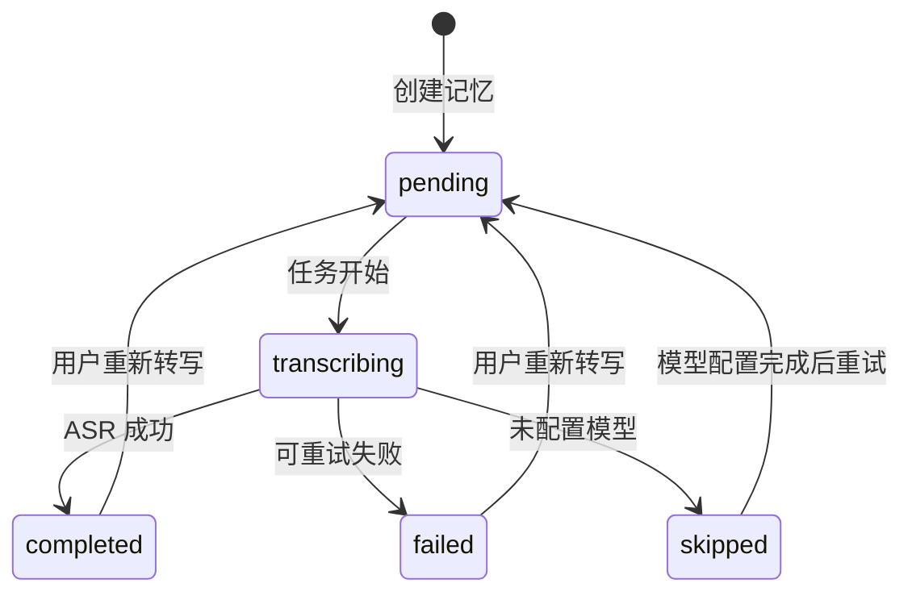
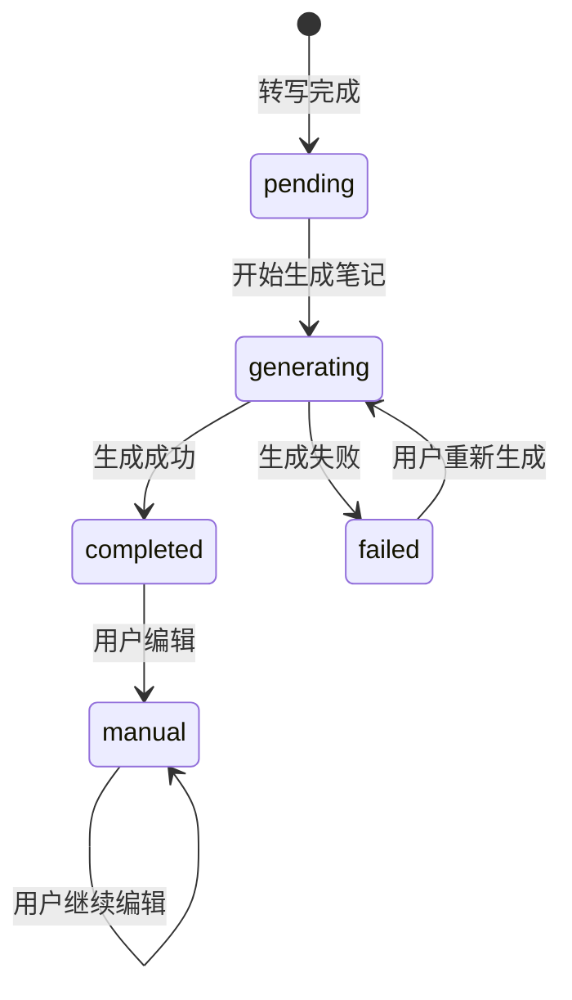

<!--cover
badge: 产 品 需 求 文 档
title: 记忆卡片转写优化 PRD|音频记忆内容处理
subtitle: 让录音记忆从“等待转写”变成可查看、可修订、可复用的统一内容。
meta: 项目=睿乐大脑 · 整理模块|版本=v1.0（待评审）|日期=2026-10-04|范围=音频记忆与记忆卡片转写|整理模块=只消费转写结果，不负责解析
kpi: 5=核心转写状态|2=内容层级（原始转写 / 格式化笔记）|0=本期新增视频解析
-->

# 记忆卡片转写优化 PRD

> 版本：v1.0（待评审）  
> 日期：2026-10-04  
> 产品范围：整理模块中的音频记忆、录音记忆、记忆卡片  
> 一句话描述：让录音记忆从“等待转写”变成可查看、格式化、可修订、可重试、可被整理复用的统一内容。

## 阅读导航

| 章节 | 回答的问题 | 读者 |
| --- | --- | --- |
| 1. 执行摘要 | 这次要解决什么问题 | 全员 |
| 2. 背景与现状 | 当前实现有什么问题 | 产品 / 研发 |
| 3. 目标与边界 | 做什么、不做什么 | 全员 |
| 4. 核心概念 | 原始转写、用户笔记、整理输入如何区分 | 产品 / 研发 |
| 5. 用户流程 | 用户从上传到整理如何操作 | 产品 / 设计 |
| 6. 功能需求 | 每个状态和动作如何工作 | 产品 / 测试 |
| 7. 页面与交互 | 记忆卡片和详情页如何展示 | 设计 / 前端 |
| 8. 数据与接口 | 后端和前端如何协作 | 研发 |
| 9. 任务管线 | 转写与笔记生成如何异步执行 | 后端 |
| 10. 兼容与迁移 | 老数据和现有整理功能如何兼容 | 研发 |
| 11. 验收标准 | 什么状态算完成 | 产品 / 测试 |
| 12. 分期实施 | 先做哪些能力 | 全员 |
| 13. 风险与待决策 | 还有哪些约束需要确认 | 全员 |
| 17.3 研发任务清单 | 研发具体做什么、如何验收 | 研发 / 测试 |

## 1. 执行摘要

### 1.1 产品定义

记忆卡片负责把音频资料转换为可阅读、可编辑的记忆内容：

```text
音频文件
  ↓
异步 ASR 转写
  ↓
原始转写文本
  ↓
可选的 AI 笔记生成
  ↓
用户查看、编辑、复用
```

整理模块只消费已经准备好的记忆内容：

```text
记忆卡片转写 / 笔记
  ↓
选择整理方案
  ↓
创建整理任务
```

本期不在整理模块中增加音频解析逻辑，也不让整理任务直接读取原始音频文件。

### 1.2 当前实现事实

当前代码已经具备以下基础能力：

- 上传音频后创建 `OrganizeMemory`。
- 使用 `organize_memory:transcribe` 异步任务执行 ASR。
- 使用 `transcription_status` 保存转写状态。
- 将原始文本保存到 `metadata.transcript`。
- 使用模型生成标题、摘要、标签和可读笔记。
- 在记忆详情页播放音频并编辑内容。
- 记忆可以继续发起整理任务。
- 文件导入路径已经注入 `DocumentReader`，可以调用知识库使用的统一读取接口。
- 知识库解析链路已经具备 `ReadRequest`、`ReadResult`、解析引擎配置和 ASR 模型抽象。

主要实现位置：

- `internal/application/service/organize_memory_audio.go`
- `internal/types/organize.go`
- `internal/types/task.go`
- `frontend/src/views/organize/OrganizeWorkspace.vue`
- `frontend/src/views/organize/OrganizeDocumentEditor.vue`
- `frontend/src/api/organize/index.ts`

### 1.3 本期核心改动

| 当前 | 目标 |
| --- | --- |
| 转写状态主要隐藏在 `metadata` 中 | 卡片和详情页明确展示状态 |
| 原始转写和 AI 笔记容易混淆 | 明确区分“转写原文”和“笔记内容” |
| AI 笔记可能退化为连续长段文本 | 输出有标题、摘要、要点和行动项等清晰层次 |
| 记忆转写与知识库解析链路存在重复能力 | 复用知识库解析引擎、配置和 ASR 能力 |
| ASR 与 AI 笔记生成在同一个任务中执行 | 两个阶段独立记录状态 |
| 失败后缺少用户可见的重试入口 | 支持卡片和详情页重新转写 |
| 重新转写可能覆盖用户编辑内容 | 手动笔记默认受到保护 |
| 整理可以拿到占位内容 | 仅允许消费已准备好的内容 |

## 2. 背景与现状诊断

### 2.1 当前流程

```text
上传音频
  ↓
创建记忆，transcription_status = pending
  ↓
异步读取音频并调用 ASR
  ↓
写入 metadata.transcript
  ↓
调用聊天模型生成标题、摘要、标签和 Markdown 笔记
  ↓
将笔记写入 OrganizeMemory.Content
  ↓
页面展示音频和笔记
```

### 2.2 当前问题

#### 问题一：状态对用户不透明

记忆卡片可以看到录音，但不能快速知道：

- 是否已经完成转写；
- 当前是否正在处理；
- 失败原因是什么；
- 是否可以重新转写；
- 是否已经可以发起整理。

#### 问题二：内容层级不清晰

当前同时存在：

- `metadata.transcript`：ASR 返回的原始文本；
- `OrganizeMemory.Content`：AI 生成或用户编辑的可读笔记；
- `metadata.summary`：摘要；
- `metadata.tags`：标签。

页面读取时会在多个字段之间兜底，用户无法明确知道自己看到的是原始转写还是加工后的笔记。

#### 问题三：转写和笔记生成耦合

ASR 成功但笔记生成失败时，两个结果没有形成清晰的独立状态。转写本身应该先完成，笔记生成应该作为可选后处理。

#### 问题四：重新转写存在数据覆盖风险

如果用户已经编辑过笔记，重新转写不应直接覆盖用户内容。

#### 问题五：整理输入不稳定

整理模块如果直接拿到“录音已保存，等待转写”的占位内容，会生成低质量整理结果。

## 3. 目标与边界

### 3.1 产品目标

1. 用户可以在记忆卡片上看到准确、明确的转写状态。
2. 用户可以查看原始转写文本。
3. 用户可以编辑可读笔记，且不破坏原始转写。
4. 转写失败可以手动重试。
5. 重新转写不会无提示覆盖用户编辑内容。
6. 整理任务只消费已经完成或明确可用的记忆内容。
7. 老数据、老接口和现有音频播放能力继续可用。

### 3.2 非目标

本期不包含：

- 视频关键帧、画面理解或视频 OCR；
- 新建一套独立的文档、图片或音视频解析器；
- 说话人识别和角色标注；
- 逐句时间戳跳转；
- 字级或句级播放高亮；
- 转写历史版本管理页面；
- 独立的转写记录表；
- 整理模板管理后台；
- 报告、脑图、时间轴、清单渲染器；
- 将整理任务改造成新的解析任务。

### 3.3 版本边界

V1 优先复用现有 `OrganizeMemory.metadata` JSONB 保存转写状态和文本，不立即新增独立转写表。

当后续需要以下能力时，再评估独立表：

- 多版本转写；
- 音频片段和时间戳；
- 说话人分段；
- 多种转写结果并存；
- 转写结果被多个业务对象引用。

## 4. 核心概念与内容分层

### 4.1 内容分层

```text
原始音频
  ↓ ASR
原始转写 transcript
  ↓ 可选 AI 加工
可读笔记 content
  ↓ 用户选择整理
整理产物 output
```

| 内容 | 产生方式 | 是否可编辑 | 是否作为整理输入 |
| --- | --- | --- | --- |
| 原始音频 | 用户上传或设备同步 | 否 | 否 |
| 原始转写 | ASR 模型生成 | V1 默认只读 | 可作为兜底输入 |
| 格式化笔记 | AI 生成或用户编辑 | 是 | 是，优先使用 |
| 整理产物 | 整理模型生成 | 按现有规则 | 作为结果复用 |

### 4.2 整理输入优先级

```text
用户笔记 content
  ↓ content 为空时
原始转写 transcript
  ↓ 两者都为空时
拒绝创建整理任务
```

如果用户已经编辑过笔记，整理任务优先使用用户笔记，同时保留原始转写的引用关系。

### 4.3 解析引擎复用原则

记忆卡片不新建一套与知识库平行的解析能力，而是复用知识库现有的解析抽象：

```text
记忆文件
  ↓
共享 DocumentReader
  ↓
ReadResult
  ├── MarkdownContent：文档或普通文本内容
  └── IsAudio + AudioData：音频或视频中的音频内容
        ↓
      共享 ASR 模型能力
        ↓
      transcript
```

复用范围：

- `interfaces.DocumentReader` / `DocReader`；
- `types.ReadRequest` 和 `types.ReadResult`；
- 知识库已有的解析引擎选择规则；
- 租户级 `ParserEngineConfig` 和脱敏后的 overrides；
- 知识库已有的 ASR 模型服务和音频格式归一化能力；
- 解析引擎可用性检查和错误分类。

不直接复用的部分：

- 知识库的 `ProcessDocument` 任务；
- 知识库切片、向量化、索引和 `Knowledge` 数据落库；
- 知识库专属的进度和状态表。

原因是记忆卡片的产物是 `OrganizeMemory`。不能因为复用解析引擎，就把音频记忆写入知识库。正确做法是共享内容读取和音频转写能力，由知识库和记忆模块分别保存各自的业务结果。

### 4.4 本次是否重构转写引擎

本次不重构底层 ASR 引擎，不更换 ASR 供应商，也不重新实现音频识别算法。

本次重构的是记忆模块的“内容处理入口”和文件格式路由：

```text
记忆附件
  ↓
按文件格式选择处理路径
  ├── 文本 / Markdown / CSV / JSON
  │     └── 直接读取或走知识库统一读取接口
  ├── PDF / Word / PPT / Excel / 图片
  │     └── 复用知识库 DocumentReader，得到 MarkdownContent
  └── 音频 / 视频
        └── 复用知识库 DocumentReader 获取 AudioData
              ↓
            复用现有 ASR 模型服务
              ↓
            transcript
```

结论：

| 能力 | 本次处理方式 |
| --- | --- |
| ASR 模型和供应商 | **保留现有实现** |
| 音频格式归一化 | **复用现有能力** |
| 文档解析器 | **复用知识库 `DocumentReader`** |
| 文件格式路由 | **新增统一路由 / 适配层** |
| 记忆任务 | **优化现有 `OrganizeMemoryTranscribeTask`** |
| 知识库切片、向量化、入库 | **不复用，不进入记忆流程** |
| 记忆结果保存 | **继续保存到 `OrganizeMemory`** |

因此，准确的工程描述是：

> **不重做转写引擎，重构记忆模块的内容解析编排层；根据文件格式复用知识库文档解析，再按需调用现有 ASR。**

### 4.5 文件格式处理矩阵

| 文件类型 | 首选处理器 | 是否调用 ASR | 记忆结果 |
| --- | --- | ---: | --- |
| `txt / md / csv / json` | 简单文本读取或 `DocumentReader` | 否 | `content` |
| `pdf / doc / docx / ppt / pptx / xls / xlsx` | 知识库 `DocumentReader` | 否 | `content` |
| `png / jpg / jpeg` | 知识库 `DocumentReader` | 否，除非返回音频内容 | `content` / Markdown |
| `mp3 / wav / m4a / flac / ogg` | 知识库 `DocumentReader` 获取音频数据 | 是 | `transcript` |
| `mp4 / mov / avi / mkv / webm` | 知识库 `DocumentReader` 获取音频数据 | 是 | `transcript` |

V1 只要求音频记忆和视频音轨能够走统一路由。视频画面理解不在本次范围内。

### 4.6 多文件记忆处理原则

一个记忆可以包含多个附件，但不能把多个文件的路径、状态和文本简单堆进 `OrganizeMemory.metadata`。推荐的数据关系是：

```text
OrganizeMemory（记忆容器）
  ├── MemoryAttachment 01（音频）
  ├── MemoryAttachment 02（PDF）
  └── MemoryAttachment 03（录音）
```

每个附件独立完成：

```text
上传
  ↓
保存附件
  ↓
按文件格式调用知识库解析引擎
  ↓
音频附件调用 ASR
  ↓
保存附件级解析结果
  ↓
汇总记忆级状态和内容
```

#### 附件级状态

每个附件都需要独立记录：

```text
pending
processing
completed
failed
skipped
```

附件失败时只重试当前附件，不重新处理同一记忆中的其他已完成附件。

#### 记忆级聚合状态

记忆卡片展示的是附件状态的聚合结果：

| 条件 | 记忆状态 | 用户操作 |
| --- | --- | --- |
| 所有附件未开始 | `pending` | 等待处理 |
| 任一附件处理中 | `processing` | 查看进度 |
| 所有必需附件成功 | `completed` | 查看、生成笔记、整理 |
| 至少一个成功，至少一个失败或跳过 | `partial` | 重试失败附件或基于已完成附件继续 |
| 所有必需附件失败 | `failed` | 重试附件 |

#### 内容汇总规则

- 按附件 `sort_order` 形成稳定顺序；
- 原始转写按文件分组保存，不直接拼成无法追溯的长文本；
- 格式化笔记可以跨文件综合，但必须保留 `attachment_id` 和文件名引用；
- 某个附件失败时，成功附件仍然可查看；
- 默认只有全部必需附件完成后才自动生成整份笔记；
- `partial` 状态下，用户必须明确确认“基于已完成附件生成”；
- 全部附件失败时禁止生成笔记和发起整理。

#### 向后兼容

现有 `/memories/upload` 单文件接口继续保留，行为调整为：

```text
创建一个 OrganizeMemory
  ↓
创建一个 MemoryAttachment
  ↓
进入统一附件处理流程
```

因此，单文件记忆不需要走另一套逻辑，多文件只是同一模型下的多个附件。

## 5. 用户流程

### 5.1 上传并自动转写

1. 用户上传音频或同步一张记忆卡片。
2. 系统创建记忆卡片。
3. 卡片立即显示“等待转写”。
4. 后台通过知识库共享的解析引擎读取音频内容。
5. 解析引擎返回音频数据后，调用共享 ASR 能力。
6. 卡片状态更新为“转写中”。
7. ASR 完成后显示“已转写”。
8. 系统可以继续生成可读笔记。
9. 用户可以查看、编辑或发起整理。

### 5.2 转写失败

1. 卡片显示“转写失败”。
2. 卡片展示简短失败原因。
3. 用户点击“重新转写”。
4. 系统重新入队。
5. 原失败信息保留到日志或任务记录中，当前卡片状态恢复为“等待转写”。

### 5.3 重新转写

如果笔记没有被用户修改：

```text
重新转写
  ↓
更新原始转写
  ↓
自动生成新笔记
```

如果笔记已经被用户修改：

```text
重新转写
  ↓
更新原始转写
  ↓
保留当前笔记
  ↓
提示用户是否生成新笔记
```

确认文案：

> 转写已更新。当前笔记包含手动修改内容，重新生成笔记会覆盖现有笔记内容。

按钮：

- 保留当前笔记
- 重新生成笔记

## 6. 功能需求

### FR-01 上传后创建记忆

系统应在音频文件保存成功后创建 `OrganizeMemory`，并将转写状态设置为 `pending`。

要求：

- 音频文件保存失败时不得创建可见的半成品记忆；
- 音频文件为空时拒绝上传；
- 保留原始音频文件引用；
- 上传接口不等待 ASR 完成；
- 记录任务入队失败原因。

### FR-02 自动发起转写

系统应在记忆创建成功后自动发起异步转写任务。

任务至少包含：

```json
{
  "tenant_id": 9,
  "memory_id": "memory-id"
}
```

任务必须支持：

- 最大重试次数；
- 超时控制；
- 幂等执行；
- 任务失败后更新记忆状态；
- 任务日志可定位。

### FR-03 展示转写状态

记忆卡片和记忆详情页必须展示以下状态：

| 状态 | 中文展示 | 用户动作 |
| --- | --- | --- |
| `pending` | 等待转写 | 查看、删除 |
| `transcribing` | 转写中 | 查看、删除 |
| `completed` | 已转写 | 查看、重新转写、整理 |
| `failed` | 转写失败 | 查看、重新转写、删除 |
| `skipped` | 未配置转写模型 | 查看、提示配置 |

### FR-04 查看原始转写

音频记忆详情页应提供“转写原文”页签。

页面显示：

- 原始转写文本；
- 转写状态；
- 转写完成时间；
- ASR 模型标识；
- 失败原因；
- 重新转写按钮。

V1 原始转写默认只读。

### FR-05 查看和编辑笔记

音频记忆详情页应提供“笔记内容”页签。

要求：

- 继续复用当前编辑器；
- 生成结果必须以格式化富文本展示，不得只展示连续纯文本；
- 笔记正文至少支持标题、段落、无序列表、有序列表和行动项；
- 摘要、关键要点和行动项应有明显层级；
- 内容较短时可以只生成“记录内容”，不得为了格式强行制造空章节；
- 用户编辑只修改 `OrganizeMemory.Content`；
- 不覆盖 `metadata.transcript`；
- 保存后将 `note_source` 记录为 `user`；
- 用户编辑后，重新转写不得直接覆盖笔记。

### FR-06 格式化生成笔记

转写完成后，系统可以根据原始转写生成一份适合阅读的笔记，而不是把 ASR 文本原样展示。

#### 默认内容结构

模型应根据内容完整程度选择结构，默认优先使用以下顺序：

```text
标题
摘要
关键要点
行动项
补充记录
```

不是所有录音都必须包含所有章节：

- 没有明确行动项时，不输出空的“行动项”章节；
- 没有可靠摘要时，不编造摘要；
- 内容很短时，使用“记录内容”承载原文；
- 不得添加转写中不存在的事实、人物、时间或结论。

#### 模型输出格式

模型只允许输出以下 JSON：

```json
{
  "title": "试听沟通复盘",
  "summary": "家长重点关注体验课节奏和报名政策。",
  "key_points": [
    "家长关注体验课节奏。",
    "家长询问报名政策。"
  ],
  "action_items": [
    "发送课程安排。",
    "跟进报名问题。"
  ],
  "note_markdown": "## 关键要点\n\n- 家长关注体验课节奏。\n- 家长询问报名政策。"
}
```

字段规则：

| 字段 | 必填 | 规则 |
| --- | --- | --- |
| `title` | 是 | 简短、准确，不使用“录音记忆”“未命名”等泛化标题 |
| `summary` | 否 | 1-2 句话，只能来自转写内容 |
| `key_points` | 否 | 3-7 条优先，内容不足时可以少于 3 条 |
| `action_items` | 否 | 只记录转写中明确表达的动作，不得推测 |
| `note_markdown` | 是 | 用于展示的 Markdown，不得包含 HTML、代码块或 JSON |

#### 格式化规则

- 使用二级标题区分内容区域；
- 使用项目列表表达多个要点；
- 使用有序列表表达步骤或行动顺序；
- 单个行动项使用动词开头；
- 长段落拆成不超过 3-4 行的短段落；
- 重点词可以适度加粗，但不得整段加粗；
- 不默认使用表格，除非内容确实存在多列对比关系；
- 不使用装饰性 Emoji 作为章节标题；
- 不输出 Markdown 代码块；
- 不输出原始 HTML；
- 不重复粘贴整段原始转写。

#### 渲染规则

后端负责对模型返回的 `note_markdown` 做以下处理：

1. 校验 JSON 是否完整；
2. 清理 Markdown 中的 HTML 和危险链接；
3. 将 Markdown 转换为编辑器可接受的 HTML；
4. 对标题、列表、段落和换行进行规范化；
5. 保存到 `OrganizeMemory.Content`；
6. 原始 Markdown 可以暂存在 metadata 中，用于失败排查，不作为前端直接展示内容。

前端只展示经过清洗的富文本，不直接执行模型返回的 HTML。

### FR-07 生成笔记

转写完成后可以生成可读笔记。

笔记生成结果包括：

- 标题；
- 摘要；
- 标签；
- 格式化笔记正文；
- 生成状态；
- 使用的模型标识。

笔记生成失败时：

- 不改变 `transcription_status = completed`；
- 设置 `note_generation_status = failed`；
- 允许用户再次点击“生成笔记”；
- 原始转写仍然可以查看和用于整理。

### FR-08 重新转写

系统应提供手动重新转写能力。

入口：

- 记忆卡片更多菜单；
- 记忆详情页顶部操作区；
- 转写失败状态卡片。

重新转写时：

- 当前任务为 `pending`、`transcribing` 时不可重复提交；
- 用户笔记为手动编辑时，必须弹出保护提示；
- ASR 成功后更新 `transcript_revision`；
- 不删除原始音频；
- 不改变记忆 ID。

### FR-09 整理入口控制

只有满足以下条件时，记忆卡片才能发起整理：

```text
transcription_status = completed
且 content 非空
```

如果 `content` 为空但 `transcript` 不为空，可以使用原始转写作为兜底输入。

以下状态下整理按钮禁用：

- `pending`
- `transcribing`
- `failed`
- `skipped`
- 记忆已存在 `queued`、`running` 或 `repairing` 的整理任务；
- 当前整理任务正在创建，尚未完成接口返回。

提示文案：

> 请先完成转写，再发起整理。

当记忆已经处于整理中时，按钮文案显示为“整理中...”，但按钮必须不可点击，不得再次调用创建整理任务接口。

整理任务完成后：

- `completed` 或 `fallback`：按钮可点击，文案显示“查看整理结果”；
- `failed` 或 `canceled`：按钮可点击，文案恢复为“整理”；
- 任务状态以服务端最新状态为准，不能只依赖前端本地创建状态。

### FR-10 轮询刷新

在记忆详情页打开期间，前端应在以下状态下轮询记忆详情：

- `pending`
- `transcribing`

建议轮询间隔：3 秒。  
转写完成、失败或页面离开后停止轮询。

## 7. 页面与交互设计

### 7.1 记忆卡片

```text
┌─────────────────────────────────┐
│ 🎙 试听沟通录音             ⋯   │
│                                 │
│ 家长重点关注体验课节奏和报名政策 │
│                                 │
│ 已转写 · 12分36秒 · 记忆卡       │
│                         整理     │
└─────────────────────────────────┘
```

卡片信息：

- 类型图标；
- 记忆标题；
- 笔记摘要或转写摘要；
- 转写状态；
- 音频时长；
- 来源；
- 更多操作。

更多操作：

- 查看记忆；
- 查看转写；
- 重新转写；
- 整理；
- 删除。

### 7.2 记忆详情页

```text
[返回] 试听沟通录音              [已转写]
来源：记忆卡 · 时长：12分36秒

[音频播放器]

[重新转写] [生成笔记] [整理]

[转写原文] [笔记内容] [整理结果]
```

默认页签：

- 音频记忆：默认打开“转写原文”；
- 已经有用户编辑笔记且再次进入：保留上次打开的页签；
- 整理结果存在时：显示“整理结果”页签。

“笔记内容”页签的默认展示结构：

```text
试听沟通复盘

摘要
家长重点关注体验课节奏和报名政策。

关键要点
• 家长关注体验课节奏
• 家长询问报名政策

行动项
1. 发送课程安排
2. 跟进报名问题
```

页面需要让用户一眼区分：

- “转写原文”：尽量保留原始表达，用于核对；
- “笔记内容”：经过整理和排版，用于阅读和后续编辑；
- “整理结果”：基于记忆内容生成的结构化产物。

### 7.3 多附件详情页

当一个记忆包含多个文件时，详情页增加“附件”区域：

```text
附件（3）

┌────────────────────────────────────┐
│ ✓ 访谈录音.mp3       已转写  12:36 │
│   查看转写                    ⋯    │
├────────────────────────────────────┤
│ ◷ 会议纪要.pdf        解析中       │
│   预计完成后自动更新                │
├────────────────────────────────────┤
│ ! 补充录音.m4a        转写失败      │
│   音频处理失败       [重新转写]     │
└────────────────────────────────────┘

[添加附件] [全部重试] [生成笔记]
```

交互规则：

- 附件按 `sort_order` 展示；
- 每个附件独立显示文件名、类型、状态和错误信息；
- 失败附件可以单独重试；
- 已完成附件可以查看原始内容或播放音频；
- “全部重试”只重试失败和跳过的附件；
- `partial` 状态下“生成笔记”必须显示使用范围；
- 用户可以选择“仅使用已完成附件”，也可以先重试失败附件；
- 删除附件需要二次确认，并重新计算记忆级状态。

记忆卡片摘要显示聚合信息：

```text
3 个附件 · 1 个已完成 · 1 个处理中 · 1 个失败
```

### 7.4 失败状态

```text
转写失败
音频处理失败，请稍后重试

[查看音频] [重新转写]
```

错误信息分级：

- 用户可理解的短文案展示在页面；
- 原始错误写入服务日志；
- 不向用户暴露模型密钥、存储路径或内部堆栈。

### 7.4 未配置模型

如果没有可用 ASR 模型：

```text
暂未配置转写模型
当前录音已保存，但无法生成转写内容。
```

此状态不应显示为普通“转写失败”，避免用户重复点击无效重试。

## 8. 状态机设计

### 8.1 转写状态



### 8.2 笔记状态



### 8.3 状态组合规则

| 转写状态 | 笔记状态 | 页面结论 |
| --- | --- | --- |
| `completed` | `completed` | 可查看、编辑、整理 |
| `completed` | `failed` | 可查看、重新生成笔记、整理 |
| `completed` | `manual` | 可查看、编辑、整理 |
| `transcribing` | 任意 | 等待转写，不允许整理 |
| `failed` | 任意 | 可重试，不允许整理 |
| `skipped` | 任意 | 提示配置，不允许整理 |

## 9. 数据设计

### 9.1 现有模型

继续使用 `OrganizeMemory`：

```text
id
kind
title
content
source
occurred_at
duration_seconds
metadata
```

V1 不增加数据库列，统一规范 `metadata` 中的字段。

多文件场景下，V1 需要新增附件实体，不能继续只依赖 `OrganizeMemory.metadata.file_path`：

```text
organize_memories
  1 ─── N organize_memory_attachments
```

建议字段：

| 字段 | 说明 |
| --- | --- |
| `id` | 附件 ID |
| `memory_id` | 所属记忆 ID |
| `sort_order` | 在记忆中的展示和汇总顺序 |
| `file_name` | 原始文件名 |
| `mime_type` | MIME 类型 |
| `file_type` | 扩展名或标准文件类型 |
| `file_path` | 存储路径 |
| `file_size_bytes` | 文件大小 |
| `duration_seconds` | 音频或视频时长 |
| `parser_engine` | 实际使用的知识库解析引擎 |
| `parser_status` | 附件解析状态 |
| `transcription_status` | 音频转写状态 |
| `normalized_content` | 文档解析后的统一文本 |
| `transcript` | 音频或视频的原始转写 |
| `error_stage` | 失败阶段 |
| `error_message` | 失败原因 |
| `revision` | 附件内容处理版本 |
| `metadata` | 扩展信息 |

`OrganizeMemory.Content` 仍然保存记忆级可编辑笔记；附件级原始内容和转写结果保存到附件实体，避免多个文件之间互相覆盖。

### 9.2 metadata 字段

```json
{
  "transcription_status": "completed",
  "transcription_error": "",
  "transcript": "家长很关心体验课节奏和报名政策。",
  "transcribed_at": "2026-10-04T10:42:00Z",
  "transcript_revision": 1,
  "transcript_source": "asr",
  "asr_model_id": "asr-1",
  "parser_engine": "auto",
  "parser_source": "knowledge_parser",
  "parser_version": "current",

  "note_generation_status": "completed",
  "note_source": "ai",
  "note_generated_at": "2026-10-04T10:43:00Z",
  "ai_model_id": "chat-1",

  "summary": "家长重点关注体验课节奏和报名政策。",
  "tags": ["试听课", "家长沟通"]
}
```

### 9.3 字段约束

| 字段 | 类型 | 说明 |
| --- | --- | --- |
| `transcription_status` | string | `pending / transcribing / completed / failed / skipped` |
| `transcription_error` | string | 用户可理解的失败摘要 |
| `transcript` | string | 原始 ASR 文本 |
| `transcribed_at` | RFC3339 | 最近一次成功转写时间 |
| `transcript_revision` | integer | 转写成功次数或版本号 |
| `transcript_source` | string | 当前固定为 `asr`，预留 `manual` |
| `asr_model_id` | string | ASR 模型 ID |
| `parser_engine` | string | 实际使用的解析引擎；`auto` 表示由知识库规则选择 |
| `parser_source` | string | 固定标识为 `knowledge_parser` |
| `parser_version` | string | 解析器版本或服务版本，便于问题追踪 |
| `note_generation_status` | string | 笔记生成状态 |
| `note_source` | string | `ai / user / fallback` |
| `note_generated_at` | RFC3339 | 最近生成时间 |
| `ai_model_id` | string | 笔记生成模型 ID |

### 9.4 内容写入规则

```text
metadata.transcript = 原始转写
OrganizeMemory.Content = 可读笔记
```

当没有 AI 笔记生成模型时：

- `transcription_status = completed`
- `note_generation_status = skipped`
- `Content` 可以暂时使用转写文本的 HTML 包装
- `note_source = fallback`

## 10. 接口设计

### 10.1 继续保留的接口

```http
POST /api/v1/organize/memories/upload
GET  /api/v1/organize/memories
GET  /api/v1/organize/memories/:id
PUT  /api/v1/organize/memories/:id
DELETE /api/v1/organize/memories/:id
```

### 10.2 新增重新转写接口

```http
POST /api/v1/organize/memories/:id/transcription
```

请求：

```json
{
  "force": true
}
```

响应：

```json
{
  "success": true,
  "data": {
    "memory_id": "memory-id",
    "transcription_status": "pending",
    "transcript_revision": 2
  }
}
```

规则：

- 已经处于 `pending` 或 `transcribing` 时返回幂等结果；
- `force = true` 只表示允许重新入队，不表示覆盖用户笔记；
- 不重新上传音频；
- 不改变记忆 ID。

### 10.3 新增重新生成笔记接口

```http
POST /api/v1/organize/memories/:id/note/regenerate
```

用途：

- 使用当前 `metadata.transcript` 重新生成笔记；
- 不重新调用 ASR；
- 如果笔记是用户手动编辑，接口需要返回确认要求或由前端先确认。

### 10.4 可选的原始转写编辑接口

V1 默认不开放。如果后续确认需要人工修订原始转写，再增加：

```http
PUT /api/v1/organize/memories/:id/transcription
```

该接口必须增加：

- revision 校验；
- 修改人；
- 修改时间；
- 修改原因；
- 与原始 ASR 结果的区分。

### 10.5 解析引擎配置

V1 不新增记忆专属的解析引擎配置接口。记忆解析沿用知识库现有的租户级配置和解析引擎选择规则：

- 文件类型对应的 parser engine 由知识库配置决定；
- 租户级 parser overrides 继续从当前租户上下文读取；
- 记忆上传请求不允许前端直接传入任意 parser endpoint 或密钥；
- 解析引擎不可用时，记忆进入可重试的失败状态，并记录具体阶段；
- 后台可通过现有 `/api/v1/system/parser-engines` 查看引擎可用性。

### 10.6 多附件接口

现有单文件上传接口继续保留，新接口用于给同一个记忆追加多个附件：

```http
POST /api/v1/organize/memories/:id/attachments
GET  /api/v1/organize/memories/:id/attachments
GET  /api/v1/organize/memories/:id/attachments/:attachment_id
POST /api/v1/organize/memories/:id/attachments/:attachment_id/retry
DELETE /api/v1/organize/memories/:id/attachments/:attachment_id
```

上传接口支持一次提交多个文件，也支持分批追加。每次上传返回附件 ID、排序号和当前处理状态。

记忆详情接口建议增加：

```json
{
  "id": "memory-id",
  "content": "<p>格式化笔记</p>",
  "attachment_summary": {
    "total": 3,
    "pending": 0,
    "processing": 1,
    "completed": 1,
    "failed": 1,
    "skipped": 0
  },
  "attachments": [
    {
      "id": "attachment-1",
      "file_name": "访谈录音.mp3",
      "sort_order": 1,
      "status": "completed",
      "transcript": "原始转写内容"
    }
  ]
}
```

附件重试只接受附件 ID，不接受客户端提交的存储路径。服务端根据当前租户和用户权限重新解析原始附件。

## 11. 后端任务管线

### 11.1 推荐拆分

```text
OrganizeMemoryTranscribeTask
  ↓
构造知识库统一 ReadRequest
  ↓
调用共享 DocumentReader
  ↓
获取 ReadResult
  ↓
提取 AudioData 并调用共享 ASR
  ↓
保存 transcript 与解析元数据
  ↓
transcription_status = completed
  ↓
可选入队 NoteGenerationTask
  ↓
更新 Content、summary、tags
```

### 11.2 ASR 任务要求

- 解析引擎选择必须复用知识库的租户配置和文件类型规则；
- 记忆模块不得复制一份 MinerU、MarkItDown 或其他解析器的选择逻辑；
- `DocumentReader` 失败与 ASR 失败要分别记录，不能统一成模糊的“转写失败”；
- 任务开始前设置 `transcribing`；
- 共享解析完成后再进入 ASR；
- ASR 成功后先持久化原始转写和 parser 元数据；
- ASR 失败时设置 `failed`；
- 模型未配置时设置 `skipped`；
- 任务重复执行不得生成重复记忆；
- 重新转写不得删除原始音频；
- 任务超时和重试次数继续复用现有队列配置。

### 11.3 笔记生成任务要求

- 独立读取 `metadata.transcript`；
- 成功后写入 `Content`、标题、摘要、标签；
- 失败不回滚已经成功的转写；
- `note_source = user` 时默认不覆盖；
- 可以单独重试。

### 11.4 幂等规则

以 `memory_id + transcript_revision` 作为业务幂等依据：

- 同一版本的转写任务重复消费，只保留一个成功结果；
- 新的重新转写成功后，revision 加一；
- 旧任务晚到时不得覆盖新 revision。

## 12. 前端需求

### 12.1 API 类型

`OrganizeMemory` 需要增加前端辅助类型，避免页面到处读取任意 metadata：

```ts
interface OrganizeTranscriptionState {
  status: 'pending' | 'transcribing' | 'completed' | 'failed' | 'skipped'
  error?: string
  transcript?: string
  transcribedAt?: string
  revision?: number
  asrModelId?: string
}

interface OrganizeNoteState {
  status: 'pending' | 'generating' | 'completed' | 'failed' | 'manual' | 'skipped'
  source?: 'ai' | 'user' | 'fallback'
  generatedAt?: string
  modelId?: string
}
```

后端仍可以返回 `metadata`，前端统一通过映射函数读取。

### 12.2 卡片刷新

- 列表首次加载时读取状态；
- 卡片所在列表处于活动状态时，可以定时刷新；
- 详情页在 `pending / transcribing` 时每 3 秒刷新；
- 完成或失败后停止轮询；
- 轮询失败不清空当前已展示内容。

### 12.3 整理入口

前端在调用 `createOrganizeJob` 前再次获取或校验记忆状态，不能只依赖卡片首次加载的数据。

整理按钮的禁用条件：

```text
正在创建整理任务
或存在 queued / running / repairing 整理任务
或转写尚未准备完成
→ disabled = true
```

即使用户通过快速连续点击、浏览器回退或多个页面同时操作，前端也不得重复提交；后端创建任务接口仍需要保留幂等或进行中的任务校验。

## 13. 权限与安全

- 用户只能查看自己有权限访问的记忆；
- 音频播放地址继续使用现有文件访问鉴权；
- 重新转写必须校验记忆所属租户和用户权限；
- 不在前端展示存储路径、内部异常堆栈或模型凭证；
- 整理任务只允许引用当前用户可访问的记忆；
- 删除记忆时同步清理音频文件和相关资源绑定；
- 转写日志不得记录完整音频内容或完整敏感转写文本。

## 14. 兼容与迁移

### 14.1 老数据兼容

兼容以下已有字段：

```text
metadata.transcript
metadata.transcription
metadata.asr_text
metadata.transcription_status
metadata.summary
metadata.tags
```

读取顺序：

```text
transcript
  ↓
transcription
  ↓
asr_text
```

新写入统一使用 `transcript`。

### 14.2 老状态兼容

历史数据可能没有 `transcription_status`：

- 有 `metadata.transcript` 且内容非空：映射为 `completed`；
- `kind` 为音频但只有占位内容：映射为 `pending`；
- 非音频记忆：不显示转写状态。

### 14.3 整理兼容

现有整理任务继续使用 `memory_ids`，不改变任务创建接口。

整理服务只需要增加输入选择逻辑：

```text
content 非空 → 使用 content
content 为空且 transcript 非空 → 使用 transcript
都为空 → 返回输入不可用
```

### 14.4 单文件到多附件迁移

迁移采用兼容式方式，不删除现有 `OrganizeMemory.metadata` 中的文件字段：

1. 新增 `organize_memory_attachments` 表；
2. 对已有记忆执行惰性迁移或后台补偿迁移；
3. 从 `metadata.file_path`、`audio_file_path`、`file_name` 等字段创建一个附件记录；
4. 将已有 `metadata.transcript`、`transcription_status` 映射到附件级字段；
5. `OrganizeMemory.Content`、标题、摘要和标签保持不变；
6. 新代码优先读取附件表，读取不到时回退旧 metadata；
7. 老的单文件删除逻辑在确认附件迁移完成后再下线。

迁移期间允许出现：

```text
记忆容器
  ├── 新附件表记录
  └── 旧 metadata 文件字段（兼容保留）
```

两者必须指向同一份存储资源，避免迁移造成重复占用或误删文件。

## 15. 埋点与指标

建议记录以下指标：

| 指标 | 说明 |
| --- | --- |
| `memory_transcription_started` | 开始转写次数 |
| `memory_transcription_completed` | 成功次数 |
| `memory_transcription_failed` | 失败次数 |
| `memory_transcription_retried` | 重试次数 |
| `memory_note_generated` | 笔记生成次数 |
| `memory_note_regenerated` | 用户主动重新生成次数 |
| `memory_note_edited` | 用户编辑笔记次数 |
| `memory_organize_blocked_not_ready` | 因内容未准备好而阻止整理的次数 |

核心指标：

1. 转写成功率；
2. 平均转写耗时；
3. 重试率；
4. 转写完成后的整理发起率；
5. AI 笔记被用户编辑的比例；
6. 用户手动编辑笔记后被重新转写覆盖的次数，目标为 0。

## 16. 验收标准

### AC-01 上传

上传有效音频后，系统在 5 秒内创建记忆卡片并展示“等待转写”，不要求上传请求等待 ASR 完成。

### AC-02 状态

转写过程中，卡片和详情页均显示“转写中”；成功后显示“已转写”；失败后显示“转写失败”和可操作的“重新转写”。

### AC-03 原始转写

ASR 成功后，用户可以在“转写原文”页签看到原始文本，且刷新页面后内容不丢失。

### AC-04 笔记分离

用户编辑“笔记内容”后，`metadata.transcript` 不发生变化。

### AC-05 失败重试

转写失败后，用户点击“重新转写”可以创建新的异步任务；重复点击不能创建并发重复任务。

### AC-06 重新转写保护

用户编辑过笔记后重新转写，系统不得自动覆盖当前笔记内容。

### AC-07 笔记失败隔离

ASR 成功但笔记生成失败时，页面仍显示“已转写”，并允许用户查看原始转写和重新生成笔记。

### AC-08 整理入口

未完成转写且没有可用笔记时，不能创建整理任务；完成转写后可以正常发起整理。

### AC-09 整理中不可重复点击

记忆存在 `queued`、`running` 或 `repairing` 整理任务时，整理按钮必须处于禁用状态，文案显示“整理中...”，点击不会发起新的整理任务请求。

### AC-10 整理完成后的入口

整理任务为 `completed` 或 `fallback` 时，按钮文案显示“查看整理结果”并打开已有产物；任务为 `failed` 或 `canceled` 时，按钮恢复为“整理”。

### AC-11 老数据

已有 `metadata.transcript` 的老音频记忆可以正常展示；没有状态字段的历史数据不会导致页面崩溃。

### AC-12 权限

用户不能通过修改记忆 ID、任务 ID 或音频路径访问其他用户的转写和音频文件。

### AC-13 解析引擎复用

记忆音频转写必须通过知识库共享的 `DocumentReader`、`ReadRequest`、`ReadResult` 链路读取和归一化内容，不得在整理模块中复制新的文档解析器或 parser engine 选择逻辑。

### AC-14 解析阶段可定位

当处理失败时，系统至少能区分：

- 解析引擎读取失败；
- 音频归一化失败；
- ASR 模型调用失败；
- 笔记生成失败。

用户界面展示可理解的短文案，服务日志保留具体阶段和错误原因。

## 17. 三个版本实施方案

三个版本都要求独立可部署、独立验收。前一版本未验收通过时，不进入下一版本的业务改造。

| 版本 | 核心目标 | 主要产物 |
| --- | --- | --- |
| V1.0 | 复用知识库解析引擎，打通稳定的异步转写链路 | 状态、轮询、重试、错误分层 |
| V1.1 | 让生成笔记格式化、可阅读，并保护用户编辑内容 | 原始转写 / 格式化笔记分层 |
| V1.2 | 让转写结果安全接入整理流程，禁止重复整理 | 整理门禁、幂等、兼容和稳定性 |

### 17.1 现状标注规则

| 标注 | 含义 | 估算方式 |
| --- | --- | --- |
| **已实现** | 当前代码已经具备可用能力，本版本只需要回归验证或接入 | 不按全新功能计算 |
| **优化修改** | 当前代码已有部分能力，但状态、接口、数据契约或交互不完整 | 按改造和补齐工作量计算 |
| **新增** | 当前没有完整实现，需要新增接口、任务、页面或数据契约 | 按新增功能计算 |

以下判断基于当前代码，而不是只根据 PRD 目标描述：

- `organize_memory:transcribe` 异步任务、ASR 调用、音频归一化和基础状态字段已经存在；
- `DocumentReader` 已经被知识库和部分文件导入路径使用，但音频记忆转写当前仍有独立的读取和 ASR 路径；
- AI 笔记已经支持 JSON、摘要、标签和 Markdown，但尚未形成完整的格式化笔记契约；
- 整理任务状态和结果查看已经存在，但整理中按钮的服务端状态禁用和输入门禁仍需补齐。

### 17.2 三个版本的改动构成

| 版本 | 已实现 | 优化修改 | 新增 | 判断 |
| --- | ---: | ---: | ---: | --- |
| V1.0 基础转写链路 | 5 | 5 | 7 | 以存量能力复用、附件模型和链路改造为主 |
| V1.1 格式化笔记 | 4 | 4 | 7 | 新增页面分层、笔记接口和多附件内容汇总 |
| V1.2 整理接入 | 5 | 5 | 6 | 以已有整理任务为基础补充多附件门禁、幂等和指标 |

这里的“已实现”不代表本版本完全不需要开发，仍需要补充接口接入、状态统一、测试和回归验证；“优化修改”表示已有代码不能直接满足 PRD，需要调整现有行为或数据契约。

### V1.0：基础转写链路

#### 版本目标

复用知识库已有的解析引擎和 ASR 能力，让音频记忆具备稳定、可观察、可重试的转写流程。

#### 实施范围

| 实施项 | 标注 | 当前情况与本版本动作 |
| --- | --- | --- |
| 音频上传并创建 `OrganizeMemory` | **已实现** | 保留现有上传和存储流程，补充回归测试 |
| `OrganizeMemoryTranscribeTask` 异步任务 | **已实现** | 保留现有队列入口和超时、重试配置 |
| ASR 模型调用 | **已实现** | 复用现有 `ModelService.GetASRModel` |
| 音频格式归一化 | **已实现** | 复用当前音频归一化能力 |
| 通过 `DocumentReader` 读取音频 | **优化修改** | 当前文件导入已使用，音频记忆任务需要改为走共享读取链路 |
| 复用 parser engine 选择规则和租户配置 | **优化修改** | 需要去除记忆模块独立选择逻辑，统一读取知识库配置 |
| `pending / transcribing / completed / failed / skipped` 状态 | **已实现** | 当前主要写入 `metadata`，本版本统一映射和错误语义 |
| 记忆卡片展示转写状态 | **新增** | 当前卡片主要展示整理状态，没有完整转写状态入口 |
| 详情页转写状态和轮询 | **新增** | 当前有音频播放和编辑能力，需要增加状态刷新 |
| 手动重新转写接口和按钮 | **新增** | 当前没有独立的记忆转写重试 API |
| 解析、归一化、ASR 错误分层 | **优化修改** | 当前失败信息需要增加阶段字段和用户可理解文案 |
| 任务重复消费幂等 | **优化修改** | 当前有队列重试，但需要增加记忆版本和旧任务覆盖保护 |
| 多文件附件模型 | **新增** | 当前一个记忆只有一组文件路径，需要新增 `MemoryAttachment` |
| 每个附件独立解析和转写任务 | **新增** | 当前任务以记忆为粒度，需要改为附件级执行、独立重试 |
| 记忆级聚合状态 `pending / processing / partial / completed / failed` | **新增** | 当前没有多附件状态聚合 |
| 附件列表、单附件重试和进度展示 | **新增** | 当前详情页只有单个音频播放入口 |
| 单文件接口迁移到附件模型 | **优化修改** | 保留现有 `/memories/upload`，内部创建一个附件记录 |

#### V1.0 不包含

- 格式化笔记协议升级；
- 原始转写和笔记的双页签；
- 整理入口改造；
- 视频画面解析和说话人识别。

#### V1.0 验收标准

| 编号 | 验收标准 |
| --- | --- |
| V1-AC01 | 上传音频后 5 秒内创建记忆卡片，并显示“等待转写”，上传请求不等待 ASR 完成 |
| V1-AC02 | 转写任务通过知识库共享解析接口执行，不复制新的 parser engine 选择逻辑 |
| V1-AC03 | 任务状态能够正确经历 `pending → transcribing → completed` |
| V1-AC04 | 解析失败、音频归一化失败、ASR 失败能够分别记录阶段和错误 |
| V1-AC05 | 转写失败后，用户可以从卡片或详情页点击“重新转写” |
| V1-AC06 | `pending` 或 `transcribing` 状态下重复点击不会创建多个并行转写任务 |
| V1-AC07 | 详情页在处理中自动刷新，完成或失败后停止轮询 |
| V1-AC08 | 未配置 ASR 模型时显示“未配置转写模型”，不显示为普通失败 |
| V1-AC09 | 原有音频播放、上传、删除和老数据读取功能不回归 |
| V1-AC10 | 一个记忆可以关联多个附件，附件可以混合文档、音频和视频格式 |
| V1-AC11 | 每个附件独立显示解析或转写状态，单个附件失败不会阻塞其他附件重试 |
| V1-AC12 | 记忆级状态能够正确聚合为 `pending / processing / partial / completed / failed` |
| V1-AC13 | 附件处理顺序按 `sort_order` 稳定，汇总内容可以回溯到具体附件 |
| V1-AC14 | 现有单文件上传接口仍然可用，并自动转换为一个记忆加一个附件 |

#### V1.0 通过条件

- V1-AC01 至 V1-AC14 全部通过；
- 至少覆盖成功、失败、重试、重复点击、无模型配置五类自动化测试；
- 至少覆盖单记忆多附件、混合文件类型、部分成功和单附件重试四类测试；
- 知识库和记忆模块使用同一份 parser 配置时，解析结果和错误分类一致。

### V1.1：格式化笔记与内容保护

#### 版本目标

将 ASR 原文加工为适合用户阅读的格式化笔记，并明确区分原始转写和用户编辑内容。

#### 实施范围

| 实施项 | 标注 | 当前情况与本版本动作 |
| --- | --- | --- |
| AI 生成标题、摘要和标签 | **已实现** | 当前转写任务已经生成这些字段 |
| JSON 模型输出 | **已实现** | 当前 prompt 已要求 JSON，本版本补充统一校验 |
| `note_markdown` | **已实现** | 当前已有 Markdown 笔记字段 |
| Markdown 转 HTML 富文本 | **优化修改** | 当前已有转换路径，需要统一清洗、降级和安全渲染 |
| 标题、摘要、关键要点、行动项结构 | **优化修改** | 当前主要依赖 prompt 和拼接逻辑，需要固化输出契约 |
| `note_generation_status` | **已实现** | 当前已有生成状态字段，本版本统一状态语义 |
| `note_source = ai / user / fallback` | **新增** | 当前缺少用户编辑来源标识，需要新增 |
| “转写原文”页签 | **新增** | 当前详情页没有独立原始转写视图 |
| “笔记内容”页签 | **优化修改** | 当前已有内容编辑器，需要明确为格式化笔记视图 |
| 单独重新生成笔记 | **新增** | 当前没有不重复 ASR 的笔记生成接口 |
| 用户编辑保护 | **新增** | 当前重新转写可能覆盖 `Content`，需要增加保护逻辑 |
| 原始转写只读展示 | **新增** | 当前原始转写只存在 `metadata`，没有独立展示入口 |
| 多附件原始转写分组展示 | **新增** | 需要按附件展示文件名、状态和对应转写内容 |
| 跨附件汇总生成格式化笔记 | **优化修改** | 当前笔记生成以单个记忆内容为输入，需要增加附件内容拼装和边界 |
| 附件级引用和来源定位 | **新增** | 格式化笔记和后续整理需要知道内容来自哪个文件 |

#### V1.1 格式化要求

- 不直接展示连续的纯文本长段落；
- 使用标题、段落、无序列表和有序列表组织内容；
- 没有行动项时不生成空的行动项章节；
- 不编造原文不存在的事实；
- 不允许模型返回原始 HTML；
- 前端只展示后端清洗后的富文本；
- 短内容可以使用“记录内容”章节，不强行生成完整模板。

#### V1.1 验收标准

| 编号 | 验收标准 |
| --- | --- |
| V1.1-AC01 | ASR 完成后可以生成标题、摘要、关键要点和格式化正文 |
| V1.1-AC02 | 笔记正文至少能够渲染标题、段落、无序列表、有序列表和行动项 |
| V1.1-AC03 | 模型返回非法 JSON、HTML 或代码块时，后端能够拒绝、清洗或降级，不得直接注入页面 |
| V1.1-AC04 | “转写原文”展示 `metadata.transcript`，“笔记内容”展示 `OrganizeMemory.Content` |
| V1.1-AC05 | 用户编辑笔记后，重新转写不会覆盖用户编辑内容 |
| V1.1-AC06 | 用户可以单独重新生成笔记，不需要重复调用 ASR |
| V1.1-AC07 | 笔记生成失败时，原始转写仍然可查看，且转写状态仍为 `completed` |
| V1.1-AC08 | 已有历史音频记忆可以继续展示，不因缺少新字段导致页面崩溃 |
| V1.1-AC09 | 笔记保存后刷新页面，格式、标题、摘要和标签保持一致 |
| V1.1-AC10 | 多附件的原始转写按文件分组展示，用户能区分每段内容来源 |
| V1.1-AC11 | 全部附件完成后，模型可以基于多个附件生成一份格式化笔记 |
| V1.1-AC12 | 格式化笔记中的关键内容可以关联到对应附件，不得丢失来源 |
| V1.1-AC13 | 部分附件失败时，默认不自动生成完整笔记；用户确认后才允许基于已完成附件生成 |

#### V1.1 通过条件

- V1.1-AC01 至 V1.1-AC13 全部通过；
- 至少准备一条长录音、一条短录音、一条无明确行动项的录音进行人工验收；
- 至少准备一组包含两个音频和一个文档的多附件记忆进行人工验收；
- 通过 XSS、非法 Markdown、空内容和模型降级测试；
- 产品确认“原始转写”和“笔记内容”的页面层级和默认页签。

### V1.2：整理接入与稳定性

#### 版本目标

让转写内容成为整理模块的稳定输入，避免未完成内容进入整理，并阻止整理任务重复创建。

#### 实施范围

| 实施项 | 标注 | 当前情况与本版本动作 |
| --- | --- | --- |
| 创建整理任务和异步执行 | **已实现** | 当前已有 `OrganizeJob`、队列、进度和结果关联 |
| 整理任务状态 `queued / running / repairing` | **已实现** | 当前前端已有处理状态集合 |
| 整理中显示“整理中...” | **已实现** | 当前已有任务文案逻辑 |
| 本地创建期间禁用按钮 | **已实现** | 当前已有 `isMemoryOrganizeCreating` |
| 已存在服务端整理任务时禁用按钮 | **优化修改** | 当前菜单主要按本地创建状态禁用，需要补充服务端任务状态 |
| 转写未完成时禁用整理 | **新增** | 当前整理入口没有绑定转写准备状态 |
| `content` 优先、`transcript` 兜底 | **新增** | 当前整理输入主要依赖记忆 `Content`，需要明确规则 |
| 整理完成后查看结果 | **已实现** | 当前已有 `output_id` 和结果跳转 |
| 整理失败或取消后恢复“整理” | **优化修改** | 当前有基础状态判断，需要明确失败、取消和重试交互 |
| 前端和后端双重防重复 | **优化修改** | 前端需禁用，后端需增加进行中任务校验 |
| `memory_id + transcript_revision` 幂等 | **新增** | 当前没有转写版本与整理输入版本绑定 |
| 老数据兼容 | **优化修改** | 当前已有部分 metadata 兼容读取，需要补充新状态推导 |
| 整理、转写、笔记生成指标 | **新增** | 当前缺少完整的跨阶段业务指标 |
| 部分完成记忆的整理确认 | **新增** | `partial` 状态下需要允许用户选择重试或基于已完成附件继续 |
| 整理输入携带附件来源 | **优化修改** | 当前整理主要绑定记忆 ID，需要保留附件级来源引用 |
| 多附件汇总内容的整理快照 | **新增** | 整理任务需要冻结本次使用的附件和内容版本 |

#### V1.2 验收标准

| 编号 | 验收标准 |
| --- | --- |
| V1.2-AC01 | 转写未完成且没有可用笔记时，“整理”按钮不可点击 |
| V1.2-AC02 | 记忆存在 `queued / running / repairing` 整理任务时，“整理”按钮不可点击，文案为“整理中...” |
| V1.2-AC03 | 整理中重复点击、快速连续点击、浏览器返回后再次点击都不会创建重复任务 |
| V1.2-AC04 | 整理任务完成或降级完成后，入口变为“查看整理结果”并打开已有产物 |
| V1.2-AC05 | 整理任务失败或取消后，入口恢复为“整理” |
| V1.2-AC06 | 整理优先使用用户编辑的 `content`，没有 `content` 时才使用 `transcript` |
| V1.2-AC07 | 整理模块不读取原始音频，不重复调用解析引擎或 ASR |
| V1.2-AC08 | 老数据缺少状态字段时，能够根据已有 `transcript` 和 `content` 推导可用状态 |
| V1.2-AC09 | 前端按钮状态与服务端最新任务状态不一致时，以服务端状态为准 |
| V1.2-AC10 | 整理、转写和笔记生成失败均有可定位的日志和用户可理解的提示 |
| V1.2-AC11 | `partial` 状态下默认不自动整理，用户明确确认后才能基于已完成附件创建任务 |
| V1.2-AC12 | 整理任务记录本次使用的附件 ID、附件顺序和附件内容版本 |
| V1.2-AC13 | 单个附件重试完成后，记忆级状态和整理按钮状态能够正确刷新 |

#### V1.2 通过条件

- V1.2-AC01 至 V1.2-AC13 全部通过；
- 通过单页面、双页面和刷新页面三种重复提交场景；
- 通过转写中、整理中、整理完成、整理失败四种组合状态；
- 通过全部成功、部分成功、全部失败三种多附件状态；
- 现有整理结果查看、归属和复用功能无回归。

### 17.3 研发任务清单（重生成版）

本节是基于当前代码和多附件方案重新生成的研发任务清单。任务标注沿用：

- **已实现复用**：保留现有代码，补充接入和回归测试；
- **优化修改**：调整当前实现的数据结构、任务边界或交互行为；
- **新增**：增加新的表、接口、任务、页面或测试能力。

#### V1.0 研发任务：基础多附件转写链路

| 任务 ID | 类型 | 研发任务 | 主要范围 | 依赖 | 产出 |
| --- | --- | --- | --- | --- | --- |
| V1-BE-01 | 新增 | 建立记忆附件模型 | 新增 `organize_memory_attachments`，保存文件、排序、解析状态、转写文本、错误和 revision | 无 | 数据模型、迁移、Repository |
| V1-BE-02 | 优化修改 | 单文件上传兼容 | 保留 `/memories/upload`，内部改为创建记忆容器和一个附件 | V1-BE-01 | 兼容上传流程、老接口回归测试 |
| V1-BE-03 | 新增 | 多附件上传与附件管理 API | 支持批量上传、追加附件、附件列表、详情、删除和单附件重试 | V1-BE-01 | Router、Handler、Service、API 类型 |
| V1-BE-04 | 优化修改 | 接入知识库共享解析引擎 | 通过 `DocumentReader`、`ReadRequest`、`ReadResult` 按文件格式读取内容 | V1-BE-01 | 共享解析适配层、parser 配置复用 |
| V1-BE-05 | 已实现复用 | 保留 ASR 和音频归一化 | 复用现有 `ModelService.GetASRModel`、音频转换和文件存储能力 | V1-BE-04 | 现有能力接入新附件任务 |
| V1-BE-06 | 新增 | 附件级异步处理任务 | 每个附件独立执行解析、音频转写、失败重试和状态更新 | V1-BE-03、V1-BE-04 | 任务类型、Payload、Worker、幂等键 |
| V1-BE-07 | 新增 | 记忆级状态聚合 | 聚合附件状态为 `pending / processing / partial / completed / failed` | V1-BE-06 | 聚合服务、状态接口、状态测试 |
| V1-BE-08 | 优化修改 | 错误阶段和资源清理 | 区分 parser、归一化、ASR、存储错误；删除附件时清理资源 | V1-BE-06 | 错误契约、日志、资源清理逻辑 |
| V1-BE-09 | 优化修改 | 附件级幂等与旧任务保护 | 以 `attachment_id + revision` 防止重复消费和旧结果覆盖新结果 | V1-BE-06 | 幂等校验、并发测试 |
| V1-FE-01 | 新增 | 记忆卡片附件摘要 | 展示附件总数、已完成、处理中、失败等聚合信息 | V1-BE-07 | `OrganizeWorkspace.vue` 卡片状态 |
| V1-FE-02 | 新增 | 详情页附件列表 | 展示文件名、类型、状态、错误、播放或预览入口 | V1-BE-03、V1-BE-07 | `OrganizeDocumentEditor.vue` 附件区域 |
| V1-FE-03 | 新增 | 单附件重试和轮询 | 支持单个附件重试，详情页在处理中自动刷新 | V1-BE-03、V1-BE-06 | API 调用、轮询、按钮状态 |
| V1-TEST-01 | 新增 | V1 集成测试 | 覆盖单文件、多文件、混合格式、部分失败、单附件重试和老数据 | 全部 V1 任务 | Go 服务测试、路由测试、前端测试 |

V1.0 验收：

| 验收 ID | 标准 |
| --- | --- |
| V1-RD-AC01 | 一个记忆可以关联多个附件，附件可以混合音频、视频和文档格式 |
| V1-RD-AC02 | 每个附件独立进入解析或转写任务，单个附件失败不影响其他附件 |
| V1-RD-AC03 | 音频和视频按知识库解析规则取得音频数据，再调用现有 ASR；未复制新的 ASR 或文档解析器 |
| V1-RD-AC04 | 记忆级状态能正确聚合为 `pending / processing / partial / completed / failed` |
| V1-RD-AC05 | 失败附件可以单独重试，已完成附件不会被重复处理 |
| V1-RD-AC06 | 处理结果按照 `sort_order` 稳定展示，并能定位到具体附件 |
| V1-RD-AC07 | 现有单文件上传接口仍然可用，并自动创建一个附件记录 |
| V1-RD-AC08 | 删除记忆或附件时，文件资源、绑定关系和数据库记录不会产生孤儿数据 |
| V1-RD-AC09 | 重复消费、快速重试和旧任务晚到不会覆盖新的附件结果 |

V1.0 发布门槛：

- V1-RD-AC01 至 V1-RD-AC09 全部通过；
- 单文件上传、单附件重试、全部成功、部分成功、全部失败均有自动化测试；
- 知识库解析配置和记忆解析配置使用同一来源；
- 不影响现有音频播放、记忆编辑、删除和整理结果查看。

#### V1.1 研发任务：格式化笔记与内容保护

| 任务 ID | 类型 | 研发任务 | 主要范围 | 依赖 | 产出 |
| --- | --- | --- | --- | --- | --- |
| V11-BE-01 | 优化修改 | 固化格式化笔记输出契约 | 统一 `title / summary / key_points / action_items / note_markdown` JSON | V1.0 | Prompt、Schema、解析器 |
| V11-BE-02 | 优化修改 | 多附件内容汇总 | 按附件顺序组装输入，保留文件边界和来源标识 | V1.0 | 汇总输入构造器 |
| V11-BE-03 | 优化修改 | Markdown 安全渲染 | 清洗 HTML、危险链接和代码块，转换为编辑器可用 HTML | V11-BE-01 | Markdown sanitizer、转换测试 |
| V11-BE-04 | 新增 | 独立笔记生成任务 | 将笔记生成从 ASR 任务中拆出，支持单独重试 | V1.0、V11-BE-02 | NoteGenerationTask、状态更新 |
| V11-BE-05 | 新增 | 重新生成笔记 API | 不重新调用 ASR，使用当前附件内容和 transcript 重新生成笔记 | V11-BE-04 | `/memories/:id/note/regenerate` |
| V11-BE-06 | 新增 | 用户笔记保护 | 增加 `note_source` 和覆盖确认规则 | V11-BE-04 | 手动编辑保护、revision 校验 |
| V11-BE-07 | 新增 | 附件级原文展示接口 | 按附件查看原始转写或解析内容 | V1.0 | 附件原文接口 |
| V11-FE-01 | 新增 | 原始转写 / 笔记内容双页签 | 原始转写只读，笔记内容可编辑 | V11-BE-07 | 详情页双页签 |
| V11-FE-02 | 新增 | 多附件内容分组展示 | 按文件展示转写状态和原文，支持播放、预览和来源定位 | V1-FE-02、V11-BE-07 | 附件内容面板 |
| V11-FE-03 | 优化修改 | 格式化笔记编辑体验 | 标题、摘要、列表、行动项保持可读和可编辑 | V11-BE-03 | 富文本展示和编辑 |
| V11-TEST-01 | 新增 | V1.1 内容测试 | 覆盖短录音、长录音、无行动项、多附件和非法模型输出 | 全部 V1.1 任务 | 服务、接口、前端测试 |

V1.1 验收：

| 验收 ID | 标准 |
| --- | --- |
| V11-RD-AC01 | ASR 完成后能生成标题、摘要、关键要点、行动项和格式化正文 |
| V11-RD-AC02 | 生成笔记至少支持标题、段落、无序列表、有序列表和行动项 |
| V11-RD-AC03 | 模型返回非法 JSON、HTML 或代码块时不会直接注入页面 |
| V11-RD-AC04 | 多附件原始转写按文件分组展示，用户能识别每段内容来源 |
| V11-RD-AC05 | 所有附件完成后可以生成一份跨附件格式化笔记 |
| V11-RD-AC06 | 部分附件失败时默认不自动生成完整笔记，用户确认后才可使用已完成附件 |
| V11-RD-AC07 | 用户编辑笔记后重新转写不会覆盖用户内容 |
| V11-RD-AC08 | 可以单独重新生成笔记，不重复调用 ASR |
| V11-RD-AC09 | 笔记生成失败不影响附件转写结果和原始转写查看 |
| V11-RD-AC10 | 笔记保存后刷新页面，格式、标题、摘要、标签和来源保持一致 |

V1.1 发布门槛：

- V11-RD-AC01 至 V11-RD-AC10 全部通过；
- 至少完成一组“两个音频 + 一个文档”的多附件人工验收；
- 通过 XSS、非法 Markdown、空内容、模型降级和用户手动编辑保护测试。

#### V1.2 研发任务：整理接入与稳定性

| 任务 ID | 类型 | 研发任务 | 主要范围 | 依赖 | 产出 |
| --- | --- | --- | --- | --- | --- |
| V12-BE-01 | 新增 | 整理输入快照 | 冻结附件 ID、顺序、处理 revision、使用范围和来源 | V1.1 | Job requirement snapshot |
| V12-BE-02 | 新增 | 整理输入门禁 | 只有 `completed` 或用户确认的 `partial` 才能创建整理任务 | V1.0、V1.1 | Service 校验和错误码 |
| V12-BE-03 | 优化修改 | 整理输入优先级 | 优先使用用户 `content`，无 content 时使用已完成附件内容 | V1.1 | Prompt 输入构造修改 |
| V12-BE-04 | 优化修改 | 整理任务服务端防重复 | 已有 `queued / running / repairing` 任务时拒绝重复创建 | 现有 OrganizeJob | 幂等校验和接口测试 |
| V12-BE-05 | 优化修改 | 结果来源扩展 | 输出引用增加 `attachment_id`、文件名和内容 revision | V12-BE-01 | Citations / metadata 扩展 |
| V12-FE-01 | 优化修改 | 整理按钮状态 | 整理中不可点击，完成后查看结果，失败后恢复整理 | 现有工作台状态 | 卡片和详情页交互 |
| V12-FE-02 | 新增 | 部分完成确认 | `partial` 状态下选择“重试失败附件”或“基于已完成附件生成” | V1.0、V12-BE-02 | 确认弹窗和范围提示 |
| V12-FE-03 | 优化修改 | 跨页面状态同步 | 刷新、返回、多个页面操作时以服务端最新状态为准 | V12-BE-04 | 状态刷新和竞态处理 |
| V12-OPS-01 | 新增 | 指标和日志 | 记录附件成功率、部分成功率、重试率、整理阻止次数和阶段耗时 | 全部前置任务 | Metrics、结构化日志 |
| V12-TEST-01 | 新增 | V1.2 回归测试 | 覆盖整理中重复点击、部分完成、失败恢复、老数据和权限 | 全部 V1.2 任务 | 端到端和接口测试 |

V1.2 验收：

| 验收 ID | 标准 |
| --- | --- |
| V12-RD-AC01 | 转写未完成且没有可用笔记时，整理按钮不可点击 |
| V12-RD-AC02 | 整理任务处于 `queued / running / repairing` 时，按钮显示“整理中...”且不可点击 |
| V12-RD-AC03 | 单页面、双页面、快速连续点击和浏览器返回都不会创建重复整理任务 |
| V12-RD-AC04 | `completed / fallback` 时显示“查看整理结果”，`failed / canceled` 时恢复“整理” |
| V12-RD-AC05 | `partial` 状态默认不自动整理，用户确认后才能使用已完成附件 |
| V12-RD-AC06 | 整理任务记录附件 ID、顺序、revision 和本次使用范围 |
| V12-RD-AC07 | 整理优先使用用户编辑笔记，没有笔记时使用已完成附件内容 |
| V12-RD-AC08 | 整理结果引用可以定位到具体附件，不丢失来源 |
| V12-RD-AC09 | 单附件重试完成后，记忆状态和整理按钮状态正确刷新 |
| V12-RD-AC10 | 老单文件记忆、现有整理结果查看、归属和复用功能无回归 |

V1.2 发布门槛：

- V12-RD-AC01 至 V12-RD-AC10 全部通过；
- 通过全部成功、部分成功、全部失败三种多附件状态；
- 通过转写中、整理中、整理完成、整理失败四种组合状态；
- 通过用户权限、文件资源清理和跨租户访问测试。

## 18. 风险与待决策

### 18.1 风险

| 风险 | 影响 | 应对 |
| --- | --- | --- |
| ASR 模型响应慢 | 用户长时间等待 | 异步任务、状态轮询、失败重试 |
| ASR 返回空文本 | 整理输入为空 | 标记完成但提示未识别到语音，禁止直接整理 |
| 笔记生成覆盖用户内容 | 数据丢失 | 记录 `note_source`，手动编辑后不自动覆盖 |
| 老数据字段不统一 | 页面展示异常 | 读取兼容字段，新写入统一字段 |
| 任务重复消费 | 内容被旧任务覆盖 | revision 校验和幂等处理 |
| 记忆与知识库解析规则分叉 | 同一文件在不同模块得到不同结果 | 统一调用 `DocumentReader` 和租户 parser 配置 |
| 音频权限错误 | 敏感内容泄露 | 复用现有租户、用户和文件鉴权 |

### 18.2 待决策问题

1. V1 是否允许用户直接编辑“原始转写”？本设计建议暂不开放。
2. ASR 返回空文本时，是否允许用户手动输入转写内容？
3. 是否允许用户关闭上传后的自动转写，改为手动开始？
4. 重新转写是否需要保留历史版本？本设计建议 V1 不保留。
5. 笔记生成失败时，是否允许直接将原始转写作为笔记内容？

## 19. 最终产品原则

本期转写模块遵循四条原则：

1. **记忆模块负责把音频变成内容。**
2. **原始转写和用户笔记必须分层保存。**
3. **转写失败与笔记生成失败必须独立处理。**
4. **解析能力复用知识库，业务结果仍归属记忆模块。**
5. **整理模块只消费准备好的文本，不负责解析原始音频。**

最终目标不是增加一个“转写按钮”，而是建立稳定的内容准备层：

```text
原始音频
  → 原始转写
  → 用户笔记
  → 整理输入
  → 整理产物
```
